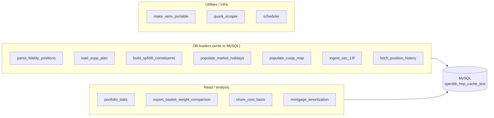

# Tools Specs — Index

> Per-tool design specs for every script under `Tools/`. Each spec captures
> purpose, inputs, outputs/tables, CLI, key functions, persistence strategy,
> dependencies, and gotchas so future sessions can resume without re-reading
> the source. The living architecture/changelog doc is `../DESIGN.md`; these
> specs are the per-tool detail it points to.

## Categories

## Tool index

| Spec | Script | Category | Writes |
|------|--------|----------|--------|
| [parse_fidelity_positions.md](parse_fidelity_positions.md) | `parse_fidelity_positions.py` | DB loader | `Portfolio_Positions`, `Account_Owner` |
| [load_espp_plan.md](load_espp_plan.md) | `load_espp_plan.py` | DB loader | `ESPP_Plan` |
| [build_sp500_constituents.md](build_sp500_constituents.md) | `build_sp500_constituents.py` | DB loader | `sp500_constituents` |
| [populate_market_holidays.md](populate_market_holidays.md) | `populate_market_holidays.py` | DB loader | `market_holidays` |
| [populate_cusip_map.md](populate_cusip_map.md) | `populate_cusip_map.py` | DB loader | `sec_13f_cusip_map` |
| [ingest_sec_13f.md](ingest_sec_13f.md) | `ingest_sec_13f.py` | DB loader | `sec_13f_holdings`, `sec_13f_cusip_map`, `sec_13f_ingest_runs` |
| [fetch_position_history.md](fetch_position_history.md) | `fetch_position_history.py` | DB loader (cache) | `equity_historical` (via `fmp_cached`) |
| [portfolio_stats.md](portfolio_stats.md) | `portfolio_stats.py` | Read | none (prints) |
| [export_basket_weight_comparison.md](export_basket_weight_comparison.md) | `export_basket_weight_comparison.py` | Read | Excel file |
| [share_cost_basis.md](share_cost_basis.md) | `share_cost_basis.py` | Analysis | none |
| [mortgage_amortization.md](mortgage_amortization.md) | `mortgage_amortization.py` | Analysis | CSV (optional) |
| [make_venv_portable.md](make_venv_portable.md) | `make_venv_portable.py` | Infra | `.venv_win/**/*.pth` |
| [quant_scraper.md](quant_scraper.md) | `quant_scraper/scrape_quant_strategies.py` | Infra | cloned repos on disk |
| [scheduler.md](scheduler.md) | `scheduler/run_fetch_position_history.ps1` | Infra | log files |

> `Tools/uv/` is vendored `uv`/`uvx` binaries (not a script) — used by the
> portable-venv / dependency tooling, no spec needed.

## Shared conventions (all DB-connected scripts)

- **sys.path bootstrap** — walk up to `PROJECT_ROOT`, insert
  `openbb_platform/{providers/fmp_cached, providers/fmp, core, platform}`
  (`ingest_sec_13f.py` also adds `providers/sec`) plus every
  `extensions/*` and `obbject_extensions/*`.
- **Connections** go through `openbb_fmp_cached.utils.database.DatabaseConfig`
  / `get_connection()`; default DB is `openbb_fmp_cache_test`. `--database`
  overrides.
- **`FMP_CACHE_AUTO_CREATE_DB=false`** in hot loops to skip the 67-table
  existence check on every `init_database()`.
- **Windows encoding** — `sys.stdout.reconfigure(encoding="utf-8", errors="replace")`.
- **HTTP** — `requests` only (no `aiohttp`); 0.3-0.5s sleep between FMP calls;
  per-symbol try/except so one failure can't kill the batch.
- **Idempotent** — `CREATE TABLE IF NOT EXISTS`; `DELETE+INSERT` for keyless
  snapshots, `INSERT ... ON DUPLICATE KEY UPDATE` for natural keys,
  `INSERT IGNORE` for lookups. Running twice yields the same row count.
