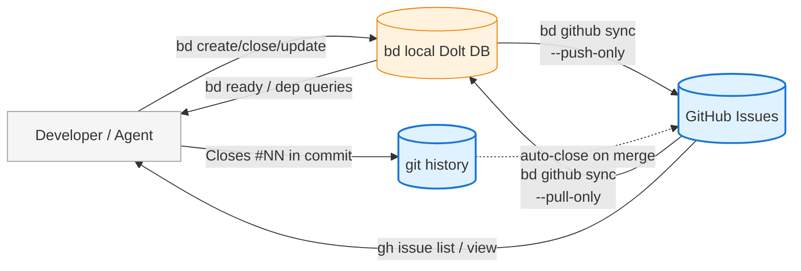
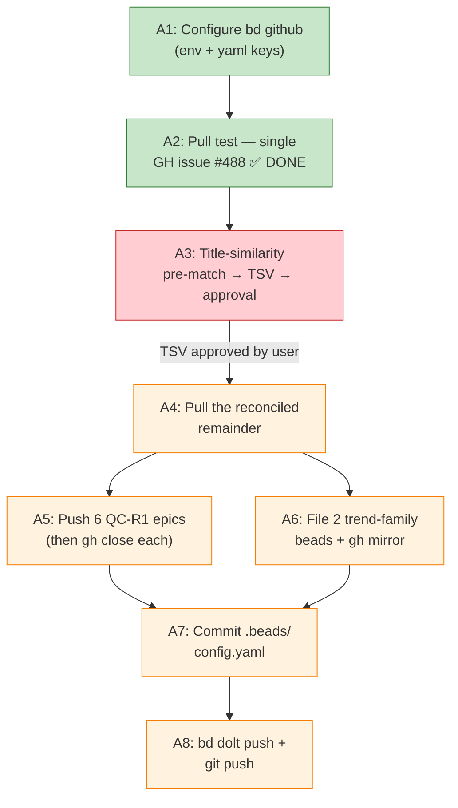

# bd → GitHub Issues Migration Plan (v3.1)

**Status:** DRAFT — awaiting approval
**Date filed:** 2026-07-12
**Owner:** Prashant Rajoria (with Claude Code assistance)
**Supersedes:** v3 — v3.1 addresses reviewer findings B1-B6 on PR #489:
Appendix B (buggy `bd_gh_match.py` skeleton) removed; A3 defers script
choice to plan-approver. `bd update --external-ref` flag verified
inline. §2 documents closed-bead push behavior (push creates OPEN
GH issue regardless of bd status). §C2 backgrounded-sync claim
corrected to foreground. Rollback via `bd import` replaced with
per-bead `bd close --reason=rollback` (JSONL edits prohibited by
bd hygiene rules). Appendix A deduped: 86 unique ghost IDs (was
73+15 with `bd-hpxh` counted twice). Added 2 mermaid diagrams:
target-state data flow (§3), Phase A dep graph (§4).
**Companion doc (planned, Phase C):** `docs/BEADS_HYGIENE.md`

---

## 1. Why this plan exists

Since the 2026-07-11 bd bootstrap collision, the local coordination
tracker (bd) and the durable audit trail (git commit messages) have
drifted apart. **80 of the 81 unique bd IDs referenced in commits
since 2026-06-01 no longer resolve as their own beads in the current
bd DB.** Only `bd-vwl → OpenBBTechnical-vwl` survives. Code work
shipped and is durable in git history; the coordination trail is
gone.

The failure mode this creates for parallel developers:

- Commit messages and design docs reference bd IDs that no longer
  resolve — a new agent reading `bd-luy Steps 1–4 shipped` in a
  commit runs `bd show bd-luy` and gets "no issue found." Cannot
  tell whether the work is real, half-done, or fabricated.
- `bd ready` cannot show truthful state because the ID space it
  operates on doesn't match the ID space the codebase records.
- Two clones of the repo can end up with completely independent bd
  DBs if one is `bd init` and the other is `bd bootstrap` from an
  existing remote — this is what caused the 2026-07-11 collision.

Root cause: **bd's DB is remote-first but locally-writeable**,
with no immutable ID space and no per-clone reconciliation
discipline. GitHub Issues, by contrast, provides server-issued
immutable IDs that survive bootstrap collisions by construction.

---

## 2. The critical discovery — bd has native GitHub sync

Verified 2026-07-12 via `bd github --help`:

```
Commands for syncing issues between beads and GitHub.

Available Commands:
  pull        Pull specific items from GitHub
  push        Push specific beads to GitHub
  repos       List accessible GitHub repositories
  status      Show GitHub sync status
  sync        Sync issues with GitHub (bidirectional by default)

Configuration:
  github.token / GITHUB_TOKEN
  github.owner / GITHUB_OWNER
  github.repo / GITHUB_REPO
```

**This has never been configured on this repo** (`bd github status`
returns `❌ Not configured`). The scaffolding is in `.beads/config.yaml`
as commented-out placeholders but was never turned on.

**Verified capabilities** (via `--dry-run` probes on 2026-07-12):

| Capability | Verified? | Detail |
|---|---|---|
| Push a single bead to GH | ✅ | `bd github push <bead-id> --dry-run` shows "Would create in GitHub: <title>" |
| Push all beads to GH | ✅ | `bd github sync --dry-run --push-only` reports it would create **852 issues** (all statuses, not just open) |
| Pull a specific GH issue into bd | ✅ | `bd github pull <#NN>` — **VERIFIED (executed live A2 2026-07-12):** creates a fresh bead, does NOT auto-match to existing beads with the same title |
| Bidirectional sync | ✅ | Default `bd github sync` mode; conflict resolution via `--prefer-github`/`--prefer-local`/`--prefer-newer` |
| Auth via env var | ✅ | `export GITHUB_TOKEN=$(gh auth token)` works if the `gh` CLI is signed in |
| Selective sync by bead ID | ✅ | `--issues bd-a,bd-b,...` and `--parent <epic>` flags |
| **Linkage field** | ✅ | Beads with `external_ref = gh-<N>` (short form) or the full GH URL are linked. Bd matches by exact `external_ref`, not title. |

**Verified state (2026-07-12 counts):**

- **369 GitHub issues** exist (#1 to #488, open + closed)
- **740 bd beads** exist (713 open, 27 in-progress or blocked)
- **50 beads have `external_ref` set** — covering GH #89 + #356–#403 (a contiguous range from a prior era of manual linking)
- **319 GH issues have NO bd linkage**
- **690 bd beads have NO GH linkage**
- **Closed-bead push behavior** — verified via `bd github push
  <closed-id> --dry-run` on `OpenBBTechnical-qy83.1.15` (closed
  bead): bd reports `Would create in GitHub: <title>` and would file
  the GH issue in **OPEN** state regardless of the bd status. To
  mirror closed status, a follow-up `gh issue close <#N>` is
  required. This has direct consequence for A5 (closing 6 QC-R1
  epics) — plan on push + close, not push alone.

**Verified risks:**

- **Blind push would create 852 duplicates.** The bd DB has 852
  issues; GitHub already has 488 (and rising). A naive
  `bd github sync --push-only` would create 852 new GH issues,
  most of them duplicates of things already in GH, plus 111 closed
  beads that shouldn't be re-filed at all. **Pull-first is
  mandatory.**
- **`bd github sync` default is push+pull**, not pull-only. First
  run must explicitly use `--pull-only`.
- **Label and status mapping is not yet verified** — how does bd
  map its ~30 labels to GitHub's 114? Does it create new GitHub
  labels? Preserve existing ones? Needs testing.
- **Duplicate detection** — how does `bd github pull` decide
  whether an incoming GH issue is a new bead vs already-linked?
  Needs testing.

This v2 plan is designed to answer those unknowns via cautious
staged experiments before any bulk operation.

---

## 3. Target state

- **bd** = local coordination + query layer (`bd ready`, dep graph,
  claim/close, memories).
- **GitHub Issues** = durable, globally-unique ID space and the
  reviewer-facing surface.
- **`bd github sync`** = the one mechanism that keeps them
  reconciled. Run automatically (via hook or CI) so no manual
  `gh issue` calls are needed.
- **Cross-session memory** = migrate `bd remember` entries into
  `docs/MEMORIES.md` (a diff-reviewable in-repo file) for the
  content that must survive bd DB loss.
- **`.beads/config.yaml`** = commit the non-secret parts
  (`github.owner`, `github.repo`) so every clone inherits the
  configuration. Token stays in `GITHUB_TOKEN` env var (never in
  repo).

Parallel-dev contamination model at the target state:

| Failure mode | Mitigation |
|---|---|
| Both grab the same work | `bd update --claim` syncs to GH assignee immediately via post-hook |
| Both edit same file | Branch name embeds issue number; enforced by convention + PR review |
| Both push to a shared coord DB | `bd github sync` conflict resolution + `refs/dolt/data` sync in parallel |
| Ghost IDs from bootstrap | **Eliminated** — if bd DB is lost, `bd github sync --pull-only` rebuilds it from GH's immutable IDs |
| Stale in-progress epics | `bd list --status in_progress` at session close + GH's own task-list rendering on parent issues |

### Data flow at the target state



- **Solid lines** = happens on every write.
- **Dashed line** = GitHub's built-in `Closes #NN` auto-close.
- **Blue** = durable (server-side, immutable IDs).
- **Orange** = local coordination layer (fast queries, rebuildable from GH).

---

## 4. Phase A — verify + configure + pull-first

**Goal:** learn exactly how `bd github sync` behaves against this
repo's specific state (852 beads + 488 GH issues + 114 GH labels)
before any bulk push. All actions except the config commit are
inspectable via `--dry-run` first.

### Phase A step dependency graph



- **Green** = executed live 2026-07-12.
- **Red** = blocked on user approval of A3 design (this doc).
- **Amber** = ready to execute once A3 unblocks.
- All edges represent hard prerequisites: A3 cannot run without
  A2's observations, A4 cannot run without A3's approved
  pairings, A8 cannot run without both A7 and the other Phase A
  writes.

### A1 — Configure bd github

**Verified 2026-07-12:** `bd config set github.owner` and
`bd config set github.repo` write to the **bd Dolt database**,
not to `.beads/config.yaml`. This means the config **does NOT
propagate to other clones via git.** For the config to be shared
across all clones, we must add it manually to
`.beads/config.yaml` and commit that file.

Two-part step:

```bash
# Local session (temporary, this shell only)
export GITHUB_TOKEN=$(gh auth token)

# Persistent, shared across all clones (via commit in A7)
# Manually edit .beads/config.yaml to add:
#   github.owner: "prajoria"
#   github.repo: "OpenBB"
# (These live under the existing "sync.remote:" line, using the same
#  top-level-key-with-colon style — check config.yaml for actual syntax)

# Verify
bd github status   # expect "✓ Configured"
```

The token stays in `GITHUB_TOKEN` env var only — **never in the
committed config file.**

### A2 — Test pull-first on a single known GH issue (✅ EXECUTED 2026-07-12)

```bash
bd github pull 488 --dry-run    # #488 = the retroactive bd-qy83.1.12 mirror
bd github pull 488               # execute
```

**Observed behavior (critical for A3 design):**

- Dry-run reported: `[dry-run] Would import: 488 - [bd] Dolt dep-schema missing depends_on_id column (blocks all bd link)`
- Execute reported: `✓ Pulled 1 issues (1 created, 0 updated)`
- **Bd created a fresh bead** `OpenBBTechnical-1783912572966-1-5b51c294` with `external_ref: https://github.com/prajoria/OpenBB/issues/488` — it did **NOT** link to the existing matching bead `OpenBBTechnical-qy83.1.12`.
- Duplicate has since been closed with reason pointing at `qy83.1.12`.

**Consequences discovered:**

1. **`external_ref` is bd's linkage field.** Bd matches an incoming GH issue to an existing bead only if that bead's `external_ref` = the GH URL/short-ref. Otherwise it creates a new bead. No title-similarity matching, no fuzzy match.
2. **50 of 740 total beads already have `external_ref`** — all in the `gh-<N>` short form (e.g. `gh-381`, `gh-380`). These cover GH #89 and the contiguous range #356-#403. So a subset of the bd DB was previously linked to GH by some earlier tool/session, but the linkage was never continued.
3. **319 of 369 GH issues have no bd-side external_ref** → a blind pull would create 319 duplicate beads.

**Implication for A3:** the plan needs a title-similarity pre-match pass to propose bead-to-issue pairings for reviewer approval BEFORE any pull creates duplicates. Bulk pull is unsafe without this.

### A3 — Pre-match unlinked GH issues to existing beads (redesigned after A2)

**Goal:** produce a triage table of candidate bead↔GH-issue pairings so the reviewer can approve linkages before bd pulls (and would-otherwise-duplicate) any of them.

**Approach:**

```bash
# Step 1: enumerate the unlinked set on each side
gh issue list --repo prajoria/OpenBB --state all --limit 500 --json number,title,state,body \
  > /tmp/gh_issues.json
bd list --limit 0 --json > /tmp/bd_beads.json

# Step 2: compute title-similarity candidate pairs
# The plan-approver picks the matching mechanism — Python script, awk,
# spreadsheet, manual grep, or an existing tool. This doc doesn't
# prescribe one because (a) any correct top-k title similarity works,
# (b) shipping a script in the plan-doc PR is out of scope.
# Whatever tool is used must produce a TSV in the format below.
```

**Output format (proposed_pairings.tsv):**

| GH# | GH title | bd ID | bd title | similarity | action |
|---|---|---|---|---|---|
| 100 | fix(fmp): retry on 429 | OpenBBTechnical-abc | fmp: retry on 429 rate limits | 0.92 | LINK |
| 210 | [portfolio] paper broker | OpenBBTechnical-qy83.4.9 | [portfolio] [P2][Paper][Fills v0] Market + Limit orders | 0.83 | LINK |
| 305 | orphan GH issue | — | — | — | PULL_NEW |

Three action categories:
- **LINK** — matched pair. Set the bead's `external_ref` to `gh-<N>` (via `bd update <id> --external-ref gh-<N>` or direct DB update). Do NOT pull; it's already linked after the ref-set.
- **PULL_NEW** — GH issue with no bd match; safe to `bd github pull <N>` → creates a fresh bead legitimately.
- **CLOSE_GH** — GH issue is a stale reference to already-shipped work; close on GH, don't pull to bd.

**Reviewer approves the TSV** (visually inspect, downgrade suspect LINK→PULL_NEW, upgrade some low-similarity pairs, mark CLOSE_GH). Approved TSV becomes the input to an execution script.

**Execution:** batch script iterates the TSV, calling `bd update ... --external-ref` for LINKs, `bd github pull <N>` for PULL_NEWs, and `gh issue close` for CLOSE_GHs. Each row is one API call; if any row fails, log it and continue.

**Verified 2026-07-12:** `bd update --external-ref` exists as a bd
flag. Live verification: `bd update --help | grep external-ref` shows
`--external-ref string    External reference (e.g., 'gh-9', 'jira-ABC', Linear URL)`.
Short-form `gh-<N>` is the canonical format the other 50 pre-linked
beads use — that's what the script must emit (**not** the full URL,
which would be an inconsistent linkage format).

### A4 — Pull the reconciled remainder (safe, no more duplicates)

After A3 sets `external_ref` on every matched bead:

```bash
bd github sync --pull-only --dry-run   # should now show only genuine unmatched GH issues
bd github sync --pull-only              # execute
```

**Expected count:** ~50-150 new beads (only the PULL_NEW rows from A3). Any bead created here is intentional.

### A5 — Selective push: the 6 QC-R1 epics + trend-family follow-ups

Only these specific beads get pushed in Phase A; the full 852-bead
push waits until Phase B has cleaned the DB.

```bash
# Verify each dry-run before executing
bd github push OpenBBTechnical-0qu --dry-run
bd github push OpenBBTechnical-4x3 --dry-run
bd github push OpenBBTechnical-8y3 --dry-run
bd github push OpenBBTechnical-97o --dry-run
bd github push OpenBBTechnical-cgh --dry-run
bd github push OpenBBTechnical-k4k --dry-run

# Then execute
bd github push OpenBBTechnical-0qu OpenBBTechnical-4x3 OpenBBTechnical-8y3 OpenBBTechnical-97o OpenBBTechnical-cgh OpenBBTechnical-k4k
```

Then close each on GH with a reason pointing at the child PRs
(per `qc-r1-cluster-jw1o-progress` memory, all children shipped).

### A6 — File the 2 genuinely-open trend-family beads

```bash
# 1. Create the PIT XLK universe builder bead (replaces ghost bd-69px)
bd create --title="Point-in-time XLK universe builder in fmp_cached" \
  --description="See docs/superpowers/specs/2026-07-10-ensemble-lift-validation-design.md §5.6. Blocks R1 IC gate acceptance runs." \
  --type=feature --priority=1

# Note the new bead ID (e.g. OpenBBTechnical-xxx)

# 2. Create the R1 IC gate bead, blocked by the above
bd create --title="R1 IC gate implementation" \
  --description="See docs/superpowers/specs/2026-07-10-ensemble-lift-validation-design.md §5. Paired-spread acceptance test on d_t = r_ext − r_base." \
  --type=feature --priority=2

bd dep add <r1-ic-gate-id> --blocked-by <pit-universe-id>

# 3. Push both to GH
bd github push <pit-universe-id> <r1-ic-gate-id>
```

### A7 — Commit `.beads/config.yaml` with the manual github.owner/repo edit

Once Phase A is stable:

```bash
# Edit .beads/config.yaml manually per A1 (or verify it was already edited)
git add .beads/config.yaml
git diff --cached                       # verify ONLY github.owner + github.repo lines added
git commit -m "chore(beads): enable bd github sync (owner+repo, no secrets)"
```

**Token stays in `GITHUB_TOKEN` env var or a per-machine secret store —
never committed.**

**Reminder:** `bd config set` writes to the bd DB, not this file.
For the config to be shared across all clones, the yaml edit is
the mechanism.

### A8 — Publish

```bash
bd dolt push   # publish bd state changes (with explicit approval)
git push       # publish config commit (with explicit approval)
```

---

## 5. Phase B — GitHub Issues audit + bulk push

**Goal:** bring GH into full alignment with bd. Then set up
ongoing sync.

**Blocked by:** Phase A completion.

### B1 — Read-only triage of all 488 existing GH issues

Produce a table listing every open GH issue with: `#`, title,
current labels, days-since-update, assignee, proposed action ∈
{close, update-labels, add-blocked-by, split, leave}. Estimated 45 min.

Reviewer approves batch actions async; batch execution follows.

### B2 — Label taxonomy consolidation

114 existing GH labels is likely more than needed. Produce a
proposed target set (~30-40 labels), map each existing label to
keep/rename/merge/delete, execute via `gh api`. Estimated 60 min.

### B3 — Bulk push remaining bd beads

After Phase A's pull + reconcile + label consolidation:

```bash
bd github sync --dry-run --push-only | tee /tmp/push-preview.txt
wc -l /tmp/push-preview.txt   # sanity check the count
bd github sync --push-only     # execute
```

Expected count: ~700-750 (down from 852 after de-duping in A4
and closing obsolete ones in Phase A steps).

### B4 — First bidirectional sync

```bash
bd github sync --dry-run       # verify nothing surprising
bd github sync                  # execute
```

From this point forward, every bd write + `bd github sync`
propagates to GH.

---

## 6. Phase C — automate + document

**Goal:** make it impossible to forget the sync.

**Blocked by:** Phase B completion.

### C1 — Write `docs/BEADS_HYGIENE.md`

Simple rules, grounded in bd github sync's actual behavior:

1. Every bd write is followed by `bd github sync` (manually or via
   hook — see C2).
2. Every commit references its bead (`bd-<id>`) OR its GH issue
   (`#NN`) in the subject or body.
3. On fresh clone: run `bd bootstrap` (never `bd init`) if a remote
   Dolt exists, then `bd github sync --pull-only` to import any
   drift.
4. On session close: `bd github sync` before `bd dolt push` before
   `git push`.
5. Cross-session memory lives in `docs/MEMORIES.md` (in-repo,
   diff-reviewable), not `bd remember` (in-DB, lost on bootstrap
   collision).
6. On any conflict: `bd github sync --prefer-newer` is the safe
   default. `--prefer-github` if bd was locally corrupted.
   `--prefer-local` if GH was mass-edited externally.

### C2 — Post-hook for foreground auto-sync (optional)

`.beads/hooks/post-update.sh`:

```bash
#!/usr/bin/env bash
# Runs after any bd write; syncs to GH before returning control.
# Foreground (blocking) — do NOT background with `&`. A backgrounded
# sync contradicts the "immediate GH visibility" goal: the bd write
# returns, control passes to the next command, but GH may lag by
# seconds (until the background process actually completes). Any
# subsequent `gh issue view` in the same shell can see stale state.
# Foreground makes the write atomic-with-visibility at the cost of
# adding the sync latency (~0.5-2s per operation) to every bd call.
bd github sync --push-only --quiet
```

Wire via `bd config set hooks.post-update .beads/hooks/post-update.sh`.

**Trade-off:** users who value command latency over strict "GH sees
it now" ordering may prefer to omit this hook and run
`bd github sync --push-only` manually at logical checkpoints
(session close, before opening a PR, etc.).

### C3 — `docs/MEMORIES.md` seed

Migrate existing `bd remember` entries. Current entries (from
`bd config list | grep memory`):

- `bootstrap-outcome-2026-07-11`
- `portfolio-intel-plan-shipped`
- `pr470-sync-trading_technicals-2026-07-11`
- `qc-r1-cluster-jw1o-progress`

Ongoing: after Phase C ships, `bd remember` still works but its
canonical mirror is `docs/MEMORIES.md`. New memories go in both
initially; bd `remember` may deprecate on a later cycle.

### C4 — CLAUDE.md update

Add a `## Coordination` section that:

- Cites `docs/BEADS_HYGIENE.md` as the authoritative protocol.
- Removes the "Beads Workflow Context" block's rules that no
  longer apply (e.g., the ghost-ID recovery advice).
- Preserves the conservative git profile.

---

## 7. Rollback plan

- **A1-A2:** env var + config unset, no state changes.
- **A3 (pull):** every pull that turns out to be a duplicate gets
  closed with `bd close <new-id> --reason="rollback: duplicate of
  <existing-id>"`. Do NOT use `bd import` to bulk-restore from a
  pre-pull JSONL snapshot — direct edits to `.beads/issues.jsonl`
  are prohibited by the bd hygiene rules (JSONL is a passive export
  that gets overwritten by the next `bd` write). Roll back one
  bead at a time via `bd close` with an audit-trail reason.
- **A5-A6:** individual `bd close --reason=rollback` + `gh issue close`
  on the specific new issues created.
- **A7 config commit:** single revert.
- **Phase B:** batch-execution recorded in the triage table; reverse
  batch script inverts label changes.
- **Phase C:** hooks are opt-in; docs are one revert.

No irreversible operations at any step. Every bulk operation has
a `--dry-run` first.

---

## 8. What v1 got wrong (for the record)

The v1 plan (commit `bf273c57d`) hand-rolled a manual pairing
protocol (custom `bd-mirror` label, `bd-id:<id>` per-bead labels,
manual `gh issue create` after every `bd close`, template body
strings, close-ordering rules). All of that reimplements what
`bd github sync` does natively.

**Root cause of the v1 mistake:** did not verify existing bd
capabilities before designing a solution. Assumed bd was
GH-agnostic based on: (a) no `bd-mirror` labels existed on the
repo, (b) no git history of GH sync setup, (c) the CLAUDE.md
"Beads Workflow Context" block does not mention `bd github`.

**Lesson generalizable:** before proposing tooling built on top of
X, run `X --help` to see what X already does. This is a specific
instance of the "R7: don't write mocks before you've made one live
call" pattern from the Analysis testing rules.

The retroactive fix I did earlier (`bd close bd-qy83.1.12` +
manual `gh issue create #488` + custom labels) is preserved but
labeled as v1-style. When `bd github sync --pull-only` runs on #488
in A2, we'll see how bd handles a GH issue that was created by
hand outside the sync flow — an accidental test case for the
migration.

---

## Appendix A — Ghost ID inventory (deduplicated for v3)

**Sources combined:**
1. `git log --all --oneline --grep='bd-[a-z0-9]\{3\}' --since='2026-06-01'`,
   deduplicated (72 unique IDs after removing `bd-vwl` which does resolve)
2. Ensemble-lift spec + prior status summaries + `tmp/session-beads-
   backup-2026-07-11.txt` (14 additional IDs not in commit-log grep)

**Total unique ghost IDs (union, deduped):** **86** — the two lists
overlap on exactly `bd-hpxh`, which is documented once here.
**Resolved in bd DB today:** 1 (`bd-vwl`, in the git-log set only).

**From commit-log grep (72 unique after excluding `bd-vwl`):**

```
bd-0bp1     bd-2k86     bd-8sq      bd-c4h      bd-kpg      bd-t7p2
bd-0h2.10   bd-3cf      bd-8tl      bd-dt1      bd-lef      bd-tnz
bd-0h2.11   bd-3ch      bd-90e      bd-e3v8     bd-luy      bd-tzm
bd-0h2.12   bd-3ka      bd-9bh      bd-fis      bd-lw3      bd-udq
bd-0h2.14   bd-3qo      bd-9loj     bd-gv1e     bd-lyzk     bd-uolr
bd-0h2.16   bd-3xq      bd-9nd.10   bd-gzf      bd-n3sf     bd-z7f
bd-0h2.9    bd-4d0      bd-9nd.11   bd-hpxh     bd-o4q      bd-znw
bd-0ru2     bd-5in      bd-9nd.12   bd-hyzu     bd-or5      bd-zuw
bd-0uh      bd-6atb     bd-9nd.8    bd-ijq      bd-ph0
bd-209      bd-78w      bd-9nd.9    bd-isvv     bd-qu2h
bd-250      bd-7ct      bd-9zb      bd-jt4r     bd-r9m
bd-2650     bd-85w      bd-bl57     bd-kbtx     bd-ri3
bd-29n      bd-8j9      bd-c2fr     bd-kh08     bd-sqf
```

**Additional 14 ghost IDs from spec/summary/backup (excluding
`bd-hpxh` which is already in the commit-log list above):**

```
bd-b6k5     bd-7gwh     bd-gj2k     bd-8332     bd-1lgd
bd-j7mw     bd-d4r3     bd-a4cl     bd-69px     bd-w1g7
bd-tik      bd-40v      bd-z43      bd-alj
```

Note: with `bd github sync` in place, these ghost IDs remain
ghost — the coordination trail for the shipped work is gone
regardless of the tool we use to coordinate future work. The
value of documenting them here is (a) the historical record and
(b) the recovery signal (if a future migration ever needs to
reconstruct the pre-2026-07-11 bd state, the git history plus
this list is the reconstruction basis).

The v1 plan's Phase A step "file an aggregate `[bd-archive]` GH
issue" is preserved as an option for A5/A6 if you want the ghost
list mirrored to GH. Not strictly necessary once bd github sync
runs on the live DB.

---

## Approval checklist

Reviewer signs off on:

- [x] Phase A step A1 (config) — DONE (github.owner/repo set in bd
  DB; yaml commit deferred to A7)
- [x] Phase A step A2 (single-issue pull test) — DONE (verified bd
  creates duplicates by default; `external_ref` is the linkage field;
  50/369 GH issues already pre-linked)
- [ ] Phase A step A3 (**redesigned**) — title-similarity pre-match
  → reviewer approves TSV → batch-execute LINK/PULL_NEW/CLOSE_GH
- [ ] Phase A step A4 (safe pull of unmatched remainder after A3)
- [ ] Phase A step A5-A6 (selective push of 6 QC epics + 2 new
  trend-family beads) requires explicit go-ahead per batch
- [ ] Phase A step A7 (`.beads/config.yaml` commit) — verify only
  non-secret keys added (owner+repo, no token)
- [ ] Phase B and Phase C scope as described
- [ ] Rollback plan (§7) suffices for each step

**Bottom line:** v3 replaces v2's naive "bulk pull then clean up
duplicates" with "pre-match → reviewer approves pairings → batch-
execute → then pull only the genuine remainder." This is more
work up front but avoids the 319-duplicate blast radius that v2's
A3 would have created.
