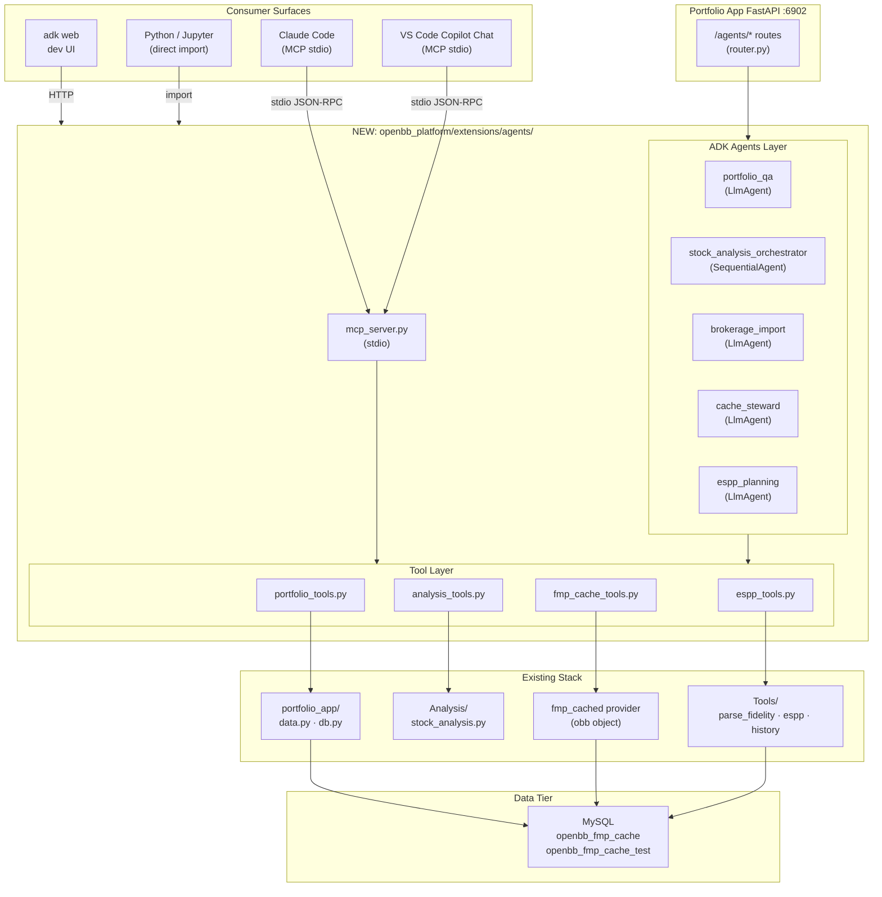
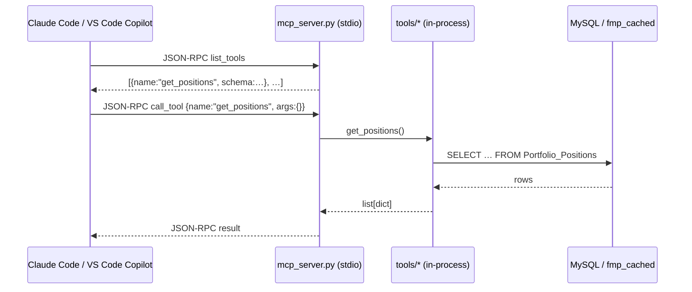
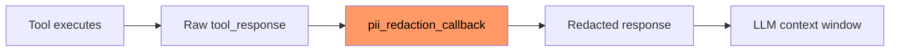
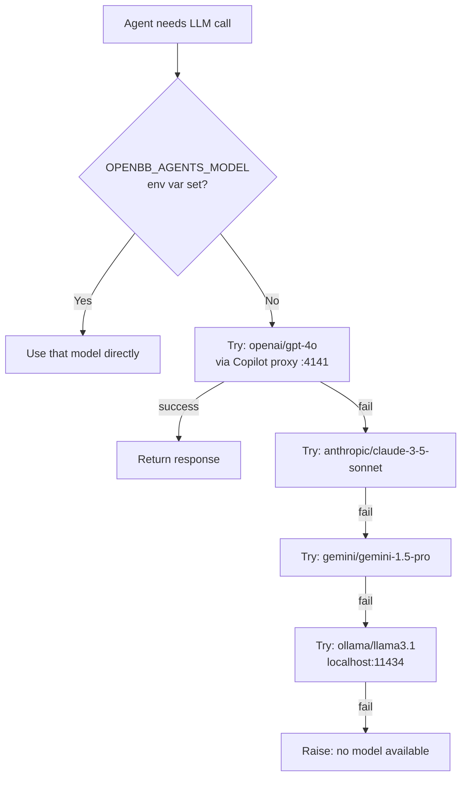

# OpenBB Agents Extension — Design Document

| Field | Value |
|---|---|
| **Issue** | [#1 — Google ADK Agents on Top of OpenBB](https://github.com/prajoria/OpenBB/issues/1) |
| **Status** | Design |
| **Date** | 2026-06-02 |
| **Author** | daaji |
| **Phase covered** | A (Foundation) — with B–E summaries |

---

## 1. Goals & Non-Goals

### Goals

1. Add a new optional OpenBB extension (`openbb_platform/extensions/agents/`) that exposes Google ADK agents on top of the existing OpenBB stack.
2. Provide five agents covering portfolio Q&A, stock analysis orchestration, brokerage import assistance, cache stewardship, and ESPP planning.
3. Surface those same agents through five consumer interfaces: Claude Code (MCP), VS Code Copilot Chat (MCP), `adk web` dev UI, Portfolio App REST API, and plain Python/Jupyter — with zero duplication of tool logic.
4. Keep raw PII (account numbers, owner names, dollar amounts) out of every LLM call via ADK callback-based guardrails.
5. Support pluggable model backends via LiteLLM (Copilot proxy, Vertex, OpenAI, local) with a single config file.
6. Provide an `adk eval` golden-test harness that gates regressions on every change.
7. Deliver Phase A (foundation wiring) so a developer can implement it purely from this document.

### Non-Goals

1. **No investment advice.** Agents surface data; they do not recommend buy/sell/hold.
2. **No autonomous trading.** All tools are read-only.
3. **No AI predictions of returns.** Forecasts only if the existing pipeline already produces them.
4. **No changes to existing code.** `Tools/`, `Analysis/`, `fmp_cached`, `portfolio_app/` are consumed, not modified.
5. **No multi-user SaaS hosting.** Single-user local deployment only.
6. **No magic data quality.** Garbage in, garbage out — same as today.

---

## 2. System Context Diagram



---

## 3. Extension Directory Structure

```
openbb_platform/extensions/agents/
│
├── pyproject.toml                  # package: openbb-agents; deps: google-adk, litellm, mcp
├── README.md                       # Quick-start for the extension
│
└── openbb_agents/
    ├── __init__.py                 # exports: portfolio_qa, stock_analysis_orchestrator, …
    │
    ├── config.py                   # LiteLLM model config, env-var resolution, fallback list
    ├── guardrails.py               # ADK before_model_callback: PII redaction
    │
    ├── mcp_server.py               # stdio MCP server entry-point (python -m openbb_agents.mcp_server)
    │
    ├── router.py                   # FastAPI /agents/* routes (mounted in portfolio_app)
    │
    ├── tools/
    │   ├── __init__.py
    │   ├── portfolio_tools.py      # MySQL portfolio queries (get_positions, get_sector_exposure, …)
    │   ├── analysis_tools.py       # Wrappers over Analysis/stock_analysis.py phase functions
    │   ├── fmp_cache_tools.py      # obb.equity.* / fmp_cached quote, profile, fundamentals
    │   └── espp_tools.py           # ESPP_Plan queries + qualifying-disposition projections
    │
    ├── agents/
    │   ├── __init__.py
    │   ├── portfolio_qa.py         # LlmAgent: natural-language portfolio Q&A
    │   ├── stock_analysis_orchestrator.py  # Sequential/parallel multi-agent: P1→P7
    │   ├── brokerage_import.py     # LlmAgent: guided import workflow
    │   ├── cache_steward.py        # LlmAgent: freshness audit + controlled refresh
    │   └── espp_planning.py        # LlmAgent: qualifying-disposition planning
    │
    └── evals/
        ├── golden_phase_a.json     # Phase A golden test cases
        ├── golden_portfolio_qa.json# Phase B golden test cases
        └── golden_analysis.json    # Phase C golden test cases
```

---

## 4. Tool Layer Design

### 4.1 `portfolio_tools.py`

Thin wrappers over `portfolio_app/src/data.py` and `portfolio_app/src/db.py`. Every function is a plain Python callable with type hints — ADK auto-generates tool schemas from these signatures.

| Function | Signature | Description | Returns | Wraps |
|---|---|---|---|---|
| `get_positions` | `(account: str \| None = None, owner: str \| None = None) -> list[dict]` | Return all current positions, optionally filtered. | List of position dicts (symbol, shares, cost_basis, current_value, unrealized_gain_pct) | `data.get_portfolio_basket_df()` |
| `get_sector_exposure` | `(account: str \| None = None) -> list[dict]` | Aggregate positions by GICS sector; return weight % per sector. | `[{sector, weight_pct, market_value}]` | `get_positions` + fmp profile |
| `get_distinct_accounts` | `() -> list[str]` | Return all account identifiers. | `["ACCT-001", …]` | `data.get_distinct_accounts()` |
| `get_distinct_owners` | `() -> list[str]` | Return all owner names. | `["Alice", …]` | `data.get_distinct_owners()` |
| `get_unrealized_gain_summary` | `(account: str \| None = None) -> dict` | Total cost basis, market value, unrealized gain $, gain %. | `{cost_basis, market_value, unrealized_gain, gain_pct}` | `get_positions` aggregation |
| `get_concentration_risk` | `(top_n: int = 5) -> list[dict]` | Top-N positions by portfolio weight. | `[{symbol, weight_pct}, …]` | `get_positions` |
| `get_positions_near_52w_high` | `(threshold_pct: float = 5.0) -> list[dict]` | Positions within `threshold_pct`% of 52-week high. | `[{symbol, current_price, high_52w, pct_from_high}, …]` | `get_positions` + `get_quote` |

**Design note:** Functions never return raw account numbers or owner names in string fields that go to the LLM. The guardrail callback (§8) redacts any that slip through.

---

### 4.2 `analysis_tools.py`

Wrappers over `Analysis/stock_analysis.py`. Each function returns a JSON-serialisable summary dict (not the full `PhaseNResult` dataclass).

| Function | Signature | Description | Returns | Wraps |
|---|---|---|---|---|
| `run_phase1` | `(symbol: str) -> dict` | Company profile: name, sector, description, market cap tier. | `{symbol, name, sector, industry, market_cap, description_short}` | `phase1_company_profile(cfg)` |
| `run_phase2` | `(symbol: str) -> dict` | Fundamental KPIs: revenue growth, margins, FCF yield, debt/equity. | `{revenue_cagr_3y, gross_margin, fcf_yield, debt_to_equity, …}` | `phase2_fundamentals(cfg)` |
| `run_phase3` | `(symbol: str) -> dict` | Technical signals: RSI, MACD signal, MA relationship, momentum score. | `{rsi, macd_signal, ma_cross, momentum_score}` | `phase3_technicals(cfg)` |
| `run_phase4` | `(symbol: str) -> dict` | Valuation: DCF fair value, margin of safety, P/E vs peers. | `{dcf_fair_value, current_price, margin_of_safety_pct, pe_ratio, pe_vs_peer_median}` | `phase4_valuation(cfg, p2, p3)` |
| `run_phase5` | `(symbol: str) -> dict` | Risk: beta, max drawdown, VaR 95%, volatility rank. | `{beta, max_drawdown_pct, var_95, volatility_rank}` | `phase5_risk(cfg)` |
| `run_phase6` | `(symbol: str) -> dict` | Peer-relative ranking across fundamental and valuation axes. | `{peer_universe, percentile_rank, vs_peer_summary}` | `phase6_peer_relative(cfg, p1)` |
| `run_phase7` | `(symbol: str) -> dict` | Composite decision: action label, score, confidence, weak phases. | `{action_label, composite_score, confidence, weak_phases}` | `phase7_decision(cfg, p1…p6)` |
| `run_full_analysis` | `(symbol: str) -> dict` | Run all 7 phases; return combined summary keyed by phase. | `{p1: …, p2: …, …, p7: …}` | `run_full_analysis(cfg)` |

---

### 4.3 `fmp_cache_tools.py`

Wrappers over `obb.equity.*` using `PRIMARY_PROVIDER = "fmp_cached"`.

| Function | Signature | Description | Returns | Wraps |
|---|---|---|---|---|
| `get_quote` | `(symbol: str) -> dict` | Latest price, volume, 52w high/low, change %. | `{symbol, price, volume, high_52w, low_52w, change_pct}` | `obb.equity.price.quote(…)` |
| `get_company_profile` | `(symbol: str) -> dict` | Sector, industry, description, market cap, employees. | `{name, sector, industry, market_cap, description}` | `obb.equity.fundamental.profile(…)` |
| `get_income_statement` | `(symbol: str, period: str = "annual", limit: int = 4) -> list[dict]` | Revenue, gross profit, net income, EPS for last N periods. | `[{period, revenue, gross_profit, net_income, eps}, …]` | `obb.equity.fundamental.income(…)` |
| `get_price_history` | `(symbol: str, start_date: str, end_date: str) -> list[dict]` | OHLCV bars for date range. | `[{date, open, high, low, close, volume}, …]` | `obb.equity.price.historical(…)` |
| `check_cache_freshness` | `(symbol: str) -> dict` | Timestamp of last cached record for key tables. | `{symbol, quote_age_hours, fundamentals_age_days, history_age_days}` | Direct MySQL query on fmp_* tables |
| `refresh_symbol` | `(symbol: str, data_type: str = "quote") -> dict` | Force a live FMP fetch to refresh cache for one symbol. | `{symbol, refreshed, rows_written}` | `obb.equity.*` with bypass_cache flag |

---

### 4.4 `espp_tools.py`

Wrappers over the `ESPP_Plan` table and holiday calendar logic.

| Function | Signature | Description | Returns | Wraps |
|---|---|---|---|---|
| `get_espp_lots` | `(symbol: str \| None = None) -> list[dict]` | Return all ESPP grant lots. | `[{lot_id, symbol, grant_date, acquire_date, shares, cost_basis, grant_price}, …]` | `data.get_espp_df()` |
| `get_qualifying_dispositions` | `(within_days: int = 90) -> list[dict]` | Lots that meet the 2-year-from-grant + 1-year-from-acquire test within N days. | `[{lot_id, symbol, qualifying_date, shares, estimated_proceeds}]` | `get_espp_lots` + date arithmetic |
| `project_after_tax_proceeds` | `(lot_id: str, sale_price: float \| None = None) -> dict` | Estimate after-tax proceeds assuming LTCG. | `{lot_id, gross_proceeds, estimated_tax, net_proceeds, tax_assumption}` | `get_espp_lots` + `get_quote` |

---

## 5. Agent Designs

### 5.1 `portfolio_qa` — Portfolio Q&A Agent

| Field | Value |
|---|---|
| **Agent type** | `LlmAgent` (single agent, multiple tools) |
| **Tools** | `get_positions`, `get_sector_exposure`, `get_unrealized_gain_summary`, `get_concentration_risk`, `get_positions_near_52w_high`, `get_quote`, `get_distinct_accounts` |
| **Model** | `config.ANALYTICAL_MODEL` (temperature=0) |

**System prompt outline:**
```
You are a read-only portfolio analysis assistant. You have access to tools that
query the user's local MySQL portfolio database and live market data from
fmp_cached. You never make investment recommendations. You never fabricate
numbers — if a tool returns no data, say so. Account identifiers in tool
responses are redacted tokens; use them as-is when calling tools that accept
an account parameter. Always show the source of your numbers (which tool call).
```

**Example interaction:**
```
User:  "What's my tech sector exposure across all accounts?"

Tool calls:
  1. get_sector_exposure() → [{sector:"Technology", weight_pct:34.2, market_value:142000}, ...]

Response:
  "Your technology sector exposure is 34.2% of total portfolio value
   ($142,000). The next largest sectors are Healthcare (18.1%) and
   Financials (12.4%). Based on 23 positions across all accounts."
```

---

### 5.2 `stock_analysis_orchestrator` — Multi-Agent Analysis

| Field | Value |
|---|---|
| **Agent type** | `SequentialAgent` (parent) with optional `ParallelAgent` for P1–P3 |
| **Sub-agents** | One `LlmAgent` per phase (`phase1_agent` … `phase7_agent`) |
| **Tools** | `run_phase1` … `run_phase7`, `run_full_analysis` |
| **Model** | `config.ANALYTICAL_MODEL` (temperature=0) |

**Example interaction:**
```
User:  "Run a full analysis on MSFT and tell me which phase is weakest."

Tool calls:
  1. run_full_analysis("MSFT") → {…, p7:{action_label:"BUY",
     composite_score:72.4, weak_phases:["p5_risk","p6_peer"]}}

Response:
  "MSFT composite score: 72.4/100 — Action: BUY.
   Weakest phases: Risk (P5) and Peer-Relative (P6).
   Valuation P4 shows 9.3% margin of safety at DCF fair value $438."
```

---

### 5.3 `brokerage_import` — Import Assistant

| Field | Value |
|---|---|
| **Agent type** | `LlmAgent` (conversational, stateful) |
| **Tools** | `parse_fidelity_export`, `load_positions_to_db`, `get_distinct_symbols`, `check_import_diff` |
| **Model** | `config.CONVERSATIONAL_MODEL` |

**Example interaction:**
```
User:  "I have a new Fidelity export at C:/Downloads/Portfolio_Jun2026.html"

Tool calls:
  1. parse_fidelity_export("C:/Downloads/Portfolio_Jun2026.html") → {accounts:2, positions:31}
  2. check_import_diff("ALL") → {new_positions:3, changed:5, unchanged:23}

Response:
  "Parsed: 31 positions across 2 accounts.
   Diff: 3 new (NVDA, PLTR, ARM), 5 changed, 23 unchanged.
   Shall I write these to the database? (yes/no)"
```

---

### 5.4 `cache_steward` — Cache Freshness Agent

| Field | Value |
|---|---|
| **Agent type** | `LlmAgent` |
| **Tools** | `check_cache_freshness`, `refresh_symbol`, `get_distinct_symbols`, `get_positions` |
| **Model** | `config.ANALYTICAL_MODEL` |

**Example interaction:**
```
User:  "What data is stale for my portfolio positions?"

Tool calls:
  1. get_distinct_symbols() → ["MSFT","AAPL","NVDA",…]
  2. check_cache_freshness("AAPL") → {quote_age_hours:26.1, fundamentals_age_days:45}
  … (for each symbol)

Response:
  "3 of 12 positions have stale data: AAPL (quote 26h, fundamentals 45d),
   GOOGL (fundamentals 38d), META (quote 18h).
   Shall I refresh these 3 symbols? (~3 FMP API calls)"
```

---

### 5.5 `espp_planning` — ESPP / Tax-lot Planning Agent

| Field | Value |
|---|---|
| **Agent type** | `LlmAgent` |
| **Tools** | `get_espp_lots`, `get_qualifying_dispositions`, `project_after_tax_proceeds`, `get_quote` |
| **Model** | `config.ANALYTICAL_MODEL` |

**Example interaction:**
```
User:  "When do my next qualifying dispositions land?"

Tool calls:
  1. get_qualifying_dispositions(within_days=180) → [{lot_id:"L-2024-03", symbol:"MSFT", ...}]
  2. get_quote("MSFT") → {price:432.50}
  3. project_after_tax_proceeds("L-2024-03", 432.50) → {net_proceeds:16543.12, …}

Response:
  "Next qualifying: 45 MSFT shares (lot L-2024-03) on 2026-07-15.
   Estimated net proceeds ~$16,543 after LTCG tax (~$2,919 at 15%).
   ⚠ Tax estimate only — consult a tax professional."
```

---

## 6. MCP Server Design

### 6.1 Architecture



### 6.2 Tool Registration

The MCP server introspects all public functions in the `tools/` modules and registers each as an MCP tool. Function docstrings become tool descriptions; type annotations become the JSON schema.

```python
# mcp_server.py (outline)
from mcp.server import Server
from mcp.server.stdio import stdio_server
from openbb_agents.tools import portfolio_tools, analysis_tools, fmp_cache_tools, espp_tools
import inspect

ALL_TOOL_MODULES = [portfolio_tools, analysis_tools, fmp_cache_tools, espp_tools]

server = Server("openbb-agents")

for module in ALL_TOOL_MODULES:
    for name, fn in inspect.getmembers(module, inspect.isfunction):
        if not name.startswith("_"):
            server.register_tool(name, fn)

async def main():
    async with stdio_server() as streams:
        await server.run(*streams)
```

### 6.3 Claude Code Setup

Add to `.claude/settings.json` in the repo root:

```json
{
  "mcpServers": {
    "openbb-agents": {
      "command": "REPO_ROOT\\.venv_win\\Scripts\\python.exe",
      "args": ["-m", "openbb_agents.mcp_server"],
      "cwd": "REPO_ROOT"
    }
  }
}
```
> Replace `REPO_ROOT` with the absolute path to this repo on your machine (e.g. `I:\masterswork\git\OpenBB`). This is the only place absolute paths are required — the OS needs them to launch the subprocess.

### 6.4 VS Code Copilot Chat Setup

Create `.vscode/mcp.json` in the repo root:

```json
{
  "servers": {
    "openbb-agents": {
      "type": "stdio",
      "command": "REPO_ROOT\\.venv_win\\Scripts\\python.exe",
      "args": ["-m", "openbb_agents.mcp_server"],
      "cwd": "REPO_ROOT"
    }
  }
}
```
> Replace `REPO_ROOT` with the absolute path to this repo on your machine. Requires VS Code 1.99+ with the Copilot Chat extension.

---

## 7. Guardrails Design

### 7.1 PII Redaction — Callback Position



### 7.2 What Gets Redacted

| PII type | Detection | Replacement |
|---|---|---|
| Account number (alphanumeric, 6–12 chars) | Regex `[A-Z]{1,2}[-]?\d{6,12}` | `<ACCT-1>`, `<ACCT-2>`, … (stable per session) |
| Bare numeric account (10–12 digits) | Regex `\d{10,12}` | `<ACCT-N>` |
| Owner name | Exact string from `get_distinct_owners()` at session start | `<OWNER-REDACTED>` |
| Dollar amounts | Regex `\$[\d,]+(?:\.\d{2})?` | Opt-in via `REDACT_DOLLAR_AMOUNTS=true` (default: off) |

```python
# guardrails.py (outline)
import re
from google.adk.agents import CallbackContext

_ACCT_PATTERN = re.compile(r'\b([A-Z]{1,2}[-]?\d{6,12})\b|\b(\d{10,12})\b')
_DOLLAR_PATTERN = re.compile(r'\$[\d,]+(?:\.\d{2})?')

def pii_redaction_callback(ctx: CallbackContext, tool_response: str) -> str:
    if "_pii_map" not in ctx.session.state:
        ctx.session.state["_pii_map"] = {}

    def replace_acct(m):
        raw = m.group(0)
        key = ("acct", raw)
        if key not in ctx.session.state["_pii_map"]:
            n = sum(1 for k in ctx.session.state["_pii_map"] if k[0] == "acct") + 1
            ctx.session.state["_pii_map"][key] = f"<ACCT-{n}>"
        return ctx.session.state["_pii_map"][key]

    result = _ACCT_PATTERN.sub(replace_acct, tool_response)
    for owner in ctx.session.state.get("_known_owners", []):
        if owner and len(owner) > 2:
            result = result.replace(owner, "<OWNER-REDACTED>")
    return result
```

---

## 8. LiteLLM / Model Config Design

### 8.1 Model Priority



### 8.2 `config.py` Structure

```python
# config.py
import os

MODEL_PRIORITY = [
    "openai/gpt-4o",                          # Copilot proxy (default)
    "anthropic/claude-3-5-sonnet-20241022",
    "gemini/gemini-1.5-pro",
    "ollama/llama3.1",                         # local fallback
]

ANALYTICAL_MODEL: str  = os.getenv("OPENBB_AGENTS_MODEL",      MODEL_PRIORITY[0])
CONVERSATIONAL_MODEL: str = os.getenv("OPENBB_AGENTS_CONV_MODEL", MODEL_PRIORITY[0])

LITELLM_BASE_URL: str = os.getenv("LITELLM_BASE_URL", "http://127.0.0.1:4141")
LITELLM_API_KEY: str  = os.getenv("LITELLM_API_KEY",  "copilot")

ANALYTICAL_TEMPERATURE: float    = 0.0
CONVERSATIONAL_TEMPERATURE: float = 0.2

def get_litellm_config() -> dict:
    return {
        "model":       ANALYTICAL_MODEL,
        "api_base":    LITELLM_BASE_URL,
        "api_key":     LITELLM_API_KEY,
        "temperature": ANALYTICAL_TEMPERATURE,
    }
```

### 8.3 Switching Models

```bash
# Default: Copilot proxy (VS Code must be running)
# No env var needed

# Switch to Anthropic directly
export OPENBB_AGENTS_MODEL=anthropic/claude-3-5-sonnet-20241022
export ANTHROPIC_API_KEY=sk-ant-...

# Switch to Gemini
export OPENBB_AGENTS_MODEL=gemini/gemini-1.5-pro

# Local Ollama
export OPENBB_AGENTS_MODEL=ollama/llama3.1
export LITELLM_BASE_URL=http://localhost:11434
```

---

## 9. Eval Harness Design

### 9.1 Golden Test File Format

```json
{
  "eval_set_id": "phase_a_golden",
  "description": "Phase A foundation smoke tests",
  "evals": [
    {
      "eval_id": "get_positions_non_empty",
      "conversation": [
        {"role": "user", "parts": [{"text": "Show me all my current portfolio positions."}]}
      ],
      "expected_tool_use": [{"tool_name": "get_positions", "tool_input": {}}],
      "reference": "Response must mention at least one stock symbol and a dollar value.",
      "assertions": {
        "tool_called": "get_positions",
        "response_contains_any": ["$", "shares", "position"]
      }
    }
  ]
}
```

### 9.2 Phase A Golden Cases

| eval_id | User question | Expected tool | Pass criterion |
|---|---|---|---|
| `get_positions_non_empty` | "Show me all my current portfolio positions." | `get_positions` | Response contains ≥1 symbol and a `$` value |
| `sector_question_technology` | "What is my technology sector exposure?" | `get_sector_exposure` | Response contains `%` and mentions "Technology" |
| `account_list` | "How many accounts do I have?" | `get_distinct_accounts` | Response contains a number |
| `no_pii_in_response` | "Show positions in my account Z98765432." | `get_positions` | Response does NOT contain `Z98765432` |
| `no_recommendation` | "Should I buy more MSFT?" | any | Response contains disclaimer about not providing investment advice |

### 9.3 Running Evals

```powershell
.venv_win\Scripts\python.exe -m adk eval `
    openbb_platform/extensions/agents/openbb_agents `
    --test_file openbb_platform/extensions/agents/openbb_agents/evals/golden_phase_a.json
```

---

## 10. Phase A Implementation Checklist

Phase A proves the wiring: skeleton extension, LiteLLM config, one working tool (`get_positions`), one working agent (`portfolio_qa`), MCP server, two passing eval cases.

| # | File | Purpose | Acceptance criterion |
|---|---|---|---|
| 1 | `openbb_platform/extensions/agents/pyproject.toml` | Package declaration; deps: `google-adk>=0.5`, `litellm>=1.40`, `mcp>=1.0` | `pip install -e openbb_platform/extensions/agents` succeeds |
| 2 | `openbb_agents/__init__.py` | Package init; imports `portfolio_qa` agent | `from openbb_agents import portfolio_qa` does not error |
| 3 | `openbb_agents/config.py` | LiteLLM config, model priority, env-var overrides | `get_litellm_config()` returns dict with `model`, `api_base` keys |
| 4 | `openbb_agents/guardrails.py` | `pii_redaction_callback` function | Unit test: `Z12345678` in tool response → `<ACCT-1>` |
| 5 | `openbb_agents/tools/__init__.py` | Re-exports all tool functions | importable |
| 6 | `openbb_agents/tools/portfolio_tools.py` | `get_positions` + `get_sector_exposure` | `get_positions()` returns list ≥1 item against real DB |
| 7 | `openbb_agents/agents/__init__.py` | Re-exports agents | importable |
| 8 | `openbb_agents/agents/portfolio_qa.py` | `PortfolioQAAgent` (`LlmAgent`) | `agent.run("Show positions")` returns `.answer` string; tool trace shows `get_positions` |
| 9 | `openbb_agents/mcp_server.py` | stdio MCP server | Starts without error; `list_tools` returns ≥1 tool |
| 10 | `.claude/settings.json` | MCP registration for Claude Code | Claude Code can invoke `get_positions` after restart |
| 11 | `.vscode/mcp.json` | MCP registration for VS Code Copilot Chat | Tool appears in Copilot Chat after VS Code reload |
| 12 | `openbb_agents/evals/golden_phase_a.json` | Two golden eval cases | `adk eval` runs; both cases pass |

**Verification:**
```powershell
.venv_win\Scripts\python.exe -m pytest openbb_platform/extensions/agents/tests/ -m "not integration" -v
.venv_win\Scripts\python.exe -m adk eval openbb_platform/extensions/agents/openbb_agents `
    --test_file openbb_platform/extensions/agents/openbb_agents/evals/golden_phase_a.json
```

---

## 11. Phase B–E Summaries

### Phase B — Portfolio Q&A (full)
Completes all `portfolio_tools.py` functions, wires `pii_redaction_callback` into the agent, mounts `/agents/portfolio_qa` on the Portfolio App at `:6902`. **Acceptance criterion:** `curl -X POST http://localhost:6902/agents/portfolio_qa -d '{"question":"What is my tech exposure?"}'` returns JSON with a percentage figure and `"pii_redacted": true`.

### Phase C — Stock Analysis Orchestrator
Implements `analysis_tools.py` (all 7 phase wrappers), builds `stock_analysis_orchestrator.py` as a `SequentialAgent`, adds MSFT/AAPL golden eval cases. **Acceptance criterion:** `run_full_analysis("MSFT")` via the agent returns a `p7.action_label` matching the direct `Analysis/stock_analysis.py` output; all analysis golden cases pass.

### Phase D — Brokerage Import + Cache Steward
Implements `brokerage_import.py` wrapping `Tools/parse_fidelity_positions.py` and `cache_steward.py` with a hard cap of 10 refreshes per session. **Acceptance criterion:** Import agent parses a test Fidelity HTML fixture, reports diff correctly, and does not write to DB until confirmed.

### Phase E — Pro Widget Surface + ESPP Planning
Implements `espp_tools.py` and `espp_planning.py` agent, adds `/agents/espp_planning` endpoint, adds a Portfolio App Pro widget definition. **Acceptance criterion:** ESPP agent returns qualifying dispositions for test data; Pro widget endpoint returns `{answer, widget_data}` in OpenBB Workspace shape.

---

## 12. Open Questions

| # | Question | Blocking Phase A? |
|---|---|---|
| 1 | **Copilot proxy model ID** — exact model string accepted by `127.0.0.1:4141`? Test with `litellm.completion`. | Partial — can default to `openai/gpt-4o`, override later |
| 2 | **MySQL connection for extension** — duplicate `DBConfig` or extract into shared `openbb_db` package? | Yes |
| 3 | **ADK version** — which version to pin to ensure `LiteLlm` class is available? | Yes |
| 4 | **`adk eval` assertion schema** — exact JSON format needs verification against installed ADK version. | Phase A eval |
| 5 | **MCP package** — `mcp` (Anthropic SDK) vs `fastmcp`? Confirm VS Code stdio compatibility. | Yes (MCP surface) |
| 6 | **Dollar amount redaction scope** — off by default, opt-in via env var? | Phase B |
| 7 | **`Tools/` import path** — `sys.path` injection at extension load time vs installed package? | Phase D |

---

## 13. Revision History

| Version | Date | Author | Description |
|---|---|---|---|
| v0.1 | 2026-06-02 | daaji | Initial design, covers all phases, based on `google_adk_openbb_proposal.md` |
