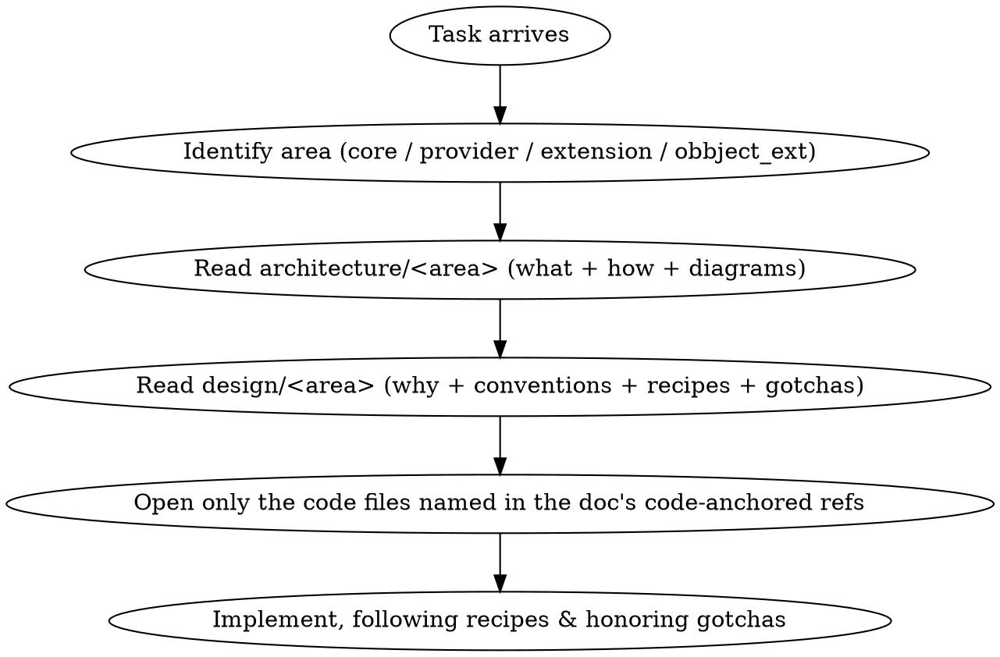

# OpenBB Platform — Memory Bank

> **Agent memory bank.** This tree is the durable, code-grounded knowledge base for the
> OpenBB Platform (`I:\masterswork\git\OpenBB\openbb_platform`). It exists so an AI agent
> (or human) can understand the system **without re-parsing the source from scratch every
> time**. Read the relevant page here first; drop into code only to confirm specifics.

- **Code lives at:** `openbb_platform/` (this doc tree only describes it; it does not duplicate it).
- **Docs live at:** `docs/OpenBBPlatform/` (here). The original repo docs are left untouched.
- **Last verified against code:** 2026-06-02. When code drifts, update the affected page and bump this date.

---

## How to use this memory bank (for agents)



1. **Find the area** in the [directory map](#directory-map--symmetric-structure) below.
2. Read its **architecture** page (structure, data flow, diagrams).
3. Read its **design** page (rationale, conventions, recipes, pitfalls).
4. Jump to the exact code files listed in each page's *code-anchored references* table.
5. Honor the [global gotchas](./design/04-gotchas.md) and [conventions](./design/02-conventions.md).

> Every page is **code-anchored**: it names files + class/function symbols (not line
> numbers, which drift) and carries a "last verified" date.

---

## Two symmetric trees

| Tree | Question it answers | Start here |
|---|---|---|
| **[architecture/](./architecture/README.md)** | *What is it / how does it work?* — structure, components, data flow, mermaid diagrams | [architecture/README.md](./architecture/README.md) |
| **[design/](./design/README.md)** | *Why is it built this way / how do I change it?* — rationale, decisions, conventions, recipes, gotchas | [design/README.md](./design/README.md) |

Each tree **mirrors the source folder layout** so navigation is mechanical: source
`openbb_platform/<area>/<module>` ↔ docs `architecture/<area>/…` and `design/<area>/…`.

---

## Directory map — symmetric structure

Source folder → its architecture doc → its design doc.

| Source (`openbb_platform/`) | Architecture | Design |
|---|---|---|
| *(whole platform)* | [System Overview](./architecture/01-system-overview.md) · [Request Lifecycle](./architecture/02-request-lifecycle.md) | [Principles](./design/00-principles.md) · [Decisions](./design/01-decisions.md) |
| `core/` | [core/](./architecture/core/README.md) | [core/](./design/core/README.md) |
| `core/openbb_core/app/` | [App Runtime](./architecture/core/app-runtime.md) | [core/ design](./design/core/README.md) |
| `core/openbb_core/provider/` | [Provider Framework](./architecture/core/provider-framework.md) | [core/ design](./design/core/README.md) |
| `core/openbb_core/app/model`, `service` | [Models & Settings](./architecture/core/models-and-settings.md) | [core/ design](./design/core/README.md) |
| `core/openbb_core/api/` | [API Server](./architecture/core/api-server.md) | [core/ design](./design/core/README.md) |
| `providers/` | [providers/](./architecture/providers/README.md) | [providers/](./design/providers/README.md) |
| `providers/fmp/` | [fmp](./architecture/providers/fmp.md) | [providers/ design](./design/providers/README.md) |
| `providers/fmp_cached/` | [fmp_cached](./architecture/providers/fmp-cached.md) | [providers/ design](./design/providers/README.md) |
| `providers/yfinance/` | [yfinance](./architecture/providers/yfinance.md) | [providers/ design](./design/providers/README.md) |
| `providers/fred/` | [fred](./architecture/providers/fred.md) | [providers/ design](./design/providers/README.md) |
| `extensions/` | [extensions/](./architecture/extensions/README.md) | [extensions/](./design/extensions/README.md) |
| `obbject_extensions/` | [obbject_extensions/](./architecture/obbject_extensions/README.md) | [obbject_extensions/](./design/obbject_extensions/README.md) |

---

## Cross-cutting references (read these often)

| Doc | Use it for |
|---|---|
| [GLOSSARY](./GLOSSARY.md) | Every domain term + the symbol that implements it |
| [Design · Principles](./design/00-principles.md) | The handful of ideas that explain everything else |
| [Design · Decisions (ADR)](./design/01-decisions.md) | Why key trade-offs were made |
| [Design · Conventions](./design/02-conventions.md) | Naming, structure, signatures you must follow |
| [Design · Recipes](./design/03-recipes.md) | Step-by-step: add a provider / command / standard model |
| [Design · Gotchas](./design/04-gotchas.md) | Invariants & pitfalls that cause silent failures |
| [Design · Quality & Testing](./design/05-quality-and-testing.md) | Pre-commit gates, VCR fetcher tests, test tiers |

---

## The 60-second model

OpenBB exposes **two surfaces from one router tree**: a Python SDK (`obb.equity.price.historical(...)`)
and a FastAPI REST API. Both are generated from the nested `Router` tree built by
`RouterLoader.from_extensions()` and both converge on `CommandRunner → Query →
QueryExecutor → Fetcher`. The connective tissue is the `ProviderInterface` singleton,
which inspects every installed **provider** and synthesizes the parameter/return models
that both surfaces inject. Plugins are discovered via three entry-point groups:
`openbb_core_extension` (Routers → commands), `openbb_provider_extension` (Providers →
data), `openbb_obbject_extension` (accessors like `.charting`).

→ Full version: [System Overview](./architecture/01-system-overview.md).

---

## Quick-ref card format (used across all per-folder pages)

Every per-folder page opens with a scannable card so an agent can grab the essentials in
one glance:

```
┌─ <folder> ──────────────────────────────────────────────
│ Purpose      : one line
│ Entry point  : group + object (if a plugin)
│ Key files    : the 3-5 files that matter
│ Public API   : what it exposes (classes / commands / accessor)
│ Depends on   : upstream modules
│ Used by      : downstream modules
│ Gotchas      : the 1-2 things that bite
│ Code refs    : file → symbol
└─────────────────────────────────────────────────────────
```

---

Maintainers & agents: when you change platform code, update the matching page in **both**
trees and bump the "last verified" date. Keeping this bank accurate is what makes it
trustworthy enough to skip reading code.
