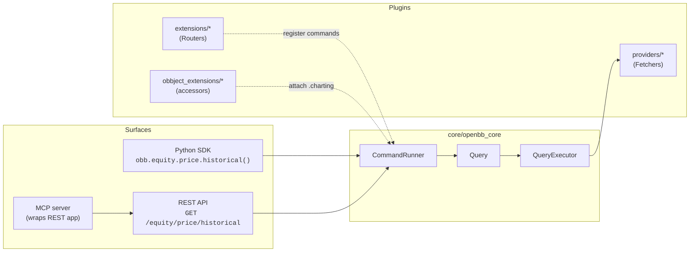
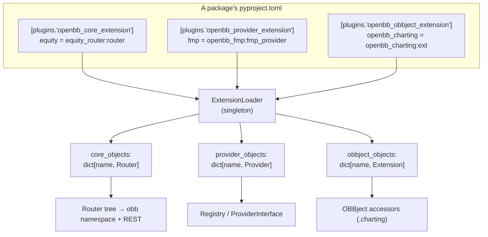
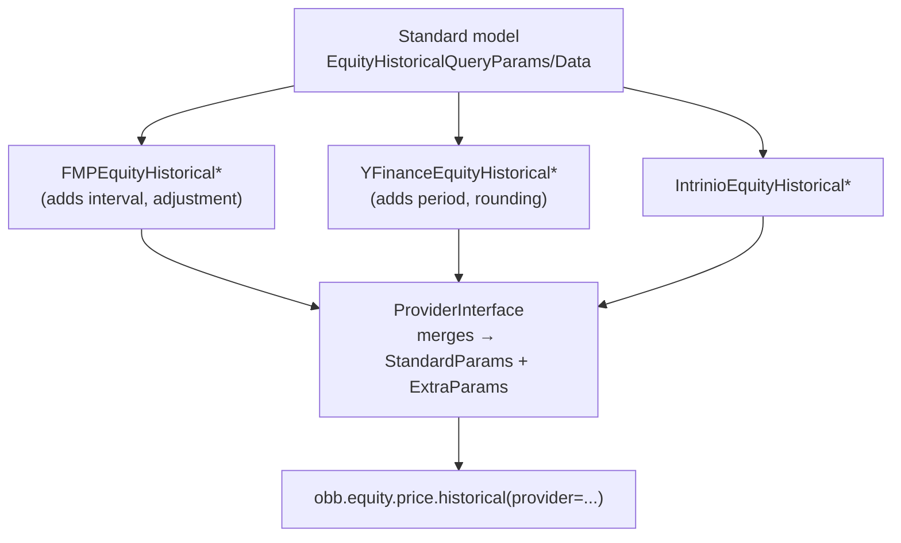

# 01 — System Overview

[← Docs home](./README.md) · Next: [02 — Request Lifecycle →](./02-request-lifecycle.md)

> **Upstream reference:** the canonical conceptual version is
> `third_party/openbb-docs/content/odp/python/developer/architecture_overview.mdx`
> ([docs.openbb.co](https://docs.openbb.co/platform/developer)). See the
> [INDEX upstream map](../INDEX.md#third-tree--upstream-docs-as-a-complementary-memory-bank).

---

## What OpenBB Platform is

The OpenBB Platform is the **"connect once, consume everywhere"** infrastructure for
financial data. It provides:

- A **vendor-neutral data contract** (standard models) so consumers program against a
  stable schema regardless of which data vendor actually serves the data.
- A **plugin architecture** where data sources (*providers*) and command namespaces
  (*extensions*) are independent installable packages discovered via Python entry points.
- **Two consumption surfaces** generated from one router tree: a typed Python SDK
  (`obb`) and a FastAPI REST API.

---

## The two surfaces, one engine

Key idea: **the surfaces are adapters.** The Python SDK methods are *generated* wrappers
that call `Container._run(...)`; the REST endpoints are *wrapped* FastAPI routes. Both
call the **same** `CommandRunner.run`. The only meaningful difference is **where the
provider is chosen** (see [Request Lifecycle](./02-request-lifecycle.md#provider-selection)).

---

## The three plugin types

Everything pluggable is a Python **entry point** declared in a package's `pyproject.toml`.
There are three groups (defined in `core/openbb_core/app/extension_loader.py` → `OpenBBGroups`):

| Entry-point group | Object loaded | Lives in | Attaches to | Doc |
|---|---|---|---|---|
| `openbb_core_extension` | `Router` | `extensions/*` | a namespace under `obb.` | [extensions/](./extensions/README.md) |
| `openbb_provider_extension` | `Provider` | `providers/*` | the provider registry | [providers/](./providers/README.md) |
| `openbb_obbject_extension` | `Extension` | `obbject_extensions/*` | an accessor on every `OBBject` | [obbject_extensions/](./obbject_extensions/README.md) |

A fourth, companion group `openbb_charting_extension` supplies per-command chart-drawing
classes (e.g. `EquityViews`) consumed by the charting accessor. Several extensions also
ship `console_scripts` (`openbb-mcp`, `openbb-api`, `openbb-agents-mcp`) that wrap the
built FastAPI app as standalone processes.

---

## The four pillars

### 1. The Engine — `core/openbb_core/`
The runtime. Contains the `app/` package (static build, command runner, router,
provider interface, models, services), the `provider/` framework (Fetcher abstractions,
standard models, registry), and the `api/` server (FastAPI assembly).
→ [core/ overview](./core/README.md)

### 2. Providers — `providers/`
34 data-source integrations. Each implements `Fetcher` subclasses mapped to standard
model names in a `Provider` object. `fmp`, `yfinance`, `fred`, and the MySQL-backed
`fmp_cached` are the notable ones in this fork.
→ [providers/ overview](./providers/README.md)

### 3. Extensions — `extensions/`
24 command namespaces. Most are **data routers** (model-backed, provider-injected);
a few are **toolkits** (`technical`, `quantitative`, `econometrics`) that compute on
input data instead of calling providers.
→ [extensions/ overview](./extensions/README.md)

### 4. OBBject Extensions — `obbject_extensions/`
Accessors attached to every result object. The `charting` extension adds
`result.charting.to_chart()` / `.show()`.
→ [obbject_extensions/ overview](./obbject_extensions/README.md)

---

## Standard models: the vendor-neutral contract

The heart of "connect once, consume everywhere." A **standard model** is a
`QueryParams` + `Data` pair defining the canonical shape of a query and its result
(e.g. `EquityHistoricalQueryParams` + `EquityHistoricalData`). There are **~177**
standard models in `core/openbb_core/provider/standard_models/`.

- An extension command targets a standard model **name** via `@router.command(model="EquityHistorical")`.
- Each provider that wants to serve that command **subclasses both halves** and registers
  a `Fetcher` under that name in its `fetcher_dict`.
- The `ProviderInterface` merges all providers' contributions into the dynamic
  `StandardParams` / `ExtraParams` / `ProviderChoices` models injected into both surfaces.

→ Details in [Provider Framework](./core/provider-framework.md#standard-models).

---

## Glossary

| Term | Meaning |
|---|---|
| **`obb`** | The static SDK object; an instance of a generated class tree (`openbb/package/*.py`). |
| **OBBject** | The universal result container (`results`, `provider`, `warnings`, `chart`, `extra`). Has `.to_dataframe()`, `.charting`, etc. |
| **Standard model** | Vendor-neutral `QueryParams`+`Data` pair defining a command's contract. |
| **Provider** | A data-source plugin; a `Provider` object mapping model names → `Fetcher` classes. |
| **Fetcher** | The `transform_query → extract_data → transform_data` (TET) pipeline for one model at one provider. |
| **Extension** | A command-namespace plugin exposing a `Router` (data router or toolkit). |
| **ProviderInterface** | Singleton that aggregates all providers into dynamic param/return models. |
| **CommandRunner** | The shared execution engine both surfaces converge on. |
| **Container** | Base class of every generated SDK router class; `._run()` bridges to `CommandRunner`. |
| **TET** | Transform-Extract-Transform — the Fetcher lifecycle. |
| **Entry point** | Python packaging mechanism used to discover plugins (`importlib.metadata.entry_points`). |

---

Next: [02 — Request Lifecycle →](./02-request-lifecycle.md)
