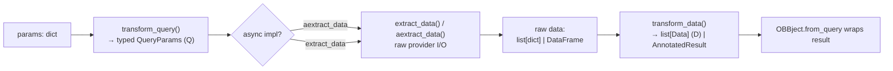

# 02 — Request Lifecycle

[← 01 System Overview](./01-system-overview.md) · [Docs home](./README.md) · Next: [core/ →](./core/README.md)

---

This page traces a single command from call site to result, for **both** surfaces, and
shows exactly where validation, provider selection, credential injection, and fetching
happen.

Worked example: `obb.equity.price.historical(symbol="AAPL", provider="fmp")`.

---

## 1. The full Python-SDK lifecycle

```mermaid
sequenceDiagram
    autonumber
    participant App as obb.equity.price.historical
    participant Cont as Container._run
    participant CR as CommandRunner.run
    participant SCR as StaticCommandRunner._execute_func
    participant PB as ParametersBuilder
    participant Fn as router coroutine<br/>(historical)
    participant Q as Query.execute
    participant QE as QueryExecutor
    participant F as Fetcher (TET)

    App->>App: @validate / @exception_handler
    App->>App: _get_provider() → credential-aware fallback
    App->>Cont: _run("/equity/price/historical", **filter_inputs(...))
    Cont->>Cont: merge user defaults (defaults.commands)
    Cont->>CR: sync_run → run(route, user_settings, ...)
    CR->>SCR: StaticCommandRunner.run → _execute_func
    SCR->>PB: build() → merge args, inject cc, validate_kwargs
    SCR->>Fn: maybe_coroutine(func, **kwargs)
    Fn->>Q: OBBject.from_query(Query(**locals()))
    Q->>Q: filter_extra_params(extra, provider)
    Q->>QE: execute(provider, model, params, credentials)
    QE->>QE: get_provider → get_fetcher → filter_credentials
    QE->>F: fetch_data(params, creds)
    F->>F: transform_query → extract_data → transform_data
    F-->>QE: list[Data] | AnnotatedResult
    QE-->>Q: results
    Q-->>Fn: results → OBBject
    Fn-->>SCR: OBBject
    SCR->>SCR: attach metadata + warnings; logging; callbacks
    SCR-->>Cont: OBBject
    Cont->>Cont: output_type transform (to_df / OBBject / ...)
    Cont-->>App: result
```

### Step-by-step

1. **Generated wrapper** (`openbb/package/equity_price.py`, regenerated on build) runs
   under two decorators from `app/static/utils/decorators.py`:
   - `@validate` → pydantic `validate_call` against the rich public signature (type coercion).
   - `@exception_handler` → normalizes errors into `OpenBBError` / `EmptyDataError` /
     `UnauthorizedError` with trimmed tracebacks (unless `DEBUG_MODE`).
2. **Provider selection happens here**, in the static layer, via
   `Container._get_provider(provider, "equity.price.historical", default_priority)`.
   If `provider is None`, it walks the priority tuple and returns the first provider
   whose required credentials are all populated.
3. **`Container._run`** (`app/static/container.py`) merges per-command user defaults,
   then calls `CommandRunner.sync_run` → `run_async(self.run, ...)`.
4. **`CommandRunner.run`** (`app/command_runner.py`) builds an `ExecutionContext`
   (command_map, route, system_settings, user_settings) and calls
   `StaticCommandRunner.run`.
5. **`StaticCommandRunner._execute_func`** is the heavy lifter:
   - `ParametersBuilder.build` merges args/kwargs, injects `cc=CommandContext(...)`
     *iff* the function declares `cc`, then `validate_kwargs` builds a dynamic pydantic
     model (`extra="allow"`) to validate/coerce.
   - `_command` → `await maybe_coroutine(func, **kwargs)` runs the **router coroutine**.
6. **The router coroutine** (`extensions/equity/.../price_router.py::historical`) is a
   one-liner: `return await OBBject.from_query(Query(**locals()))`.
7. **`Query.execute`** (`app/query.py`) dumps standard params, filters extra params to
   those the chosen provider supports, dumps credentials, and calls the executor.
8. **`QueryExecutor.execute`** (`provider/query_executor.py`) looks up the provider and
   its fetcher, validates credentials (`filter_credentials`), and runs `fetch_data`.
9. **`Fetcher.fetch_data`** runs TET (see [Fetcher lifecycle](#3-the-fetcher-tet-lifecycle)).
10. Result is wrapped in an **OBBject**; metadata/warnings attached; logging fired.
11. **`Container._run` applies the output transform** based on `preferences.output_type`
    (`OBBject` returned as-is, else `obbject.to_<type>()`, e.g. `to_dataframe`).

---

## 2. The REST-API lifecycle (shared engine)

The REST surface differs only in the adapter. `api/router/commands.py::build_api_wrapper`
rebuilds each route's signature for FastAPI and the async wrapper ultimately calls the
**same** `command_runner.run(path, user_settings, *args, **kwargs)`.

```mermaid
sequenceDiagram
    autonumber
    participant HTTP as GET /equity/price/historical
    participant FA as FastAPI + Depends()
    participant W as build_api_wrapper.wrapper
    participant CR as CommandRunner.run
    participant Rest as (identical to SDK path)
    HTTP->>FA: request; provider as query param
    FA->>FA: Depends() injects StandardParams/ExtraParams/ProviderChoices
    FA->>FA: (if API_AUTH) user_settings_hook
    FA->>W: validated params
    W->>W: apply per-command defaults
    W->>CR: run(path, user_settings, *args, **kwargs)
    CR->>Rest: StaticCommandRunner → Query → Fetcher
    Rest-->>W: OBBject
    W->>W: validate_output (strip exclude_from_api)
    W-->>HTTP: JSON
```

### <a id="provider-selection"></a>Where the surfaces diverge: provider selection

| | Python SDK | REST API |
|---|---|---|
| **Provider chosen by** | `Container._get_provider` (credential-aware fallback) | request `provider` param + FastAPI `Depends` |
| **Param injection** | baked into generated method signature | `Depends()` on dynamic dataclasses |
| **Auth** | local `user_settings` | optional `user_settings_hook` when `API_AUTH` |
| **Output** | `preferences.output_type` transform | JSON (`validate_output`) |

**Credential *validation* is identical and always late** — inside
`QueryExecutor.filter_credentials`, just before `fetch_data`.

---

## 3. The Fetcher TET lifecycle

Every provider implements one `Fetcher` per standard model. `fetch_data` orchestrates
three steps (defined in `provider/abstract/fetcher.py`):



- **transform_query** — dict → validated provider `QueryParams` (injects defaults).
- **extract_data / aextract_data** — actual HTTP/DB I/O; returns **raw** data only.
  A subclass implements *either* sync `extract_data` *or* async `aextract_data`;
  `__init_subclass__` binds async onto `extract_data` and `maybe_coroutine` calls it
  correctly. This is why sync (`yfinance`) and async (`fmp`) providers share machinery.
- **transform_data** — validates raw records into the provider's `Data` subclass.

→ Full detail in [Provider Framework](./core/provider-framework.md).

---

## 4. Where each concern is handled (cheat sheet)

| Concern | Location | Module |
|---|---|---|
| Public type coercion | `@validate` on generated method | `app/static/utils/decorators.py` |
| Error normalization | `@exception_handler` | `app/static/utils/decorators.py` |
| Provider selection (SDK) | `Container._get_provider` | `app/static/container.py` |
| User-default merge | `Container._run` | `app/static/container.py` |
| `cc` injection + kwargs validation | `ParametersBuilder` | `app/command_runner.py` |
| Router coroutine execution | `StaticCommandRunner._command` | `app/command_runner.py` |
| Extra-param filtering by provider | `Query.filter_extra_params` | `app/query.py` |
| Credential validation | `QueryExecutor.filter_credentials` | `provider/query_executor.py` |
| Data fetch (TET) | `Fetcher.fetch_data` | `provider/abstract/fetcher.py` |
| Result wrapping | `OBBject.from_query` | `app/model/obbject.py` |
| Metadata + logging | `StaticCommandRunner` (`finally`) | `app/command_runner.py` |
| Output-type transform | `Container._run` | `app/static/container.py` |

---

## 5. The build that makes the SDK exist

Before any of the above can run in the Python SDK, the static `obb` object must be
generated. On `import openbb`, `PackageBuilder.auto_build()` compares installed
extensions against the recorded set and regenerates `openbb/package/*.py` if they differ.

→ See [App Runtime § Package build](./core/app-runtime.md#the-package-build-process).

---

Next: [core/ overview →](./core/README.md)
