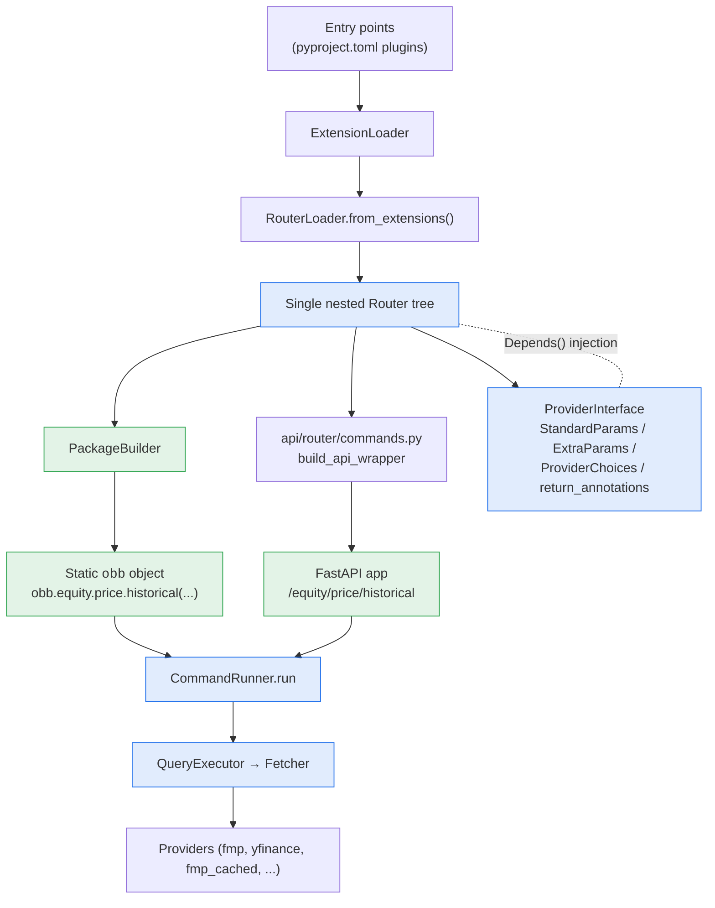

# OpenBB Platform — Architecture Documentation

[← Memory Bank Index](../INDEX.md) · Sister tree: [design/](../design/README.md) · [GLOSSARY](../GLOSSARY.md)

> **Audience:** developers and AI agents working on the OpenBB Platform codebase.
> **Purpose:** an accurate, code-grounded reference for the system architecture, the
> module layout, and the runtime data flows — the *what* and *how*. For the *why*
> (rationale, conventions, recipes, gotchas) see the sister [design/](../design/README.md) tree.

This documentation tree mirrors the on-disk module layout of
`openbb_platform/` so you can navigate from a concept to the code that implements it.
Code lives at `openbb_platform/`; these docs only describe it. **Last verified: 2026-06-02.**

---

## Document map

| Document | Covers | Source modules |
|---|---|---|
| [01 — System Overview](./01-system-overview.md) | The big picture, two consumption surfaces, glossary | whole platform |
| [02 — Request Lifecycle](./02-request-lifecycle.md) | End-to-end trace of a command call, sequence diagrams | `core/openbb_core/app` + `provider` |
| [core/](./core/README.md) | The core runtime engine | `core/openbb_core/` |
| &nbsp;&nbsp;├ [App Runtime](./core/app-runtime.md) | Static `obb` build, Container, CommandRunner, Router | `core/openbb_core/app/` |
| &nbsp;&nbsp;├ [Provider Framework](./core/provider-framework.md) | Fetcher / QueryParams / Data / Provider abstractions | `core/openbb_core/provider/` |
| &nbsp;&nbsp;├ [Models & Settings](./core/models-and-settings.md) | OBBject, credentials, user/system settings | `core/openbb_core/app/model`, `app/service` |
| &nbsp;&nbsp;└ [API Server](./core/api-server.md) | FastAPI assembly, REST↔Python sharing | `core/openbb_core/api/` |
| [providers/](./providers/README.md) | Provider subsystem, registration, all 34 providers | `providers/` |
| &nbsp;&nbsp;└ [fmp_cached deep dive](./providers/fmp-cached.md) | MySQL gap-detection caching layer | `providers/fmp_cached/` |
| [extensions/](./extensions/README.md) | Router extensions, registration, all 24 extensions | `extensions/` |
| &nbsp;&nbsp;└ [Toolkit vs Data Routers](./extensions/toolkit-vs-data-routers.md) | Two command flavors | `extensions/{technical,quantitative,...}` |
| [obbject_extensions/](./obbject_extensions/README.md) | The `.charting` accessor pattern | `obbject_extensions/charting/` |

---

## The one-paragraph mental model

OpenBB exposes **two consumption surfaces built from one set of `Router` objects**:
a **Python static layer** (`obb.equity.price.historical(...)`) and a **REST API**
(`/equity/price/historical`). Both surfaces are generated from the same nested
`Router` tree assembled by `RouterLoader.from_extensions()`. Both converge on
`CommandRunner` → `Query` → `QueryExecutor` → `Fetcher`. The connective tissue is the
`ProviderInterface` singleton, which inspects every installed provider's fetchers and
synthesizes the dynamic parameter/return models used by both surfaces.



---

## Repository layout (top level of `openbb_platform/`)

```
openbb_platform/
├── core/                 # openbb-core: the engine (this is where the magic lives)
│   ├── openbb/           #   the installable `openbb` package + generated package/
│   └── openbb_core/      #   app runtime, provider framework, api server
├── extensions/           # 24 command-router extensions (equity, crypto, technical, ...)
├── providers/            # 34 data-source integrations (fmp, yfinance, fred, ...)
├── obbject_extensions/   # OBBject accessors (charting)
├── pyproject.toml        # meta-package pinning the default install set
└── docs/architecture/    # <-- you are here
```

See [01 — System Overview](./01-system-overview.md) to start.

---

## Conventions used in these docs

- **File references** are relative to `openbb_platform/` unless noted.
- **Mermaid diagrams** render on GitHub and most Markdown viewers.
- **TET** = the Fetcher pipeline: **T**ransform query → **E**xtract data → **T**ransform data.
- Cross-document links are relative; every page links back here.
