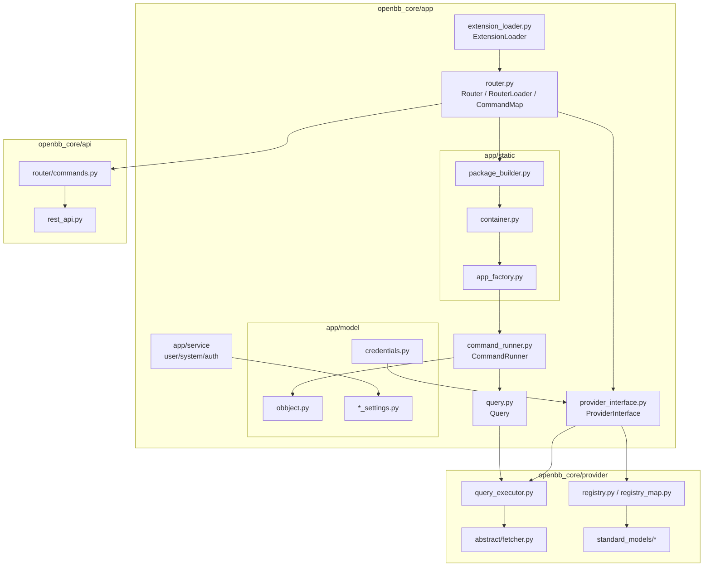

# core/ — The Engine (`openbb-core`)

[← Docs home](../README.md) · [01 Overview](../01-system-overview.md) · [02 Lifecycle](../02-request-lifecycle.md)

---

`core/` is the `openbb-core` package — the runtime engine that every other package
depends on. It contains no data sources and no command definitions of its own; instead
it provides the **abstractions, the execution engine, and the code generator** that turn
installed plugins into the `obb` SDK and the REST API.

## On-disk layout

```
core/
├── openbb/                       # the installable `openbb` package (the SDK entry)
│   ├── __init__.py               #   ignition: auto_build() then build `obb`
│   ├── package/                  #   GENERATED static SDK classes (not committed)
│   └── assets/reference.json     #   GENERATED command reference
└── openbb_core/
    ├── app/                      # the application runtime  ── see App Runtime
    │   ├── static/               #   SDK code generation (PackageBuilder, Container)
    │   ├── command_runner.py     #   execution engine
    │   ├── router.py             #   Router, @command decorator, RouterLoader
    │   ├── provider_interface.py #   aggregates providers → dynamic param models
    │   ├── extension_loader.py   #   entry-point discovery
    │   ├── query.py              #   Query.execute (router → provider bridge)
    │   ├── model/                #   OBBject, settings, credentials ── see Models & Settings
    │   └── service/              #   user/system/auth services
    ├── provider/                 # the provider framework ── see Provider Framework
    │   ├── abstract/             #   Fetcher, QueryParams, Data, Provider
    │   ├── standard_models/      #   ~177 vendor-neutral contracts
    │   ├── registry.py           #   provider registry
    │   ├── registry_map.py       #   schema introspection
    │   ├── query_executor.py     #   runs the chosen fetcher
    │   └── utils/                #   HTTP helpers, descriptions
    ├── api/                      # the FastAPI server ── see API Server
    └── env.py                    # Env singleton (.env + os.environ snapshot)
```

## Sub-documents

| Document | What it covers |
|---|---|
| [App Runtime](./app-runtime.md) | Static `obb` generation, `Container`, `CommandRunner`, `Router`, `ProviderInterface`, `ExtensionLoader` |
| [Provider Framework](./provider-framework.md) | `Fetcher` (TET), `QueryParams`, `Data`, `Provider`, standard models, registry, executor |
| [Models & Settings](./models-and-settings.md) | `OBBject`, `Credentials`, `UserSettings`/`SystemSettings`/`Preferences`, services |
| [API Server](./api-server.md) | FastAPI assembly, how REST and Python share one router tree |

## Component map



---

Start with [App Runtime →](./app-runtime.md).
