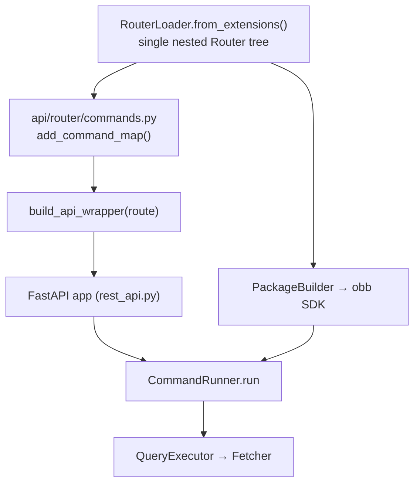
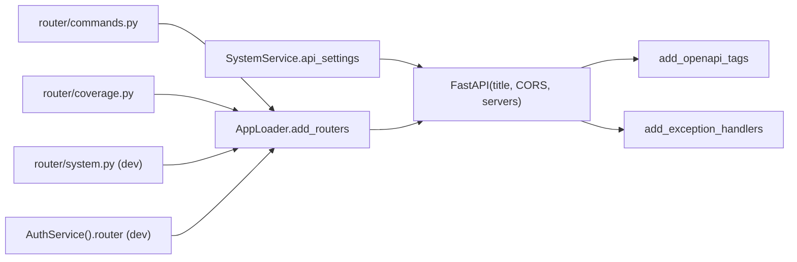

# core/ — API Server

[← core/ overview](./README.md) · [Docs home](../README.md)

Covers `core/openbb_core/api/` — how the **same** router tree that backs the Python SDK is
turned into a FastAPI REST application.

Related: [App Runtime](./app-runtime.md) · [Request Lifecycle](../02-request-lifecycle.md) · [extensions/mcp_server](../extensions/README.md#mcp_server)

---

## 1. The shared-router insight

The single most important fact about the API: **it does not re-implement anything.**
`api/router/commands.py` takes the same `RouterLoader.from_extensions()` tree the SDK
generator uses, wraps each endpoint for FastAPI, and routes calls into the same
`CommandRunner.run`.



---

## 2. App assembly (`api/rest_api.py`)

Builds the FastAPI `app` from `SystemService().system_settings.api_settings`
(title, CORS, servers). Registers routers via `AppLoader.add_routers`:

- **DEV_MODE**: `[AuthService().router, router_system, router_coverage, router_commands]`
- **otherwise**: `[router_commands, router_coverage]`

Then `add_openapi_tags` (descriptions from the router tree) and `add_exception_handlers`.



`api/app_loader.py::AppLoader` provides `add_routers` / `add_openapi_tags` /
`add_exception_handlers`. Handlers in `api/exception_handlers.py` map `OpenBBError`,
`ValidationError`, `EmptyDataError`, `UnauthorizedError` → JSON error responses.

---

## 3. The REST↔core bridge (`api/router/commands.py`)

```python
def add_command_map(command_runner, api_router):
    plugins_router = RouterLoader.from_extensions()      # SAME tree as the SDK
    for route in plugins_router.api_router.routes:
        route.endpoint = build_api_wrapper(command_runner, route)
    api_router.include_router(router=plugins_router.api_router)
```

`build_api_wrapper`:
- **`build_new_signature`** rebuilds each endpoint's signature for FastAPI:
  - removes `cc`,
  - conditionally inserts `chart: bool` (if charting installed),
  - adds custom `Header` params,
  - when `Env().API_AUTH`, adds `__authenticated_user_settings` with
    `Depends(AuthService().user_settings_hook)`.
- the async `wrapper` extracts authenticated `UserSettings`, applies per-command
  `defaults`, then `await command_runner.run(path, user_settings, *args, **kwargs)` —
  **the identical `CommandRunner.run` used by the SDK.**
- post-processing: `validate_output` strips `exclude_from_api` fields; `_results_only` /
  `_extension_modified` return raw `JSONResponse`.

Module-level it instantiates
`CommandRunner(system_settings=SystemService(logging_sub_app="api"))` and wires the map at
import.

---

## 4. Other API routers

| File | Purpose |
|---|---|
| `api/router/commands.py` | the command endpoints (above) |
| `api/router/coverage.py` | `/coverage/*` — provider↔command maps, command schemas |
| `api/router/system.py` | `/system/*` (DEV only) |
| `api/router/user.py` | default auth hooks (`auth_hook`, `user_settings_hook`) |
| `api/auth/user.py` | auth user model |
| `api/dependency/*` | FastAPI dependencies (coverage/system) |

---

## 5. Auth flexibility

`AuthService` (singleton) chooses the auth implementation:
- defaults to `api/router/user.py` (no-op hooks),
- if `OPENBB_API_AUTH_EXTENSION` env var names an installed core extension, loads its
  `router`, `auth_hook`, and `user_settings_hook` instead.

This lets a deployment plug in real authentication without changing the command surface.

---

## 6. Downstream consumers of the REST app

Two `console_scripts` wrap the built app as standalone processes (they do **not** add to
`obb`):

- **`openbb-api`** (`extensions/platform_api`) — launches the app with uvicorn and serves
  OpenBB Workspace widget descriptors (`widgets.json`).
- **`openbb-mcp`** (`extensions/mcp_server`) — `FastMCP.from_fastapi(app)` turns each
  route into an MCP tool.

→ [extensions/ overview § Special extensions](../extensions/README.md#special-extensions).

---

## Quick reference

| Concern | File | Symbol |
|---|---|---|
| App assembly | `api/rest_api.py` | `app` |
| Router registration | `api/app_loader.py` | `AppLoader` |
| REST↔core bridge | `api/router/commands.py` | `add_command_map`, `build_api_wrapper` |
| Exception handling | `api/exception_handlers.py` | handlers |
| Coverage endpoints | `api/router/coverage.py` | router |
| Auth selection | `app/service/auth_service.py` | `AuthService` |

[← back to core/ overview](./README.md)
