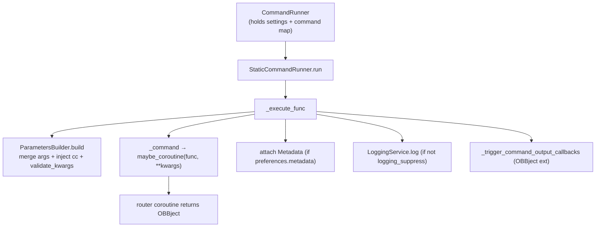
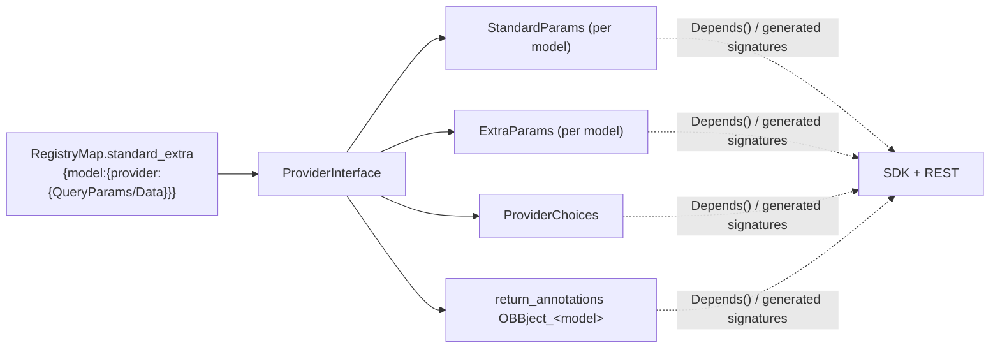

# core/ — App Runtime

[← core/ overview](./README.md) · [Docs home](../README.md)

Covers `core/openbb_core/app/` — the static SDK generation, the command runner, the
router system, the provider interface, and extension discovery.

Related: [Request Lifecycle](../02-request-lifecycle.md) · [Provider Framework](./provider-framework.md) · [Models & Settings](./models-and-settings.md) · [API Server](./api-server.md)

---

## 1. How the `obb` object comes to exist

`openbb/__init__.py` is the ignition sequence:

```python
_PackageBuilder(_this_dir).auto_build()        # (1) regenerate package/ if extensions changed
_ReferenceLoader(_this_dir)                     # (2) prime reference.json singleton
from openbb.package.__extensions__ import Extensions as _Extensions  # (3) import generated tree
obb = _create_app(_Extensions)                  # (4) compose the runtime object
sdk = obb
```

`create_app` (`app/static/app_factory.py`) composes `BaseApp` with the **generated**
`Extensions` class via multiple inheritance and injects a shared `CommandRunner`:

```python
def create_app(extensions=None):
    class App(BaseApp, extensions or object):
        ...
    return App(command_runner=CommandRunner())
```

The generated `Extensions` class is a `Container` subclass whose properties lazily
instantiate per-router classes, **threading the same `command_runner`**:

```python
@property
def equity(self):
    from . import equity
    return equity.ROUTER_equity(command_runner=self._command_runner)
```

So `obb.equity.price.historical` resolves `App → ROUTER_equity → ROUTER_equity_price →
historical`, every node a `Container` carrying `self._command_runner`.

> **`openbb/package/` is generated and not committed** (except `__init__.py`).

---

## 2. The package build process

Public entry: `openbb.build()` → `PackageBuilder(dir).build(modules)`. On import,
`auto_build()` only rebuilds if the installed extension set differs from the recorded
set in `reference.json` (and `Env().AUTO_BUILD` is true).

```mermaid
sequenceDiagram
    autonumber
    participant I as openbb/__init__.py
    participant PB as PackageBuilder
    participant RL as RouterLoader (lru_cache)
    participant EL as ExtensionLoader
    participant MB as ModuleBuilder / ClassDefinition / MethodDefinition
    participant RG as ReferenceGenerator
    I->>PB: auto_build()
    PB->>PB: _diff(installed entry points vs reference.json)
    alt extensions changed
        PB->>PB: build() under FileLock(.build.lock)
        PB->>RL: from_extensions()
        RL->>EL: core_objects (entry points → Routers)
        RL-->>PB: single nested Router tree
        loop each route path
            PB->>MB: ModuleBuilder.build(path)
            MB-->>PB: source (Container subclass + methods)
            PB->>PB: write package/<module>.py
        end
        PB->>RG: get_paths/get_routers
        RG-->>PB: reference.json
        PB->>PB: write reference.json; run black + ruff
    end
```

Key generator classes (all in `app/static/package_builder.py`):

| Class | Role |
|---|---|
| `PackageBuilder` | Orchestrates clean → build modules → save package → save reference → lint. |
| `PathHandler` | `build_route_map()` / `build_path_list()` from the router tree. |
| `ModuleBuilder` | Per-path: `ImportDefinition` + `ClassDefinition`. |
| `ClassDefinition` / `MethodDefinition` | Emit `class ROUTER_x(Container)` and each command method body. |
| `DocstringGenerator` | NumPy-style docstrings from `ProviderInterface` field metadata. |
| `ReferenceGenerator` | Produces `reference.json` (→ `obb.reference`, `obb.coverage`). |

A generated command method body looks like:

```python
return self._run(
    "/equity/price/historical",
    **filter_inputs(
        provider_choices={"provider": self._get_provider(
            provider, "equity.price.historical", ("fmp", "fmp_cached", "yfinance"))},
        standard_params={"symbol": symbol, "start_date": start_date, ...},
        extra_params=kwargs,
        info={...multiple_items_allowed map...},
    )
)
```

`filter_inputs` (`app/static/utils/filters.py`) converts list inputs to comma-strings
where `multiple_items_allowed`, and converts `data` to BaseModels for POST commands.

---

## 3. `Container` — the SDK↔engine bridge

`app/static/container.py`. Base class of every generated router class.

- `__init__` stores the runner and pins settings onto the OBBject class
  (`OBBject._user_settings`, `OBBject._system_settings`).
- **`_run(*args, **kwargs)`**:
  1. derive endpoint from route,
  2. merge per-command user defaults (`user_settings.defaults.commands`),
  3. `command_runner.sync_run(...)` → OBBject,
  4. apply `preferences.output_type` transform (`OBBject` as-is, else `to_<type>()`).
- **`_get_provider(choice, command, default_priority)`** — credential-aware provider
  fallback; returns the first provider whose required credentials are populated, else
  raises `OpenBBError("Provider fallback failed...")`.

---

## 4. Command execution engine — `app/command_runner.py`



| Class | Role |
|---|---|
| `ExecutionContext` | Immutable bundle: command_map, route, system/user settings. |
| `ParametersBuilder` | Merge args/kwargs, inject `CommandContext` (only if func declares `cc`), validate via a dynamic pydantic model (`extra="allow"`), warn on unknown extras. |
| `StaticCommandRunner` | `_execute_func`, `_command`, `_chart`, `run`, callbacks. The actual executor. |
| `CommandRunner` | Public stateful holder; `run` (async) / `sync_run`. |

Notable behaviors inside `_execute_func` (wrapped in `catch_warnings(record=True)`):
- pops `chart`, deep-copies kwargs;
- sets `obbject.provider` from the resolved provider;
- stashes `_route`, `_standard_params`, `_extra_params` on the OBBject (for charting);
- in `finally`: appends recorded warnings to `obbject.warnings`; fires `LoggingService`
  unless `system_settings.logging_suppress`.

---

## 5. Router system — `app/router.py`

### `Router` and `@router.command`

`Router` wraps a FastAPI `APIRouter`. `include_router(router, prefix)` both delegates to
FastAPI and records the sub-router in `self._routers` (so the Python tree is navigable).

The decorator `@router.command(model="EquityHistorical", examples=[...])`:
- runs `SignatureInspector.complete(func, model)` to rewrite the signature;
- stores `openapi_extra = {"model", "examples", "no_validate"}` — **the `model` string is
  the lynchpin** later read by `CommandMap`, `PackageBuilder`, and `Coverage`;
- registers the route via `api_router.add_api_route(...)` (default `methods=["GET"]`).

### `SignatureInspector` (dependency injection)

For model-backed routes, it:
1. **validates** the function declares `provider_choices: ProviderChoices`,
   `standard_params: StandardParams`, `extra_params: ExtraParams`;
2. **injects** the real generated dataclasses from `ProviderInterface().params[model]`
   as `Annotated[..., Depends()]`;
3. **injects the return annotation** `OBBject_<model>` (discriminated union of provider
   result types).

If the model isn't implemented by any installed provider, the route is **skipped**
(silently disappears).

### `RouterLoader` and `CommandMap`

```python
@lru_cache
def from_extensions():
    router = Router()
    for name, entry in ExtensionLoader().core_objects.items():
        router.include_router(router=entry, prefix=f"/{name}")
    return router
```

This single tree is shared by the SDK generator, the coverage maps, and the FastAPI app.
`CommandMap` derives `map` (route → endpoint), `provider_coverage`, `command_coverage`,
and `commands_model` by reading each route's `openapi_extra["model"]`.

---

## 6. Provider aggregation — `app/provider_interface.py`

`ProviderInterface` (singleton) reads `RegistryMap().standard_extra` and synthesizes the
dynamic models both surfaces depend on:

| Generated | Shape |
|---|---|
| `model_providers` | per-model dataclass with `provider: Literal[...]`. |
| `params` | `{model: {"standard": StandardParams_dc, "extra": ExtraParams_dc}}`. |
| `data` | standard/extra `Data` dataclasses. |
| `return_annotations` | `OBBject_<model>` discriminated union. |
| `provider_choices` | global `ProviderChoices` with `Literal[all providers]`. |
| `credentials` | `{provider: [cred_names]}`. |

**Param-map construction** (`_extract_params`): for the `"openbb"` pseudo-provider,
fields become **standard** params; for real providers, fields *not* in openbb become
**extra** params (forced optional). When two providers contribute the same extra field,
`_merge_fields` unions the types and concatenates provider titles (used by
`Query.filter_extra_params` to warn when a param isn't supported by the chosen provider).



---

## 7. Extension discovery — `app/extension_loader.py`

`ExtensionLoader` (singleton) reads three entry-point groups via
`importlib.metadata.entry_points` (`OpenBBGroups`):

- `openbb_core_extension` → `core_objects: {name: Router}` (filtered by `isinstance Router`);
- `openbb_provider_extension` → `provider_objects: {name: Provider}` (tolerates
  `ModuleNotFoundError` so a missing optional dep doesn't crash the platform);
- `openbb_obbject_extension` → `obbject_objects: {name: Extension}`.

It also builds `on_command_output_callbacks` (consumed by
`StaticCommandRunner._trigger_command_output_callbacks`).

---

## Quick reference

| Concern | File | Symbol |
|---|---|---|
| SDK ignition | `openbb/__init__.py` | `build()`, `obb` |
| App composition | `app/static/app_factory.py` | `BaseApp`, `create_app` |
| SDK↔engine bridge | `app/static/container.py` | `Container._run`, `_get_provider` |
| Code generation | `app/static/package_builder.py` | `PackageBuilder`, `MethodDefinition` |
| Execution engine | `app/command_runner.py` | `CommandRunner`, `StaticCommandRunner`, `ParametersBuilder` |
| Routing/decorator | `app/router.py` | `Router.command`, `SignatureInspector`, `RouterLoader`, `CommandMap` |
| Provider aggregation | `app/provider_interface.py` | `ProviderInterface` |
| Router→provider bridge | `app/query.py` | `Query.execute`, `filter_extra_params` |
| Discovery | `app/extension_loader.py` | `ExtensionLoader`, `OpenBBGroups` |

Next: [Provider Framework →](./provider-framework.md)
