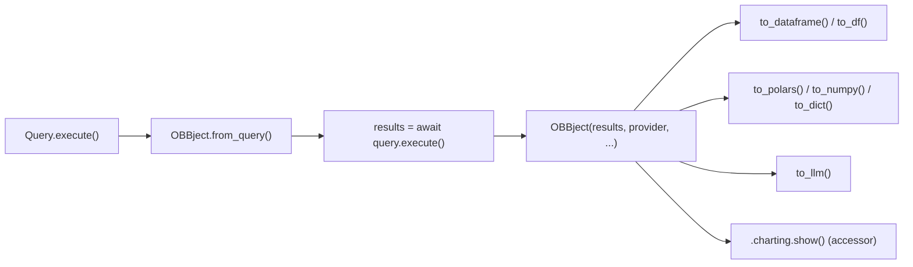
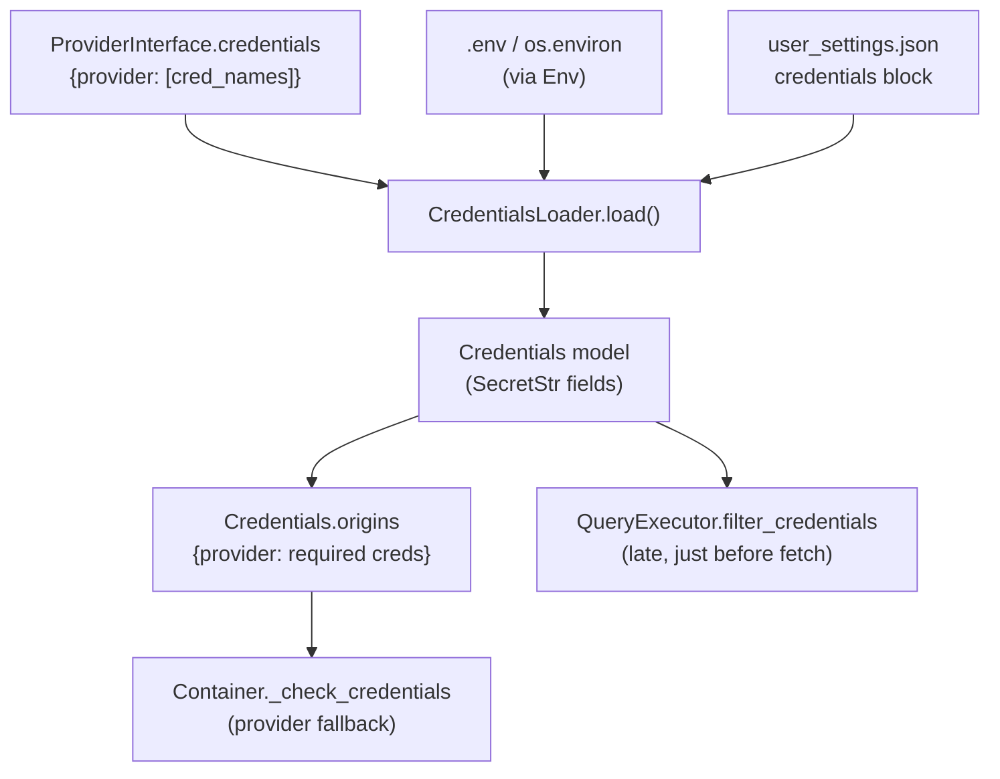
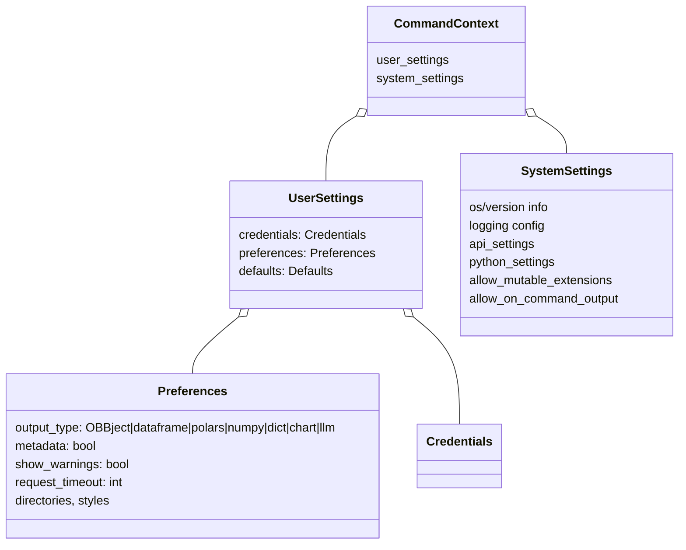
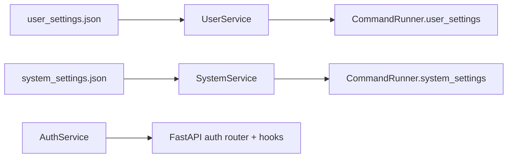

# core/ — Models & Settings

[← core/ overview](./README.md) · [Docs home](../README.md)

> **Upstream reference (user-facing config — not duplicated here):**
> `third_party/openbb-docs/content/odp/python/settings/` — `user_settings/{api_keys,defaults,preferences}.mdx`,
> `environment_variables.mdx`, `system_settings.mdx`. Output container:
> `basic_usage/response_model.mdx`. See [INDEX upstream map](../../INDEX.md#third-tree--upstream-docs-as-a-complementary-memory-bank).

Covers `core/openbb_core/app/model/` and `core/openbb_core/app/service/` — the result
container, the credential/settings models, and the services that load them.

Related: [App Runtime](./app-runtime.md) · [Provider Framework](./provider-framework.md)

---

## 1. `OBBject` — the universal result container

`app/model/obbject.py` · `OBBject(Tagged, Generic[T])`

Every command returns an `OBBject`. Fields:

| Field | Meaning |
|---|---|
| `results: T \| None` | the serializable payload (usually `list[Data]`) |
| `provider` | which provider served the data |
| `warnings` | accumulated warnings |
| `chart` | chart object (when `chart=True`) |
| `extra` | metadata, results_metadata, command params |

Private attrs `_route`, `_standard_params`, `_extra_params` are stashed by the command
runner (used by charting). Class-level `accessors`, `_user_settings`, `_system_settings`.

### Converters & the join point

`@classmethod async from_query(query)` is **the join point between router and provider**:
it runs `results = await query.execute()`, unwrapping `AnnotatedResult` into `results` +
`extra["results_metadata"]`.

OBBject extensions register accessors (`.charting`) via `Extension.register_accessor` →
`CachedAccessor` (pandas-style lazy attribute). → see [obbject_extensions/](../obbject_extensions/README.md).

---

## 2. Credentials

`app/model/credentials.py`

`CredentialsLoader.load()` dynamically builds a `Credentials` pydantic model from:
- `ProviderInterface().credentials` (every provider's required cred names),
- OBBject-extension credentials,
- values from `user_settings.json` and the environment.

- `OBBSecretStr` serializes `SecretStr` to plaintext only in JSON mode.
- `Credentials.origins` maps provider → required cred names; used by
  `Container._get_provider` to pick the first provider with complete credentials.
- `model_post_init` backfills unset credentials from environment defaults.

---

## 3. Settings models

| Model | File | Notes |
|---|---|---|
| `UserSettings` | `user_settings.py` | `credentials` + `preferences` + `defaults`; auto-loads from `USER_SETTINGS_PATH` on init. |
| `Preferences` | `preferences.py` | `output_type` drives the SDK return transform; `metadata`, `show_warnings`, `request_timeout`. |
| `SystemSettings` | `system_settings.py` | frozen; OS/version, logging, `api_settings`, `python_settings`. Validator creates `~/.openbb_platform` and default JSON files. |
| `CommandContext` | `command_context.py` | `{user_settings, system_settings}`; injected into router funcs that declare `cc`. |
| `Credentials` | `credentials.py` | dynamic model (see §2). |
| `Metadata` | `metadata.py` | `arguments`, `duration` (ns), `route`, `timestamp`; attached when `preferences.metadata`. |

`~/.openbb_platform/user_settings.json` is the on-disk source for credentials,
preferences, and per-command defaults. The `.env` at `OPENBB_DIRECTORY` and `os.environ`
are snapshotted by `env.py::Env` (singleton), exposing `API_AUTH`, `AUTO_BUILD`,
`DEBUG_MODE`, `DEV_MODE`, `ALLOW_MUTABLE_EXTENSIONS`, `ALLOW_ON_COMMAND_OUTPUT`.

---

## 4. Services (`app/service/`)

| Service | Responsibility |
|---|---|
| `UserService` (singleton) | `read_from_file()`/`write_to_file()` for `user_settings.json`; persists only `{credentials, preferences, defaults}`; recursive `_merge_dicts`. Source of `CommandRunner._user_settings`. |
| `SystemService` (singleton) | `_read_from_file()` for `system_settings.json` filtered to an allowlist. Source of `CommandRunner._system_settings`. |
| `AuthService` (singleton) | Selects the auth router + hooks. Defaults to `api/router/user.py`; if `OPENBB_API_AUTH_EXTENSION` names an installed core extension, loads its `router`, `auth_hook`, `user_settings_hook`. |

---

## Quick reference

| Concern | File | Symbol |
|---|---|---|
| Result container | `app/model/obbject.py` | `OBBject.from_query`, `to_dataframe` |
| Credentials | `app/model/credentials.py` | `CredentialsLoader`, `Credentials.origins`, `OBBSecretStr` |
| User settings | `app/model/user_settings.py` | `UserSettings` |
| Preferences | `app/model/preferences.py` | `Preferences.output_type` |
| System settings | `app/model/system_settings.py` | `SystemSettings` |
| Command context | `app/model/command_context.py` | `CommandContext` |
| Metadata | `app/model/metadata.py` | `Metadata` |
| Settings loaders | `app/service/*` | `UserService`, `SystemService`, `AuthService` |
| Env | `env.py` | `Env` |

Next: [API Server →](./api-server.md)
