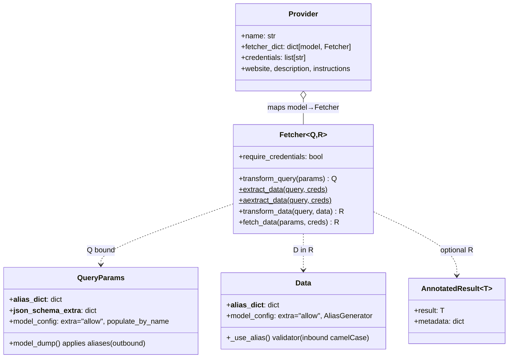
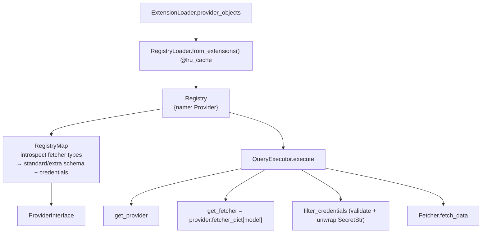

# core/ — Provider Framework

[← core/ overview](./README.md) · [Docs home](../README.md)

Covers `core/openbb_core/provider/` — the abstractions every data source implements:
`Fetcher`, `QueryParams`, `Data`, `Provider`, the standard models, the registry, and the
query executor.

Related: [App Runtime](./app-runtime.md) · [providers/ overview](../providers/README.md) · [Request Lifecycle](../02-request-lifecycle.md)

---

## 1. The five abstractions (`provider/abstract/`)



### `QueryParams` (`abstract/query_params.py`)
- `model_config = ConfigDict(extra="allow", populate_by_name=True)` — accepts unknown
  provider params and allows set-by-alias.
- **Aliases are outbound-only**: `__alias_dict__` is applied only in `model_dump()`, when
  building the provider's querystring (e.g. FMP `start_date → from`, `end_date → to`).
- `__json_schema_extra__` carries per-field schema metadata
  (e.g. `{"symbol": {"multiple_items_allowed": True}}`).

### `Data` (`abstract/data.py`)
- `AliasGenerator(validation_alias=to_camel, serialization_alias=to_snake)` — **inbound is
  camelCase-tolerant, outbound is snake_case**. Provider JSON like `adjClose` validates
  against snake_case fields.
- `__alias_dict__` + a `model_validator(mode="before")` remaps explicit field names before
  validation (e.g. FMP `close → adjClose`).
- `extra="allow"` — providers attach extra columns without subclassing.

### `AnnotatedResult[T]` (`abstract/annotated_result.py`)
Lets `transform_data` return `result` plus side-band `metadata` (record counts,
rate-limit info). Downstream unwraps and stores metadata in `extra["results_metadata"]`.

### `Fetcher[Q, R]` (`abstract/fetcher.py`)
The TET pipeline. See [§2](#2-the-fetcher-tet-lifecycle).

### `Provider` (`abstract/provider.py`)
A declarative manifest:
```python
class Provider:
    def __init__(self, name, description, website=None, credentials=None,
                 fetcher_dict=None, repr_name=None,
                 deprecated_credentials=None, instructions=None):
        ...
        self.credentials = [f"{name.lower()}_{c}" for c in (credentials or [])]
```
- `fetcher_dict: {standard_model_name: FetcherSubclass}` — the routing table.
- Each declared credential is auto-prefixed with `{name}_` → `credentials=["api_key"]`
  becomes `["fmp_api_key"]`. This is the *only* place credential names are namespaced.

---

## 2. The Fetcher TET lifecycle

```python
Q = TypeVar("Q", bound=QueryParams)
D = TypeVar("D", bound=Data)
R = TypeVar("R")  # usually list[D]

class Fetcher(Generic[Q, R]):
    require_credentials = True

    @staticmethod
    def transform_query(params: dict) -> Q: ...
    @staticmethod
    async def aextract_data(query: Q, credentials) -> Any: ...
    @staticmethod
    def extract_data(query: Q, credentials) -> Any: ...
    @staticmethod
    def transform_data(query: Q, data: Any, **kwargs) -> R | AnnotatedResult[R]: ...

    @classmethod
    async def fetch_data(cls, params, credentials=None, **kwargs):
        query = cls.transform_query(params=params)                       # T
        data  = await maybe_coroutine(cls.extract_data, query=query,     # E
                                      credentials=credentials, **kwargs)
        return cls.transform_data(query=query, data=data, **kwargs)      # T
```

```mermaid
flowchart LR
    P["params dict"] --> TQ["transform_query → Q"]
    TQ --> SW{"impl?"}
    SW -->|aextract_data (async)| EX["extract_data()"]
    SW -->|extract_data (sync)| EX
    EX --> RAW["raw list[dict] / DataFrame"]
    RAW --> TD["transform_data → list[D] | AnnotatedResult"]
```

**Sync/async unification** — `__init_subclass__`:
```python
def __init_subclass__(cls, *args, **kwargs):
    super().__init_subclass__(*args, **kwargs)
    if cls.aextract_data != Fetcher.aextract_data:
        cls.extract_data = cls.aextract_data        # async wins
    elif cls.extract_data == Fetcher.extract_data:
        raise NotImplementedError("must implement extract_data or aextract_data")
```
A subclass implements *either* sync or async extract; `maybe_coroutine` in `fetch_data`
calls it correctly. So `fmp` (async, returns dicts) and `yfinance` (sync, returns a
DataFrame) flow through identical machinery.

**Type introspection** via a custom `classproperty` reads `cls.__orig_bases__[0].__args__`
to expose `query_params_type` (Q), `return_type` (R), and `data_type` (D). These power
schema generation (`RegistryMap`) and the `Fetcher.test()` QA harness, which asserts the
types at each TET stage.

---

## 3. Standard models (`provider/standard_models/`)

**~177 standard models** (178 files incl. `__init__.py`). Each declares a vendor-neutral
`QueryParams` + `Data` pair. They are the "connect once" boundary.

Two design patterns coexist (both valid because of `extra="allow"`):

| Pattern | Example | Data side |
|---|---|---|
| **Fat & stable** | `EquityHistoricalData` | declares full OHLCV — vendors agree |
| **Thin core** | `BalanceSheetData` | only `period_ending`, `fiscal_period`, `fiscal_year`; line items added per-provider |

Providers **subclass both halves** to extend:

```python
# providers/fmp/openbb_fmp/models/equity_historical.py
class FMPEquityHistoricalQueryParams(EquityHistoricalQueryParams):
    __alias_dict__ = {"start_date": "from", "end_date": "to"}
    __json_schema_extra__ = {"symbol": {"multiple_items_allowed": True}}
    interval: Literal["1m","5m","15m","30m","1h","4h","1d"] = Field(default="1d")
    adjustment: Literal["splits_only","splits_and_dividends","unadjusted"] = ...

class FMPEquityHistoricalData(EquityHistoricalData):
    __alias_dict__ = {"open":"adjOpen","high":"adjHigh","low":"adjLow","close":"adjClose"}
    change: float | None = None
    change_percent: float | None = None
```

Field descriptions come from shared dicts in `provider/utils/descriptions.py`
(`QUERY_DESCRIPTIONS`, `DATA_DESCRIPTIONS`) so wording is uniform across all models.

---

## 4. Registry & execution



| File | Symbol | Role |
|---|---|---|
| `registry.py` | `Registry`, `RegistryLoader.from_extensions()` | Loads `Provider` objects, keyed by `name.lower()`. Load failures warn (raise in `DEBUG_MODE`). |
| `registry_map.py` | `RegistryMap`, `MapType` | Walks every fetcher's `query_params_type`/`data_type`, splits standard vs provider-extra fields, builds the credentials map and available-models list. |
| `query_executor.py` | `QueryExecutor.execute`, `filter_credentials` | `get_provider` → `get_fetcher` → `filter_credentials` → `fetch_data`. Missing required credential → `OpenBBError` pointing at the provider website. |

**`Query.execute`** (`app/query.py`) is the bridge from a router coroutine to the executor:
```python
standard_dict = asdict(self.standard_params)
extra_dict = self.filter_extra_params(self.extra_params, self.provider)  # warns if unsupported
query_executor = self.provider_interface.create_executor()
return await query_executor.execute(
    provider_name=self.provider, model_name=self.name,
    params={**standard_dict, **extra_dict},
    credentials=self.cc.user_settings.credentials.model_dump(),
    preferences=self.cc.user_settings.preferences.model_dump(),
)
```

---

## 5. Provider utils (`provider/utils/`)

| Function | Role |
|---|---|
| `run_async` | Run a coroutine in a blocking context (anyio portal). Powers `Fetcher.test()`. |
| `maybe_coroutine` | Await if coroutine else call — the sync/async glue in `fetch_data`. |
| `get_querystring(items, exclude)` | dict → `k=v&k2=v2`; drops `None`, expands lists. |
| `amake_request` / `amake_requests` | Async HTTP (aiohttp), single / concurrent (`asyncio.gather`). Honors `request_timeout`; raises on `UnauthorizedError`. |
| `make_request` | Sync HTTP (requests). |
| `get_async_requests_session` | Builds sessions honoring `python_settings.http` (proxies, SSL/CA, headers). |
| `check_item` | Validate against an allowed list with "Did you mean…?" suggestions. |
| `filter_by_dates` | Post-filter `list[Data]` by record date. |

---

## How to add a provider (pointer)

→ See [providers/ overview § Adding a provider](../providers/README.md#adding-a-new-provider).

---

## Quick reference

| Concern | File | Symbol |
|---|---|---|
| Query contract | `abstract/query_params.py` | `QueryParams` |
| Data contract | `abstract/data.py` | `Data` |
| Fetch pipeline | `abstract/fetcher.py` | `Fetcher.fetch_data` (TET) |
| Provider manifest | `abstract/provider.py` | `Provider` |
| Side-band metadata | `abstract/annotated_result.py` | `AnnotatedResult` |
| Standard contracts | `standard_models/*` | `*QueryParams` / `*Data` |
| Registry | `registry.py` / `registry_map.py` | `Registry`, `RegistryMap` |
| Execution | `query_executor.py` | `QueryExecutor.execute` |

Next: [Models & Settings →](./models-and-settings.md)
