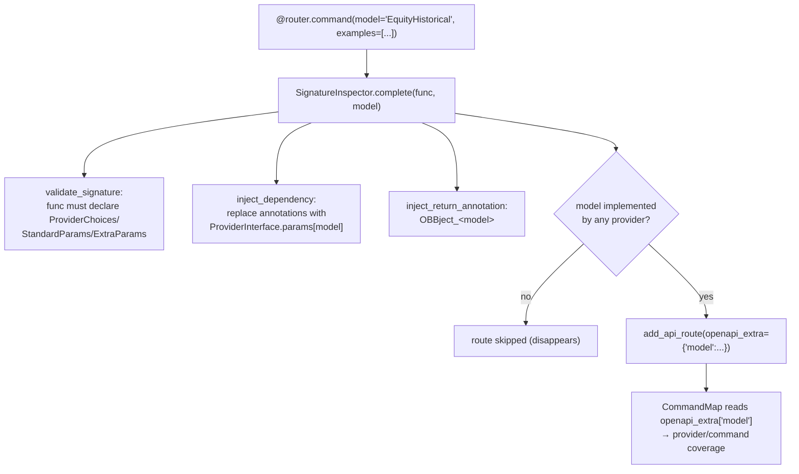
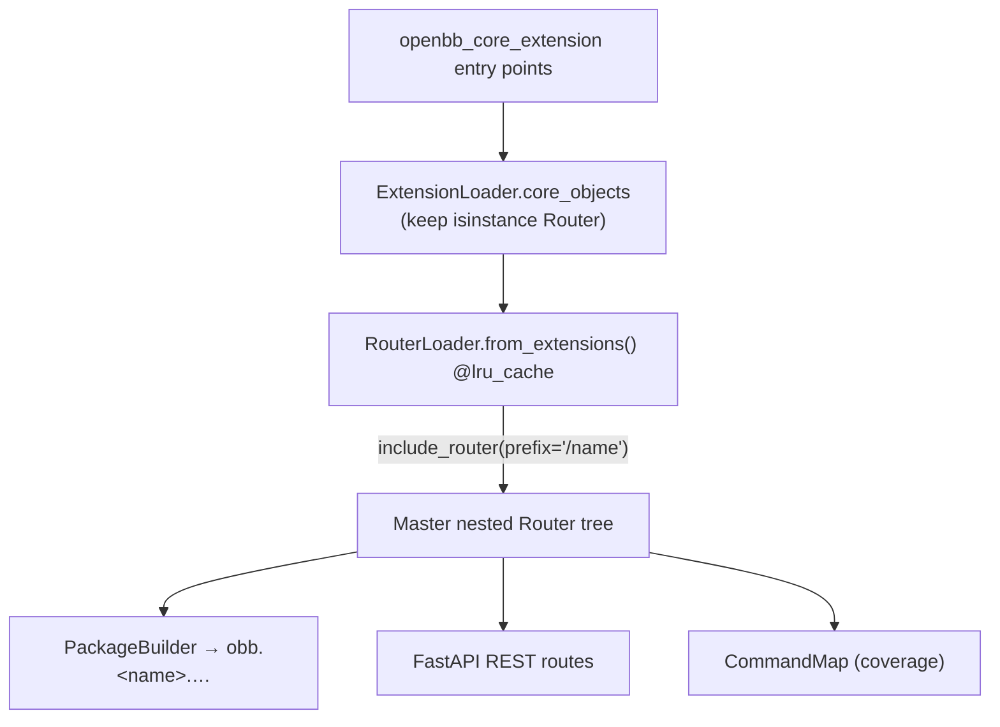

# extensions/ — Command Namespaces

[← Memory Bank Index](../../INDEX.md) · [← Docs home](../README.md) · Sister: [extensions/ design](../../design/extensions/README.md) · [GLOSSARY](../../GLOSSARY.md) · Related: [App Runtime § Router](../core/app-runtime.md#5-router-system--approuterpy) · [Request Lifecycle](../02-request-lifecycle.md)

> **Last verified:** 2026-06-02.

---

An **extension** is an installable package that contributes a command namespace under
`obb.` (and the corresponding REST routes). It exposes a `Router` object via the
`openbb_core_extension` entry point. This fork ships **24 extensions**.

There are two flavors:

- **Data routers** — model-backed; commands declare a standard `model` and the params/
  providers are injected from `ProviderInterface`. Example: `equity`, `crypto`, `economy`.
- **Toolkits** — compute on input `data` instead of calling providers. Example:
  `technical`, `quantitative`, `econometrics`. → [Toolkit vs Data Routers](./toolkit-vs-data-routers.md)

A few packages are **special** (no `obb.` namespace): they wrap the built app or provide
tooling — `mcp_server`, `platform_api`, `agents`, `devtools`, `portfolio`.

---

## The router extension pattern (`equity`)

```
extensions/equity/
├── pyproject.toml                  # equity = openbb_equity.equity_router:router
└── openbb_equity/
    ├── __init__.py                 # INTENTIONALLY empty ("""Equity Data.""")
    ├── equity_router.py            # top-level Router, includes sub-routers
    ├── equity_views.py             # EquityViews (charting hook)
    ├── price/price_router.py       # sub-router, prefix="/price"
    ├── fundamental/ ownership/ estimates/ ...
    └── py.typed
```

> `__init__.py` is **empty** — the entry point targets the module attribute
> `equity_router:router`, not the package.

`equity_router.py` instantiates a top-level `Router(prefix="")` and composes sub-routers:

```python
router = Router(prefix="", description="Equity market data.")
router.include_router(price_router)        # prefix="/price"
router.include_router(fundamental_router)
# ... 8 more

@router.command(model="EquitySearch", examples=[APIEx(parameters={"provider": "intrinio"})])
async def search(cc: CommandContext, provider_choices: ProviderChoices,
                 standard_params: StandardParams, extra_params: ExtraParams) -> OBBject:
    """Search for stock symbol, CIK, LEI, or company name."""
    return await OBBject.from_query(Query(**locals()))
```

A sub-router (`price/price_router.py`) carries its own prefix:

```python
router = Router(prefix="/price")

@router.command(model="EquityHistorical", examples=[APIEx(parameters={"symbol": "AAPL", "provider": "fmp"})])
async def historical(cc, provider_choices, standard_params, extra_params) -> OBBject:
    """Get historical price data for a given stock."""
    return await OBBject.from_query(Query(**locals()))
```

The extension-name prefix (`/equity`) is applied by `RouterLoader` at load time, so the
final route is `/equity` + `/price` + `/historical` → `obb.equity.price.historical(...)`.

Entry points:
```toml
[tool.poetry.plugins."openbb_core_extension"]
equity = "openbb_equity.equity_router:router"

[tool.poetry.plugins."openbb_charting_extension"]
equity = "openbb_equity.equity_views:EquityViews"
```

---

## How `@router.command(model=...)` wires a command



The body `return await OBBject.from_query(Query(**locals()))` hands the bound params to the
provider machinery. → see [Request Lifecycle](../02-request-lifecycle.md).

---

## Registration into the `obb` namespace



---

## The 24 extensions

| Extension | Purpose | Type |
|---|---|---|
| `commodity` | Petroleum, LME warehouse, commodity prices | Data router |
| `crypto` | Crypto price & search | Data router |
| `currency` | FX rates, pairs, reference | Data router |
| `derivatives` | Options & futures chains/quotes | Data router |
| `econometrics` | Regression / causality / unit-root on input data | **Toolkit** |
| `economy` | Macro indicators (GDP, CPI, calendars) | Data router |
| `equity` | Price, fundamentals, ownership, estimates | Data router |
| `etf` | ETF holdings, info, sectors, performance | Data router |
| `famafrench` | Research factor portfolios | Data router (provider-hosted) |
| `financialtoolkit` | Ratios/metrics via `financetoolkit` lib | Data router |
| `fixedincome` | Rates, govt/corporate bonds, spreads | Data router |
| `index` | Index constituents & prices | Data router |
| `news` | Company & world news | Data router |
| `portfolio` | Portfolio/ESPP/stock-analysis Workspace widgets | **Special / API-router** |
| `quantitative` | Stats, rolling, performance metrics on input data | **Toolkit** |
| `regulators` | SEC / CFTC filings & data | Data router |
| `technical` | Technical-analysis indicators on input data | **Toolkit** |
| `uscongress` | US Congress trading/legislative data | Data router (provider-hosted) |
| `devtools` | Dev tooling meta-package (ruff/pylint/mypy/...) | **Special / tooling** |
| `agents` | Google ADK agents over OpenBB (portfolio Q&A) | **Special / agent** |
| `mcp_server` | Expose the REST API as an MCP server | **Special / server** |
| `platform_api` | Launch script + Workspace widgets builder | **Special / server** |
| *(+ `tests`, shared harness — not an extension)* | | |
| `charting` *(in `obbject_extensions/`)* | `.charting` accessor | [OBBject ext](../obbject_extensions/README.md) |

> **Provider-hosted routers:** `famafrench` and `uscongress` register their
> `openbb_core_extension` router from inside a *provider* package
> (`providers/famafrench`, `providers/congress_gov`); the `extensions/` dirs are test
> stubs.

---

## <a id="special-extensions"></a>Special extensions

### `mcp_server`
`console_scripts: openbb-mcp`. `create_mcp_server` wraps the existing FastAPI app via
`FastMCP.from_fastapi(app)`. `customize_components` maps each route → an MCP tool
(`/equity/price/historical` → `equity_price_historical`), compresses JSON schemas, and
adds discovery/admin tools (`available_categories`, `activate_tools`, …). Tool-category
profiles live in `assets/profiles/{minimal,equity_only,portfolio,full}.json`. Transports:
stdio or HTTP/SSE.

### `platform_api`
`console_scripts: openbb-api`. Launches the FastAPI app with uvicorn and builds/serves
`widgets.json` by introspecting the OpenAPI schema — turning the REST API into an **OpenBB
Workspace Custom Backend**. Honors `~/.openbb_platform/widget_settings.json`.

### `portfolio`
Deliberately **does not** register `openbb_core_extension`; its routes (`/portfolio/*`,
`/stock/*`, `/espp/*`) live outside the auto-discovered prefix tree and are wired via
`openbb-api --app .../portfolio/launch.py`, which `include_router`s a raw FastAPI router
and serves `widgets.json` / `apps.json`.

### `agents`
flit-built; `console_scripts: openbb-agents-mcp`. Google ADK agents
(`agents/portfolio_qa.py`), tools, guardrails, evals. `__init__.py` does a `sys.path`
bootstrap to import `fmp_cached`'s `DatabaseConfig` without a full install. A
consumer/orchestration extension, not an `obb.*` router.

### `devtools`
Pure meta-package — `__init__.py` is a placeholder; its value is the dev-tool dependency
bundle (ruff, pylint, mypy, pydocstyle, black, bandit, codespell, pre-commit, pytest, …).

---

## Sub-documents

- [Toolkit vs Data Routers](./toolkit-vs-data-routers.md) — the two command flavors compared.

→ Design counterpart: [extensions/ design](../../design/extensions/README.md) · Add one: [Recipes D](../../design/03-recipes.md#recipe-d--add-a-new-extension-command-namespace)

[← Memory Bank Index](../../INDEX.md) · [← Docs home](../README.md)
