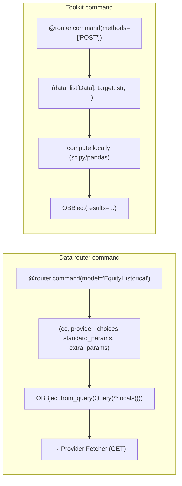

# extensions/ — Toolkit vs Data Routers

[← extensions/ overview](./README.md) · [Docs home](../README.md) · Related: [Request Lifecycle](../02-request-lifecycle.md)

---

Both flavors register as `Router` objects and appear identically under `obb.` to the user.
Internally they are very different: **data routers fetch from providers; toolkits compute
on data you pass in.**



---

## Side-by-side

| Aspect | Data router | Toolkit |
|---|---|---|
| Examples | `equity`, `crypto`, `economy`, `etf`, `news`, `fixedincome`, `derivatives`, `currency`, `commodity`, `index`, `regulators`, `financialtoolkit` | `technical`, `quantitative`, `econometrics` |
| `@router.command(model=...)` | **yes** — names a standard model | **no** |
| Signature | `(cc, provider_choices, standard_params, extra_params)` | `(data: list[Data], <typed scalars>)` |
| HTTP method | `GET` (default) | usually `POST` (data in body) |
| Provider injection | `ProviderInterface.params[model]` via `SignatureInspector` | none — `else` branch in `SignatureInspector.complete` |
| Body | `return await OBBject.from_query(Query(**locals()))` | convert → compute → `OBBject(results=...)` |
| Output type | discriminated union `OBBject_<model>` | `OBBject[SomeModel]` |

---

## Data router command (model-backed)

```python
# extensions/equity/openbb_equity/price/price_router.py
@router.command(
    model="EquityHistorical",
    examples=[APIEx(parameters={"symbol": "AAPL", "provider": "fmp"})],
)
async def historical(cc, provider_choices, standard_params, extra_params) -> OBBject:
    """Get historical price data for a given stock."""
    return await OBBject.from_query(Query(**locals()))
```

`SignatureInspector` replaces `provider_choices/standard_params/extra_params` with the
generated dataclasses from `ProviderInterface`, and the return with `OBBject_EquityHistorical`.

---

## Toolkit command (compute on input data)

```python
# extensions/quantitative/openbb_quantitative/quantitative_router.py
@router.command(
    methods=["POST"],
    examples=[
        PythonEx(code=[
            "stock_data = obb.equity.price.historical(symbol='TSLA').to_df()",
            "obb.quantitative.normality(data=stock_data, target='close')"]),
        APIEx(parameters={"target": "close", "data": APIEx.mock_data("timeseries", 8)}),
    ],
)
def normality(data: list[Data], target: str) -> OBBject[NormalityModel]:
    """Get Normality Statistics."""
    from scipy import stats
    df = basemodel_to_df(data)
    series_target = get_target_column(df, target)
    ...
    return OBBject(results=norm_summary)
```

```python
# extensions/technical/openbb_technical/technical_router.py
async def relative_rotation(
    data: list[Data],
    benchmark: str,
    study: Literal["price", "volume", "volatility"] = "price",
    long_period: int | None = 252,
) -> OBBject[RelativeRotationData]:
    ...
```

Key traits:
- Input is `data: list[Data]` (the generic base `Data` model) + plain typed scalars — **no
  `model=`, no provider injection**.
- Almost always `methods=["POST"]` (data travels in the request body, not fetched).
- Helpers `basemodel_to_df` / `df_to_basemodel` / `get_target_column(s)` convert OBBject
  results → DataFrame → compute → `OBBject(results=...)`.
- In `SignatureInspector.complete`, the absence of `model` takes the **`else` branch** — it
  only polishes the return schema; no `ProviderInterface` lookup.

---

## The typical composition pattern

Toolkits consume the output of data routers — fetch with a data router, compute with a
toolkit:

```python
df = obb.equity.price.historical("AAPL", provider="fmp").to_df()
obb.technical.rsi(data=df, target="close", length=14)
obb.quantitative.normality(data=df, target="close")
```

[← extensions/ overview](./README.md)
