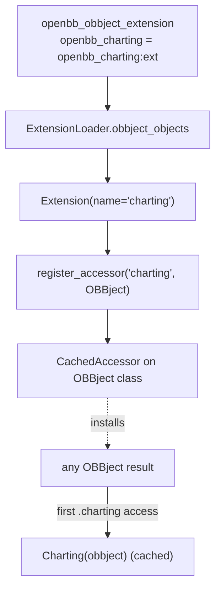
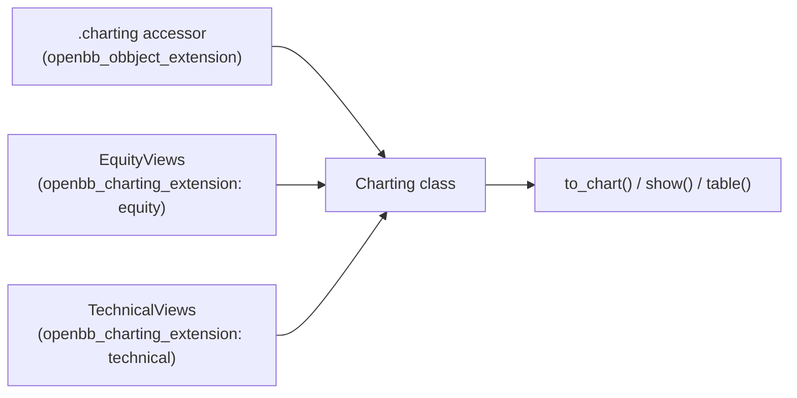

# obbject_extensions/ — OBBject Accessors

[← Docs home](../README.md) · Related: [Models & Settings § OBBject](../core/models-and-settings.md#1-obbject--the-universal-result-container) · [extensions/ overview](../extensions/README.md)

---

An **OBBject extension** attaches a pandas-style accessor to *every* `OBBject` result.
It is registered via the `openbb_obbject_extension` entry point and loads an `Extension`
object. The shipped example is **charting** (`result.charting.to_chart()` / `.show()`).

```
obbject_extensions/
└── charting/
    ├── pyproject.toml           # openbb_charting = openbb_charting:ext
    └── openbb_charting/
        ├── __init__.py          # builds `ext` and registers the accessor
        └── charting.py          # the Charting accessor class + view discovery
```

---

## The accessor registration mechanism

```python
# obbject_extensions/charting/openbb_charting/__init__.py
from openbb_core.app.model.extension import Extension

def get_charting_module():
    import importlib
    return importlib.import_module("openbb_charting.charting").Charting

ext = Extension(name="charting", description="Create custom charts from OBBject data.")
Charting = ext.obbject_accessor(get_charting_module())
```

`Extension.obbject_accessor` → `register_accessor(name, OBBject)` installs a
`CachedAccessor` onto the `OBBject` class (pandas-style):

```python
# core/openbb_core/app/model/extension.py
setattr(cls, name, CachedAccessor(name, accessor))   # cls = OBBject, name = "charting"
cls.accessors.add(name)
```

On first access, `CachedAccessor.__get__` instantiates `accessor(obbject)` (i.e.
`Charting(obbject)`) and caches it on the instance. So every result gains a lazy
`.charting` property.



---

## Two-layer charting design

The single `openbb_obbject_extension` provides the `.charting` **surface**. The actual
per-command drawing functions come from a **separate** plugin group,
`openbb_charting_extension`, discovered by the `Charting` class itself:

```python
# openbb_charting/charting.py
class Charting:
    _extension_views: ClassVar[list[type]] = [
        ep.load() for ep in entry_points(group="openbb_charting_extension")
    ]
```

So `equity → EquityViews`, `technical → TechnicalViews`, etc. (each data/toolkit extension
ships an `openbb_charting_extension` entry; see [extensions/](../extensions/README.md)).



---

## Security gating

`Extension.__init__` blocks output-mutating OBBject extensions (`on_command_output`,
`immutable=False`, `results_only`) unless `system_settings.allow_on_command_output` /
`allow_mutable_extensions` are enabled. Charting uses the default immutable/non-mutating
mode, so it loads freely.

---

## Writing an OBBject extension (pointer)

1. Create a package exposing `ext = Extension(name="<name>", ...)`.
2. `accessor = ext.obbject_accessor(<AccessorClass>)` where `<AccessorClass>.__init__`
   takes the `OBBject` instance.
3. Register the entry point:
   ```toml
   [tool.poetry.plugins."openbb_obbject_extension"]
   <name> = "openbb_<name>:ext"
   ```
4. Result: `result.<name>.<method>()` is available on every OBBject.

## Quick reference

| Concern | File | Symbol |
|---|---|---|
| Accessor registration | `core/openbb_core/app/model/extension.py` | `Extension.obbject_accessor`, `register_accessor`, `CachedAccessor` |
| Charting entry | `obbject_extensions/charting/openbb_charting/__init__.py` | `ext`, `Charting` |
| View discovery | `obbject_extensions/charting/openbb_charting/charting.py` | `Charting._extension_views` |

[← Docs home](../README.md)
