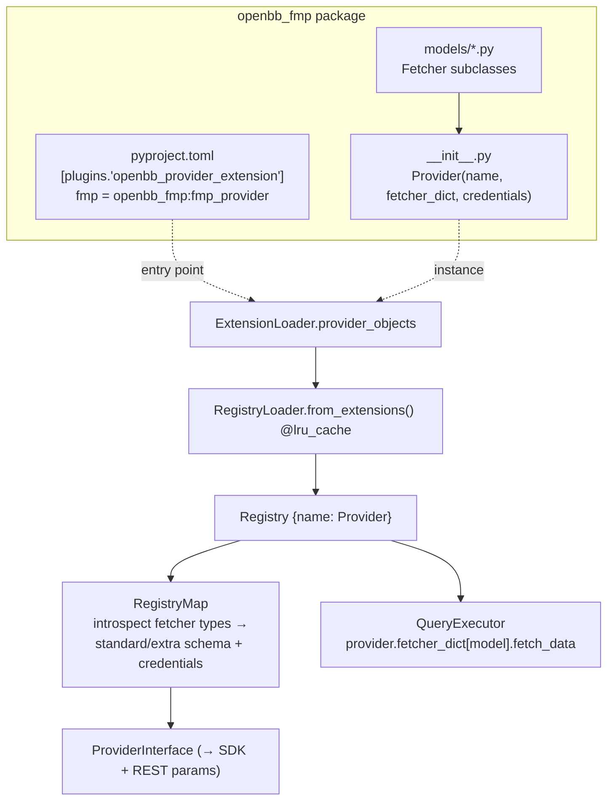

# providers/ — Data Source Integrations

[← Memory Bank Index](../../INDEX.md) · [← Docs home](../README.md) · Sister: [providers/ design](../../design/providers/README.md) · [GLOSSARY](../../GLOSSARY.md) · Related: [Provider Framework](../core/provider-framework.md) · [Request Lifecycle](../02-request-lifecycle.md)

> **Last verified:** 2026-06-02.

---

A **provider** is an independently installable package that integrates one data source.
It implements `Fetcher` subclasses (one per standard model it serves) and exposes a
single `Provider` object via the `openbb_provider_extension` entry point.

This fork ships **34 registrable providers** (the `providers/` directory has 36
sub-dirs; `tests/` and shared files are not providers).

## On-disk layout of a provider

```
providers/fmp/
├── pyproject.toml                  # entry point: fmp = openbb_fmp:fmp_provider
└── openbb_fmp/
    ├── __init__.py                 # builds `fmp_provider = Provider(...)`
    ├── models/                     # one Fetcher module per standard model (~70)
    │   ├── equity_historical.py    #   FMPEquityHistoricalFetcher
    │   ├── balance_sheet.py
    │   └── ...
    ├── utils/                      # provider HTTP helpers
    │   └── helpers.py
    └── py.typed
```

## Registration & aggregation flow



The `Provider` object is a declarative manifest:

```python
fmp_provider = Provider(
    name="fmp",
    website="https://financialmodelingprep.com",
    credentials=["api_key"],                    # → requires "fmp_api_key"
    fetcher_dict={
        "EquityHistorical": FMPEquityHistoricalFetcher,
        "BalanceSheet": FMPBalanceSheetFetcher,
        "EtfHistorical": FMPEquityHistoricalFetcher,   # one fetcher can serve 2 models
        # ... ~70 entries
    },
    repr_name="Financial Modeling Prep (FMP)",
    instructions="Go to: https://site.financialmodelingprep.com/developer/docs ...",
)
```

→ The `Fetcher` TET pipeline and `Provider`/`QueryParams`/`Data` abstractions are
documented in [Provider Framework](../core/provider-framework.md).

---

## Sync vs async providers (worked contrast)

| | `fmp` | `yfinance` | `fmp_cached` |
|---|---|---|---|
| Extract style | **async** `aextract_data` | **sync** `extract_data` | async, MySQL-backed |
| Raw return | `list[dict]` | pandas `DataFrame` | `list[dict]` |
| Credentials | `fmp_api_key` | none | `fmp_cached_api_key` (+ MySQL) |
| Notable | concurrent `amake_request` per symbol | `PrivateAttr` for internal knobs | gap-detection caching → [deep dive](./fmp-cached.md) |

Both flow through identical machinery because `Fetcher.__init_subclass__` binds async
onto `extract_data` and `maybe_coroutine` calls it correctly.

---

## The 34 providers

| Provider | Source | One-line |
|---|---|---|
| `alpha_vantage` | Alpha Vantage | Stocks, forex & crypto market data. |
| `benzinga` | Benzinga | Financial news & analyst ratings. |
| `biztoc` | BizToc | Aggregated business news headlines. |
| `bls` | US BLS | Labor & inflation (CPI) public data. |
| `cboe` | CBOE | Quotes, indices & options. |
| `cftc` | CFTC | Commitments-of-Traders & public reporting. |
| `congress_gov` | Congress.gov | US legislative data (hosts `uscongress` router). |
| `deribit` | Deribit | Crypto derivatives (options/futures). |
| `ecb` | European Central Bank | Euro-area rates, FX & macro. |
| `econdb` | EconDB | Global macroeconomic indicators. |
| `eia` | US EIA | US energy data. |
| `famafrench` | Fama-French | Research factor portfolios (hosts `famafrench` router). |
| `federal_reserve` | Federal Reserve | Fed rates, balance sheet, monetary data. |
| `finra` | FINRA | Short-interest & regulatory data. |
| `finviz` | FinViz | Screener, quotes & performance. |
| `fmp` | Financial Modeling Prep | Broad equities/fundamentals/prices (~70 models). |
| `fmp_cached` | FMP (cached) | FMP + MySQL gap-detection cache. → [deep dive](./fmp-cached.md) |
| `fred` | FRED (St. Louis Fed) | US/global economic time series. |
| `government_us` | Data.gov | US government open datasets (Treasury). |
| `imf` | IMF | International Monetary Fund data. |
| `intrinio` | Intrinio | Fundamentals, prices & options. |
| `multpl` | multpl.com | S&P 500 ratios & macro metrics. |
| `nasdaq` | NASDAQ | Market data, calendars, directories. |
| `oecd` | OECD | International economic statistics. |
| `polygon` | Polygon.io | Stocks, options, FX & crypto. |
| `sec` | SEC | EDGAR filings & disclosures. |
| `seeking_alpha` | Seeking Alpha | Estimates, calendars & commentary. |
| `stockgrid` | Stockgrid | Dark-pool / short-volume data. |
| `tiingo` | Tiingo | EOD/intraday prices, news, fundamentals. |
| `tmx` | TMX | Canadian exchange market data. |
| `tradier` | Tradier | Brokerage quotes & options chains. |
| `tradingeconomics` | Trading Economics | Global macro indicators & forecasts. |
| `wsj` | Wall Street Journal | Market movers & quotes. |
| `yfinance` | Yahoo Finance | Free equities/ETF/crypto/futures data. |

> **This fork's Analysis module uses `fmp_cached` exclusively** (`PRIMARY_PROVIDER =
> "fmp_cached"`). See the root `CLAUDE.md` and [fmp_cached deep dive](./fmp-cached.md).

---

## <a id="adding-a-new-provider"></a>Adding a new provider

1. Create `providers/<name>/openbb_<name>/`.
2. For each standard model you serve, add `models/<model>.py` with:
   - `class <Name><Model>QueryParams(<Model>QueryParams)` (+ `__alias_dict__`, extra fields),
   - `class <Name><Model>Data(<Model>Data)` (+ aliases, extra fields),
   - `class <Name><Model>Fetcher(Fetcher[Q, list[D]])` implementing `transform_query`,
     `extract_data`/`aextract_data`, `transform_data`.
3. In `__init__.py`, build `<name>_provider = Provider(name=..., credentials=[...],
   fetcher_dict={"<Model>": <Name><Model>Fetcher, ...})`.
4. Register the entry point in `pyproject.toml`:
   ```toml
   [tool.poetry.plugins."openbb_provider_extension"]
   <name> = "openbb_<name>:<name>_provider"
   ```
5. `python dev_install.py -e`, then `python -c "import openbb; openbb.build()"`.
6. Use `Fetcher.test(params, credentials)` for a self-checking integration test.

→ Mechanics: [Provider Framework](../core/provider-framework.md).

## Representative provider quick-ref cards

Four providers are documented in depth as templates for the other 30. Each card follows the
same shape (auth · extract style · raw shape · models · gotchas).

| Provider | Deep dive | Auth | Extract | Raw shape | Why representative |
|---|---|---|---|---|---|
| `fmp` | [fmp.md](./fmp.md) | `fmp_api_key` | async | `list[dict]` | the broad REST provider (~70 models) |
| `fmp_cached` | [fmp-cached.md](./fmp-cached.md) | `fmp_cached_api_key` + MySQL | async | `list[dict]` | fork-canonical caching wrapper |
| `yfinance` | [yfinance.md](./yfinance.md) | none | sync | `DataFrame` | free, sync, library-backed |
| `fred` | [fred.md](./fred.md) | `fred_api_key` | async | `list[dict]` | economic time-series shape |

## Sub-documents

- [fmp deep dive](./fmp.md) — the broad async REST provider.
- [fmp_cached deep dive](./fmp-cached.md) — the MySQL gap-detection caching layer.
- [yfinance deep dive](./yfinance.md) — the free, sync, DataFrame-backed provider.
- [fred deep dive](./fred.md) — economic time-series provider.

→ Design counterpart: [providers/ design](../../design/providers/README.md) · Add one: [Recipes A](../../design/03-recipes.md#recipe-a--add-a-provider-integration-for-an-existing-standard-model)
→ Upstream: `third_party/openbb-docs/content/odp/python/extensions/providers/index.mdx` (install + key names), `developer/extension_types/provider.md` (how to build), `faqs/data_providers.mdx`

[← Memory Bank Index](../../INDEX.md) · [← Docs home](../README.md)
