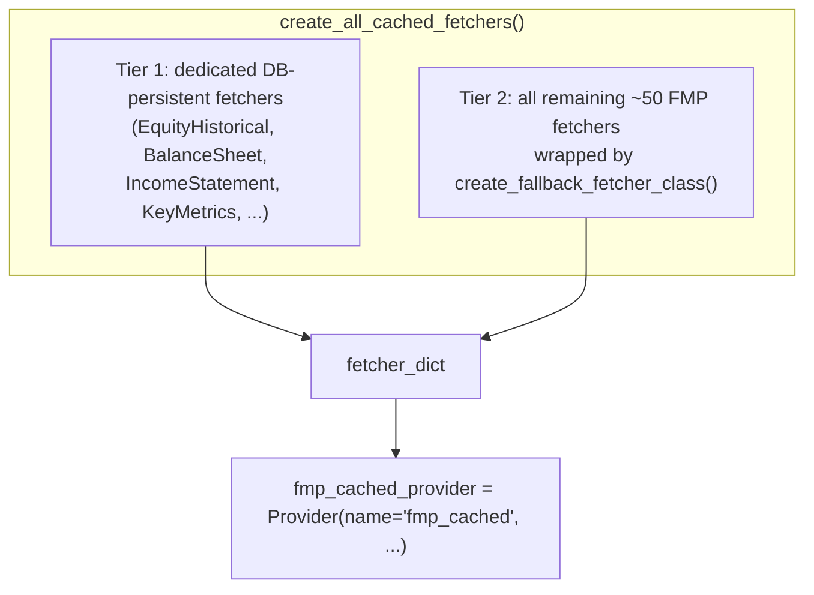
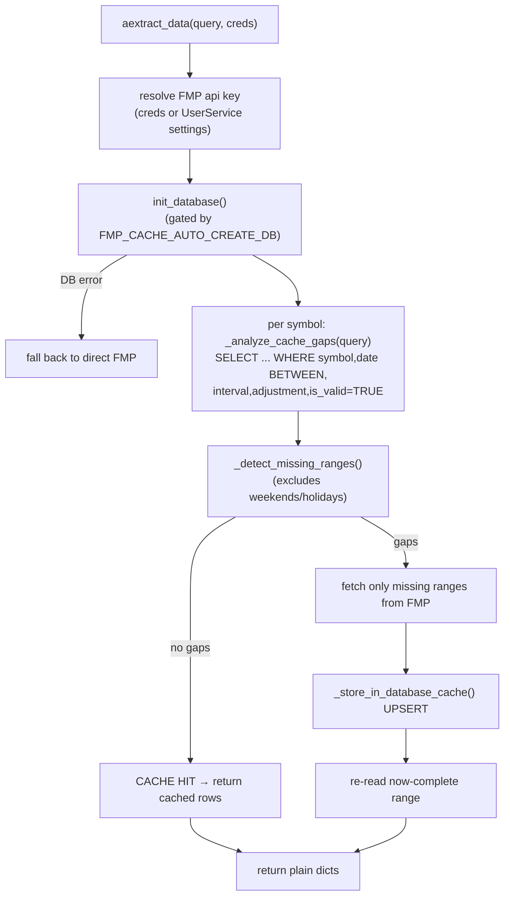

# providers/fmp_cached — MySQL Gap-Detection Caching Layer

[← providers/ overview](./README.md) · [Docs home](../README.md) · Related: [Provider Framework](../core/provider-framework.md)

---

`fmp_cached` is a **MySQL-backed persistence wrapper around `openbb_fmp`**. It depends on
`openbb_fmp` and reuses its fetchers, overriding only the subset for which it implements
database persistence. It is the **primary provider for this fork's Analysis module**
(`PRIMARY_PROVIDER = "fmp_cached"`).

> Design intent (per `base_cached.py`): *persistent database storage to avoid unnecessary
> API calls* — **not** a TTL cache. Freshness is achieved by **gap detection** over date
> ranges; rows are upserted with `cached_at` timestamps and soft-deleted via `is_valid`.

## Layout

```
providers/fmp_cached/openbb_fmp_cached/
├── __init__.py            # builds fmp_cached_provider via a 2-tier fetcher_dict
├── models/
│   ├── base_cached.py     # create_fallback_fetcher_class() — credential-translation wrapper
│   ├── equity_historical.py   # gap-detection caching fetcher
│   ├── balance_sheet.py, income_statement.py, cash_flow.py, financial_ratios.py,
│   ├── key_metrics.py, analyst_estimates.py, equity_profile.py, equity_quote.py,
│   └── equity_peers.py, institutional_ownership.py, index_constituents.py
├── utils/
│   ├── database.py        # pymysql connection pool, execute_query/execute_many
│   ├── cache_schema.py    # FLATTENED_TABLES, create_all_tables
│   └── cache_manager.py   # DatabaseManager: get_stored_data/store_data UPSERT, stats
└── complementary/         # free fallback sources (FRED/Yahoo) for e.g. yields
```

## Two-tier fetcher assembly



- **Tier 1 — dedicated** (real caching): `EquityHistorical`, `EquityInfo`, `EquityPeers`,
  `EquityQuote`, `EtfHistorical`, `FinancialRatios`, `IndexConstituents`,
  `IncomeStatement`, `InstitutionalOwnership`, `KeyMetrics`, `BalanceSheet`,
  `CashFlowStatement`, `AnalystEstimates`.
- **Tier 2 — fallback-wrapped** (pass-through): every other FMP fetcher is wrapped by
  `create_fallback_fetcher_class(original, name)`, which **only translates credentials**
  (`fmp_cached_api_key → fmp_api_key`) and delegates to the original FMP fetcher — no
  caching, just full surface parity.

```python
fmp_cached_provider = Provider(
    name="fmp_cached",
    credentials=["api_key"],            # → "fmp_cached_api_key"
    fetcher_dict=_cached_fetchers,      # tier 1 + tier 2
    repr_name="Financial Modeling Prep (Cached)",
    instructions="...MySQL connection details in user_settings.json...",
)
```

## Gap-detection caching (equity_historical)

`FMPCachedEquityHistoricalFetcher.aextract_data` implements an **incremental cache**:



1. Resolve the FMP API key (from `credentials` or `UserService` settings; handles `SecretStr`).
2. `init_database()` — gated by `FMP_CACHE_AUTO_CREATE_DB`; on failure, fall back to direct FMP.
3. Per symbol: `_analyze_cache_gaps` runs
   `SELECT ... FROM equity_historical WHERE symbol=%s AND date BETWEEN %s AND %s AND
   interval_type=%s AND adjustment_type=%s AND is_valid=TRUE`, then `_detect_missing_ranges`
   computes gaps **excluding weekends/known holidays** (so it doesn't chase non-trading days).
4. **HIT** → return cached rows. **PARTIAL/MISS** → fetch only missing ranges, UPSERT, re-read.
5. Optional dividend merge (`include_dividends`, `interval=='1d'`).
6. Always returns **plain dicts** so the standard `transform_data` works unchanged.

## Persistence internals

| File | Symbol | Notes |
|---|---|---|
| `utils/database.py` | `DatabaseConfig`, `ConnectionPool` | Loads MySQL creds from `user_settings.json` (`mysql_*`/`db_*`/`database_*` variants) or `DB_*` env vars; **fails fast** if user/password missing (no shipped defaults). `pymysql` `DictCursor`, `autocommit=True`. `execute_query`/`execute_many` are synchronous (async wrappers delegate to sync). |
| `utils/cache_manager.py` | `DatabaseManager` | Maps endpoint→table, builds WHERE clauses, `INSERT ... ON DUPLICATE KEY UPDATE` UPSERTs, stuffs unknown fields into `additional_fields` JSON, renames reserved `change → change_amount`, tracks `hits/misses/stores/errors`. Soft-delete via `is_valid=FALSE`. |
| `utils/cache_schema.py` | `FLATTENED_TABLES`, `create_all_tables` | Table definitions + common-field mapping. |

## Credentials & configuration

`~/.openbb_platform/user_settings.json`:
```json
{
  "credentials": { "fmp_cached_api_key": "..." },
  "preferences": {
    "mysql_host": "...", "mysql_user": "...",
    "mysql_password": "...", "mysql_database": "..."
  }
}
```
(Key names also accepted as `db_*` / `database_*`, or `DB_*` env vars.) The connection
fails fast if user/password are missing — there are no default credentials shipped.

[← providers/ overview](./README.md)
