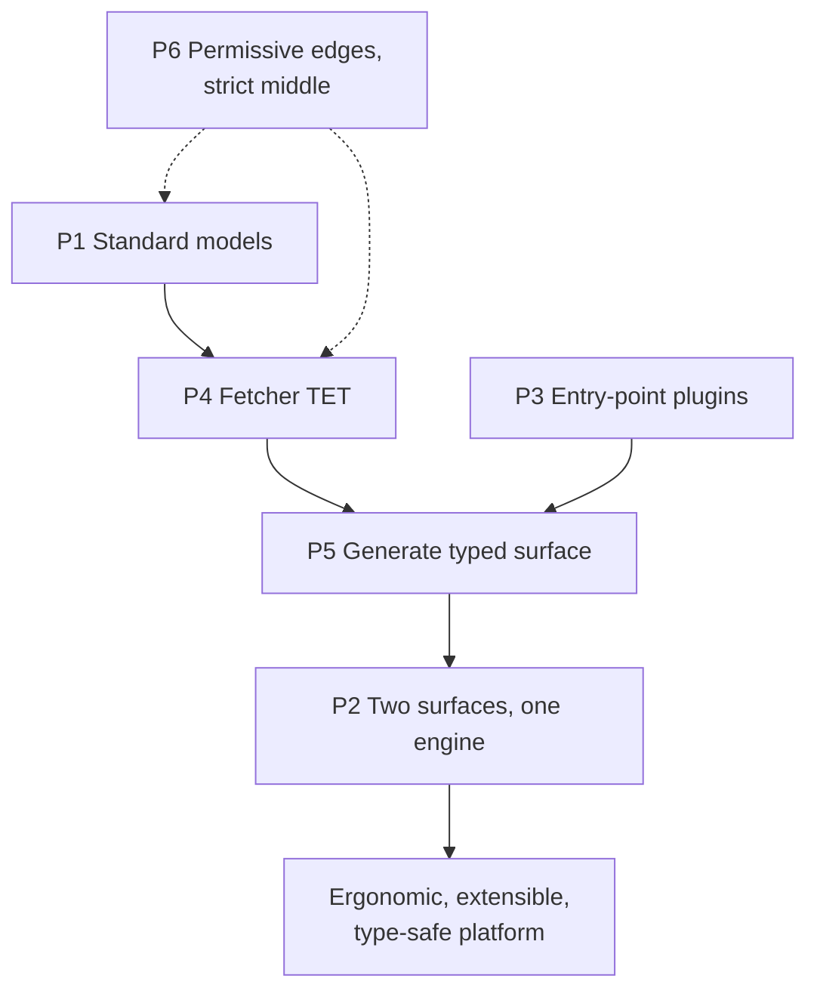

# 00 — Design Principles

[← design/](./README.md) · [Memory Bank](../INDEX.md) · Next: [01 Decisions →](./01-decisions.md)

The six ideas below explain almost every structural choice in the platform. If a piece of
code seems odd, it is usually serving one of these.

---

## P1 — Standardize the contract, not the source

Consumers program against **vendor-neutral standard models** (`provider/standard_models/`),
never against a vendor's raw schema. A standard model is a `QueryParams` + `Data` pair
(e.g. `EquityHistoricalQueryParams` / `EquityHistoricalData`). Providers **subclass** both
halves to add their specifics.

- Only fields shared by **2+ providers** belong in a standard model; provider-unique
  fields are `Optional` extras. (Per `CONTRIBUTING.md`.)
- Standard models are **owned by the core team** — adding a standard field is a core PR.
- Payoff: any provider implementing a model is interchangeable, and the model works with
  the charting / technical / quantitative / econometrics menus for free.

→ [Provider Framework § standard models](../architecture/core/provider-framework.md#3-standard-models-providerstandard_models)

## P2 — Two surfaces, one engine

The Python SDK (`obb`) and the REST API are **adapters over the same router tree**. Both
converge on `CommandRunner → Query → QueryExecutor → Fetcher`. Nothing about a command is
implemented twice.

- The router tree is built once by `RouterLoader.from_extensions()` (lru_cache).
- The SDK is *generated* from it (`PackageBuilder`); the REST app *wraps* it
  (`api/router/commands.py::build_api_wrapper`).
- Implication: a command's behavior is defined in exactly one place — the extension
  router coroutine.

→ [Request Lifecycle](../architecture/02-request-lifecycle.md)

## P3 — Plugins via entry points, discovered at runtime

Providers, extensions, and OBBject accessors are **independent installable packages**
discovered through three entry-point groups (`openbb_provider_extension`,
`openbb_core_extension`, `openbb_obbject_extension`). The core never imports them by name.

- Installing a package makes its capability appear; uninstalling removes it.
- Load failures are **tolerated** (warned, not fatal) so a missing optional dependency
  doesn't break the platform — unless `DEBUG_MODE` is on. (See [Gotchas](./04-gotchas.md).)

→ [System Overview § plugin types](../architecture/01-system-overview.md#the-three-plugin-types)

## P4 — The Fetcher is a fixed three-step pipeline (TET)

Every data integration is the same shape: **Transform query → Extract data → Transform
data**. This uniformity is what lets the engine treat 34 providers identically.

- `transform_query(dict) -> QueryParams` (validate/normalize, inject defaults).
- `extract_data` **or** `aextract_data` (raw I/O only — never return `Data` objects here).
- `transform_data(query, raw) -> list[Data]` (validate into the typed model).
- Sync vs async is auto-resolved (`__init_subclass__`), so providers choose freely.

→ [Provider Framework § TET](../architecture/core/provider-framework.md#2-the-fetcher-tet-lifecycle)

## P5 — Generate the typed surface from provider metadata

The rich, per-provider parameter and return **types** users see are *synthesized* at
runtime by `ProviderInterface` from every fetcher's `QueryParams`/`Data`. Standard fields
become `StandardParams`; provider-only fields become `ExtraParams`; providers become a
`Literal` in `ProviderChoices`.

- This is why the SDK must be **rebuilt** when providers change: the generated signatures
  encode the aggregate.
- This is also why a command **disappears** if no provider implements its model — there's
  nothing to inject.

→ [App Runtime § ProviderInterface](../architecture/core/app-runtime.md#6-provider-aggregation--appprovider_interfacepy)

## P6 — Be permissive at the edges, strict in the middle

- `QueryParams` and `Data` use `extra="allow"` — unknown fields pass through (providers
  add columns freely; unsupported params *warn*, not error).
- But the **standard model fields** are typed and validated, and the **Fetcher contract**
  is enforced at class-creation time.
- Credentials are validated **late** (just before fetch), and errors are normalized into
  `OpenBBError` with trimmed tracebacks.

This permissiveness is ergonomic but has sharp edges — see [Gotchas](./04-gotchas.md)
(typo'd params are silently accepted).

---

## How the principles compose

→ Next: [01 — Decisions](./01-decisions.md) for the trade-offs behind these.
