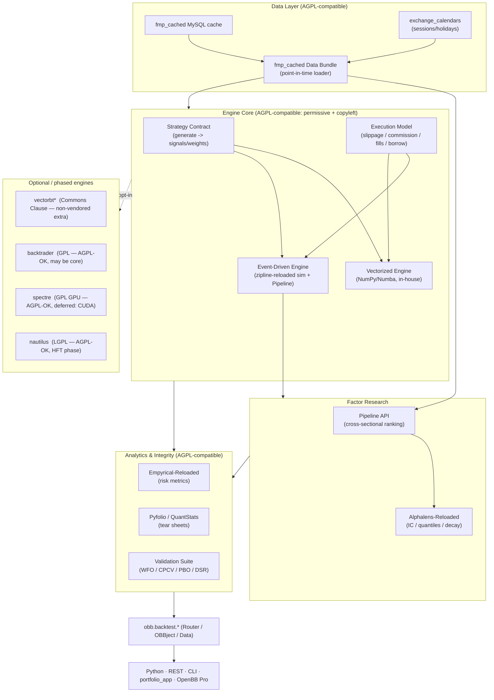

# PRD & Functional Spec: Best-in-Class Backtesting Engine (`openbb-backtest`)

**Status:** Draft / Proposal — for review
**Author:** Quant working group
**Target component:** OpenBB Platform first-party extension (`openbb-backtest`) + `fmp_cached` data bundle
**Companion documents:**
- [`docs/Specs/Quant-Analysis-Module-Proposal.md`](./Quant-Analysis-Module-Proposal.md) (broader `openbb-quant` strategy surface)
- [`Analysis/docs/PHASED_ANALYSIS_MASTER_PLAN.md`](../../Analysis/docs/PHASED_ANALYSIS_MASTER_PLAN.md) (7-phase single-stock analysis)
- [`docs/Tools/Quant-Strategies-Guide.md`](../Tools/Quant-Strategies-Guide.md) (453-repo survey)
**Date:** 2026-06-03 (rev. 2026-06-04 — licensing reassessed for AGPL-3.0 + non-commercial posture)
**Decision posture:** The sponsor has explicitly accepted a *heavyweight* engineering cost in exchange for a best-in-class result. This document optimizes for **correctness, realism, and research rigor first**, convenience second.
**Licensing posture:** The fork is licensed **AGPL-3.0** (inherited from OpenBB) and is **non-commercial** — never sold, freely usable by anyone. This makes GPL/LGPL engines fully eligible as **core dependencies** (see §6); the only residual constraint is not *vendoring* Commons-Clause source.

---

## Table of Contents

1. [Executive Summary](#1-executive-summary)
2. [Problem Statement & Motivation](#2-problem-statement--motivation)
3. [Goals & Non-Goals](#3-goals--non-goals)
4. [Guiding Principles](#4-guiding-principles)
5. [Deep Comparative Analysis of Backtesting Engines](#5-deep-comparative-analysis-of-backtesting-engines)
6. [Licensing Analysis (Decision-Critical)](#6-licensing-analysis-decision-critical)
7. [Selected Architecture — The "Best of All" Hybrid](#7-selected-architecture--the-best-of-all-hybrid)
8. [Best-of-Breed Component Selection](#8-best-of-breed-component-selection)
9. [Functional Specification](#9-functional-specification)
10. [Data Layer Integration](#10-data-layer-integration)
11. [Cross-Sectional Factor Pipeline](#11-cross-sectional-factor-pipeline)
12. [Execution Realism Model](#12-execution-realism-model)
13. [Analytics & Reporting](#13-analytics--reporting)
14. [Anti-Overfitting Validation Suite](#14-anti-overfitting-validation-suite)
15. [Strategy Authoring API & Reference Library](#15-strategy-authoring-api--reference-library)
16. [Non-Functional Requirements](#16-non-functional-requirements)
17. [Phased Delivery Roadmap](#17-phased-delivery-roadmap)
18. [Risks & Mitigations](#18-risks--mitigations)
19. [Open Questions / Decisions Needed](#19-open-questions--decisions-needed)
20. [Appendix A — Full Engine Inventory](#appendix-a--full-engine-inventory)
21. [Appendix B — Glossary](#appendix-b--glossary)

---

## 1. Executive Summary

This PRD proposes **`openbb-backtest`**, a first-party OpenBB Platform extension that
delivers a **best-in-class backtesting engine** for the personal-finance fork. Rather
than adopt any single framework wholesale, it composes the strongest, AGPL-compatible
pieces of the open-source ecosystem into one coherent, OpenBB-native surface:

- A **dual-engine core**: a fast **vectorized** path for research-scale parameter
  sweeps, and a **canonical event-driven** path for look-ahead-free validation and
  realistic execution.
- A **cross-sectional Pipeline** (Zipline-style) for factor computation across a
  universe — the natural successor to the single-stock `Analysis/` 7-phase pipeline.
- A **`fmp_cached` data bundle** so the existing MySQL cache feeds the engine directly,
  with **`exchange_calendars`** providing correct trading sessions/holidays.
- A **realistic execution model** (slippage, commission, fill, borrow, lot/tax-lot
  awareness) that plugs into the `portfolio_app` privacy model.
- An **institutional analytics layer** (Pyfolio/Empyrical/QuantStats tear sheets,
  Alphalens factor diagnostics).
- An **anti-overfitting validation suite** (walk-forward, Combinatorial Purged
  Cross-Validation, Probability of Backtest Overfitting, Deflated Sharpe Ratio) —
  the feature that most distinguishes a *best-in-class* engine from a naive one.

**Central architectural decision:** because the fork is **already AGPL-3.0** and
**non-commercial**, the engine core is free to depend on **permissive (Apache-2.0 / MIT /
BSD) *and* copyleft (GPL-3.0 / LGPL-3.0) components alike** — AGPLv3 is explicitly
compatible with GPLv3/LGPLv3 (FSF §13), so engines like **zipline-reloaded** (Apache-2.0),
**backtrader** and **spectre** (GPL-3.0), and **nautilus_trader** (LGPL-3.0) can all be
true core dependencies. The **only** remaining license constraint is the *Commons Clause*
on **vectorbt** and **pybroker**: they may be used freely (we never sell), but their source
**must not be vendored** into this AGPL tree — so they are wired in as **optional,
non-vendored pip dependencies** (`pip install ...[vectorbt]`), imported at runtime. This
is how we get "the best of all repos" as first-class building blocks rather than
isolated work-arounds. *(If the project ever became commercial, the Commons-Clause
packages would have to be dropped from any paid/hosted value path; GPL/AGPL would remain
fine.)*

---

## 2. Problem Statement & Motivation

The fork has matured into a layered personal-finance platform: the `fmp_cached`
MySQL cache (67+ models), the `Analysis/` 7-phase single-stock decision pipeline, and
the `portfolio_app` holdings service. What is missing is the ability to answer the
question every one of those layers ultimately implies:

> *"If I had actually traded this signal / ranking / allocation rule over history —
> with realistic costs, correct calendars, and no look-ahead — what would have
> happened, and is the result statistically real or just overfit noise?"*

Today there is **no backtesting capability** in the fork. The `quant_repos/` reference
collection contains ~445 cloned libraries, including every major engine, but they are
**fragmented, mutually incompatible, and variously licensed**. Naively adopting one
(e.g. `pip install backtrader`) would:

- inherit that engine's data model and calendar assumptions (often wrong for our cache),
- still leave us without the **research-integrity tooling** (PBO, DSR, CPCV) that
  separates a credible backtest from a curve-fit, and
- for Commons-Clause packages (vectorbt/pybroker), risk **vendoring source** that is
  incompatible with the fork's AGPL-3.0 license if bundled into the tree.

is to build **one engine, designed for this platform**, that borrows the best ideas and
the AGPL-compatible code from across the ecosystem.

---

## 3. Goals & Non-Goals

### Goals

- **G1 — Dual-mode engine.** Vectorized (fast research) and event-driven (realistic
  validation) under one strategy contract; identical strategy code runs in both.
- **G2 — Look-ahead-free by construction.** The event-driven path makes future-peeking
  structurally impossible; the vectorized path ships with explicit shift/lag guards.
- **G3 — `fmp_cached`-native.** A first-class data bundle over the existing MySQL cache;
  no re-downloading, no second source of truth.
- **G4 — Calendar correctness.** All sessions, holidays, and half-days come from
  `exchange_calendars`, replacing the manual `market_holidays` table.
- **G5 — Cross-sectional factor research.** A Pipeline API to rank a universe per day,
  generalizing the single-stock `Analysis/` scores to N-stock strategies.
- **G6 — Realistic execution.** Pluggable slippage, commission, fill, and borrow models;
  tax-lot and ESPP-lockup awareness for the personal portfolio.
- **G7 — Institutional analytics.** One-call tear sheets (Pyfolio/QuantStats) and factor
  diagnostics (Alphalens) on every run.
- **G8 — Research integrity.** Built-in walk-forward, CPCV, PBO, and Deflated Sharpe so
  every reported edge carries an overfitting probability.
- **G9 — OpenBB-native surface.** Exposed as `obb.backtest.*` using standard Router /
  `OBBject[Model]` / `Data` conventions, identical to existing extensions.
- **G10 — AGPL-compatible, non-commercial license hygiene.** Every dependency must be
  AGPL-3.0-compatible (Apache-2.0 / MIT / BSD / GPL-3.0 / LGPL-3.0 all qualify).
  Copyleft engines may be core dependencies. The single hard rule: **do not vendor
  Commons-Clause source** (vectorbt, pybroker) into the tree — consume them as optional,
  non-vendored pip extras instead.

### Non-Goals

- **NG1 — Not a live broker / execution gateway.** No real order routing in v1
  (paper/sim only). Live trading remains out of scope.
- **NG2 — Not a new market-data provider.** Reuse `fmp_cached` / existing providers.
- **NG3 — Not an HFT / tick / L2 order-book engine in v1.** Daily/intraday bar
  granularity only; L2/microstructure (hftbacktest, nautilus) is a documented future
  phase, not v1.
- **NG4 — Not a wholesale adoption of any one framework.** We borrow the best ideas and
  AGPL-compatible code; we do not inherit a single framework's full dependency tree as
  our core just for convenience.
- **NG5 — No GPU factor compute in v1.** `spectre`-style CUDA acceleration is deferred for
  *technical* reasons (weight, CUDA toolchain) — not licensing; its GPL-3.0 is
  AGPL-compatible and it may become a core dependency in a later phase.

---

## 4. Guiding Principles

1. **Correctness over speed.** A fast wrong number is worthless. The event-driven path
   is the source of truth; the vectorized path is a research accelerator that must
   reconcile against it within tolerance.
2. **Determinism.** Same inputs → identical outputs (seeded RNG, frozen calendars,
   point-in-time data). Mirrors the `Analysis/` module's `fmp_cached`-only determinism
   mandate.
3. **Point-in-time discipline.** Fundamentals are lagged to their filing/availability
   date; no restated data leaks backward.
4. **License hygiene is an architectural constraint, not an afterthought.** The fork is
   AGPL-3.0 and non-commercial; keep every dependency AGPL-compatible and never vendor
   Commons-Clause source. See §6.
5. **Privacy-first.** Personal holdings stay in local MySQL; the engine never emits
   account numbers, lot detail, or dollar amounts to external surfaces (per fork rules).
6. **Composability.** Engine outputs are `Data`/`OBBject` and round-trip through Python,
   REST, and CLI unchanged.

---

## 5. Deep Comparative Analysis of Backtesting Engines

All engines below are present in [`quant_repos/`](../../quant_repos/). They are grouped
by paradigm. Scores are this team's assessment for **our** use case (daily/intraday
equity + personal portfolio on a MySQL cache), not a universal ranking.

### 5.1 Event-Driven Engines (canonical, realistic)

| Engine | Path | License | Strengths | Weaknesses for us | Fit |
|---|---|---|---|---|---|
| **Zipline (Quantopian)** | `quant_repos/quantopian__zipline/` | Apache-2.0 | The canonical reference; **Pipeline API**; slippage/commission models; data bundles | Unmaintained; pinned to old pandas/numpy | Reference only |
| **Zipline-Reloaded** | `quant_repos/stefan-jansen__zipline-reloaded/` | **Apache-2.0** | Modernized Zipline (Py 3.9+); Pipeline API intact; integrates with Alphalens/Pyfolio-reloaded | Heavy ingest; opinionated bundle/calendar stack | **Core (factor + validation)** |
| **Backtrader** | `quant_repos/backtrader__backtrader/` | **GPL-3.0** | Mature, flexible, multi-timeframe, huge community, live-broker hooks | **GPL copyleft**; single-asset-centric loop; slower | Adapter-only |
| **QuantConnect LEAN** | `quant_repos/QuantConnect__Lean/` | Apache-2.0 | Institutional-grade, multi-asset, C#-core | C#/.NET runtime; far too heavy for an in-process Python engine | Reference only |
| **PyBroker** | `quant_repos/edtechre__pybroker/` | **Apache-2.0 + Commons Clause** | ML-first, Numba-fast, walk-forward built in | **Commons Clause** (no "sell"/host-for-fee) | Adapter-only |
| **QSTrader** | `quant_repos/mhallsmoore__qstrader/` | MIT | Clean event-driven reference; readable | Smaller feature set; less active | Pattern reference |
| **PyAlgoTrade** | `quant_repos/gbeced__pyalgotrade/` | Apache-2.0 | Simple, well-documented event loop | Dated; limited portfolio analytics | Pattern reference |
| **RQAlpha** | `quant_repos/ricequant__rqalpha/` | Apache-2.0 | Full event engine, mod system | China-market-centric defaults | Reference only |
| **pysystemtrade** | `quant_repos/robcarver17__pysystemtrade/` | GPL-3.0 | Carver's systematic-futures framework; excellent sizing/vol-targeting ideas | GPL; futures-centric | Idea reference |

### 5.2 Vectorized Engines (fast research)

| Engine | Path | License | Strengths | Weaknesses for us | Fit |
|---|---|---|---|---|---|
| **vectorbt** | `quant_repos/polakowo__vectorbt/` | **Apache-2.0 + Commons Clause** | **Fastest** large grid sweeps; Numba portfolio sim; Plotly dashboards | **Commons Clause**; steep API; easy to peek future if careless | **Optional accelerator (adapter)** |
| **bt** | `quant_repos/pmorissette__bt/` | **MIT** | Clean tree-of-algos allocation backtests; built on `ffn` | Allocation-centric, not signal/trade-centric | **Core (allocation tests)** |
| **fastquant** | `quant_repos/enzoampil__fastquant/` | MIT | 3-line backtests for beginners | Thin wrapper over backtrader (GPL transitive) | Reference only |
| **pybacktest** | `quant_repos/ematvey__pybacktest/` | MIT | Tiny vectorized core; educational | Abandoned; minimal | Pattern reference |

### 5.3 Crypto / Live-Oriented (out of v1 scope)

| Engine | Path | License | Note |
|---|---|---|---|
| **Jesse** | `quant_repos/jesse-ai__jesse/` | MIT | Crypto-only; clean strategy API worth studying |
| **Freqtrade** | `quant_repos/freqtrade__freqtrade/` | GPL-3.0 | Crypto bot + hyperopt; GPL |
| **OctoBot** | `quant_repos/Drakkar-Software__OctoBot/` | GPL-3.0 | Crypto automation |
| **Lumibot** | `quant_repos/Lumiwealth__lumibot/` | (varies) | Multi-broker live + backtest |

### 5.4 HFT / Microstructure (deferred — future phase)

| Engine | Path | License | Note |
|---|---|---|---|
| **hftbacktest** | `quant_repos/nkaz001__hftbacktest/` | **MIT** | L2/L3 tick-level, queue position modeling; Rust/Numba; best-in-class for HFT |
| **nautilus_trader** | `quant_repos/nautechsystems__nautilus_trader/` | **LGPL-3.0** | Event-driven, nanosecond, live+backtest parity; Rust core |

### 5.5 Cross-Sectional Factor Research

| Tool | Path | License | Role |
|---|---|---|---|
| **Alphalens-Reloaded** | `quant_repos/stefan-jansen__alphalens-reloaded/` | **Apache-2.0** | Factor IC, quantile returns, turnover, decay — **core** |
| **spectre** | `quant_repos/Heerozh__spectre/` | **GPL-3.0** | GPU (CUDA) factor compute, Zipline-like Pipeline | Adapter-only (deferred) |
| **101 Formulaic Alphas** | `quant_repos/ram-ki__101_formulaic_alphas/` | (study) | Alpha expression reference set |

### 5.6 Performance & Risk Analytics

| Tool | Path | License | Role |
|---|---|---|---|
| **Empyrical-Reloaded** | `quant_repos/stefan-jansen__empyrical-reloaded/` | **Apache-2.0** | Sharpe/Sortino/Calmar/VaR primitives — **core** |
| **Pyfolio-Reloaded** | `quant_repos/stefan-jansen__pyfolio-reloaded/` | **Apache-2.0** | Full tear sheets, round-trip & exposure analysis — **core** |
| **QuantStats** | `quant_repos/ranaroussi__quantstats/` | Apache-2.0 | One-call HTML tear sheets — **core (reporting)** |
| **ffn** | `quant_repos/pmorissette__ffn/` | **MIT** | Return/drawdown/stat helpers — **core util** |

### 5.7 Calendars & Anti-Overfitting

| Tool | Path | License | Role |
|---|---|---|---|
| **exchange_calendars** | `quant_repos/gerrymanoim__exchange_calendars/` | **Apache-2.0** | Authoritative sessions/holidays — **core** |
| **pandas_market_calendars** | `quant_repos/rsheftel__pandas_market_calendars/` | MIT | Alternative calendar source — fallback |
| **mlfinlab** | `quant_repos/hudson-and-thames__mlfinlab/` | (restricted) | **Study-only** source for CPCV/PBO/DSR algorithms — we re-implement from public papers |
| **machine-learning-for-trading** | `quant_repos/stefan-jansen__machine-learning-for-trading/` | Apache-2.0 (code) | Reference implementations of the same techniques |

### 5.8 Verdict

No single engine wins on all axes. **Zipline-Reloaded** is the strongest event-driven +
Pipeline foundation; **vectorbt** is the strongest research accelerator; the **Reloaded
analytics family** (Empyrical/Pyfolio/Alphalens) is uniformly Apache-2.0 and
best-in-class. Because the fork is **AGPL-3.0 and non-commercial**, copyleft is not a
barrier (§6), so GPL engines (backtrader, spectre) and LGPL engines (nautilus) are
eligible as core dependencies too. The optimal design is therefore a **composition**, not
a selection — see §7.

---

## 6. Licensing Analysis (Decision-Critical)

License posture directly shapes the architecture. Verified from each repo's `LICENSE`
file in `quant_repos/`, and from the fork's own license.

### 6.0 The governing facts

1. **This fork is licensed AGPL-3.0** (inherited from OpenBB — see [`LICENSE`](../../LICENSE)).
   AGPL-3.0 is the *strongest* copyleft license here; it already obligates the whole work
   to remain free and open (including over a network).
2. **The project is non-commercial** — never sold, freely usable and redistributable by
   anyone.

These two facts **invert the earlier caution**: there is no proprietary value to protect,
so pulling in copyleft code creates no new obligation we don't already have. The relevant
test becomes simply **"is the dependency AGPL-3.0-compatible?"** — and the FSF lists
Apache-2.0, MIT, BSD, **GPL-3.0, and LGPL-3.0** as compatible with AGPLv3 (§13 of
GPLv3/AGPLv3 explicitly permits the GPL↔AGPL combination).

### 6.1 Eligibility under AGPL + non-commercial

| Component | License | AGPL-compatible? | Can it be a **core dependency**? |
|---|---|---|---|
| zipline-reloaded | Apache-2.0 | ✅ | ✅ Yes (core) |
| empyrical-reloaded | Apache-2.0 | ✅ | ✅ Yes (core) |
| pyfolio-reloaded | Apache-2.0 | ✅ | ✅ Yes (core) |
| alphalens-reloaded | Apache-2.0 | ✅ | ✅ Yes (core) |
| exchange_calendars | Apache-2.0 | ✅ | ✅ Yes (core) |
| quantstats | Apache-2.0 | ✅ | ✅ Yes (core) |
| bt | MIT | ✅ | ✅ Yes (core) |
| ffn | MIT | ✅ | ✅ Yes (core) |
| pandas_market_calendars | MIT | ✅ | ✅ Yes (fallback) |
| **backtrader** | **GPL-3.0** | ✅ | ✅ **Yes (core OK)** — was adapter-only |
| **spectre** (GPU Pipeline) | **GPL-3.0** | ✅ | ✅ **Yes (core OK)** — defer for *technical* reasons only |
| **pysystemtrade** | **GPL-3.0** | ✅ | ✅ Code OK (still futures-centric — use selectively) |
| **freqtrade** | **GPL-3.0** | ✅ | ✅ Code OK (crypto-centric — out of v1 scope) |
| **nautilus_trader** | **LGPL-3.0** | ✅ | ✅ Yes (defer for HFT-phase reasons, not license) |
| QuantConnect LEAN | Apache-2.0 | ✅ | ⚠️ C#/.NET — impractical, not a license issue |
| **vectorbt** | Apache-2.0 **+ Commons Clause** | ⚠️ see 6.2 | ✅ **Use freely**, but **do not vendor** — optional pip extra |
| **pybroker** | Apache-2.0 **+ Commons Clause** | ⚠️ see 6.2 | ✅ **Use freely**, but **do not vendor** — optional pip extra |
| **mlfinlab** | Restricted/commercial | ❌ | ❌ Study-only; re-implement from public papers |

### 6.2 The one residual nuance: Commons Clause (vectorbt, pybroker)

Two distinct questions:

- **Can you *use* them?** — **Yes, without restriction.** Commons Clause only forbids
  "Selling" (incl. paid hosting/support whose value derives substantially from the
  software). Since the project is never sold, that condition never binds.
- **Can you *vendor their source* inside this AGPL repo?** — **No.** AGPL must grant
  downstream users *every* freedom, including the freedom to sell; Commons Clause removes
  that freedom, so their source cannot be relicensed under AGPL and redistributed in the
  tree. **Resolution:** consume them as **optional, non-vendored pip dependencies**
  (`pip install openbb-backtest[vectorbt]`), installed by the user at runtime. Your AGPL
  code never redistributes their source, so there is no conflict — and you still get full
  functional use.

### 6.3 What actually changed vs. the original plan

- **GPL/LGPL engines are now eligible as core dependencies** (backtrader, spectre,
  nautilus, pysystemtrade). The previous "process-isolated adapter" gymnastics were
  solving a contamination problem that **does not exist** for an AGPL project. Any
  remaining phasing of these engines is **technical** (dependency weight, CUDA/Rust
  toolchains, HFT scope) — not legal.
- **mlfinlab** remains excluded — its license is genuinely restricted/commercial, *not*
  merely copyleft; CPCV/PBO/DSR are re-implemented from the public papers.
- **Commons-Clause packages** stay as **optional, non-vendored extras** — the single line
  not to cross is bundling their source or putting them in a paid value path.

**Conclusion:** under AGPL + non-commercial, a best-in-class core is achievable with an
*even wider* palette than before — permissive **and** copyleft engines are all fair game.
The only hard rule left is **"don't vendor Commons-Clause source."** *(Caveat: if the
project ever turned commercial, vectorbt/pybroker would have to leave any paid/hosted
value path; the GPL/LGPL/AGPL components would remain fine.)*

---

## 7. Selected Architecture — The "Best of All" Hybrid

A **layered** architecture. Each layer is independently testable. Under AGPL +
non-commercial, the core may freely include copyleft (GPL/LGPL) engines; the only
separation that remains is keeping **Commons-Clause packages as optional, non-vendored
extras** (installed by the user, never bundled in the tree).



**Why hybrid, not single-engine:**

- The **vectorized core** answers *"sweep 10,000 parameter combos in seconds"* (research).
- The **event-driven core** answers *"what actually happens with realistic fills and no
  look-ahead"* (validation / truth).
- A **reconciliation gate** asserts the two agree (within tolerance) on a shared baseline,
  catching look-ahead bugs automatically.
- The **optional / phased engines** (vectorbt, backtrader, spectre, nautilus) are a
  *faster or more specialized path to the same answer*. vectorbt is opt-in via
  `pip install openbb-backtest[vectorbt]` (non-vendored, Commons Clause); the GPL/LGPL
  engines are AGPL-compatible and may be promoted to core when their *technical* cost
  (dependency weight, CUDA/Rust toolchain, HFT scope) is justified.

---

## 8. Best-of-Breed Component Selection

| Capability | Chosen component | License | Why it wins |
|---|---|---|---|
| Trading calendars | **exchange_calendars** | Apache-2.0 | Authoritative, maintained; replaces manual `market_holidays` |
| Event-driven sim + Pipeline | **zipline-reloaded** (sim core + Pipeline) | Apache-2.0 | Best AGPL-compatible engine with a true cross-sectional Pipeline |
| Vectorized research engine | **In-house NumPy/Numba** (+ optional vectorbt) | AGPL (ours) | First-party core; vectorbt as opt-in (non-vendored) speed |
| Allocation/rebalance tests | **bt** + **ffn** | MIT | Cleanest tree-of-algos allocation model |
| Risk metrics | **empyrical-reloaded** | Apache-2.0 | Canonical, vectorized, battle-tested |
| Tear sheets | **pyfolio-reloaded** + **quantstats** | Apache-2.0 | Institutional + one-call HTML |
| Factor diagnostics | **alphalens-reloaded** | Apache-2.0 | The standard for IC/quantile/decay |
| Anti-overfitting | **In-house** (CPCV/PBO/DSR from public papers) | AGPL (ours) | mlfinlab is restricted; re-implement Bailey/López de Prado |
| GPU factor compute | **spectre** (deferred: CUDA) | GPL-3.0 | AGPL-compatible; may be core when CUDA cost is justified |
| HFT/L2 (future) | **hftbacktest** / **nautilus_trader** | MIT / LGPL | Best-in-class microstructure; future phase |

---

## 9. Functional Specification

### 9.1 Extension layout

Mirrors the on-disk shape of existing extensions (`quantitative`, the proposed
`openbb-quant`): sub-router per domain, lazy imports, `models.py`, `helpers.py`.

```
openbb_platform/extensions/backtest/
├── openbb_backtest/
│   ├── __init__.py
│   ├── backtest_router.py        # top-level Router; includes sub-routers
│   ├── models.py                 # Pydantic Data models (see §9.3)
│   ├── helpers.py                # df<->Data plumbing, alignment, returns
│   ├── strategy.py               # Strategy protocol + registry
│   ├── py.typed
│   ├── engine/
│   │   ├── vectorized.py         # in-house NumPy/Numba engine
│   │   ├── event_driven.py       # zipline-reloaded sim wrapper
│   │   ├── reconcile.py          # cross-engine agreement gate
│   │   └── execution.py          # slippage/commission/fill/borrow models
│   ├── pipeline/                 # cross-sectional factor pipeline
│   ├── data/
│   │   └── fmp_cached_bundle.py  # bundle ingest over MySQL cache
│   ├── analytics/                # empyrical/pyfolio/quantstats wrappers
│   ├── validation/               # WFO / CPCV / PBO / DSR
│   ├── adapters/                 # OPTIONAL engines: vectorbt (non-vendored extra), backtrader, spectre
│   └── strategies/               # curated reference strategy library
├── tests/
├── README.md
└── pyproject.toml                # entry point: openbb_core_extension
```

**Entry point** (`pyproject.toml`):

```toml
[tool.poetry.plugins."openbb_core_extension"]
backtest = "openbb_backtest.backtest_router:router"

[tool.poetry.extras]
vectorbt = ["vectorbt"]        # Commons Clause — opt-in, MUST stay non-vendored (user installs)
backtrader = ["backtrader"]    # GPL-3.0 — AGPL-compatible; opt-in for dependency weight, not license
gpu = ["spectre"]              # GPL-3.0 — AGPL-compatible; opt-in for CUDA toolchain
```

After `python -c "import openbb; openbb.build()"`, all commands appear under `obb.backtest.*`.

### 9.2 Command surface (`obb.backtest.*`)

| Command | Purpose |
|---|---|
| `obb.backtest.run(strategy, universe, start, end, engine=...)` | Run a backtest; returns `BacktestResult` |
| `obb.backtest.sweep(strategy, param_grid, ...)` | Parameter sweep (vectorized); returns `SweepResult` |
| `obb.backtest.pipeline(factors, universe, ...)` | Cross-sectional factor compute; returns `FactorPanel` |
| `obb.backtest.factor_eval(factor, forward_returns, ...)` | Alphalens IC/quantile/decay; returns `FactorReport` |
| `obb.backtest.tearsheet(returns, benchmark=...)` | Pyfolio/QuantStats tear sheet; returns `TearSheet` |
| `obb.backtest.validate(strategy, method="cpcv"|"wfo", ...)` | Anti-overfitting validation; returns `ValidationReport` |
| `obb.backtest.reconcile(strategy, ...)` | Run both engines; assert agreement; returns `ReconcileReport` |
| `obb.backtest.bundle.ingest(symbols, start, end)` | Build/refresh the `fmp_cached` bundle |

All inputs/outputs are `Data`/`OBBject` so they round-trip through Python, REST, and CLI.

### 9.3 Core data models (`models.py`)

```python
class BacktestConfig(Data):
    strategy: str                      # registered strategy id
    universe: list[str]                # symbols or a screen reference
    start: date
    end: date
    engine: Literal["vectorized", "event", "auto"] = "auto"
    initial_cash: Decimal = Decimal("100000")
    frequency: Literal["daily", "hourly", "minute"] = "daily"
    calendar: str = "XNYS"             # exchange_calendars code
    commission: CommissionModel
    slippage: SlippageModel
    seed: int = 0                      # determinism

class Trade(Data):
    timestamp: datetime
    symbol: str
    side: Literal["buy", "sell"]
    quantity: Decimal
    price: Decimal
    commission: Decimal
    slippage: Decimal

class BacktestResult(Data):
    equity_curve: list[EquityPoint]    # date, equity, cash, exposure
    trades: list[Trade]
    positions: list[PositionSnapshot]
    metrics: PerformanceMetrics        # Sharpe, Sortino, Calmar, MDD, CAGR, …
    engine_used: str
    config: BacktestConfig

class PerformanceMetrics(Data):
    cagr: float; sharpe: float; sortino: float; calmar: float
    max_drawdown: float; volatility: float; var_95: float; cvar_95: float
    win_rate: float; profit_factor: float; turnover: float
    beta: float | None; alpha: float | None

class ValidationReport(Data):
    method: str                        # "wfo" | "cpcv"
    in_sample: PerformanceMetrics
    out_of_sample: PerformanceMetrics
    pbo: float                         # Probability of Backtest Overfitting [0,1]
    deflated_sharpe: float             # DSR
    n_trials: int
    verdict: Literal["robust", "fragile", "overfit"]
```

---

## 10. Data Layer Integration

### 10.1 `fmp_cached` data bundle

A bundle (`data/fmp_cached_bundle.py`) ingests the existing MySQL cache into the engine's
columnar store. **No new download path** — it reads `equity_historical`,
`income_statement`, `balance_sheet`, `cash_flow`, `financial_ratios`, etc.

- **OHLCV** ← `equity_historical` (already gap-aware via `is_gap_fill`).
- **Fundamentals** ← statement tables, **lagged to availability date** (point-in-time).
- **Corporate actions** ← `calendar_splits`, `calendar_dividend` for adjustment.
- **Credentials/DB:** reuse `openbb_fmp_cached/utils/database.py` `DatabaseConfig`
  (no hardcoded secrets; honors `FMP_CACHE_TEST_MODE`).

### 10.2 Calendars

`exchange_calendars` (`XNYS` default) supplies sessions and holidays. This **supersedes
the hand-maintained `market_holidays` table** for backtest correctness; the table may
remain for the portfolio app but the engine treats `exchange_calendars` as authoritative.

### 10.3 Privacy & portfolio integration

- Personal holdings (`Portfolio_Positions`, `ESPP_Plan`) stay in local MySQL.
- The engine can run a backtest **seeded from current holdings** (e.g. "what if I had
  rebalanced quarterly") but emits only synthetic/normalized series outward — never
  account numbers, lot IDs, or dollar amounts (per fork privacy rules).
- ESPP lockups and tax-lot constraints are modeled as execution constraints (§12).

---

## 11. Cross-Sectional Factor Pipeline

The Pipeline API generalizes the single-stock `Analysis/` 7-phase scores into
**universe-wide, per-day rankings** — the bridge from "analyze one stock" to "rank and
trade N stocks."

- **Factor definitions** (declarative) compute across the whole universe per session,
  with built-in lookback windows, NaN handling, and universe screens.
- The existing Phase-2 (fundamentals), Phase-3 (technicals), Phase-4 (valuation),
  Phase-5 (risk) computations become **reusable `Factor` nodes**.
- **Alphalens-reloaded** then evaluates each factor: Information Coefficient, quantile
  return spreads, turnover, and signal decay — answering *"does this score actually
  predict forward returns?"* before it ever becomes a strategy.

Example flow:

```python
panel = obb.backtest.pipeline(
    factors={"value": ev_ebitda_rank, "quality": roic_rank, "momentum": mom_12_1},
    universe="SP500", start="2015-01-01", end="2025-01-01",
)
report = obb.backtest.factor_eval(panel.factor("momentum"), horizon=[1, 5, 21])
# report.ic_mean, report.quantile_returns, report.decay
```

---

## 12. Execution Realism Model

Pluggable models (`engine/execution.py`), defaulting to conservative settings.

| Model | Options |
|---|---|
| **Commission** | per-share, per-trade flat, percentage, tiered; default = Fidelity-like zero-commission equities |
| **Slippage** | fixed bps, volume-share (price impact ∝ order/volume), spread-based |
| **Fill** | next-bar-open (default; prevents same-bar look-ahead), VWAP, limit-with-timeout |
| **Borrow / shorting** | borrow fee, locate availability, hard-to-borrow flag |
| **Constraints** | ESPP lockup windows, tax-lot (FIFO/LIFO/specific-ID), restricted list, max position % |

Look-ahead prevention: in the event-driven engine, orders submitted on bar *t* fill at
bar *t+1* by construction. The vectorized engine enforces the same via mandatory signal
lag (`shift(1)`), validated by the reconciliation gate (§7).

---

## 13. Analytics & Reporting

Every run can emit:

- **Empyrical-reloaded** metrics: Sharpe, Sortino, Calmar, Omega, max drawdown, VaR/CVaR,
  tail ratio, stability.
- **Pyfolio-reloaded** tear sheet: returns, rolling stats, drawdown periods, exposure,
  round-trip analysis.
- **QuantStats** one-call HTML report for quick sharing.
- **Benchmark-relative**: alpha, beta, information ratio vs `SPY`/sector ETF (reuses the
  Phase-6 peer-relative concept).

Outputs are `Data` models plus optional saved HTML/PNG artifacts under
`Analysis/exports/` (consistent with existing export conventions).

---

## 14. Anti-Overfitting Validation Suite

This is the feature that elevates the engine from "a backtester" to "best-in-class."
Algorithms re-implemented in-house from public literature (mlfinlab is restricted):

| Method | What it answers | Reference |
|---|---|---|
| **Walk-Forward Optimization (WFO)** | Does the edge survive rolling out-of-sample? | Pardo |
| **Combinatorial Purged Cross-Validation (CPCV)** | Robust OOS distribution with purge+embargo to prevent leakage | López de Prado, *Advances in Financial ML* |
| **Probability of Backtest Overfitting (PBO)** | Probability the best in-sample config is below-median OOS | Bailey, Borwein, López de Prado, Zhu |
| **Deflated Sharpe Ratio (DSR)** | Sharpe adjusted for number of trials + non-normality | Bailey & López de Prado |
| **Minimum Backtest Length** | How much history is needed to trust a given Sharpe | Bailey et al. |

`obb.backtest.validate(...)` returns a `ValidationReport` with a `verdict` of
`robust` / `fragile` / `overfit`, so **no strategy is reported without an overfitting
probability attached.**

---

## 15. Strategy Authoring API & Reference Library

### 15.1 Strategy contract

One protocol so every strategy runs identically in both engines (shared with the
`openbb-quant` proposal's `Strategy` abstraction for consistency):

```python
class Strategy(Protocol):
    def generate(self, data: MarketData) -> Signals | Weights:
        """Return per-symbol signals (long/short/flat) or target weights.
        MUST only use data up to and including the current bar."""
```

### 15.2 Curated reference library

A small, high-quality set (AGPL-compatible; Carver-style ideas may now be taken directly
from GPL `pysystemtrade` code rather than only re-implemented):

- **Momentum** (12-1 cross-sectional, time-series trend).
- **Mean-reversion** (Bollinger / z-score).
- **Factor tilt** (value + quality + momentum composite — reuses `Analysis/` scores).
- **Volatility targeting** (Carver-style; may reuse `pysystemtrade` GPL code — AGPL-OK).
- **Risk parity / HRP allocation** (via `bt` + AGPL-compatible optimizers).
- **Buy-and-hold / 60-40 benchmark** baselines.

Each ships with a validated test and a tear sheet so users have working starting points.

---

## 16. Non-Functional Requirements

| Area | Requirement |
|---|---|
| **Python** | 3.10–3.13 (match platform); primary dev on Windows 3.12 |
| **Determinism** | Seeded RNG, frozen calendars, point-in-time data → byte-identical results |
| **Performance** | Vectorized: ≥10k param combos/min on a single mid-range CPU; event-driven: ≥10y daily / universe-of-500 in <60s |
| **Concurrency** | Sync MySQL path (PyMySQL) — avoid the known Windows 3.12 aiohttp `CancelledError` |
| **Determinism vs speed** | Reconciliation gate tolerance configurable; default 1e-6 on equity curve |
| **Testing** | Unit (no DB) + integration (`FMP_CACHE_TEST_MODE=true`); golden-file backtests with known answers |
| **Privacy** | No PII/dollar/lot leakage; CORS unchanged; secrets via `user_settings.json`/env only |
| **Code quality** | Ruff (line-length 122), `Decimal` for money, `pathlib`, `logging` not `print`, no emoji |
| **Licensing** | All deps AGPL-3.0-compatible (permissive **or** GPL/LGPL). Commons-Clause (vectorbt/pybroker) only as non-vendored `extras` |

---

## 17. Phased Delivery Roadmap

| Phase | Milestone | Scope | Exit criteria |
|---|---|---|---|
| **P0** | Foundations | Extension skeleton, `Strategy` contract, models, `fmp_cached` bundle, `exchange_calendars` | `obb.backtest.bundle.ingest` works; buy-and-hold runs end-to-end |
| **P1** | Vectorized core | In-house NumPy/Numba engine; `run` + `sweep`; lag guards | Momentum sweep reproduces a golden result |
| **P2** | Event-driven core | zipline-reloaded sim wrapper; execution models; `reconcile` gate | Both engines agree within tolerance on baseline |
| **P3** | Analytics | empyrical/pyfolio/quantstats wrappers; benchmark-relative metrics | `tearsheet` produces full report + HTML |
| **P4** | Factor pipeline | Pipeline API; Alphalens factor eval; reuse `Analysis/` scores as factors | `factor_eval` returns IC/quantiles/decay |
| **P5** | Validation suite | WFO, CPCV, PBO, DSR | `validate` returns verdict; documented vs paper test cases |
| **P6** | Reference library + portfolio integration | Curated strategies; holdings-seeded backtests; privacy review | Strategies tested; portfolio_app can request a backtest |
| **P7 (future)** | Optional accelerators / HFT | vectorbt/backtrader/spectre adapters; hftbacktest/nautilus L2 | Opt-in, isolated, license-reviewed |

---

## 18. Risks & Mitigations

| Risk | Impact | Mitigation |
|---|---|---|
| **Commons-Clause vendoring** | AGPL/Commons-Clause conflict if vectorbt/pybroker source is bundled | Never vendor their source; consume as optional pip `extras` installed by the user; documented in README |
| **Future commercialization** | If the project ever became commercial, vectorbt/pybroker couldn't sit in a paid value path | Keep them strictly optional and replaceable by the in-house vectorized engine; GPL/LGPL/AGPL deps stay fine either way |
| **zipline-reloaded heavyweight ingest** | Slow onboarding, dependency weight | Use only the sim + Pipeline; our own bundle; pin versions; CI smoke test |
| **Look-ahead bugs in vectorized path** | False edges | Mandatory signal lag + reconciliation gate vs event engine |
| **Point-in-time fundamentals leakage** | Inflated backtests | Lag fundamentals to availability date; test with restated-data fixtures |
| **Windows 3.12 async issues** | Runtime failures | Sync PyMySQL path; no aiohttp in engine |
| **Determinism drift** | Non-reproducible results | Seed everything; freeze calendar versions; golden-file tests |
| **Scope creep into live trading** | Never ships | NG1 firm; paper/sim only in v1 |
| **mlfinlab license** | Cannot ship its code | Re-implement CPCV/PBO/DSR from public papers; cite sources |

---

## 19. Open Questions / Decisions Needed

1. **Engine of record for `engine="auto"`** — default to event-driven (correct) and use
   vectorized only when the strategy is provably stateless? (Recommended: yes.)
2. **vectorbt packaging** — confirmed non-commercial, so vectorbt is usable; ship it only
   as a **non-vendored** optional extra (user installs). Do we even need it given the
   in-house vectorized engine, or include it purely for sweep speed? (Recommended:
   include as optional extra only.)
3. **Calendar source of truth** — fully retire `market_holidays` for backtests, or keep a
   reconciliation check between it and `exchange_calendars`?
4. **Intraday scope in v1** — daily-only first, or include hourly/minute from the start?
5. **Relationship to `openbb-quant`** — is `openbb-backtest` a sub-component of the broader
   `openbb-quant` proposal, or a standalone extension that `openbb-quant` depends on?
   (Recommended: standalone engine; `openbb-quant` consumes it.)
6. **Universe definitions** — reuse `equity_screener` cache for universe construction, or
   maintain explicit symbol lists?

---

## Appendix A — Full Engine Inventory

Backtesting-relevant repositories available in [`quant_repos/`](../../quant_repos/),
with role in this design:

**Event-driven:** `quantopian__zipline` (ref — dead), `stefan-jansen__zipline-reloaded` (**core**),
`backtrader__backtrader` (GPL — core-eligible), `QuantConnect__Lean` (ref — C#),
`edtechre__pybroker` (Commons Clause — non-vendored extra), `mhallsmoore__qstrader` (pattern),
`gbeced__pyalgotrade` (pattern — dated), `ricequant__rqalpha` (ref),
`robcarver17__pysystemtrade` (GPL — code reusable), `enigmampc__catalyst` (ref — dead).

**Vectorized:** `polakowo__vectorbt` (Commons Clause — non-vendored extra), `pmorissette__bt` (**core**),
`enzoampil__fastquant` (ref), `ematvey__pybacktest` (pattern).

**Crypto/live (out of v1):** `jesse-ai__jesse`, `freqtrade__freqtrade`,
`Drakkar-Software__OctoBot`, `Lumiwealth__lumibot`, `alpacahq__pylivetrader`.

**HFT/microstructure (future):** `nkaz001__hftbacktest`, `nautechsystems__nautilus_trader`.

**Factor:** `stefan-jansen__alphalens-reloaded` (**core**), `quantopian__alphalens` (ref),
`Heerozh__spectre` (GPL GPU — core-eligible, deferred for CUDA), `ram-ki__101_formulaic_alphas` (ref).

**Analytics:** `stefan-jansen__empyrical-reloaded` (**core**),
`stefan-jansen__pyfolio-reloaded` (**core**), `ranaroussi__quantstats` (**core**),
`pmorissette__ffn` (**core util**).

**Calendars:** `gerrymanoim__exchange_calendars` (**core**),
`rsheftel__pandas_market_calendars` (fallback).

**Research integrity:** `hudson-and-thames__mlfinlab` (study-only),
`stefan-jansen__machine-learning-for-trading` (reference code).

---

## Appendix B — Glossary

- **Look-ahead bias** — using information not available at decision time; the single most
  common cause of fake backtest edges.
- **Point-in-time (PIT)** — data as it was known on a given historical date (e.g. pre-restatement).
- **Pipeline** — Zipline's declarative cross-sectional factor computation across a universe.
- **IC (Information Coefficient)** — rank correlation between a factor and forward returns.
- **PBO** — Probability of Backtest Overfitting; chance the best in-sample config underperforms OOS.
- **DSR (Deflated Sharpe Ratio)** — Sharpe corrected for multiple trials and non-normality.
- **CPCV** — Combinatorial Purged Cross-Validation; leakage-resistant OOS testing.
- **WFO** — Walk-Forward Optimization; rolling in-sample fit / out-of-sample test.
- **Commons Clause** — a license rider that forbids "selling" the software (incl. hosted/paid
  services deriving substantial value from it); makes a package *source-available*, not OSS.

---

*End of document.*
