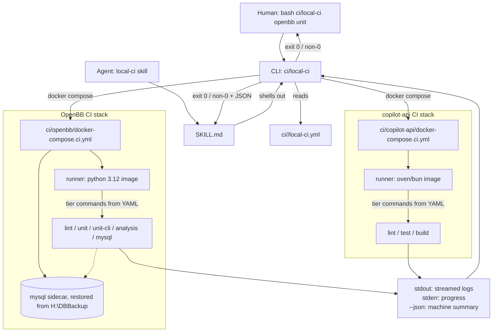

# Spec: `local-ci` — Deterministic Local CI Tool + Agent Skill Wrapper

**Status:** Draft / Proposal — for review (rev. 2026-07-21b — split CLI from skill)
**Author:** Developer tooling working group
**Target component:** Deterministic CLI (`ci/local-ci` — Python) driven by a checked-in YAML config, plus a thin agent skill (`.agents/skills/local-ci/`) that invokes the CLI.
**Companion documents:**
- Source proposal: `temp/local-ci-skill-proposal.md` (multi-root workspace context)
- Related skill precedent: `.agents/skills/openbb-dev-cycle/` (same `SKILL.md` + `reference/` layout)
- Relevant CI: `.github/workflows/test-unit-platform.yml`, `general-linting.yml`, `.github/scripts/noxfile.py`
**Date:** 2026-07-21 (rev. b)
**Decision posture:** The **CLI + YAML is the source of truth**; the skill is a thin shell-out. Humans running from a terminal and agents running from a chat produce identical, byte-comparable results. No behavior lives only in the skill's prose.

---

## Table of Contents

1. [Problem & Motivation](#1-problem--motivation)
2. [Goals & Non-Goals](#2-goals--non-goals)
3. [Architecture](#3-architecture)
4. [File Layout](#4-file-layout)
5. [The CLI (`local-ci`) — deterministic core](#5-the-cli-local-ci--deterministic-core)
   - [5.1 YAML schema (`local-ci.yml`)](#51-yaml-schema-local-ciyml)
   - [5.2 CLI surface](#52-cli-surface)
   - [5.3 Machine-readable output contract](#53-machine-readable-output-contract)
6. [The Skill — thin wrapper](#6-the-skill--thin-wrapper)
7. [Per-Project CI Environments](#7-per-project-ci-environments)
8. [GH Actions → Local Equivalence Table](#8-gh-actions--local-equivalence-table)
9. [Invocation UX](#9-invocation-ux)
10. [Secrets & Config](#10-secrets--config)
    - [10.1 MySQL restore from `H:\DBBackup\`](#101-mysql-restore-from-hdbbackup)
11. [User Guide (documentation deliverable)](#11-user-guide-documentation-deliverable)
12. [Deliverables & Phased Delivery](#12-deliverables--phased-delivery)
13. [Scope Boundaries](#13-scope-boundaries)
14. [Open Decisions](#14-open-decisions)
15. [Acceptance Criteria](#15-acceptance-criteria)

---

## 1. Problem & Motivation

The developer workspace is multi-root with two very different projects, each with its own GitHub Actions setup:

| Project | Stack | GH workflows | Local CI entrypoint today |
|---|---|---|---|
| `OpenBBTechnical` / this fork | Python 3.10–3.14 (Poetry/nox) | `test-unit-platform.yml`, `test-unit-cli.yml`, `general-linting.yml`, codeql, desktop builds | `nox -f .github/scripts/noxfile.py -s unit_test_platform` |
| `copilot-api` | Bun / TypeScript | `ci.yml`, `release.yml`, `release-docker.yml` | `bun run lint`, `bun test`, `bun run build` |

**Pain points this solves:**

1. **No unified "run CI for *this* project" command** — devs must remember each toolchain.
2. **GH-hosted CI skips entire tiers** — the marker filter in `.github/scripts/noxfile.py` excludes `requires_mysql`, `requires_agents`, `integration`, and `nightly`. Those never run until production. A local Docker CI **can** run them by standing up MySQL as a sidecar.
3. **Reproducibility** — the Windows `.venv_win` differs from GH's `ubuntu-latest`. Containers give the exact Linux environment CI uses.
4. **Agent/human parity** — if the "run CI" behavior lives inside a skill's prose, the moment a human runs it manually they diverge. Extracting to a CLI + YAML makes both paths byte-identical.

## 2. Goals & Non-Goals

**Goals:**

- Deliver a **standalone CLI** (`ci/local-ci`, Python-based) that reads a **checked-in `local-ci.yml`** per project and executes the declared tiers inside Docker Compose. Deterministic, exit-coded, JSON-summary output.
- Deliver a **thin agent skill** that simply shells out to the CLI and parses its output — no CI knowledge in the skill beyond "which project, which tier."
- Deliver a **user guide** (`ci/README.md`) so a human can invoke the CLI directly without touching an agent.
- Optionally run the extra tiers GH cannot (`requires_mysql`, integration) via sidecar services.
- Reuse the exact nox sessions / bun scripts — no re-implementation of test logic.

**Non-goals:**

- Not a replacement for GH Actions — complements them.
- Not Windows/macOS-runner emulation (Docker is Linux-only; desktop `build-desktop-*` and CodeQL workflows stay on GH).
- Not `act`. `act`'s community images cannot cleanly run the MySQL-backed or multi-python nox flow; purpose-built compose stacks are faster and more reliable.
- **Not a new CI engine.** The CLI orchestrates Docker Compose + declared shell commands. No test runner, no scheduler, no reporter beyond exit code + JSON summary.

## 3. Architecture



**Key property:** the arrow from **Human** and the arrow from **Skill** both terminate at the same CLI. There is no code path the skill can trigger that a human cannot, and vice versa.

## 4. File Layout

```
<repo-root>/
  ci/
    local-ci                       # Python CLI entrypoint (executable, no extension)
    local-ci.ps1                   # Windows wrapper: invokes python ci/local_ci.py
    local_ci/                      # importable Python package
      __init__.py
      __main__.py                  # `python -m local_ci ...`
      cli.py                       # argparse + dispatch
      config.py                    # YAML load + schema validation
      compose.py                   # docker compose orchestration
      report.py                    # human-readable + JSON summary emitters
      schema/
        local-ci.schema.json       # JSON Schema for local-ci.yml validation
    README.md                      # user guide (see §11)
    openbb/
      local-ci.yml                 # tier declarations, image, env, sidecars
      Dockerfile.ci                # python:3.12-slim + poetry + system deps
      docker-compose.ci.yml        # runner + mysql sidecar
      .env.ci.example              # non-secret CI env
    copilot-api/
      local-ci.yml
      Dockerfile.ci                # oven/bun:latest
      docker-compose.ci.yml
      .env.ci.example
  .agents/skills/local-ci/
    SKILL.md                       # thin wrapper — invokes ci/local-ci and parses JSON
    reference/
      project-map.md               # summary of ci/*/local-ci.yml (kept in sync via test)
      cli-contract.md              # the CLI/skill boundary + JSON schema pointer
```

**Rationale:** the YAML config sits **next to its Compose file** (`ci/openbb/local-ci.yml` alongside `ci/openbb/docker-compose.ci.yml`), so the entire per-project stack lives in one folder. The CLI itself is one folder up so it's a single tool shared across projects.

## 5. The CLI (`local-ci`) — deterministic core

### 5.1 YAML schema (`local-ci.yml`)

The full schema lives in `ci/local_ci/schema/local-ci.schema.json` and is validated on load. Sketch:

```yaml
# ci/openbb/local-ci.yml
version: 1
project: openbb                       # id used by CLI (`local-ci openbb ...`)
description: OpenBB Platform (Python/nox) — local CI stack

compose:
  file: docker-compose.ci.yml         # relative to this yml
  runner_service: runner              # service name inside the compose file
  env_file: .env.ci                   # loaded into runner env (git-ignored)

tiers:
  lint:
    description: Mirrors general-linting.yml
    command: >
      bash -lc "codespell . && black --check . && ruff check .
      && mypy openbb_platform && pylint openbb_platform"
  unit:
    description: Mirrors test-unit-platform.yml
    command: nox -f .github/scripts/noxfile.py -s unit_test_platform --python 3.12
  unit-cli:
    command: nox -f .github/scripts/noxfile.py -s unit_test_cli
  analysis:
    command: pytest Analysis/tests -m "not integration"
  mysql:
    description: Local-only bonus tier — requires_mysql against sidecar
    command: pytest -m requires_mysql
    requires_services: [mysql]        # brought up before tier runs

default_tiers: [lint, unit]           # what `local-ci openbb` runs with no tier arg

sidecars:
  mysql:
    service: mysql                    # service name in compose file
    healthcheck_timeout_s: 120
    init:
      kind: mysql_restore
      source_env: DBBACKUP_DIR        # value read from host env or .env.ci
      source_file: mysql_all_databases.sql   # relative to $DBBACKUP_DIR
      volume: openbb-ci-mysql-data    # named volume in compose file
      # --fresh flag on the CLI drops this volume before compose-up
```

**Validation rules:**

- Every `tier.command` is a string (single command, run inside runner via `docker compose exec`).
- Every `sidecar.service` and `compose.runner_service` must exist in the referenced compose file (CLI cross-checks on load; missing → clear error, non-zero exit).
- `default_tiers` must be a subset of declared `tiers`.
- Unknown keys are rejected (JSON Schema `additionalProperties: false`) — no silent config drift.

### 5.2 CLI surface

```
local-ci <project> [tier ...] [flags]

Positional:
  <project>     Project id (matches `project:` in a discoverable local-ci.yml).
                Resolved by scanning `ci/*/local-ci.yml`; if omitted, the CLI
                detects project from CWD.
  [tier ...]    Zero or more tier names. Empty → uses `default_tiers` from YAML.

Flags:
  --fresh                  Drop sidecar named-volumes before up (forces re-init,
                           e.g. re-restore MySQL from DBBACKUP_DIR).
  --keep-up                Leave the stack running after the tier completes
                           (default: `docker compose down` on exit).
  --json                   Emit machine-readable summary to stdout after the
                           human-readable log. See §5.3.
  --list                   List discovered projects and their tiers, exit 0.
  --dry-run                Print the compose invocations and tier commands
                           that would run, without executing.
  --pull                   `docker compose pull` before up (freshen base images).
  -v, --verbose            Stream all docker compose stderr; default is quiet.

Exit codes:
  0    All requested tiers passed.
  1    One or more tiers failed (test/lint failure).
  2    CLI misuse (bad args, unknown project/tier).
  3    Config error (YAML invalid, compose file missing, schema violation).
  4    Docker error (daemon down, image build failure, sidecar unhealthy).
  5    Init error (e.g. DBBACKUP_DIR missing / dump file not readable).
```

**Determinism guarantees:**

- Same YAML + same repo state + same Docker daemon → same commands executed in the same order.
- No hidden defaults: if a tier isn't declared in YAML, `local-ci` refuses to run it.
- No env-var magic: only `env_file` (declared in YAML) and `source_env` (declared per sidecar init) are read from the host.
- Skill and human paths call the same argv — no per-caller code branches.

### 5.3 Machine-readable output contract

`--json` emits a single JSON object to stdout (after human-readable logs, delimited by a marker line `---LOCAL-CI-JSON---` so the skill can slice it cleanly):

```json
{
  "schema": "local-ci/v1",
  "project": "openbb",
  "tiers": [
    {"name": "lint", "status": "pass", "duration_s": 42.1, "exit_code": 0},
    {"name": "unit", "status": "fail", "duration_s": 611.4, "exit_code": 1,
     "first_failure_excerpt": "FAILED openbb_platform/.../test_foo.py::test_bar - AssertionError: ..."}
  ],
  "sidecars": [
    {"name": "mysql", "brought_up": true, "healthy": true, "init_ran": false}
  ],
  "overall_status": "fail",
  "overall_exit_code": 1
}
```

This is the **contract between the CLI and the skill**. It's committed as JSON Schema alongside the YAML schema (`ci/local_ci/schema/report.schema.json`) and version-tagged (`schema: local-ci/v1`) so future breaking changes are explicit.

## 6. The Skill — thin wrapper

The skill's entire job is:

1. Detect project from active editor / CWD (or take a project arg from the user).
2. Shell out to `ci/local-ci <project> [tiers...] --json`.
3. Parse the trailing JSON block after `---LOCAL-CI-JSON---`.
4. Render the result to chat: pass/fail table + `first_failure_excerpt` on any failure.
5. **On non-zero exit, do NOT claim success** (verification-before-completion discipline).

The skill contains **no CI logic** — no tier names hardcoded, no compose knowledge, no MySQL-restore steps. It reads `ci/*/local-ci.yml` (via `local-ci --list --json`) to discover projects and tiers. This means adding a project or tier is a one-file YAML change; the skill picks it up automatically.

`reference/cli-contract.md` documents the CLI/skill boundary and links to the JSON Schemas so the skill's assumptions are testable.

## 7. Per-Project CI Environments

### 7.1 OpenBB (`ci/openbb/`)

- **Runner image:** `python:3.12-slim` + Poetry + editable `dev_install.py -e`.
- **MySQL sidecar:** `mysql:8`, **restored from `H:\DBBackup\` on first boot** (see §10.1).
- **Tiers** (all declared in `local-ci.yml`, exact commands in §5.1 sketch):
  `lint`, `unit`, `unit-cli`, `analysis`, `mysql`.
- **Matrix:** default single Python (3.12) for speed; opt-in full 3.10–3.13 matrix via a follow-up tier (out of P2/P3 scope).

### 7.2 copilot-api (`ci/copilot-api/`)

- **Runner image:** `oven/bun:latest`.
- **Tiers** (in that project's `local-ci.yml`): `lint` (`bun run lint`), `test` (`bun test`), `build` (`bun run build`).

## 8. GH Actions → Local Equivalence Table

The **YAML files are the source of truth**; this table is a spec-time summary of what the initial YAMLs will declare:

| GH workflow / job | Local tier | Command in container |
|---|---|---|
| Unit test Platform | `unit` | `nox -f .github/scripts/noxfile.py -s unit_test_platform --python 3.12` |
| Unit test CLI | `unit-cli` | `nox -f .github/scripts/noxfile.py -s unit_test_cli` |
| General Linting | `lint` | `codespell ... ; black --check ; ruff check ; mypy ; pylint` |
| *(not in GH)* | `mysql` | `pytest -m requires_mysql` (sidecar) |
| copilot-api CI | `test` / `lint` / `build` | `bun test` / `bun run lint` / `bun run build` |

A CI check (P7) diffs `ci/openbb/local-ci.yml` tier commands against the corresponding GH workflow's step so drift is caught in PR review.

## 9. Invocation UX

**Direct (human):**

```bash
bash ci/local-ci openbb                # runs default_tiers (lint + unit)
bash ci/local-ci openbb lint           # single tier
bash ci/local-ci openbb mysql --fresh  # re-restore MySQL and run mysql tier
bash ci/local-ci --list                # discover all projects and tiers
bash ci/local-ci copilot-api test
```

Windows PowerShell equivalents via `ci/local-ci.ps1`.

**Via agent skill:**

- `run local CI` → skill detects project → invokes `local-ci <project> --json`.
- `run local CI mysql tier for openbb` → `local-ci openbb mysql --json`.
- `run CI for copilot-api` → `local-ci copilot-api --json`.

Both paths report a compact pass/fail table + first failing log excerpt. **On failure, non-success is reported** (no false-green).

## 10. Secrets & Config

- Per-project `.env.ci` (git-ignored; `.env.ci.example` committed). Never bake keys into images.
- OpenBB: mounts nothing sensitive by default; `requires_mysql` tier uses a throwaway sidecar password. Integration tier (opt-in, future) reads `FMP_CACHED_API_KEY` from `.env.ci`.
- Aligns with repo rule: keys come from `user_settings.json` / `.env`, both git-ignored.

### 10.1 MySQL restore from `H:\DBBackup\`

The MySQL sidecar (§7.1, tier `mysql`) restores a real snapshot so tests hit the same schema and data shape as the developer's local instance — seeding empty would make `requires_mysql` tests degenerate.

**Source layout** (as-observed on `H:\DBBackup\`):

```
H:\DBBackup\
  mysql_all_databases.sql              # ~330 MB full-server dump (all schemas)
  register_mysql_service.bat           # host-side helper (not used by CI)
  <YYYY-MM-DD_HHMMSS>\                 # per-timestamp per-DB dumps
    openbb_fmp_cache.sql
    openbb_fmp_cache_test.sql
    openbb_fmp_cache_from_test.sql
    *.err                              # dump-time logs (skip)
```

**Selection policy (encoded in `local-ci.yml`, §5.1 `sidecars.mysql.init`):**

- Restore the **full-server dump** `mysql_all_databases.sql` — chosen to exercise the exact prod schema surface, even though it is slower per-run than the single-DB dumps.
- Source path is resolved from `DBBACKUP_DIR` (host env or `.env.ci`; default `H:\DBBackup`). No timestamp folder selection is needed for the "all databases" choice; devs override `DBBACKUP_DIR` to a pinned/older backup for bisecting.

**Mechanics:**

- Compose mounts `${DBBACKUP_DIR}` **read-only** into the sidecar at `/docker-entrypoint-initdb.d/` (MySQL's stock init hook — any `*.sql` there runs on first boot against an empty data volume).
- Sidecar `MYSQL_ROOT_PASSWORD` is a throwaway value in `.env.ci.example`, documented as non-production.
- Data volume is the named Docker volume declared in `sidecars.mysql.init.volume`. `local-ci --fresh` removes it before compose-up, forcing a re-restore (needed after switching `DBBACKUP_DIR`); default reuses the volume for speed.
- Restore progress is streamed to the CI log so a dev sees it isn't hung on the ~330 MB first-boot restore.
- **Loud failure:** missing / unreadable `${DBBACKUP_DIR}\mysql_all_databases.sql` → CLI exits with code 5 and a clear "expected file not found at …" message. Never a silent empty DB (repo's "loud empties" rule).

**Never committed:** the dump files themselves. Only the *path* variable (`DBBACKUP_DIR`) is committed via `.env.ci.example`.

## 11. User Guide (documentation deliverable)

`ci/README.md` — a **standalone user guide** so a human never needs the agent skill to run CI. Contents:

1. **Prerequisites** — Docker Desktop version, `DBBACKUP_DIR` setup, `.env.ci` from `.env.ci.example`.
2. **Quickstart** — the five commands from §9 above.
3. **Per-project tier reference** — one section per project generated (or hand-maintained + CI-checked) from `local-ci.yml`.
4. **MySQL tier walkthrough** — the exact `--fresh` semantics and how to point at a pinned backup.
5. **Troubleshooting** — exit-code table (from §5.2) mapped to common causes.
6. **Adding a new tier** — the one-file YAML edit + how to verify with `--dry-run`.
7. **Adding a new project** — create `ci/<name>/{local-ci.yml, Dockerfile.ci, docker-compose.ci.yml, .env.ci.example}`; `local-ci --list` picks it up.

The user guide is the primary artifact of P6. The skill's `SKILL.md` can (and should) point at it rather than duplicating.

## 12. Deliverables & Phased Delivery

Delivered as sequential GitHub Issues under an epic tracker. Each is independently reviewable.

| Phase | Deliverable | Size |
|---|---|---|
| **P0** | Formal spec (this doc) + resolve open decisions | S |
| **P1** | **CLI + YAML schema**: `ci/local-ci` executable, `local_ci` package, `local-ci.schema.json`, `report.schema.json`, unit tests. No project stacks yet — CLI can `--list` an empty set and validate a fixture YAML. | M |
| **P2** | OpenBB CI stack — `ci/openbb/{local-ci.yml, Dockerfile.ci, docker-compose.ci.yml, .env.ci.example}` covering `lint`, `unit`, `unit-cli`, `analysis` tiers. Wired into the CLI. | M |
| **P3** | MySQL sidecar + `mysql` tier + `H:\DBBackup` restore init handler (`sidecar.init.kind: mysql_restore`). | M |
| **P4** | copilot-api CI stack — `ci/copilot-api/{local-ci.yml, Dockerfile.ci, docker-compose.ci.yml}`. | S |
| **P5** | **Agent skill wrapper** — `.agents/skills/local-ci/SKILL.md` + `reference/{project-map.md, cli-contract.md}`. Depends on P1 (CLI exists) but not P2/P3/P4 individually — skill is generic. | S |
| **P6** | **User guide** — `ci/README.md` per §11. Depends on P2 minimum (something to document). | S |
| **P7** | **Drift check** — a CI script (runs in GH Actions) that diffs each `local-ci.yml` tier command against the corresponding GH workflow step and fails on drift. | S |

**Dependency graph:**

```
P0 ─▶ P1 ─▶ P2 ─┬─▶ P3
                ├─▶ P6 (user guide)
                └─▶ P7 (drift check)
       P1 ─▶ P5 (skill wrapper)
       P1 ─▶ P4 (copilot-api stack)
```

## 13. Scope Boundaries

- Not a replacement for GH Actions — complements them.
- Not Windows/macOS-runner emulation — desktop `build-desktop-*` and CodeQL workflows stay on GH; the CLI's `--list` will not offer them.
- Not `act`.
- Not a general workflow engine. Only "run declared shell command inside declared compose service, optionally bring up declared sidecars first." Anything beyond that is out of scope until a concrete need appears.

## 14. Open Decisions

**Resolved** in P0 (#984, 2026-07-21):

1. **Default tier set** on bare `local-ci openbb` → **`[lint, unit]`**.
2. **Docker Desktop** → available on target dev machines (hard prerequisite confirmed).
3. **CLI implementation language** → **Python** (jsonschema + subprocess + PyYAML; ships in `.venv_win`; matches OpenBB stack).
4. **Folder name** → **`ci/` at repo root**.
5. **Project scope** → **OpenBB first** (P2/P3); **copilot-api deferred** to a later session (P4).

## 15. Acceptance Criteria

1. **CLI/skill parity:** running `bash ci/local-ci openbb lint unit` from a shell and asking the agent to "run local CI for openbb" produce **byte-identical tier commands** (verifiable via `--dry-run`).
2. `bash ci/local-ci openbb` (default tiers) produces a green `lint + unit` build in-container, with output matching the corresponding GH Actions log for the same commit.
3. `bash ci/local-ci openbb mysql --fresh` restores `${DBBACKUP_DIR}\mysql_all_databases.sql` into the sidecar, runs ≥1 `requires_mysql`-marked test, and reports pass/fail. Missing dump → exit 5 with clear message.
4. `bash ci/local-ci --list` enumerates every discovered project and its tiers by scanning `ci/*/local-ci.yml`.
5. Adding a new tier is a **one-file YAML edit** — no CLI, skill, or Compose changes required (for tiers that reuse the existing runner service).
6. `bash ci/local-ci --json` emits a valid `local-ci/v1` report per §5.3, validated against `report.schema.json` in unit tests.
7. Skill (P5) contains **zero hardcoded tier names**; discovers everything via `local-ci --list --json`.
8. User guide (P6) allows a fresh dev to run `lint + unit` end-to-end without opening the skill or this spec.
9. Drift check (P7) fails a synthetic PR that edits a GH workflow step but not the corresponding `local-ci.yml` tier command.
10. All secrets remain in git-ignored `.env.ci` files; no keys in images, YAMLs, or committed configs.
