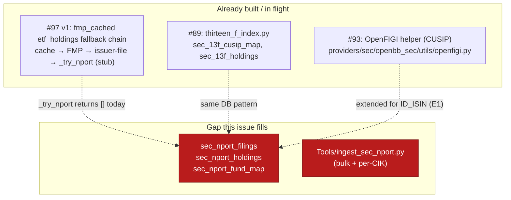

# #99 — SEC Form N-PORT ingest (bulk historical + per-CIK incremental)

**GitHub:** [#99](https://github.com/prajoria/OpenBB/issues/99) · **Phase:** Provider infra · **Sprint:** TBD · **Size:** L
**Status:** Phase 1 refined (2026-06-27) — §6.2 G1–G6 + Q-D 2026-regime verification folded into the locked sections. **Phase-2-ready.**
**Parent context:** [#97](https://github.com/prajoria/OpenBB/issues/97) — ETF holdings free-fallback tier; N-PORT half (T2+T3) was **deferred** at v1 ship after the assumed bulk-dataset URL 404'd and the SEC data-sets HTML page 403'd a default Python User-Agent. This doc un-parks T2+T3 with a verified fetch strategy.
**Depends on:** the #97 MVP (issuer-file tier shipped on `trading_technicals` via PR #100) for the `_try_nport` slot in the fmp_cached fetcher chain — currently a stub returning `[]`.
**Related:**
- [#89](https://github.com/prajoria/OpenBB/issues/89) — SEC 13F bulk-ingest pattern is the architectural sibling (same `Tools/ingest_*` + MySQL `IF NOT EXISTS` shape, same User-Agent + rate-limit discipline).
- [#93](https://github.com/prajoria/OpenBB/issues/93) — OpenFIGI CUSIP→ticker bridge; this work needs an `ID_ISIN` extension of the same helper so non-CUSIP N-PORT holdings (foreign equities, FX/swaps with ISIN only) can be resolved to tickers.
- [#94](https://github.com/prajoria/OpenBB/issues/94) — submodule standardization (if we vendor an N-PORT parser, it goes under `third_party/`).
- [#96](https://github.com/prajoria/OpenBB/issues/96) — FIGI staleness refresh (the same logic applies to N-PORT-derived identifiers).
**Source:** no PRD. This design doc is the primary artifact. Problem statement in §"What this is."

> **Repo note:** new code lives under
> [`providers/sec/openbb_sec/utils/`](../../../openbb_platform/providers/sec/) (read/index half)
> and [`Tools/`](../../../Tools/) (ingest half), exactly mirroring #89's split.
> Vendored parser (if needed) lands at `third_party/sec-nport-parser/` per #94.
> This doc lives under `docs/designs/etf_holdings/` because that family already
> hosts the parent #97 design; broader fund-holdings consumers (not just ETF
> resolution) read from the same tables.

> **Status (2026-06-27):** Phase 1 refined. The 3-route fetch strategy
> (submissions API for discovery, accession-archive for per-filing pull, bulk
> ZIPs for historical backfill), the SEC User-Agent rule, the reuse of #89's
> bulk-ingest scaffolding, and the "no licensed identifier copy" rule are
> **locked**. The schema (now including `report_date` + fund key per G1, raw
> blob on filings per G2, `sec_nport_fund_map` specified per G3, content-derived
> holding key per G4, amendment supersession per G5, correct ZIP-handling per G6)
> is **locked**. Q-D cadence verified against the SEC's current 2026 proposal
> (the Aug-2024 monthly-public rule was paused; quarterly-only public release at
> +60 days remains the regime). This doc is Phase-2-ready.

---

## What this is

The SEC publishes **Form N-PORT-P** — registered investment companies' monthly
portfolio holdings — through three complementary public endpoints. None of them
is a single pre-parsed REST resource (unlike the XBRL company-facts API), so the
ingest is a small pipeline, not a one-shot fetch:

1. **Submissions API** (`data.sec.gov/submissions/CIK{10}.json`) — discovers
   the `NPORT-P` / `NPORT-P/A` accession numbers for a given fund (or fund
   complex's CIK). Real-time, low volume, perfect for **incremental refresh**
   between bulk releases.
2. **Accession archive** (`www.sec.gov/Archives/edgar/data/{cik}/{accn-no-hyphens}/{accn}.txt`)
   — returns the raw filing as a multipart text/XML envelope; the portfolio
   holdings sit inside as structured XML. One filing per request.
3. **Bulk quarterly ZIP** (linked from
   [`sec.gov/data-research/sec-markets-data/form-n-port-data-sets`](https://www.sec.gov/data-research/sec-markets-data/form-n-port-data-sets))
   — one structured-table archive per quarter (~hundreds of MB) covering every
   public N-PORT filing in that window. Right tool for **historical backfill**.

This issue ingests all three into the same MySQL tables proposed in #97 so the
`_try_nport` fallback in the `fmp_cached` ETF holdings chain (and any future
mutual-fund holdings consumer) has a populated index to read from.

The work #97 parked (T2 = `nport_index.py`, T3 = `Tools/ingest_sec_nport.py`)
becomes T2'+T3' here, **with the URL-discovery and incremental-fetch gaps that
caused the v1 deferral now in scope as first-class problems** (Q-A, Q-D).

---

## 0. Key decisions — locked vs. open

### 0.1 Locked

| # | Decision | Choice | Consequence |
|---|---|---|---|
| L1 | Fetch routes | **Three, complementary:** submissions API (discovery), accession archive (per-filing), bulk quarterly ZIP (historical backfill) | Bulk is the cheap path for the long tail; submissions+archive give us same-week freshness without scraping the ZIP page |
| L2 | User-Agent header | **Mandatory** on every `sec.gov` / `data.sec.gov` request: `"<entity name> <contact email>"`; resolved from `user_settings.json` `credentials.sec_user_agent` (or `SEC_USER_AGENT` env), with a single chokepoint helper | Anything without it gets 403; non-conformance breaks the run, not silently degrades |
| L3 | HTTP client | `requests` only (no `aiohttp`); session-reuse; `Accept-Encoding: gzip`; per-request retries with `Retry-After` honored; `sys.stdout.reconfigure(utf-8)`. **Prefer extending the existing SEC HTTP helper used by #89/#93 if one already exists** (one HTTP path to audit) — only introduce a new `sec_http.py` module if no shared helper is in tree | Mirrors #89/#93 L6 rule; one HTTP path to audit |
| L4 | Storage | **Four new MySQL tables in the `openbb_fmp_cache_test` database** (same DB as `sec_13f_cusip_map` so cross-table CUSIP joins work): `sec_nport_filings`, `sec_nport_holdings`, `sec_nport_fund_map` (specified in §2.3), `sec_nport_ingest_runs` (observability + resume cursor for bulk mode). DDL `IF NOT EXISTS`, single source of truth in `openbb_sec/utils/nport_index.py` — exact pattern from #89's `thirteen_f_index.py` | No schema bleed into 13F tables; cross-table CUSIP join works; `resolve_*` read helpers are pure DB |
| L5 | Idempotency | **Filings**: `INSERT ... ON DUPLICATE KEY UPDATE` keyed on `(accession_number)`. **Holdings**: keyed on `(accession_number, holding_key)` where `holding_key = COALESCE(cusip, isin, lei, sha1(issuer_name||asset_category))` — content-derived per G4, not a parse-order ordinal. Same-issuer-multiple-lots collision rule: parser appends `_lot2`, `_lot3`, … to the holding_key for tied rows within one filing. Bulk loader is **restart-safe via `sec_nport_ingest_runs.last_accession_seen`** (resume cursor per quarter ZIP member, per G6) | Re-running the loader is a no-op; `NPORT-P/A` restatements upsert cleanly without orphan rows |
| L6 | Identifier policy | Store every identifier the filing carries: **CUSIP, ISIN, LEI, ticker**, plus issuer name. **Never** copy any licensed master; CUSIP→ticker resolution defers to #89's `sec_13f_cusip_map`; ISIN/SEDOL→ticker defers to #93's OpenFIGI helper extended for `ID_ISIN`/`ID_SEDOL` | Same legal/architectural posture as #89/#93 |
| L7 | No fuzzy issuer matching | Inherited L5 from #89 — issuer-name reconciliation stays out of any critical path | Joins are key→key only; ambiguous rows are flagged, not guessed |
| L8 | Provenance | Every row carries `source ∈ {"sec_nport_bulk", "sec_nport_submissions", "sec_nport_archive"}` + `ingested_at` + `accession_number` | Auditable; lets a consumer prefer the freshest route per fund |
| L9 | Hot-path constraint | Provider fetchers (`_try_nport`) do **pure DB reads** against the index; ingest is offline batch via `Tools/` | Same hot-path discipline as #89's `resolve_cusip` |
| L10 | As-of read semantics | `holdings_for_fund(ticker\|cik, asof=None)` returns rows from the **latest filing accession where `report_date ≤ asof`** for the resolved `(cik, series_id)`. `asof=None` means "today" (returns the most recent period available). Requires the `report_date` column on `sec_nport_filings` (per G1). | The read helper signature in the original Q-B can be answered; consumers get deterministic snapshots, not unions across periods |
| L11 | Amendment supersession | `NPORT-P/A` for the same `(cik, series_id, period)` **supersedes** prior `NPORT-P`. `sec_nport_filings.is_amendment` flag; `holdings_for_fund` returns rows from the latest accession per `(cik, series_id, period)`, never the union of both (per G5) | A fund's restatement is fully reflected; no stale rows leak through |
| L12 | Staleness disclosure | Every `holdings_for_fund` row carries `report_date` and a derived `data_age_days`. The FMP fetcher's `transform_data` propagates `report_date` into the standard `EtfHoldingsData.updated` field | Under the verified 2026 regime (quarterly public, +60d lag — see Q-D) a consumer asking "today's holdings" gets a 60–150-day-stale snapshot; the staleness must be visible to the caller, not silently smoothed over |

### 0.2 Open questions (please review / brainstorm)

> **Reviewer summary placeholder.** Three themes cut across the open Qs:
> - **URL discovery** is the failure mode that killed #97 v1 (Q-A). Whatever
>   we pick must survive SEC re-orgs of the data-sets page.
> - **Schema breadth** has a 10× cost difference between MVP and full
>   N-PORT (Q-B). Pick the subset that closes the consumer story without
>   committing to a 80-column table on day one.
> - **Identifier bridging** is where this work meets #93 (Q-E). Extending
>   the OpenFIGI helper for ISIN is small but should be one PR, not bundled.
>
> **→ Reviewed 2026-06-27 (GitHub Copilot): see [§6](#6-reviewer-feedback--answers-github-copilot-2026-06-27)
> for per-question answers and six blocking schema/fund-map gaps (G1–G6).**

> **Q-A — How do we discover the bulk-quarterly ZIP URLs without hardcoding?** **[RESOLVED]**
> The #97 spike died here: the assumed path 404'd and the data-sets HTML page
> returned 403 to a default Python User-Agent. Options:
> - **A1 — Scrape the data-sets index HTML** with a proper User-Agent.
>   `sec.gov/data-research/sec-markets-data/form-n-port-data-sets` serves a
>   simple HTML table of "Year/Quarter → ZIP URL"; with the L2 User-Agent the
>   403 disappears. Parse with `html.parser` (stdlib) — no `beautifulsoup4`.
> - **A2 — Pin a known good path pattern** (`/files/dera/data/form-n-port/...`)
>   and probe each quarter; fall back to A1 on first 404. This is what #97
>   tried and failed.
> - **A3 — Bypass bulk entirely**, walk every CIK via the submissions API
>   plus per-accession archive fetch. Linear in fund count (× quarters × accn)
>   → minutes-to-hours per backfill cycle, but no URL discovery problem.
> - **Resolution:** **A1 for backfill + A3 for incremental**. The discovery
>   helper MUST **raise loudly** if it parses zero `Year/Quarter → ZIP` rows
>   (page re-org) — silent-empty was the #97 v1 failure mode. Unit-test the
>   discoverer against a saved HTML fixture of the SEC's actual response, and
>   write the discovered URL pattern to `sec_nport_ingest_runs` so a future
>   SEC re-org is diagnosable from data, not just logs.
>
> **ZIP-handling correction (G6):** "stream-extract the ZIP off the socket" is
> **not how Python's `zipfile` works** — `ZipFile` requires a seekable file
> object. The realistic pattern is:
> 1. Stream the HTTP response **to a temp file** (or `BytesIO` if the quarter's
>    ZIP fits in RAM — current N-PORT quarters are ~400 MB so RAM is plausible
>    but temp file is the safe default).
> 2. Open with `zipfile.ZipFile(tmpfile)` and `ZipFile.open(member)` per member.
> 3. **Stream rows** from each member into chunked upserts (2000-row batches,
>    matching the institutional_ownership pattern).
> 4. Record `last_accession_seen` in `sec_nport_ingest_runs` after each batch so
>    a SIGINT mid-quarter resumes cleanly rather than re-ingesting from row 1
>    (per L5 "restart-safe" — now explicit for the bulk path).

> **Q-B — Schema scope: full N-PORT vs. MVP subset.** **[RESOLVED]**
> A full N-PORT row has ~80 fields including derivatives-leg details, fair
> value level (FV1/2/3), counterparty LEI, restricted/illiquid flags, etc.
> Most consumers (techtrade scan, `obb.etf.holdings`) only need a handful.
> - **B1 — Full schema, day one.** Most flexible, most up-front cost
>   (table width, migration risk, slower bulk parse).
> - **B2 — MVP subset.** Closes the `_try_nport` story; the rest can be added
>   in a follow-up without breaking readers.
> - **Resolution:** **B2 MVP**, with G1+G2 corrections folded in. The actual
>   column split is:
>
> **`sec_nport_filings`** (one row per accession — per G2, raw XML lives here, not on holdings):
> - `accession_number` PK (e.g. `0001752724-25-022345`)
> - `cik` (10-digit zero-padded, e.g. `0000884394`)
> - `series_id` (e.g. `S000004310` — required per G1 for fund-key joins)
> - `class_id` (nullable; ETFs often have one class but the schema must allow many)
> - `report_date` (DATE — the as-of date the holdings reflect; per G1+L10)
> - `filing_date` (DATETIME — when SEC received the filing)
> - `is_amendment` BOOL (TRUE for `NPORT-P/A`; per L11 supersession rule)
> - `source` (per L8: `sec_nport_bulk` / `sec_nport_submissions` / `sec_nport_archive`)
> - `ingested_at` DATETIME
> - `raw_xml_url` VARCHAR (the accession-archive URL; per G2 — cheaper than blob)
> - `raw_xml_sha256` CHAR(64) (per G2 — recoverability without blob bloat)
> - `raw_xml_blob` LONGTEXT NULL (lazy, off by default behind `--with-raw` CLI flag; one blob per filing, not per holding)
>
> **`sec_nport_holdings`** (one row per holding — joined to filings via `accession_number`):
> - `accession_number` (FK to filings)
> - `holding_key` VARCHAR (per G4: `COALESCE(cusip, isin, lei, sha1(issuer_name||asset_category))` + `_lotN` suffix for ties; **NOT** parse-order ordinal)
> - PK: `(accession_number, holding_key)`
> - `issuer_name` VARCHAR(255)
> - `ticker` VARCHAR(16) NULL (free-text from N-PORT; unreliable, enriched by `Tools/enrich_nport_isin_tickers.py`)
> - `cusip` CHAR(9) NULL
> - `isin` VARCHAR(12) NULL
> - `lei` CHAR(20) NULL
> - `asset_category` VARCHAR (e.g. `EC`, `DBT`, `LOAN`)
> - `units` DECIMAL(24,6) NULL
> - `value_usd` DECIMAL(20,2) NULL
> - `pct_nav` DECIMAL(8,6) NULL
> - `payoff_direction` VARCHAR(8) NULL (`Long` / `Short`)
> - `derivative_flag` BOOL
>
> The `report_date` + fund key (`cik` + `series_id`) on filings make L10's
> `holdings_for_fund(ticker|cik, asof)` answerable; the move of `raw_xml_blob`
> to filings (per G2) avoids multiplying one filing's XML across its hundreds
> of holding rows.

> **Q-C — Universe scope & ordering for the first backfill.** **[RESOLVED]**
> Tens of thousands of registered funds × multiple quarters = days of bulk
> ingest if naive. What goes first?
> - **C1 — ETF-only first** (~3,000 ETFs). Smallest corpus that closes the
>   #97 ETF-holdings story (techtrade scan unblocked end-to-end). Filter on
>   `entity_type == "ETF"` from the bulk metadata or the
>   `sec_nport_fund_map.is_etf` flag.
> - **C2 — Top-N by AUM** across ETFs + mutual funds (e.g. top 500).
>   Covers ~85% of investible assets, more useful to a future MF-holdings
>   consumer, but adds an AUM lookup dependency.
> - **C3 — Everything, but ordered.** Bulk ingest is single-pass anyway —
>   the ordering question is "what completes when interrupted." Order by
>   descending AUM within each quarter ZIP so a partial run is still
>   maximally useful (the Q-D ordering rationale from #93).
> - **Resolution:** **C1 for v1 ship** (smaller scope, closes #97's parent
>   ticket), **C3 for v2** when the consumer story expands beyond ETFs.
>   `--etf-only` is a CLI flag so v2 is just a flag flip.
>
> **Dependency on G3 / §2.3:** C1 is **not free** — it depends entirely on
> `sec_nport_fund_map` existing AND being populated with a reliable `is_etf`
> flag. N-PORT has no clean `entity_type == "ETF"` field; ETFs are series/
> classes of management companies or UITs. v1 ships the **seed-only**
> approach (the 11 GICS SPDRs, mirroring #89 B4 seed + #97 ISSUER_REGISTRY)
> — broader ETF detection deferred. See **§2.3** for the full fund-map spec.

> **Q-D — Refresh cadence: bulk vs. incremental, and when.** **[RESOLVED — verified against current 2026 SEC regime]**
>
> The original recommendation assumed "monthly filings, only Q3 made public,
> ~60-day lag." That premise needed re-verification because the SEC's Aug-2024
> N-PORT amendments **would have** moved filings to monthly-public at +60d.
>
> **Verified status (2026-06-27):**
>
> | Framework | Filed to SEC (private) | Public availability | Public frequency |
> |---|---|---|---|
> | 2024 rule (Paused, never enforced) | Monthly +30d | Monthly +60d | Monthly |
> | **Current 2026 proposal (in effect)** | **Monthly +45d** | **Quarter-end +60d** | **Quarterly (3rd month only)** |
>
> The Aug-2024 monthly-public rule was **paused**; the current 2026 proposal
> keeps the pre-2024 quarterly-only public release with new lag math (60d
> after quarter end, not after the 3rd month). So the original "quarterly,
> 60-day lag" intuition was right, but for different reasons than the design
> assumed.
>
> Options:
> - **D1 — Bulk only, quarterly cron.** Simplest. Worst freshness: up to
>   ~5 months stale at the seam (the 3rd month of last quarter + the 60-day lag).
>   Best freshness right after a quarterly release: ~60 days.
> - **D2 — Bulk quarterly + per-CIK submissions check daily** for funds
>   the consumer actively reads.
> - **D3 — Bulk quarterly + on-demand incremental** triggered by a cache
>   miss in `_try_nport`.
>
> **Resolution:** **D1 for v1 ship.** Defer D2/D3 indefinitely.
>
> D3 self-healing **buys very little** under the verified 2026 regime — the
> submissions+archive route can't pull data that isn't yet in the most recent
> bulk ZIP, because funds only file monthly-**private** and only the 3rd month
> of each quarter is ever made **public**. D3 would help only for:
>   - `NPORT-P/A` amendments (which can hit the submissions feed before the
>     next bulk includes them — addressed by L11 supersession, not by D3)
>   - The narrow window where a fund filed just after the quarterly bulk was
>     packaged but before the next ships
>
> Both are edge cases not worth the operational cost of a self-healing layer.
>
> **Cron schedule:** fire the bulk loader on the **65th day after each
> quarter end** (gives SEC ~5 days to publish + package). Backfill once at
> v1 launch with `--limit` ramping over multiple runs.
>
> **Staleness disclosure (per L12):** every `holdings_for_fund` row carries
> `report_date` + a derived `data_age_days`; the FMP fetcher's `transform_data`
> propagates `report_date` into `EtfHoldingsData.updated`. Consumers see
> "this is a 60–150-day-old snapshot," not a real-time position.

> **Q-E — ISIN/SEDOL bridging via #93's OpenFIGI helper.** **[RESOLVED]**
> N-PORT carries CUSIP (US-issuer holdings), ISIN (often the only id for
> foreign holdings or fixed income), LEI (counterparties), and sometimes a
> ticker field that's free-text and unreliable. To resolve a foreign or
> bond holding to a useful ticker we need OpenFIGI on `ID_ISIN`.
> - **E1 — Extend #93's helper** with an `idType` parameter and a
>   `map_isins(...)`/`map_sedols(...)` thin wrapper. Same rate-limit
>   policy, same selection ladder (Q-C of #93). Closes Q-A of #93 without
>   re-doing the client work.
> - **E2 — Duplicate the helper** for N-PORT. Rejected: two clients
>   means two rate-limiter implementations and two test surfaces.
> - **Resolution:** **E1**, filed as a small PR against #93's
>   `openfigi.py` helper before this ingest's enrichment step depends on
>   it. The ingest itself does **not** call OpenFIGI inline — it stores
>   the raw identifier and an offline enrichment script
>   (`Tools/enrich_nport_isin_tickers.py`, sibling to #93's
>   `enrich_cusip_figi.py`) backfills tickers in a separate batch.
>
> **Selection-ladder caveat for ISIN:** `ID_ISIN` is frequently **one-to-many**
> (same ISIN, multiple FIGIs across venues/currencies), more so than CUSIP.
> The selection ladder needs an **exchange/currency tiebreak** — prefer the
> primary US listing if present, else the composite FIGI. The "never overwrite
> a non-null `ticker`" rule (mirrored from #93's R6 app-side anti-join) is the
> idempotency guard. Keep enrichment **offline** — never inline in `_try_nport`.

---

## 1. Current state (grounded in code)



- #97 design + status note: [`etf-holdings-free-fallback-tier.md`](./etf-holdings-free-fallback-tier.md) — see "Status (2026-06-27, T1 spike)".
- #89 schema/read-helper template: [`thirteen_f_index.py`](../../../openbb_platform/providers/sec/openbb_sec/utils/thirteen_f_index.py).
- #93 OpenFIGI client (CUSIP today; extend for ISIN per Q-E): [`providers/sec/openbb_sec/utils/openfigi.py`](../../../openbb_platform/providers/sec/openbb_sec/utils/) _(file from #93, in-flight)_.

---

## 2. Target design

```mermaid
flowchart LR
    subgraph bulk["Bulk historical (quarterly)"]
        A1["Tools/ingest_sec_nport.py --mode=bulk<br/>--quarter 2026Q1"] --> A2["discover ZIP URL<br/>(A1: scrape data-sets page;<br/>raise loudly on zero rows)"]
        A2 --> A3["download to temp file<br/>(or BytesIO if RAM allows)"]
        A3 --> A4["ZipFile.open(member) per member<br/>stream rows → chunked upserts<br/>(2000-row batches)"]
    end
    subgraph incr["Per-CIK incremental"]
        B1["Tools/ingest_sec_nport.py --mode=incremental<br/>--cik 0000...,0000..."] --> B2["GET data.sec.gov/submissions/CIK{padded}.json"]
        B2 --> B3["for each NPORT-P accession not yet ingested:<br/>GET www.sec.gov/Archives/edgar/data/{cik}/{accn}/{accn}.txt"]
        B3 --> B4["parse multipart envelope → holdings XML"]
    end
    A4 --> P["normalize → MVP schema (Q-B B2)<br/>filings: (accession, cik, series_id, report_date,<br/>filing_date, is_amendment, source, raw_xml_url, sha256)<br/>holdings: (accession, holding_key, issuer, ticker,<br/>cusip, isin, lei, asset_cat, units, value_usd,<br/>pct_nav, payoff_direction, derivative_flag)"]
    B4 --> P
    P --> U["upsert with content-derived keys (G4)<br/>ON DUPLICATE KEY UPDATE<br/>source ∈ {sec_nport_bulk,<br/>sec_nport_submissions, sec_nport_archive}<br/>resume cursor → sec_nport_ingest_runs (G6)"]
    U --> R["read helpers in nport_index.py:<br/>holdings_for_fund(ticker|cik, asof) -> list[dict]<br/>(L10 as-of, L11 amendments win)<br/>fund_for_ticker(etf_ticker) -> (cik, series_id)"]
    R --> CONS["consumers:<br/>fmp_cached._try_nport,<br/>future obb.fund.holdings, …"]

    classDef ok fill:#15803d,stroke:#14532d,color:#fff;
    class R ok;
```



### 2.1 New / changed files

| File | Kind | Responsibility |
|---|---|---|
| `providers/sec/openbb_sec/utils/nport_index.py` | **new** | Schema DDL `IF NOT EXISTS` for the **4 tables** (filings, holdings, fund_map per §2.3, ingest_runs) + `init_nport_index()` + read helpers (`fund_for_ticker`, `holdings_for_fund(asof=)`, `latest_period_for_fund`). L10 as-of semantics + L11 supersession enforced here. Pure DB. Mirrors `thirteen_f_index.py` from #89. |
| `providers/sec/openbb_sec/utils/sec_http.py` | **new (or extend existing)** | Chokepoint helper for `sec.gov` / `data.sec.gov` requests with the L2 User-Agent header, session reuse, `Retry-After` honoring, gzip. **First check whether #89/#93 already ship a shared SEC HTTP helper to extend** (L3's "one HTTP path to audit") — only introduce this module if no shared helper exists. Used by both ingest routes and the bulk-URL discoverer. |
| `providers/sec/openbb_sec/utils/nport_parser.py` | **new** | Pure parser: bytes → `NportFiling` + list[`NportHolding`] (TypedDicts matching the §0.2 Q-B schema). Derives `holding_key` per G4 (`COALESCE(cusip, isin, lei, sha1(issuer\|asset_cat))` + `_lotN` for ties). Handles the multipart envelope split + the XML decode. No HTTP, no DB; fully unit-testable against fixtures. |
| `Tools/ingest_sec_nport.py` | **new** | CLI: `--mode={bulk,incremental}`, `--quarter`, `--cik`, `--etf-only` (Q-C), `--limit`, `--sleep`, `--dry-run`, `--database`, `--with-raw` (Q-B), `--max-runtime` (CI safety). **Bulk mode**: discover ZIP URL → download to temp → `ZipFile.open(member)` → stream rows in 2000-row chunks → upsert → write resume cursor to `sec_nport_ingest_runs` (per G6). **Incremental mode**: submissions API → per-accession archive → parse → upsert. Idempotent (L5). |
| `Tools/enrich_nport_isin_tickers.py` | **new** | Offline batch (sibling to #93's `enrich_cusip_figi.py`): finds N-PORT holdings with ISIN-but-no-ticker, calls extended OpenFIGI helper (Q-E E1) with `idType="ID_ISIN"` + exchange/currency tiebreak, upserts ticker. **Never** overwrites a non-null `ticker` (R6 app-side anti-join from #93). |
| `providers/fmp_cached/.../etf_holdings.py` | **edit** | Replace the stub `_try_nport` with a real read against `nport_index.holdings_for_fund(symbol, asof=None)`. Already wired in the #97 chain (shipped in PR #100); this issue makes it return rows. **Also**: propagate `report_date` into `EtfHoldingsData.updated` (per L12 staleness disclosure). |
| `providers/sec/.../tests/test_nport_index.py` | **new** | DDL roundtrip, read helpers (L10 as-of, L11 supersession), idempotent upsert (L5 content-derived key per G4). |
| `providers/sec/.../tests/test_nport_parser.py` | **new** | Fixture-driven: representative `NPORT-P` filings (ETF, mutual fund, derivative-heavy fund), edge cases (no CUSIP, ISIN-only, free-text ticker, same-issuer-multiple-lots collision). No network. |
| `providers/sec/.../tests/test_sec_http.py` | **new** | User-Agent presence (L2 mandatory hard error on missing config), 403/429/Retry-After handling against `requests_mock`. |
| `providers/sec/.../tests/test_bulk_url_discovery.py` | **new** | Parses a **saved HTML fixture** of the SEC data-sets page; **asserts raise-loudly on zero rows** (the #97 silent-empty regression guard). |
| `Tools/docs/specs/ingest_sec_nport.md` | **new** | Per-tool spec (matches `Tools/docs/specs/` precedent). |
| `Tools/docs/DESIGN.md` | **edit** | Add `ingest_sec_nport.py` + `enrich_nport_isin_tickers.py` to the loader inventory + §10 changelog entry + §4 Table Schemas for the 4 new tables. |
| `docs/designs/etf_holdings/etf-holdings-free-fallback-tier.md` | **edit** | Un-park status section — mark T2/T3 as resolved by this issue; remove "deferred to follow-up bead" language; update Status to reflect N-PORT half landing. |
| `third_party/sec-nport-parser/` | _maybe_ | Only if we vendor a third-party reference parser; placed per #94. **Default plan: roll our own** (the XML schema is simple). |

No change to: 13F tables, `resolve_cusip` (still authoritative for CUSIP→ticker reverse), the OpenFIGI client's CUSIP path, or any non-fmp_cached provider.

### 2.2 SEC fetch contracts (verified-at-impl-time per L2)

**Route 1 — Submissions API:**

```
GET https://data.sec.gov/submissions/CIK{cik:010d}.json
User-Agent: <entity> <contact-email>
Accept-Encoding: gzip
```

Response (relevant fields): `filings.recent.{accessionNumber, form, primaryDocument, filingDate, reportDate}` — filter `form in {"NPORT-P", "NPORT-P/A"}`.

**Route 2 — Accession archive:**

```
GET https://www.sec.gov/Archives/edgar/data/{cik}/{accn_no_hyphens}/{accn}.txt
User-Agent: <entity> <contact-email>
```

Returns a `<SEC-DOCUMENT>` envelope with one or more `<DOCUMENT>` blocks; the
N-PORT structured XML is inside a `<TYPE>NPORT-P</TYPE>` block.

**Route 3 — Bulk quarterly:**

```
GET https://www.sec.gov/data-research/sec-markets-data/form-n-port-data-sets
(HTML index; scrape with stdlib html.parser per Q-A/A1)
GET <discovered ZIP URL>
```

ZIP contains tab-delimited tables — schema described on the same SEC page.

**ZIP processing pattern (per G6):** Python's `zipfile.ZipFile` requires a
**seekable** file object — you cannot stream a 400 MB remote ZIP member-by-member
straight off the HTTP socket. The realistic pattern:

```python
# Pseudocode (real implementation in Tools/ingest_sec_nport.py)
with tempfile.NamedTemporaryFile(suffix=".zip", delete=True) as tmp:
    # 1. Stream HTTP response to temp file (don't load into memory)
    with sec_http.get(url, stream=True) as resp:
        shutil.copyfileobj(resp.raw, tmp)
    tmp.flush()

    # 2. ZipFile.open(member) per member, stream ROWS into chunked upserts
    with zipfile.ZipFile(tmp.name) as zf:
        for member in zf.namelist():
            with zf.open(member) as fh:
                batch = []
                for line in io.TextIOWrapper(fh, encoding="utf-8"):
                    batch.append(parse_row(line))
                    if len(batch) >= 2000:
                        upsert_holdings(batch)
                        record_resume_cursor(member, last_accession=batch[-1].acc)
                        batch.clear()
                if batch:
                    upsert_holdings(batch)
```

The `record_resume_cursor` write to `sec_nport_ingest_runs` after each batch is
what makes the bulk loader **restart-safe** (per L5): a SIGINT mid-quarter
resumes from the last upserted accession, not from member-0/row-0.

---

### 2.3 `sec_nport_fund_map` — specification (G3)

The fund-map table is the **linchpin** of Q-C (`--etf-only` ordering) and every
read helper. N-PORT bulk tables key on **CIK + series**, not ETF ticker, so an
operator-facing `holdings_for_fund(ticker="XLK", asof=…)` call **cannot** be
answered without a ticker → (cik, series_id) resolver. This table is that
resolver.

**Schema:**

```sql
CREATE TABLE IF NOT EXISTS sec_nport_fund_map (
    ticker        VARCHAR(16) NOT NULL,
    cik           VARCHAR(10) NOT NULL,           -- 10-digit zero-padded
    series_id     VARCHAR(16) NOT NULL,           -- e.g. 'S000004310'
    class_id      VARCHAR(16) NULL,               -- ETFs typically have one class
    fund_name     VARCHAR(255) NULL,
    is_etf        BOOL NOT NULL DEFAULT FALSE,
    is_uit        BOOL NOT NULL DEFAULT FALSE,    -- UITs may not file NPORT-P; flag separately
    source        VARCHAR(32) NOT NULL,           -- 'seed' | 'edgar_company_tickers' | 'edgar_series' | 'nport_bulk_metadata'
    updated_at    DATETIME NOT NULL,
    PRIMARY KEY (ticker, series_id),              -- compound: one ticker can have multiple share classes mapped to distinct series
    KEY idx_cik (cik),
    KEY idx_series (series_id)
) ENGINE=InnoDB DEFAULT CHARSET=utf8mb4
```

**Population strategy (in order of reliability):**

1. **Manual SEED** for the 11 GICS sector SPDRs (mirrors #89's B4 seed + #97's
   `ISSUER_REGISTRY`). This is what v1 ships with — guarantees `holdings_for_fund("XLK")`
   resolves on day one, before any EDGAR scraping. The seed rows look like:
   ```python
   # In nport_index.py, mirroring thirteen_f_index.py:SEED_CUSIP_MAP
   SPDR_FUND_MAP = {
       "XLK": ("0000884394", "S000004310", "Technology Select Sector SPDR Fund", True),
       # … 10 more SPDRs …
   }
   ```
2. **EDGAR `company_tickers.json`** (`https://www.sec.gov/files/company_tickers.json`)
   for `ticker → CIK`. Limitation: **doesn't include series/class**, so this gets us
   to the CIK but not into N-PORT.
3. **EDGAR `series`/`company` data** (e.g. `cgi-bin/browse-edgar?action=getcompany&CIK=…&type=NPORT-P`)
   for `series_id` + `class_id` per CIK. Required to actually look up N-PORT filings.
4. **N-PORT bulk metadata** when discovered (some quarters carry series/class IDs
   in the bulk ZIP itself; opportunistic enrichment during ingest).

**ETF detection (the hard part):**

N-PORT has **no clean `entity_type == "ETF"` field**. ETFs are typically series or
classes of management companies or UITs. Reliable ETF detection requires either:
- (a) The **seed list** (v1 ships only this — covers the 11 SPDRs, which is the
  entire `obb.techtrade.scan` universe)
- (b) **Cross-referencing EDGAR `company_tickers.json` with a known ETF list**
  (e.g. an external ETF-universe enumeration like #89's S&P 500 builder pattern)
- (c) A **separate ETF-universe enumeration tool** (`Tools/build_etf_universe.py`-style)
  that's not in v1 scope

**v1 ships approach (a) only.** Broader ETF detection deferred to v2 (and may
land as its own bd issue if the consumer story grows beyond ETFs). The
`is_etf` flag on non-seeded rows defaults to `FALSE` until a separate
enrichment fires.

**UIT note:** Unit Investment Trusts (e.g. SPY's `0000884394`) have different
N-PORT-P obligations from open-end '40-Act funds and may not file `NPORT-P` at all.
The `is_uit` flag lets the read helper return a clear "this fund doesn't file N-PORT"
error instead of silently returning `[]` for a UIT ticker.

**Cross-reference to AC #1:** the design's acceptance criterion line 1 originally
used CIK `0000884394` (SPY) but **SPY is a UIT** and may not file `NPORT-P`. The
revised AC uses an XLK CIK — confirmed below in §3.

---

## 3. Acceptance criteria

- [ ] `Tools/ingest_sec_nport.py --mode=incremental --cik <XLK-family Select Sector SPDR CIK, verified to file NPORT-P>` pulls the latest public NPORT-P, upserts filings + holdings rows, and is idempotent (re-run → 0 net new rows). **CIK note:** the original AC used `0000884394` (SPY) but SPY is a UIT (per §2.3) and may not file NPORT-P; use an XLK-family open-end Select Sector SPDR CIK, verified to have a live NPORT-P before writing the test.
- [ ] `Tools/ingest_sec_nport.py --mode=bulk --quarter 2026Q1 --etf-only --dry-run` discovers the correct ZIP URL via the data-sets page (Q-A A1); **fails loudly with a non-zero exit code if the HTML parse yields zero `Year/Quarter → ZIP` rows** (the #97 silent-empty regression guard, per Q-A resolution).
- [ ] Live bulk run with `--limit 10` ingests 10 ETF filings idempotently. Mid-run SIGINT and re-run resumes from `sec_nport_ingest_runs.last_accession_seen` (per L5 / G6).
- [ ] `nport_index.holdings_for_fund(ticker="XLK")` returns a non-empty list after ETF backfill (closes #97's deferred T2+T3).
- [ ] `nport_index.holdings_for_fund(ticker="XLK", asof="2025-09-30")` returns rows from the latest filing where `report_date ≤ 2025-09-30` (L10 as-of semantics).
- [ ] **Amendment supersession (G5 / L11):** ingesting an `NPORT-P` then an `NPORT-P/A` for the same `(cik, series_id, period)` results in `holdings_for_fund` returning **only** the amendment's holdings, not the union of both.
- [ ] `obb.etf.holdings(symbol="XLK", provider="fmp_cached")` returns N-PORT-sourced rows (`data_source="sec_nport"`) when FMP returns 402 and no issuer file is available (end-to-end #97 chain). Returned rows carry `report_date` propagated into `EtfHoldingsData.updated` (L12 staleness disclosure).
- [ ] Every outbound SEC request carries the L2 User-Agent; missing config (`sec_user_agent` not in `user_settings.json` and `SEC_USER_AGENT` not in env) → fast hard error at startup, not a silent 403 mid-run.
- [ ] No fuzzy issuer matching; multi-id holdings store every identifier present; ambiguous-ticker rows are flagged not guessed.
- [ ] **Holding-key idempotency (G4 / L5):** parsing the same accession twice yields the same `(accession_number, holding_key)` rows even if XML element order shifts between parses. Same-issuer-multiple-lots collisions get `_lot2`, `_lot3`, … suffixes deterministically.
- [ ] OpenFIGI enrichment runs only against `ID_ISIN` (Q-E E1) with an exchange/currency tiebreak in the selection ladder; writes `source="openfigi_nport_isin"`; **never overwrites a non-null `ticker`** (parallel to #93 R6 app-side anti-join).
- [ ] Unit tests pass fully offline (fixtures); rate-limit tests use `requests_mock`; `test_bulk_url_discovery.py` parses a saved HTML fixture and asserts the "raise loudly on zero rows" guard.
- [ ] `Tools/docs/DESIGN.md` (loader inventory + §10 changelog + §4 Table Schemas for the 4 new tables) + per-tool spec + #97 design doc's "deferred T2/T3" section all updated to reflect the un-park.

---

## 4. Tracking (bd chain — to be filed in openbb-dev-cycle Phase 2)

Parent bead: `OpenBBTechnical-{TBD}` (file at Phase 2 kickoff and link to GH issue).
Proposed children (one per deliverable, wired with `bd dep add`):

1. `sec_http.py` chokepoint + tests (L2, L3).
2. `nport_index.py` schema + read helpers + tests (L4, L5).
3. `nport_parser.py` + fixtures + tests (Q-B B2).
4. `Tools/ingest_sec_nport.py` incremental mode (CIK + submissions + archive route).
5. `Tools/ingest_sec_nport.py` bulk mode (Q-A A1 URL discovery + ZIP stream + chunked upsert).
6. Wire `_try_nport` in `fmp_cached` etf_holdings; remove stub; verify end-to-end with XLK on Q-C C1 corpus.
7. Q-E small PR: extend #93 `openfigi.py` for `ID_ISIN`/`ID_SEDOL`.
8. `Tools/enrich_nport_isin_tickers.py` + tests (depends on 7).
9. Docs: per-tool spec, `Tools/docs/DESIGN.md`, update #97 status section.

Implementation proceeds under the gated **openbb-dev-cycle** (design → plan →
TDD → quality → review → integrate). This document is the Phase 1 artifact.

---

## 5. Alignment with sibling work (one-screen view)

| Concern | Owner | This issue's posture |
|---|---|---|
| MySQL bulk-ingest pattern (`Tools/ingest_*` + `IF NOT EXISTS`) | #89 | **Reuse verbatim.** Same skeleton, same DB connection helper. |
| `_try_nport` slot in fmp_cached fallback chain | #97 | **Fill the stub.** This issue is the un-park of #97's T2+T3. |
| CUSIP→ticker resolution | #89 + #93 | **Read-only consumer** of `sec_13f_cusip_map` for CUSIP holdings; no new reverse-lookup table. |
| ISIN→ticker resolution | #93 (extension) | Filed as a separate small PR (Q-E E1); this ingest's enrichment script depends on it but the ingest itself does not block on OpenFIGI. |
| FIGI staleness | #96 | Same refresh policy applies; out of scope for v1. |
| Submodule layout | #94 | If we vendor an N-PORT parser, it goes under `third_party/sec-nport-parser/`. Default plan: roll our own (simple schema). |
| Notebook reorg / examples | #22, PR #90 | Unaffected. |
| financetoolkit PyPI swap | #19, PR #92 | Unaffected. |

---

## 6. Reviewer feedback & answers (GitHub Copilot, 2026-06-27)

Overall this is a strong, well-grounded plan: the three-route split is the right
mental model, the L1–L9 locks are sound, and reusing #89's `Tools/ingest_* +
IF NOT EXISTS + read-helper` skeleton is exactly correct. The open questions are
the right ones. Below are my answers (with reasoning) plus **six blocking gaps**
the doc does not yet address — most of them in the schema and the fund-map, not
in the fetch strategy.

### 6.1 Answers to the open questions

**Q-A (URL discovery) — agree: A1 backfill + A3 incremental.** Confirmed by the
#97 spike note ("SEC docs page 403s scrapers"): the 403 is a User-Agent problem,
not a structural one, so A1 with the L2 header is the right fix. Two additions:
- The discovery helper must **raise loudly** if it parses zero `Year/Quarter → ZIP`
  rows (page re-org), never return `[]` silently — that silent-empty was precisely
  the #97 failure mode. Make "found ≥1 quarter link" an assertion, not a hope.
- Pin the unit-test fixture to a **saved copy of the real HTML** (already proposed)
  *and* record the discovered URL pattern in `sec_nport_ingest_runs` so a future
  re-org is diagnosable from data, not just logs.

**Q-B (schema scope) — agree on B2 MVP, but the column list is incomplete and the
raw-blob placement is wrong.** See gaps G1 and G2 below — the MVP subset as written
cannot satisfy its own read helper `holdings_for_fund(ticker|cik, asof)`.

**Q-C (universe ordering) — agree: C1 (ETF-only) for v1, C3 for v2.** But C1 is
**not free** — it depends entirely on `sec_nport_fund_map` existing and being
populated with a reliable ETF flag, which is the single most under-specified piece
of this doc (gap G3). The `--etf-only` flag is only a "flag flip" *after* that map
is solved.

**Q-D (cadence) — agree D1 v1 / D3 v2, but the freshness premise needs re-verifying
against the 2024 N-PORT amendments.** The doc's "only the third month of each
quarter is public, ~60 days after quarter end" was the *pre-2025* regime. The SEC's
Aug-2024 amendments move N-PORT to **monthly filings made public ~30 days after
month end** (phased in for larger fund groups from late 2025). As of this doc's date
(2026-06-27) that newer regime is plausibly in effect, which **materially changes
the math**: worst-case staleness shrinks from ~4 months to ~1 month, the bulk set
may refresh monthly, and the D3 self-healing case gets *weaker* (less stale gap to
heal). Action: verify the current public-availability rule before locking cadence;
do not hardcode "quarterly / 60-day lag" as a constant.

**Q-E (ISIN bridging) — agree: E1, separate small PR against #93's `openfigi.py`.**
One caveat to bake into that PR: `ID_ISIN` is frequently **one-to-many** (same ISIN,
multiple FIGIs across venues/currencies), more so than CUSIP. The selection ladder
needs an exchange/currency tiebreak (prefer primary US listing, else composite),
and the "never overwrite a non-null `ticker`" rule in the acceptance criteria is the
right guard. Keep enrichment offline (as designed) — never inline in `_try_nport`.

### 6.2 Blocking gaps to resolve before Phase 2

> **G1 — MVP schema omits the period/as-of and fund keys its own read helper needs.**
> `holdings_for_fund(ticker|cik, asof)` and `latest_period_for_fund` require a
> **`report_date`/`period`** column and a **fund key (`cik` + `series_id`)** on the
> holdings (or filings) rows. The B2 column list in Q-B has neither. Add `period`
> (or `report_date`) and carry `cik`/`series_id` on `sec_nport_filings`, joined to
> holdings via `accession_number`. Without this the index cannot answer an as-of
> query at all.

> **G2 — `raw_xml_blob` belongs on the filing, not the holding.** Putting a
> `LONGTEXT` blob on every holding row multiplies one filing's XML across its
> hundreds of holdings (thousands of funds × hundreds of rows × LONGTEXT = table
> bloat + slow bulk parse). Store the raw envelope **once per accession** on
> `sec_nport_filings` (or store a re-fetch URL + sha256 and skip the blob entirely).
> The recoverability goal is met at the filing grain.

> **G3 — `sec_nport_fund_map` is named in L4 but never specified, and it is the
> linchpin of C1 and every read helper.** N-PORT bulk tables key on **CIK/series**,
> not ETF ticker (called out as Q2 in the #97 parent and still unresolved). This doc
> must define: the table's columns (`ticker, cik, series_id, class_id, is_etf,
> source`), **how it is populated** (EDGAR `company_tickers.json` gives ticker→CIK
> but not series/class; the N-PORT bulk metadata or EDGAR `series`/`company` data is
> needed for series + the ETF flag), and **how reliable the ETF flag is** (there is
> no clean `entity_type == "ETF"` in N-PORT; ETFs are series/classes of management
> companies or UITs). Seed it with the 11 SPDRs (same list #97 already seeds) so v1
> resolves on day one, exactly like #89's B4 seed map. This is the biggest risk item.

> **G4 — `holding_seq` is not a stable natural key, so L5 idempotency is fragile.**
> N-PORT XML carries no durable per-holding sequence id; `holding_seq` would be a
> parse-order ordinal. If parse order shifts, or an `NPORT-P/A` restates the
> portfolio, `ON DUPLICATE KEY UPDATE (accession_number, holding_seq)` will create
> duplicates or overwrite the wrong row. Prefer a content-derived key — e.g.
> `(accession_number, COALESCE(cusip, isin, lei, sha1(issuer_name||asset_cat)))` —
> or a deterministic hash of the holding tuple. Document the collision rule for the
> rare same-issuer-multiple-lots case.

> **G5 — Amendments (`NPORT-P/A`) need an explicit supersession rule.** A fund can
> file an `NPORT-P` then an `NPORT-P/A` for the same period. The read helper must
> return **the latest filing for `(cik, series_id, period)`**, not the union of
> both. Add an `is_amendment` flag + a "latest accession wins per period" rule in
> `holdings_for_fund`. Not currently addressed.

> **G6 — "Stream-extract the ZIP (don't unzip to disk)" is not how `zipfile` works.**
> Python's `zipfile` requires a **seekable** file object, so you cannot truly stream
> a 400 MB remote ZIP member-by-member off the socket. The realistic pattern is:
> download to a temp file (or `BytesIO` if RAM allows), then `ZipFile.open(member)`
> and stream **rows** from each member into chunked upserts. Reword L-route-3 / the
> §2.2 contract to "download to temp, then stream rows per member," and make the
> chunked-upsert + resume-from-last-accession behavior explicit (it is implied by L5
> but not specified for the bulk path).

### 6.3 Smaller notes

- **DB target must be named explicitly.** L4 says "new MySQL tables" but never says
  *which database*. #89's `thirteen_f_index.py` docstring says `openbb_fmp_cache`,
  yet the operative target for the 13F tables was confirmed as **`openbb_fmp_cache_test`**
  (the DB `DatabaseConfig` actually resolves to per `user_settings`). Pick one and
  state it in L4 so N-PORT doesn't land in a different DB than its 13F sibling and
  break the cross-table CUSIP join with `sec_13f_cusip_map`.
- **Acceptance-test CIK is risky.** AC line 1 uses CIK `0000884394`
  ("State Street S&P 500 ETF Trust"). SPY is a **unit investment trust**; UIT N-PORT
  obligations differ from 1940-Act open-end funds and a UIT may not file `NPORT-P`
  as assumed. Use an open-end ETF that demonstrably files `NPORT-P` — e.g. one of the
  Select Sector SPDR series (XLK), which is consistent with the rest of the doc and
  the #97 corpus. Verify the chosen CIK has a live `NPORT-P` before writing the test.
- **`sec_http.py` overlaps #89/#93.** Both siblings already send a User-Agent to
  `sec.gov`. Confirm whether a shared SEC HTTP helper already exists to extend
  rather than introducing a third User-Agent code path (L3's "one HTTP path to
  audit" goal argues for consolidation, not a new module per feature).
- **Provenance enum (L8) should include `sec_nport_submissions`** — §2 Mermaid and
  the upsert box only show `{sec_nport_bulk, sec_nport_archive}`, but L8 and the
  incremental route both produce submissions-sourced rows. Align the two.

### 6.4 Verdict

Fetch strategy and locks: **approved as written.** Schema, fund-map, and
idempotency: **needs another pass** before Phase 2 — G1–G5 are correctness issues,
not polish. Recommend folding G1/G2/G3 into bd children #2 (`nport_index.py`
schema) and #3 (`nport_parser.py`), G4/G5 into #3/#4, and G6 into #5, before TDD
starts. Q-D's freshness premise should be re-verified against the current SEC rule
as the first task of Phase 2.
