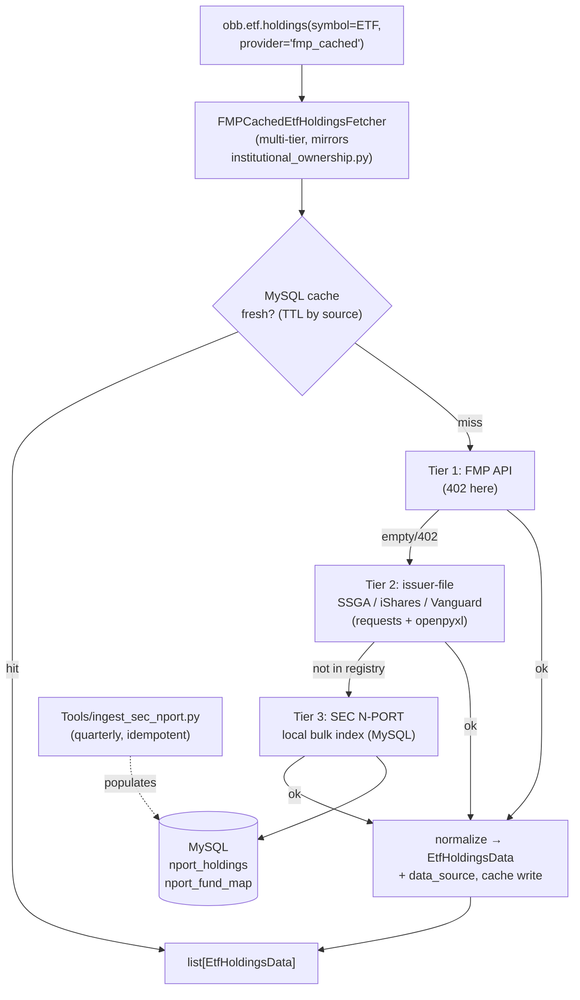

# ETF holdings — free fallback tier (issuer-file + SEC N-PORT)

**GitHub:** _(proposed — not yet filed)_ · **Beads:** `OpenBBTechnical-f6j` · **Phase:** Provider infra · **Sprint:** TBD · **Size:** L
**Depends on:** none (self-contained provider work). Optionally reuses the
`openbb_fmp_cached.utils.database` helpers and the OpenFIGI CUSIP resolver from #93.
**Related:** the `fmp_cached` → `obb.etf.holdings` path consumed by techtrade's
segment-universe resolver
([`engine/universe.py`](../../../openbb_platform/extensions/techtrade/openbb_techtrade/engine/universe.py))
and surfaced by Cell 4.3 (`obb.techtrade.scan`) in
[`notebooks/01-foundations-techtrade-and-analysis.ipynb`](../../../notebooks/01-foundations-techtrade-and-analysis.ipynb).
**Source:** no PRD — this design doc is the primary artifact. Problem statement in
§"What this is".
**Scope:** Add a **free, multi-tier fallback** to the `fmp_cached` `etf_holdings`
fetcher so `obb.etf.holdings(symbol=…, provider="fmp_cached")` returns real
constituents when the FMP `EtfHoldings` endpoint is restricted (`402`). Two new
free tiers: an **issuer-file tier** (State Street / iShares / Vanguard daily
holdings files — covers the 11 SPDR sector ETFs techtrade uses, daily-fresh) and a
**SEC N-PORT bulk-index tier** (universal coverage for any registered fund,
quarterly, ingested once like the #89 13F datasets).

> **Repo note:** provider code lives in this `OpenBBTechnical` checkout. Affected
> providers: [`providers/fmp_cached/`](../../../openbb_platform/providers/fmp_cached/)
> (converts its thin `etf_holdings` cache wrapper into a fallback fetcher) and
> [`providers/sec/`](../../../openbb_platform/providers/sec/) (new N-PORT read/index
> helpers). This design doc lives under `docs/designs/etf_holdings/`, one doc per
> feature, mirroring the `ownership_13f/` precedent.

---

## What this is

`obb.etf.holdings(symbol="XLK", provider="fmp_cached")` resolves to
[`FMPCachedEtfHoldingsFetcher`](../../../openbb_platform/providers/fmp_cached/openbb_fmp_cached/models/etf_holdings.py),
which today is a **thin read-through cache** over `FMPEtfHoldingsFetcher` — a single
live source. On the active FMP plan that endpoint returns:

```
402 Restricted Endpoint: This endpoint is not available under your current subscription  (EtfHoldings)
```

**The downstream symptom.** techtrade's `obb.techtrade.scan` resolves each of the
11 GICS sectors to a symbol universe by expanding the sector's SPDR ETF
(`XLK`, `XLF`, …) via `obb.etf.holdings`
([`_default_holdings_fetcher`](../../../openbb_platform/extensions/techtrade/openbb_techtrade/engine/universe.py)).
When every one of those 11 calls `402`s, `_resolve_filter_universe`
([`engine/movers.py`](../../../openbb_platform/extensions/techtrade/openbb_techtrade/engine/movers.py))
silently degrades to **no universe filter**, so every sector falls back to the same
market-wide discovery feed and the scan returns degenerate, identical rows (the
repeated `EURKR` symptom). The scan needs a *working* holdings source to be
trustworthy on this subscription.

**The principle (same as #89):** *the authoritative free sources cost volume, not
access.* Fund issuers publish their full holdings daily for free, and the SEC
publishes every registered fund's monthly portfolio via Form N-PORT. We add those
as fallback tiers behind the existing FMP primary, normalize them to the standard
`EtfHoldingsData` schema, and cache the result — so `fmp_cached` stays the single
consumer and only its fallback chain changes.

---

## Research — free sources surveyed

| Source | Access | Coverage | Freshness | Cost / shape | Verdict |
|---|---|---|---|---|---|
| **FMP `EtfHoldings`** | API key | US ETFs | daily | **402 on this plan** | current primary — keep, but unusable here |
| **Intrinio `EtfHoldings`** (in-tree) | **paid key** | US ETFs | daily | separate paid sub | rejected — adds a paid credential |
| **TMX `EtfHoldings`** (in-tree) | free, no key | **Canada-listed only** | daily | no XLK/XLF/etc. | rejected — wrong market |
| **Alpha Vantage `ETF_PROFILE`** | free key | US ETFs | daily | 25 req/day free cap | rejected — new credential + tiny quota |
| **Issuer daily files** (SSGA / iShares / Vanguard) | **free, no key** | the issuer's own funds | **daily** | HTTP `.xlsx`/`.csv`, bespoke parse per issuer | **PRIMARY free tier** — SSGA covers all 11 SPDR sector ETFs |
| **SEC Form N-PORT bulk data sets** | **free, no key** | **any registered fund** (ETF/MF/UIT) | monthly holdings, **quarterly release, ~60-day lag** | ~400 MB ZIP/quarter, structured tables | **UNIVERSAL fallback tier** — bulk-ingest once, like #89 |
| Community GitHub scrapers | free | varies | varies | unmaintained, ToS-fragile | rejected as a dependency; useful only as parsing references |

**Why these two, in this order.**
- The 11 GICS sector ETFs techtrade uses
  ([`GICS_SECTOR_ETFS`](../../../openbb_platform/extensions/techtrade/openbb_techtrade/engine/screener.py):
  `XLK XLF XLE XLV XLY XLP XLI XLB XLRE XLU XLC`) are **all State Street SPDR
  funds**. State Street publishes each fund's full holdings as a free daily file —
  an exact, daily-fresh, no-key match for the primary use case.
- SEC **N-PORT** is the universal safety net: any registered fund not in the issuer
  registry (arbitrary ETFs a user passes) is still resolvable, at the cost of a
  ~60-day-stale quarterly snapshot. Confirmed live: quarterly ZIP data sets
  2019-Q4 → present, documented by the SEC N-PORT readme.

> **Authentic-source rule.** Both tiers are first-party: the issuer's own published
> holdings, and the regulator's own structured filing. No third-party aggregator is
> required for either free tier.

---

## 0. Key decisions + Open questions

### Locked (do not re-open)

| # | Decision | Choice | Consequence |
|---|---|---|---|
| L1 | Where the fallback lives | Inside `fmp_cached`'s `etf_holdings` fetcher only | techtrade and every other `obb.etf.holdings(provider="fmp_cached")` caller benefits with zero changes |
| L2 | Output schema | Normalize **every** tier to the standard `EtfHoldingsData` | callers see one shape regardless of source; `data_source` records provenance |
| L3 | Fallback order | cache → FMP API → **issuer-file** → **SEC N-PORT index** | cheapest/fresh first; universal-but-stale last |
| L4 | HTTP client | `requests` only | `aiohttp` is broken on Windows Py 3.12 (repo rule) |
| L5 | N-PORT delivery | **bulk-ingest once per quarter** into MySQL, read from the index | mirrors #89; live per-request EDGAR parsing is too slow/rate-limited |
| L6 | Issuer registry | a small `ETF → issuer-file URL + parser` table, seeded with the 11 SPDRs | extensible to iShares/Vanguard without touching the fetcher |
| L7 | DB | reuse `openbb_fmp_cached.utils.database` (`get_connection`, `execute_*`, `init_database`) | same connection/runtime as #89; N-PORT tables `CREATE TABLE IF NOT EXISTS` |
| L8 | Caching | persist normalized rows in an `etf_holdings` cache table; TTL by source (issuer 1d, N-PORT 30d) | warm reads are instant; the scan's 402 storm disappears |
| L9 | No emoji, `logging` not `print`, type hints, idempotent ingest | per `DEVELOPMENT_RULES.md` | house style |

### Open questions (resolve during the spike task, T1)

> **Status (2026-06-27, T1 spike):** Q1 fully resolved against live SSGA. Q2/Q4 deferred — N-PORT bulk-dataset URL is not at the assumed path (probes 404; SEC docs page 403s scrapers), so the N-PORT half (T2+T3) is parked as a follow-up bead and the v1 ship is **SSGA-only** (which alone closes the EURKR symptom — all 11 GICS sector ETFs are State Street). Q3 unchanged: techtrade only needs `symbol`; weight/shares/CUSIP populated, value/ISIN may be None depending on the issuer file.

| # | Question | Default if unanswered |
|---|---|---|
| Q1 | Exact live SSGA holdings-file URL + sheet layout (header row, column names, cash/`-` rows) | use the documented `holdings-daily-us-en-<ticker>.xlsx` pattern; parse with `openpyxl`, skip metadata rows |
| Q2 | N-PORT ticker→fund resolution: the bulk tables key on fund **CIK/series**, not the ETF ticker | seed an `ETF ticker → series/CIK` map (11 SPDRs) + fall back to EDGAR `company_tickers` |
| Q3 | Do we need ISIN/CUSIP per holding, or just `symbol`+`weight`+`shares` for techtrade? | techtrade only needs `symbol`; populate `cusip`/`weight`/`value` when present, else `None` |
| Q4 | Issuer-file ToS / rate limits | one fetch per ETF per day, polite UA, cache aggressively; document in `Tools/docs` |

### 0.4 Resolved (post-spike T1, 2026-06-27)

**Q1 — SSGA URL + workbook layout (live-confirmed against XLK).**

URL template (all 11 GICS sector SPDRs follow this exact pattern):
```
https://www.ssga.com/us/en/intermediary/library-content/products/fund-data/etfs/us/holdings-daily-us-en-<ticker_lower>.xlsx
```

Workbook layout for `xlk`:
- Sheet name: **`holdings`** (the only sheet; `wb.active` works)
- Metadata rows: index 0–3 (Fund Name, Ticker Symbol, Holdings/As-of date, blank)
- **Header row: index 4**, columns in this exact order:
  `Name | Ticker | Identifier | SEDOL | Weight | Sector | Shares Held | Local Currency`
- Data rows: index 5 onward
- `Identifier` is the **9-char CUSIP** (e.g. `67066G104` for NVDA)
- `Weight` is a **percentage as decimal** (e.g. `14.79788` = 14.8% — divide by 100 for fraction)
- `Shares Held` is a float (integer-valued share counts but stored as float)
- `Sector` is often `-` (the fund's own sector is uniform; not useful per-holding)
- No `Market Value` column ships in the SSGA file (techtrade doesn't need it)
- In the XLK fixture there were no `USD CASH` rows, but the parser must still handle that case in case other SPDRs include cash sleeves

**Q2 — N-PORT URL discovery: DEFERRED.**
The bulk-dataset URL is not at any of the patterns tried (404 with proper UA; SEC docs page returns 403 to scrapers). Follow-up bead deferred until URL is hand-confirmed. v1 ships SSGA-only.

**Q3 — Field scope: confirmed minimal.**
techtrade only consumes `symbol`. The parser populates symbol + name + weight (as fraction) + shares + cusip (from `Identifier`). value/ISIN remain `None` in v1 (SSGA file doesn't carry them; techtrade doesn't need them).

**Q4 — Issuer-file ToS: no explicit rate limit on the SSGA URLs.**
Public daily holdings files; one fetch per ETF per day per UA is well within polite use. Cache TTL of 1 day (L8) makes a re-fetch at most once daily.

---

## Architecture



Two independently shippable halves, exactly like #89:

1. **Read/fallback half** (`fmp_cached` + `sec` read helpers) — usable immediately
   via the issuer-file tier; the N-PORT tier returns empty until the index is
   populated (graceful, never raises).
2. **Ingest half** (`Tools/ingest_sec_nport.py` + `openbb_sec/utils/nport_index.py`
   write helpers) — the once-per-quarter bulk loader.

---

## Data model & normalization

Target: the standard
[`EtfHoldingsData`](../../../openbb_platform/core/openbb_core/provider/standard_models/etf_holdings.py)
(superset used by FMP):

| Field | Issuer-file source | N-PORT source | Required for techtrade |
|---|---|---|---|
| `symbol` | ticker column | `ticker`/derived from CUSIP↔FIGI | **yes** |
| `name` | security name | `name`/`title` | no |
| `weight` | weight % (→ normalized fraction) | `pctVal` | no |
| `shares` | shares/units column | `balance` (when units) | no |
| `value` | market value | `valUSD` | no |
| `cusip` | CUSIP column if present | `cusip` | no |
| `isin` | ISIN if present | `isin` | no |
| `data_source` | `"issuer_ssga"` / `"issuer_ishares"` / … | `"sec_nport"` | provenance |

A row missing everything but `symbol` is still valid (techtrade only consumes
`symbol`). `transform_data` validates each dict against `EtfHoldingsData` and skips
non-conforming rows (same tolerance pattern as `institutional_ownership.py`).

### N-PORT MySQL schema (single source of truth — DDL `IF NOT EXISTS`)

```sql
-- fund identity: ETF ticker  <->  N-PORT fund (CIK + series)
CREATE TABLE IF NOT EXISTS nport_fund_map (
    ticker      VARCHAR(16)  NOT NULL,
    cik         VARCHAR(16)  NOT NULL,
    series_id   VARCHAR(16)  NULL,
    fund_name   VARCHAR(255) NULL,
    source      VARCHAR(32)  NOT NULL,
    updated_at  DATETIME     NOT NULL,
    PRIMARY KEY (ticker),
    KEY idx_cik (cik)
) ENGINE=InnoDB DEFAULT CHARSET=utf8mb4;

-- one row per (fund, period, holding)
CREATE TABLE IF NOT EXISTS nport_holdings (
    cik          VARCHAR(16)  NOT NULL,
    period       CHAR(7)      NOT NULL,        -- 'YYYY-Qn' (report quarter)
    holding_name VARCHAR(255) NULL,
    holding_sym  VARCHAR(32)  NULL,
    cusip        CHAR(9)      NULL,
    isin         VARCHAR(12)  NULL,
    pct_val      DECIMAL(12,8) NULL,
    val_usd      DECIMAL(20,2) NULL,
    balance      DECIMAL(24,4) NULL,
    PRIMARY KEY (cik, period, holding_name),
    KEY idx_cik_period (cik, period)
) ENGINE=InnoDB DEFAULT CHARSET=utf8mb4;
```

Persistence strategy: `INSERT … ON DUPLICATE KEY UPDATE` keyed on the documented PKs
(idempotent re-ingest). Lookup/identity rows use `INSERT IGNORE`. (Per `DEVELOPMENT_RULES.md` §persistence-by-shape.)

---

## File structure

**Create**
- `openbb_platform/providers/sec/openbb_sec/utils/nport_index.py` — schema DDL +
  `init_nport_index()`, read helpers `fund_for_ticker(ticker)` /
  `holdings_for_fund(cik, period=None)`, and write helpers
  `upsert_fund_map` / `upsert_holdings` / `record_ingest_run` (write half imported
  by the ingest script — never carries its own DDL).
- `openbb_platform/providers/fmp_cached/openbb_fmp_cached/models/etf_holdings_issuer.py` —
  the issuer-file tier: `ISSUER_REGISTRY` (`ETF → (url, parser)`), a `requests`
  fetch + `openpyxl`/`csv` parse, normalize to `EtfHoldingsData` dicts. Seeded with
  the 11 SPDR sector ETFs (State Street).
- `Tools/ingest_sec_nport.py` — quarterly bulk loader (download ZIP → stream-parse →
  `upsert_*`). Follows the `Tools/` script skeleton (§4 `DEVELOPMENT_RULES.md`),
  idempotent, `requests`, UTF-8 stdout.
- Tests:
  `openbb_platform/providers/fmp_cached/tests/test_etf_holdings_fallback.py`,
  `openbb_platform/providers/sec/tests/test_nport_index.py`.

**Modify**
- `openbb_platform/providers/fmp_cached/openbb_fmp_cached/models/etf_holdings.py` —
  replace the thin `create_cached_fetcher_class(...)` wrapper with a custom
  `FMPCachedEtfHoldingsFetcher` subclass implementing the cache → FMP → issuer →
  N-PORT chain (structure copied from `institutional_ownership.py`:
  `aextract_data`, `_get_cached_*`, `_store_*`, `_try_fmp`, `_try_issuer`,
  `_try_nport`, `transform_data`).
- `Tools/docs/DESIGN.md` — add the `nport_*` table schemas + a changelog entry
  (repo rule: one entry per `Tools/`-modifying session).

**Unchanged (consumes for free):** techtrade `engine/universe.py` — it already calls
`obb.etf.holdings(provider="fmp_cached")`, so it picks up the fallback with no edit.

---

## Tasks (TDD, bite-sized, checkbox)

> **For agentic workers:** use `superpowers:subagent-driven-development` or
> `superpowers:executing-plans`. Each task ends with an independently testable
> deliverable and a commit. `bd update OpenBBTechnical-f6j --claim` before starting;
> file sub-beads for any discovered work.

### Task 1 — Spike: confirm the two live sources (no production code)
- [ ] Fetch one SSGA holdings file (`XLK`) with `requests`; record the working URL,
      sheet name, header row, and column names. Resolve Q1.
- [ ] Download one small slice of a recent N-PORT quarter ZIP; identify the holdings
      table file(s) and the fund-identity columns. Resolve Q2.
- [ ] Write findings into this doc's §"Open questions" as resolved. Commit doc only.

### Task 2 — N-PORT index schema + read helpers (`nport_index.py`)
- [ ] Write failing tests: `init_nport_index()` creates both tables; `fund_for_ticker`
      / `holdings_for_fund` return `[]`/`None` on an empty DB (graceful).
- [ ] Implement DDL + `init_nport_index` + read helpers (lazy `fmp_cached.database`
      import, mirror `thirteen_f_index.py`). Run tests green. Commit.

### Task 3 — N-PORT write helpers + ingest script (`Tools/ingest_sec_nport.py`)
- [ ] Failing tests for `upsert_fund_map` / `upsert_holdings` idempotency (run-twice =
      same row count) against a mocked/`execute_*` seam.
- [ ] Implement write helpers + the ingest script (download → parse → upsert), seeded
      `ETF→series/CIK` map for the 11 SPDRs. Idempotent, `requests`, UTF-8. Green. Commit.

### Task 4 — Issuer-file tier (`etf_holdings_issuer.py`)
- [ ] Failing tests with a **fixture** SSGA workbook: `fetch_issuer_holdings("XLK")`
      returns normalized `EtfHoldingsData` dicts; unknown ticker → `[]`; cash/`-`
      rows dropped; `requests.get` patched (no live network in unit tests).
- [ ] Implement `ISSUER_REGISTRY` (11 SPDRs) + fetch/parse/normalize. Green. Commit.

### Task 5 — Wire the fallback chain into `FMPCachedEtfHoldingsFetcher`
- [ ] Failing tests: with FMP patched to raise `402`, the fetcher returns issuer-file
      rows for `XLK`; with issuer empty, it returns N-PORT rows; with all empty, `[]`
      (never raises). Cache write/read round-trips; `data_source` set per tier.
- [ ] Replace the wrapper with the subclass implementing
      cache → FMP → issuer → N-PORT + `_store`/`transform_data`. Green. Commit.

### Task 6 — Rebuild + integration + notebook demo
- [ ] `python -c "import openbb; openbb.build()"`; run an integration test (or guarded
      live call) that `obb.etf.holdings(symbol="XLK", provider="fmp_cached")` returns a
      non-empty, schema-valid list with `data_source != "fmp"`.
- [ ] Re-run Cell 4.3 and confirm the scan no longer degenerates (distinct movers per
      sector, no 402 storm). Add a short notebook note crediting the new tier. Commit.

### Task 7 — Docs
- [ ] Update `Tools/docs/DESIGN.md` (schema + changelog). Update this design doc's
      status to "implemented". Close `OpenBBTechnical-f6j` (or its child beads).

---

## Testing strategy

- **Unit (no network):** patch `requests.get`; ship a tiny fixture SSGA workbook and a
  fixture N-PORT row set. Cover: 402→issuer fallthrough, issuer→N-PORT fallthrough,
  empty-everything → `[]`, cash-row filtering, schema normalization, cache hit/miss,
  ingest idempotency. Markers per `pytest.ini` (`not integration`).
- **Integration (`-m integration`, Windows-friendly):** one live SSGA fetch for `XLK`
  and (if the index is populated) one N-PORT read; assert schema-valid, non-empty.
- **Regression:** a techtrade scan test asserting distinct per-sector universes when
  the issuer tier is available (guards against the EURKR degeneration returning).

---

## Risks & mitigations

| Risk | Mitigation |
|---|---|
| Issuer changes its file URL/layout | Registry isolates URL+parser per issuer; spike (T1) pins current layout; parser fails soft → next tier |
| Issuer ToS / rate limiting | One fetch per ETF per day, cached (L8), polite UA; documented in `Tools/docs` |
| N-PORT ticker→fund mapping is incomplete | Seed the 11 SPDRs; arbitrary tickers degrade to `[]` (graceful), never raise |
| N-PORT 60-day staleness misleads users | `data_source="sec_nport"` + period recorded; surface as-of in the cache row |
| 400 MB quarterly ZIPs | Stream-parse, never load whole ZIP in memory; ingest is an offline `Tools/` job, not in the request path |
| `aiohttp` on Windows | `requests` only (L4) |

---

## Why this is the right shape

It is the **same proven pattern as #89**: an authoritative, free, high-volume source
(SEC) bulk-ingested once into a local index, fronted by a fast read tier, plus a
lighter daily issuer source for the common case — all hidden behind the existing
`fmp_cached` fallback contract so the only consumer change is *"it now returns data."*
techtrade's scan, the notebook, and any other `obb.etf.holdings` caller get a working,
no-key, no-paid-plan ETF-holdings source for free.
