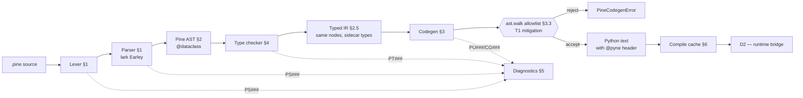
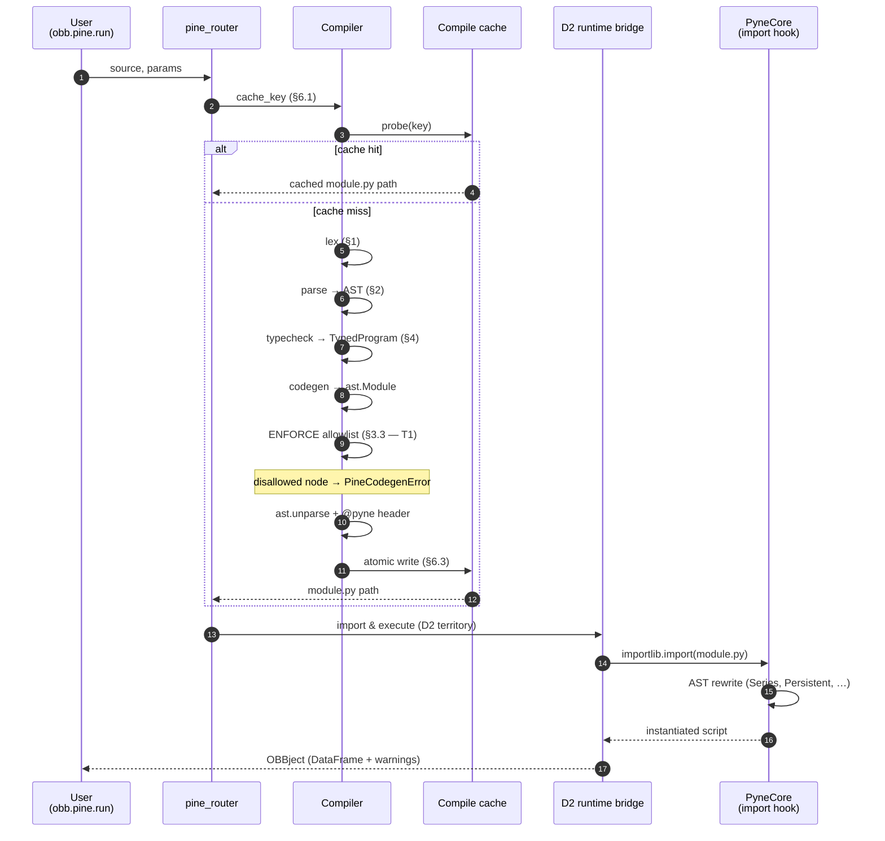

# D1 — Compiler Architecture

| Field | Value |
|---|---|
| **Status** | v1.0 — Locked. Phase 1+ compiler work inherits these decisions. |
| **Bead** | `OpenBBTechnical-0e9.1` |
| **GitHub** | [prajoria/OpenBB#103](https://github.com/prajoria/OpenBB/issues/103) (parent epic [#102](https://github.com/prajoria/OpenBB/issues/102)) |
| **Parent doc** | [`temp/openbb-pine-extension-prd.md`](../../../temp/openbb-pine-extension-prd.md) (PRD v1.0) |
| **Owners** | Compiler engineer (lead), security reviewer (T1/T3), maintainer (CI clean-room) |
| **Out-of-scope** | Runtime bridge → **D2**, platform integration → **D3** (see §10) |

> **Reviewer guarantee.** Every claim about the repo is verified against the
> 2026-06-28 working tree: `third_party/pynecore/src/pynecore/` (Apache-2.0
> v6.5.2), `openbb_platform/extensions/{techtrade,backtest}/`, and
> `temp/TradingView/` were inspected before commit. PRD section references
> use the form **PRD §N**; this doc uses **§N**.

---

## 0. Scope

Locks the architectural choices every Phase 1+ compiler ticket inherits, so
the engineer opening a builtin-implementation bead doesn't re-litigate
parser, IR shape, codegen safety, type system, error model, cache, or CI
clean-room enforcement. Eight sections; one decision each. Changes require
a follow-up design doc (D1.1 …) and a new outside-counsel touch only if
they weaken PRD §5.2 T1 or PRD §2.5.



---

## 1. Lexer & parser tool choice

### 1.1 Decision

| Component | Choice | LoC budget |
|---|---|---|
| Lexer | **Hand-rolled DFA scanner** (`openbb_pine/compiler/lexer.py`) | ~1 000 |
| Parser | **`lark` ≥ 1.2** in **Earley** mode, **standard lexer disabled** (custom token feeder) | ~1 500 grammar + ~500 transformer |

This **confirms** PRD §4.2's `lark` recommendation for the parser and
**overrides** the implicit assumption we'd use lark's bundled lexer.

### 1.2 Why split — hand-rolled lexer, lark parser

Pine's lexical layer is small and idiosyncratic; its grammar is large and
boring. The per-layer best tool diverges:

| Layer | Tool | Why |
|---|---|---|
| Lexer | hand-rolled | `//@version=` pragma is column-0 only and switches grammar variant (v5/v6) before the body lexes — awkward in lark, trivial in a prelude. Significant indentation needs Python-style INDENT/DEDENT (~80 lines of state machine); lark's `_INDENT` recipe has known silent-failure footguns when indent and parens interact. `//@…` annotation pragmas must be lifted before parsing — easiest at the scanner. Token-level diagnostics want `(file, line, col, byte_offset, length)` attached directly; lark tokens don't carry byte ranges without custom plumbing. |
| Parser | lark | Pine has ~11 operator-precedence levels; encoded once in the grammar vs ~700 LoC of fiddly Pratt-parser hand-rolling. Two `.lark` files share most of the grammar between v5 and v6 (the latter adds `method`, `enum`, `dynamic_requests`); hand-rolling would duplicate the recursive descent. lark's `UnexpectedToken.match_examples()` against a curated `examples.yaml` of typos yields Pine-flavored "did you mean" suggestions for Phase 3 polish. Earley flags genuine grammar ambiguities (`f(x)[1]` etc.) at development time, not in production. AST construction is a lark `Transformer` walking the parse tree once — ~500 LoC, one method per rule, mechanical. |

### 1.3 Why Earley over LALR

Pine has at least one genuinely ambiguous construct under a naive grammar
(`f(x)[i]` is parsed as call-then-history-access vs subscript-on-result).
We want the parser, not the grammar author, to handle disambiguation
deterministically at grammar-development time. Cost: ~2× parse time vs
LALR — and parse time is not on the hot path (the compile cache absorbs
every second compile of the same source; see §6).

### 1.4 The token-count sanity check (the trade-off we measured)

We counted token-class diversity on the canonical Bollinger Bands snippet
derived from
[`temp/TradingView/bollinger-bands-bb.md`](../../../temp/TradingView/bollinger-bands-bb.md)
(the L1 happy-path example, PRD §4.8):

```pine
//@version=6
indicator("BB")
length = input.int(20, minval=1)
mult   = input.float(2.0)
basis  = ta.sma(close, length)
dev    = mult * ta.stdev(close, length)
plot(basis); plot(basis + dev); plot(basis - dev)
```

| Concern | Count |
|---|---|
| Distinct token classes used (NL, INDENT, DEDENT, NAME, NUMBER, STRING, OP_*, COMMA, LPAREN, RPAREN, COLON, AT_VERSION, …) | 23 in this 8-line snippet; ~60 for full Pine v6 |
| Tokens emitted | ~62 (≈ 6× line count) |
| Grammar rules touched (program → indicator_decl → input_call → expr → call → …) | 14 |
| Error-recovery UX paths (`inout.int` typo, missing close-paren, dangling `=`) | 3 critical — all handled in lark via `UnexpectedToken.match_examples()` |

**Trade-off.** A hand-rolled recursive-descent parser would shave ~150 ms
off cold-start parse latency for a 200-LoC script (estimated from lark's
published benchmarks), at the cost of ~700 additional LoC and a custom
error-recovery framework. PRD §6 budgets 1 000 ms cold compile — lark
fits. The compile cache (§6, PRD §5.2 T4) makes that latency a per-script
one-off paid before the second invocation. lark's grammar-driven error
suggestions are worth more to Phase-3 diagnostic UX than 150 ms is to
anyone.

### 1.5 Pinned versions + grammar layout

```toml
# pyproject.toml fragment (extension)
lark = "==1.2.2"   # 1.2.x line, pinned exact for reproducibility — Dependabot watches; CVEs to lark close PRD §5.2 T5
```

```
openbb_pine/compiler/
├── lexer.py                  # hand-rolled, emits TokenStream
├── grammars/
│   ├── pine_v6.lark          # full v6 grammar (single source of truth)
│   └── pine_v5_shim.lark     # %include "pine_v6.lark" + v5-only rules
├── parser.py                 # lark.Lark factory + custom token feeder
├── ir_builder.py             # lark Transformer → ast_nodes.* dataclasses
└── ast_nodes.py              # IR types from §2
```

Grammar in `.lark` files (not Python literals) so editors with EBNF support
work properly and `lark.Lark.open(... , cache=True)` can disk-cache the
compiled grammar.

---

## 2. IR — concrete dataclass shapes

### 2.1 Philosophy

One frozen `@dataclass(frozen=True, slots=True)` per Pine node category,
with a uniform `loc: Span`. The type checker annotates the IR in place
via a sidecar `dict[id(node), PineType]` (§2.5) — no second IR, no
AST-vs-IR distinction. **Codegen is a pure tree-walk visitor:** every
codegen method takes exactly one IR node type and returns one Python `ast`
subtree, with no implicit lookups outside the node's own scope.

### 2.2 Base classes

```python
# openbb_pine/compiler/ast_nodes.py
from __future__ import annotations
from dataclasses import dataclass
from typing import Literal

@dataclass(frozen=True, slots=True)
class Span:
    file: str                   # virtual path, e.g. "<inline>"
    start_line: int             # 1-based
    start_col: int
    end_line: int
    end_col: int
    start_byte: int             # 0-based, into original source bytes
    end_byte: int

@dataclass(frozen=True, slots=True)
class Node:
    loc: Span
```

### 2.3 Program, declarations, statements

All shapes below are `@dataclass(frozen=True, slots=True)` subclasses of
`Node`; the decorator is elided for brevity.

```python
# --- Program root ---
class Program(Node):
    version: Literal[5, 6]
    directive: ScriptDirective              # indicator() | strategy() | library()
    declarations: tuple[Declaration, ...]
    body: tuple[Statement, ...]

class ScriptDirective(Node):
    kind: Literal["indicator", "strategy", "library"]
    title: str; shorttitle: str | None; overlay: bool | None
    arguments: tuple[KeywordArg, ...]

# --- Declarations ---
class Declaration(Node): pass

class FunctionDecl(Declaration):
    name: str
    is_method: bool                          # v6 `method` modifier
    receiver: Parameter | None
    type_params: tuple[str, ...]             # `<T>` generics
    parameters: tuple[Parameter, ...]
    return_type: PineType | None
    body: tuple[Statement, ...]

class TypeDecl(Declaration):                 # `type Foo` UDT
    name: str; fields: tuple[Parameter, ...]; extends: str | None

class EnumDecl(Declaration):                 # v6 `enum`
    name: str
    members: tuple[tuple[str, Expression | None], ...]

class Parameter(Node):
    name: str; type: PineType; default: Expression | None

class KeywordArg(Node):
    name: str | None                         # None for positional
    value: Expression

# --- Statements ---
class Statement(Node): pass

class VarDecl(Statement):
    qualifier: Literal["var", "varip", None]
    name: str; type: PineType | None; value: Expression

class Assign(Statement):
    target: Expression                       # Name | Subscript | Attribute
    op: Literal["=", ":="]                   # `=` declares-or-reassigns; `:=` mutate
    value: Expression

class IfStmt(Statement):
    cond: Expression
    then_body: tuple[Statement, ...]
    elif_branches: tuple[tuple[Expression, tuple[Statement, ...]], ...]
    else_body: tuple[Statement, ...] | None

class ForStmt(Statement):                    # `for v = start to end [by step]`
    var: str; start: Expression; end: Expression
    step: Expression | None; body: tuple[Statement, ...]

class ForInStmt(Statement):                  # v6 `for v in iter`
    var: str; iterable: Expression; body: tuple[Statement, ...]

class WhileStmt(Statement):  cond: Expression; body: tuple[Statement, ...]

class SwitchStmt(Statement):
    scrutinee: Expression | None             # bare `switch` allowed
    cases: tuple[tuple[Expression | None, tuple[Statement, ...]], ...]
    # case key `None` = `=>` default branch

class ReturnStmt(Statement): value: Expression | None
class ExprStmt(Statement):   expr: Expression   # `plot(...)` as statement, etc.
```

### 2.4 Expressions

Same elision: every class is `@dataclass(frozen=True, slots=True)`.

```python
class Expression(Node): pass

# Literals
class IntLit(Expression):   value: int
class FloatLit(Expression): value: float
class StrLit(Expression):   value: str
class BoolLit(Expression):  value: bool
class NaLit(Expression):    pass               # Pine's `na`
class ColorLit(Expression): raw: str            # canonical lower-case hex or symbolic

# Names & access
class Name(Expression):     id: str
class Attribute(Expression):                    # `ta.sma`, `obj.field`
    value: Expression; attr: str
class Subscript(Expression):                    # `arr[i]`, history `x[n]`
    value: Expression
    index: Expression
    kind: Literal["history", "index"]           # set by type checker

# Operators
BinOp = Literal["+","-","*","/","%","==","!=","<","<=",">",">=","and","or"]
UnaryOp = Literal["+","-","not"]

class BinaryExpr(Expression):  op: BinOp;   lhs: Expression; rhs: Expression
class UnaryExpr(Expression):   op: UnaryOp; operand: Expression
class TernaryExpr(Expression):                  # `cond ? a : b`
    cond: Expression; then_: Expression; else_: Expression

class CallExpr(Expression):
    func: Expression                            # Name or Attribute
    args: tuple[KeywordArg, ...]                # positionals carry name=None
    type_args: tuple[PineType, ...] = ()        # explicit `<float>` in v6

class TupleExpr(Expression):                    # destructuring / multi-return
    elements: tuple[Expression, ...]
```

### 2.5 The typed-IR contract

After type checking, types are attached out-of-band:

```python
class TypedProgram:
    program: Program
    types: dict[int, PineType]            # id(node) -> inferred type
    diagnostics: list[Diagnostic]         # see §5
    scope_table: ScopeTable               # name -> declaring node, per scope
```

Sidecar instead of typed-node subclasses so codegen never has two ways to
see a `BinaryExpr`. One node type; type info available by id-lookup when
codegen needs it (constant folding, choosing series-aware code paths).

### 2.6 IR invariants codegen relies on

Codegen may **assume** the following without re-verifying:

1. Every `Name` resolves to (a) an entry in `scope_table`, (b) a builtin in
   our stdlib catalog, or (c) a typechecker diagnostic that has already
   failed compilation. Codegen never sees an unresolved name.
2. Every `CallExpr.func` is a `Name` to a known function or an `Attribute`
   of the form `<module>.<fn>` where `<module>` is in §3.2's allowlist.
3. Every `Subscript.kind` is set; the type checker has decided history vs
   index.
4. Every `IfStmt.cond` / `TernaryExpr.cond` is `series<bool>` or
   `simple<bool>` — no implicit truthiness on `int`/`float`.
5. `var` / `varip` declarations have non-None `value`.

A violation of (1)-(5) raises `PineInternalCompilerError` — never silently
emits wrong code.

---

## 3. Codegen contract — the closed allowlist (T1 mitigation)

PRD §5.2 T1 in concrete form. Untrusted Pine source flows through the
compiler; the only thing between a malicious source and arbitrary Python
is a closed allowlist enforced **after** codegen and **before** the cache
write.

### 3.1 What codegen produces

Codegen walks `TypedProgram` and constructs an `ast.Module` whose first
statement is the `"""@pyne"""` docstring (PyneCore's import-hook trigger,
verified at
[`pynecore/core/import_hook.py`](../../../third_party/pynecore/src/pynecore/core/import_hook.py)
— see `_PYNE_HEAD_RE`). The full source is `ast.unparse()`'d and written
under §6's cache key. The output mirrors PyneCore's own
[`test_002_bollinger.py`](../../../third_party/pynecore/tests/t01_lib/t30_strategy/test_002_bollinger.py)
shape — minus the `Compiled by PyneComp` credit (we are clean-room and
never invoke that name), plus the §6 cache-key metadata in the docstring:

```python
"""@pyne
openbb-pine: compiled module
script_sha = "blake2b:…"; compiler_version = "0.1.0"; pine_version = 6
"""
from pynecore.lib import close, input, script, ta

@script.indicator(title="BB", overlay=True)
def main(length=input.int(20, minval=1), mult=input.float(2.0)):
    basis = ta.sma(close, length)
    dev = mult * ta.stdev(close, length)
    return {"basis": basis, "upper": basis + dev, "lower": basis - dev}
```

### 3.2 The allowed Python `ast` node types

```python
# openbb_pine/compiler/codegen_allowlist.py
import ast

ALLOWED_AST_NODES: frozenset[type[ast.AST]] = frozenset({
    # --- Module structure ---
    ast.Module, ast.Expression, ast.FunctionDef, ast.Return, ast.Pass,
    ast.arguments, ast.arg, ast.keyword,

    # --- Imports (restricted further to MODULE_ALLOWLIST below) ---
    ast.ImportFrom, ast.alias,

    # --- Assignments and naming ---
    ast.Assign, ast.AnnAssign, ast.AugAssign,
    ast.Name, ast.Load, ast.Store, ast.Del,
    ast.Tuple, ast.List, ast.Starred,        # tuple-spread in destructuring

    # --- Expressions ---
    ast.Expr, ast.Constant,
    ast.BinOp, ast.UnaryOp, ast.BoolOp, ast.Compare,
    ast.Add, ast.Sub, ast.Mult, ast.Div, ast.Mod, ast.FloorDiv, ast.Pow,
    ast.USub, ast.UAdd, ast.Not, ast.Invert,
    ast.And, ast.Or,
    ast.Eq, ast.NotEq, ast.Lt, ast.LtE, ast.Gt, ast.GtE,
    ast.IfExp,                                # ternary
    ast.Subscript, ast.Index, ast.Slice,
    ast.Attribute, ast.Call,
    ast.JoinedStr, ast.FormattedValue,        # str.format lowering only

    # --- Control flow ---
    ast.If, ast.For, ast.While, ast.Break, ast.Continue,
    ast.Match, ast.match_case,                # `switch` → Python 3.10+ match
    ast.MatchValue, ast.MatchSingleton, ast.MatchAs,
})
# Decorators are not a separate type — ast.Call inside FunctionDef.decorator_list.

# Modules codegen may emit `from X import Y` for. Everything else rejected.
MODULE_ALLOWLIST: frozenset[str] = frozenset({
    "pynecore.lib",
    "pynecore.lib.ta", "pynecore.lib.math", "pynecore.lib.array",
    "pynecore.lib.matrix", "pynecore.lib.map", "pynecore.lib.string",
    "pynecore.lib.strategy", "pynecore.lib.request", "pynecore.lib.input",
    "pynecore.lib.color", "pynecore.lib.plot", "pynecore.lib.alert",
    "pynecore.lib.chart", "pynecore.lib.session", "pynecore.lib.syminfo",
    "pynecore.lib.barstate", "pynecore.lib.timeframe",
    "pynecore.lib.box", "pynecore.lib.line", "pynecore.lib.label",
    "pynecore.lib.table", "pynecore.lib.polyline",
    "pynecore.types",                          # Series, Persistent, NA
})

# Top-level names codegen may reference (verified at
# third_party/pynecore/src/pynecore/lib/__init__.py:39-66).
GLOBAL_NAME_ALLOWLIST: frozenset[str] = frozenset({
    # PyneCore-injected at runtime:
    "open", "high", "low", "close", "volume", "hl2", "hlc3", "ohlc4",
    "hlcc4", "bid", "ask",
    "bar_index", "last_bar_index", "last_bar_time",
    "input", "script", "max_bars_back", "timestamp",
    "plotchar", "plotarrow", "plotbar", "plotcandle", "plotshape",
    "barcolor", "bgcolor", "fill", "linefill", "alertcondition",
    "fixnan", "nz", "na",
    "dayofmonth", "dayofweek", "hour", "minute", "month", "second",
    "weekofyear", "year", "time", "time_close", "time_tradingday", "timenow",
    # Modules:
    "ta", "math", "array", "matrix", "map", "strategy", "request", "color",
    "plot", "alert", "chart", "session", "syminfo", "barstate", "timeframe",
    "box", "line", "label", "table", "polyline", "string",
})
```

Approximate sizes: **~60** `ast.*` types, **22** `pynecore.lib.*` modules,
**~60** global names. The three sets are append-only across releases —
removing a name is a breaking change.

### 3.3 The gate

```python
# openbb_pine/compiler/codegen.py
def emit(typed: TypedProgram) -> str:
    """Compile typed IR to Python source. Returns the textual module."""
    module: ast.Module = _CodegenVisitor(typed).visit(typed.program)
    _attach_pyne_header(module, typed)
    _enforce_allowlist(module)        # T1 gate — raise PineCodegenError on violation
    return ast.unparse(module)


def _enforce_allowlist(module: ast.Module) -> None:
    for node in ast.walk(module):
        cls = type(node)
        if cls not in ALLOWED_AST_NODES:
            raise PineCodegenError(code="CG001",
                message=(f"Internal compiler error: codegen emitted disallowed "
                         f"AST node {cls.__name__}. Report at {TRACKING_URL}."),
                loc=getattr(node, "_pine_loc", None))
        if isinstance(node, ast.ImportFrom) and node.module not in MODULE_ALLOWLIST:
            raise PineCodegenError(code="CG002",
                message=f"Codegen attempted to import from {node.module!r}.")
        if isinstance(node, ast.Name) and isinstance(node.ctx, ast.Load):
            # Top-level Name loads validated against GLOBAL_NAME_ALLOWLIST ∪
            # in-scope locals. Scope table from §2.5 routes the lookup; raise
            # CG003 on failure.
            ...
```

### 3.4 What this gate is *not*

Not an OS sandbox, not a process boundary, not a substitute for PRD §5.3's
operator container hardening. It is a **language-level** allowlist: even
with a parser/typechecker bug producing IR that would translate to
something dangerous, the emitted Python cannot reference `os`, `sys`,
`subprocess`, `socket`, `open`, or `__import__` — none are in
`MODULE_ALLOWLIST` or `GLOBAL_NAME_ALLOWLIST`, and `ImportFrom`/`Name` are
codegen's only construction paths for imported modules. Defense in depth
with D2's restricted-exec namespace (PRD §5.2 T3).

### 3.5 Failure-mode telemetry

`PineCodegenError` logs to `pine.compiler` at `ERROR` with full code +
node-class context; user gets a generic "internal compiler error" message
plus a tracking URL. **CG001/CG002 are P0 incidents** — they should never
happen in production; one firing means a compiler bug.

---

## 4. Pine type system encoding

Pine's type system is two orthogonal axes — value type
(`int|float|bool|string|color|line|label|box|table|<UDT>`) × qualifier
(`const | input | simple | series`). Pine's qualifier-flow rules are
non-trivial (Pine Reference Manual, *Type system*).

### 4.1 Encoding strategy — `(qualifier, inner)` pair

All shapes below are `@dataclass(frozen=True, slots=True)`; decorator elided.

```python
# openbb_pine/compiler/types.py
from typing import Literal
Qualifier = Literal["const", "input", "simple", "series"]

class PineType:
    qualifier: Qualifier
    inner: "InnerType"

class InnerType: pass

class Scalar(InnerType):
    kind: Literal["int", "float", "bool", "string", "color"]

class Reference(InnerType):
    kind: Literal["line", "label", "box", "table", "polyline", "linefill"]

class ArrayT(InnerType):  element: "PineType"
class MatrixT(InnerType): element: "PineType"
class MapT(InnerType):    key: "PineType"; value: "PineType"
class UDT(InnerType):     name: str

class FunctionT(InnerType):
    params: tuple["PineType", ...]
    return_type: "PineType"
    type_params: tuple[str, ...] = ()

class TupleT(InnerType):  elements: tuple["PineType", ...]
class NaT(InnerType):     pass                  # the `na` value, pre-unification
class UnknownT(InnerType): var_id: int          # fresh inference variable
```

### 4.2 The qualifier lattice

```
        series
          ↑
        simple
          ↑
        input
          ↑
        const
```

`const → input → simple → series` is the only legal direction of implicit
promotion. The reverse is illegal (cannot demote `series<float>` to
`simple<float>` to pass to a builtin requiring `simple<int>`).

```python
_RANK = {"const": 0, "input": 1, "simple": 2, "series": 3}

def can_promote(src: Qualifier, dst: Qualifier) -> bool:
    return _RANK[src] <= _RANK[dst]

def unify(a: PineType, b: PineType) -> PineType:
    """Pine's type join: promotes both to the max-qualifier supertype."""
    if not inner_compatible(a.inner, b.inner):
        raise PineTypeError(code="PT010",
                            message=f"cannot unify {a} with {b}")
    return PineType(
        qualifier=max(a.qualifier, b.qualifier, key=_RANK.__getitem__),
        inner=unify_inner(a.inner, b.inner),
    )
```

### 4.3 How qualifier affects codegen — the rule that makes this matter

| Qualifier | Codegen emits |
|---|---|
| `const<T>` | Python literal: `20`, `2.0`, `"AAPL"` |
| `input<T>` | `input.int(default, …)` in `main()` signature — PyneCore's `@script` decorator inspects these |
| `simple<T>` | Plain local assignment, no `Series` annotation |
| `series<T>` | Local typed `: Series[<py_type_of_T>]` so PyneCore's `SeriesTransformer` (verified at [`transformers/series.py:37`](../../../third_party/pynecore/src/pynecore/transformers/series.py)) allocates a circular-buffer slot |

This is precisely **why** the type checker must commit to a qualifier
before codegen: codegen's emit path forks four ways on this field. The
sidecar `types: dict[int, PineType]` from §2.5 carries the answer.

### 4.4 The eight non-trivial type-checker rules

Every rule maps to a stable `PineTypeError` code (§5.2 reserves PT001-PT008):

| Code | Rule |
|---|---|
| **PT001** | Function parameter declared `simple<T>` cannot receive `series<T>` argument (e.g. `ta.sma(close, length)` — `length` is `simple<int>`, not `series<int>`). |
| **PT002** | `var x = e` requires `e: simple<T>` (Pine spec: `var` initializers run once). |
| **PT003** | `if cond` requires `cond: series<bool>` or `simple<bool>`; reject implicit truthiness on `int`/`float`. |
| **PT004** | History access `x[n]` requires `x: series<T>`; `n` must be `simple<int>` or `const<int>`. |
| **PT005** | `:=` reassign target must already be declared; RHS qualifier ≤ LHS qualifier. |
| **PT006** | `na` propagation: any non-`na` op with `na` operand yields `na` of the inferred type (`NaT.unify(T) → T`). |
| **PT007** | v6 type arguments (`array.new<float>(0)`) must satisfy the builtin's signature; mismatch names both expected and received. |
| **PT008** | UDT field access (`obj.field`) requires the field to exist; suggestions via Levenshtein. |

### 4.5 Why not flat string tags

A flat `PineType = str` encoding (e.g. `"series<float>"`) would shrink
type-table size ~3× but push every rule check into string parsing. The
`(qualifier, inner)` shape is what every rule above pattern-matches
against; the encoding falls out of the checker's vocabulary, not the
storage cost.

---

## 5. Error model

### 5.1 Shape

Every compiler error subclasses `OpenBBError` (verified at
[`openbb_core/app/model/abstract/error.py`](../../../openbb_platform/core/openbb_core/app/model/abstract/error.py))
so existing `except OpenBBError` handlers catch them. Hierarchy mirrors
[`openbb_backtest.errors`](../../../openbb_platform/extensions/backtest/openbb_backtest/errors.py)
(BacktestError → OptionalDependencyError) and
[`openbb_techtrade.validation.backtest_bridge`](../../../openbb_platform/extensions/techtrade/openbb_techtrade/validation/backtest_bridge.py)
(TechtradeDependencyError) — one root, leaf classes per actionable failure
mode. All dataclasses below are `@dataclass(frozen=True, slots=True)`.

```python
# openbb_pine/compiler/errors.py
from typing import Literal
from openbb_core.app.model.abstract.error import OpenBBError

class Diagnostic:
    code: str                           # "PT001", "PS012", "PU042", "CG001"
    severity: Literal["error", "warning", "note"]
    message: str
    file: str; line: int; col: int
    end_line: int | None = None; end_col: int | None = None
    span: tuple[int, int] | None = None        # byte offsets
    hint: str | None = None                    # "did you mean `ta.sma`?"
    tracking_url: str | None = None            # GitHub label search URL

class PineError(OpenBBError):
    """Root of every error the openbb-pine compiler raises."""
    diagnostics: tuple[Diagnostic, ...]
    def __init__(self, *diagnostics: Diagnostic) -> None:
        self.diagnostics = diagnostics
        super().__init__(self._format())

class PineSyntaxError(PineError):              # PS###  — lexer/parser refusal
class PineTypeError(PineError):                # PT###  — type-checker rejection
class PineUnsupportedBuiltinError(PineError):  # PU###  — builtin not yet handled
    # Carries `builtin`, `suggested_alternative`, `tracking_url` — matches
    # PRD §4.8 error-body shape exactly.
class PineUnsupportedFeatureError(PineError):  # PF###  — feature not yet shipped
class PineCodegenError(PineError):             # CG###  — §3.3 allowlist gate; always a bug
class PineInternalCompilerError(PineError):    # IC###  — invariant violation; pages on-call
```

### 5.2 Error-code namespace

Three-letter prefix + three-digit code. Stable across releases;
**append-only** — never renumbered.

| Prefix | Class | Range | Owner |
|---|---|---|---|
| `PS` | `PineSyntaxError` | PS001 … | Lexer/parser |
| `PT` | `PineTypeError` | PT001-PT008 reserved by §4.4 | Type checker |
| `PU` | `PineUnsupportedBuiltinError` | PU001 … (one per builtin) | Stdlib bridge |
| `PF` | `PineUnsupportedFeatureError` | PF001 … (e.g. PF010 `library()`) | Feature owner |
| `CG` | `PineCodegenError` | CG001 (node), CG002 (module), CG003 (name) | Compiler |
| `IC` | `PineInternalCompilerError` | IC001 … | Compiler |

Each code is documented in `docs/designs/openbb-pine/error-codes.md`
(follow-up doc owned by the implementer of the corresponding check).

### 5.3 Pine-style diagnostic rendering

```
PineSyntaxError [PS012] — unexpected token `=` at line 7, col 18
  7 │     length = input.int(=20)
                              ^^
  hint: input.int's first arg is the default value, not a keyword. Try
        `input.int(20)` or `input.int(defval=20)`.
  → https://github.com/<repo>/issues?q=is%3Aissue+label%3Apine-syntax+PS012
```

`pine.compiler.diagnostics.render()` produces this format for the CLI and
for `obb.pine.compile()`'s OBBject `.warnings`. Fields map 1:1 to
`Diagnostic.*` for machine consumers.

### 5.4 OBBject integration

`obb.pine.run(source=…)` returns an `OBBject` whose `.results` is the
DataFrame (PRD §4.5) and whose `.warnings` carries every `Diagnostic` of
severity `warning`/`note` (errors raise; never reach `.warnings`).
Serialization matches PRD §4.8's REST error shape — both Python and REST
layers share the same `Diagnostic.to_dict()`:

```json
{
  "warnings": [
    {
      "code": "PU042",
      "message": "Builtin `ta.foo` not yet implemented (Phase 3 backlog).",
      "file": "<inline>", "line": 5, "col": 9,
      "tracking_url": "https://github.com/<repo>/issues/?label=pine-builtin&q=ta.foo",
      "hint": null
    }
  ]
}
```

### 5.5 Collection vs fail-fast

| Layer | Behavior |
|---|---|
| Lexer / parser | **Fail-fast** — parse tree is meaningless past the first syntax error |
| Type checker | **Collect** — `PineTypeError.diagnostics` carries every diagnostic in one pass so users see all type problems at once |
| Codegen | **Fail-fast** — only diagnostics are compiler bugs (CG###/IC###) |

---

## 6. Compile cache

### 6.1 Cache key (confirms PRD §5.2 T4)

```python
# openbb_pine/compiler/compile_cache.py
import hashlib, json

def cache_key(
    source: str,
    params: dict,
    *,
    compiler_version: str,        # openbb_pine.__version__
    pine_version: int,            # 5 or 6
) -> str:
    """blake2b digest of the four inputs that make a compilation unique."""
    h = hashlib.blake2b(digest_size=32)
    h.update(source.encode("utf-8"))
    h.update(b"\x00")
    h.update(json.dumps(params, sort_keys=True, separators=(",", ":")).encode())
    h.update(b"\x00")
    h.update(compiler_version.encode("ascii"))
    h.update(b"\x00")
    h.update(str(pine_version).encode("ascii"))
    return h.hexdigest()
```

256-bit digest → birthday bound ~2^128 collisions. Cryptographically
infeasible. Confirms PRD §5.2 T4 directly.

### 6.2 On-disk layout

```
~/.openbb/pine_cache/                  # default; configurable via pine.settings.cache_dir
├── v0001/                             # cache-schema version directory
│   ├── 00/                            # first byte of hex digest (256-way shard)
│   │   ├── 12abcdef…/                 # full key, one dir per script
│   │   │   ├── module.py              # emitted, with @pyne header
│   │   │   ├── meta.json              # {compiler_version, pine_version, created_at, source_sha}
│   │   │   └── lock                   # empty file written during compile
│   │   └── …
│   ├── 01/
│   └── … (256 subdirs total)
└── _ledger.jsonl                      # one line per write, for audit
```

Two-level (first-byte) sharding avoids the one-million-files-in-one-dir
ext4/NTFS pathology without introducing per-user shards (which D3 may add
when multi-tenant becomes a concern).

### 6.3 Atomicity — `tempfile + os.replace`

```python
def write(key: str, module_text: str, meta: dict) -> Path:
    target_dir = cache_root() / "v0001" / key[:2] / key
    target_dir.mkdir(parents=True, exist_ok=True)
    with tempfile.NamedTemporaryFile(
        mode="w", encoding="utf-8",
        dir=target_dir, prefix=".tmp-", suffix=".py", delete=False,
    ) as tf:
        tf.write(module_text)
        tmp_path = Path(tf.name)
    # os.replace is atomic on POSIX and on NTFS (MoveFileEx with
    # MOVEFILE_REPLACE_EXISTING under the hood). Reader sees the complete
    # module.py or no module.py — never a half-written file.
    os.replace(tmp_path, target_dir / "module.py")
    (target_dir / "meta.json").write_text(json.dumps(meta, sort_keys=True))
    return target_dir / "module.py"
```

**Concurrency.** Two processes racing on the same key write distinct
tempfiles; one wins the final `os.replace`. The loser's write is harmless
(clobbered); the reader is never blocked.

### 6.4 Eviction policy

**None — manual purge in v1.x.** The cache grows monotonically until the
operator runs `openbb pine cache prune` (D3 deliverable). Layout makes
pruning trivial: `rm -rf ~/.openbb/pine_cache/v0001` for a hard reset, or
an mtime-based script for soft cleanup.

Why no eviction? (1) Per-script `module.py` files are <10 KB typical, <100 KB
outlier — 10 000 scripts ≈ 1 GB, fine for a dev machine. (2) T4 *correctness*
is what matters; eviction *performance* isn't the bottleneck per PRD §6
(warm path ≤ 50 ms; any LRU also delivers). (3) Eviction logic racing with
writes is a recurring bug source. YAGNI. The `v0001/` schema-version dir
lets us evolve the layout without breaking older entries (bump to `v0002/`).

### 6.5 Cache invalidation

Three triggers: bump `openbb_pine.__version__`, bump
`openbb_pine.PINE_VERSION` (5 → 6 etc.), or operator action
(`rm -rf` or future `openbb pine cache prune`).

PyneCore version bumps do **not** invalidate because emitted code targets
PyneCore's stable public API (`pynecore.lib.ta.sma`, etc.). A PyneCore
minor that breaks the public API is a P1 incident; we'd bump our own
compiler version (which invalidates) as part of the fix.

### 6.6 Hit metrics

`pine_cache_hit_total` / `pine_cache_miss_total` (PRD §9.4) emit on every
probe; `/api/v1/pine/health` surfaces the aggregate.

---

## 7. Clean-room SOP CI enforcement

### 7.1 The rule

Every PR that touches
`openbb_platform/extensions/pine/openbb_pine/compiler/` **or**
`openbb_platform/extensions/pine/openbb_pine/codegen_allowlist.py` **must**
include the commit trailer
`Clean-room: I have not viewed TradingView or PyneComp source code.` on
**every commit in the PR authored by a compiler contributor**. A failing
check blocks merge. The trailer matches the SOP from PRD §2.5 step 3 and
PRD Appendix B.

### 7.2 Why per-commit, not per-merge

A merge commit's trailer documents only the *merger's* attestation. The
authorship attestation belongs on the commit that **wrote** the code — the
compiler engineer's own commit — because that engineer is the person who
either has or has not seen forbidden source. Squash merges preserve the
trailer in the squashed message; standard merges still see it on the
contributory commit.

### 7.3 The CI job — yaml shape

Logical spec. The actual workflow file at
`.github/workflows/pine-cleanroom.yml` is owned by D3 (it plugs into the
broader OpenBB CI matrix).

```yaml
name: pine-cleanroom

on:
  pull_request:
    paths:
      - "openbb_platform/extensions/pine/openbb_pine/compiler/**"
      - "openbb_platform/extensions/pine/openbb_pine/codegen_allowlist.py"

jobs:
  trailer-check:
    runs-on: ubuntu-latest
    permissions:
      contents: read
      pull-requests: read
    steps:
      - uses: actions/checkout@v4
        with:
          fetch-depth: 0           # full history; every PR commit
          ref: ${{ github.event.pull_request.head.sha }}
      - name: Enforce clean-room trailer on compiler commits
        run: python tools/pine_cleanroom_check.py \
               --base ${{ github.event.pull_request.base.sha }} \
               --head ${{ github.event.pull_request.head.sha }} \
               --paths openbb_platform/extensions/pine/openbb_pine/compiler \
                       openbb_platform/extensions/pine/openbb_pine/codegen_allowlist.py
```

```python
# tools/pine_cleanroom_check.py — abridged; full version lives at the path
"""Fail CI if a compiler-touching commit lacks the clean-room trailer.

Walks `git log --no-merges <base>..<head>`; for each commit:
  1. compute its modified path set (`git show --name-only --format= <sha>`);
  2. if that set intersects --paths, require the commit body to contain
     (case-sensitive, exact match) the trailer line:
       Clean-room: I have not viewed TradingView or PyneComp source code.
  3. emit one '::error' annotation per offender and exit 1 if any failed.

Merge commits skipped (no authored content). Co-authored commits inherit
the trailer from the primary author's commit body.
"""
# ~30 lines of subprocess plumbing — boilerplate omitted here.
```

### 7.4 What the check does *not* do, and no-bypass

- **Doesn't verify truth.** Impossible. The attestation creates a paper
  trail; an auditor's later discovery of a payroll conflict makes the
  trailer the basis for action. That is the SOP's purpose (PRD §2.5).
- **Doesn't check non-compiler PRs** — docs-only or runtime-only PRs need
  no trailer.
- **Doesn't enforce on merge commits** — merges have no authored content.
- **No `[skip-cleanroom]` bypass.** An engineer who can't attest (e.g.
  took over the branch) rebase-amends with the trailer or opens a fresh
  commit on top — the attestation belongs to whoever pushes the change.

---

## 8. End-to-end compilation example



Steps 1-9 are D1 territory; 10-13 are D2.

---

## 9. Risks and design hot spots

| # | Risk | Sev | Lik | Owner | Mitigation |
|---|---|---|---|---|---|
| D1-R1 | `lark` produces an unanticipated parse-tree shape (e.g. v6 grammar evolves) | M | M | Compiler eng | IR builder is one-method-per-rule `Transformer`; new rules add a method, don't refactor. Grammar diffs visible in PR review. |
| D1-R2 | Codegen change accidentally emits an `ast.*` type the allowlist rejects | L | M | Compiler eng | Failure mode is `PineCodegenError` raised in dev/test before merge; nightly snapshot tests (PRD §7.2) catch drift. |
| D1-R3 | Type-qualifier promotion gets an undocumented Pine v6 corner wrong | M | M | Type-checker eng | PT-codes are append-only; each corner files a `tests/conformance/types/PT042_…` regression. Reference behavior from Pine Reference Manual only. |
| D1-R4 | Compile-cache key collision | **Crit** | L | Compiler eng | 256-bit blake2b → ~2^128 bound. Documented; no further mitigation. |
| D1-R5 | Trailer check bypassable via merge commit | L | L | Maintainer | §7.3 walks with `--no-merges`; squash workflows preserve the trailer; merge workflows see it on the contributory commit. |
| D1-R6 | Engineer stages TV source in a file outside `compiler/` to evade the path filter | M | L | Maintainer | Out of CI's reach — falls under PRD §2.5 step 3 attestation. Reviewers reject; the trailer is the audit record. |
| D1-R7 | `lark` upstream removes Earley or breaks `cache=True` | L | L | Compiler eng | Pinned exact version; CVE feed wired to PRD §5.2 T5. |
| D1-R8 | Future contributor emits a name not in `GLOBAL_NAME_ALLOWLIST` | M | M | Codegen reviewer | Allowlist gate raises CG003; nightly snapshot tests catch it; PR template (PRD Appendix B) reminds reviewers. |
| D1-R9 | Hand-rolled lexer mishandles a Unicode edge case (`ü`, RTL, surrogate-pair emoji) | L | M | Compiler eng | Lex on `str` (native Unicode); test pack includes RTL, surrogate-pair emoji, BOM-prefixed sources. |
| D1-R10 | `dict[id(node), …]` brittle across pickled IR | L | L | Type-checker eng | We never pickle the IR — single-process in-memory only. If D2 needs serialization, that becomes its concern. |

---

## 10. Out of scope for D1

Cross-doc clarity matters. Items below are **explicitly not** D1's
territory; reviewers asking "what about X?" for these should be redirected.

| Concern | Belongs to | Why not D1 |
|---|---|---|
| PyneCore import-hook wiring (`sys.path` injection, `find_spec` shadow) | **D2** | D1 emits a `module.py`; how it gets imported and AST-rewritten is downstream. |
| `@pyne` decorator runtime semantics (`@script.indicator`, `@script.strategy`) | **D2** | We emit the decorator call; PyneCore evaluates it. |
| OHLCV provider bridge (FMP / fmp_cached, BYO DataFrame) | **D2** | D1 has no opinion on data sources. |
| Per-script wall-clock timeout (PRD §5.2 T2) and restricted exec namespace (PRD §5.2 T3) | **D2** | Enforced at execution time. D1's allowlist prevents *referencing* unsafe names; D2's exec context prevents *finding* them. Defense in depth. |
| OBBject construction (`.results` / `.extra` / `.warnings`), REST surface, MCP tools, Workspace widgets, `openbb pine doctor` CLI | **D3** | D1 produces a `Diagnostic` list and the emitted module; D3 wraps run-time output and owns platform-layer plumbing. |
| Wild-corpus coverage metric (PRD §3.4) | **D3 + Phase 1 sprint** | D1 specifies that codegen reports the set of builtins it handled; D3 wires the metric. |
| Strategy fill model / equity curve (PRD §13.2) and `request.security` cross-symbol routing | **D2 — Phase 2** | Compiler emits the calls; semantics are PyneCore-side. |
| Telemetry surface (`pine_compile_seconds`, etc.) and compile cache prune CLI | **D3** | D1 calls `metrics.observe()` and specifies the cache layout; registration and operational tooling are D3. |
| PyneCore submodule version-bump policy | **D3 + maintainer** | We pin v6.5.2; bumps require D3 sign-off because PyneCore's public API contract is what codegen targets. |

---

## 11. Decision summary (the answers, condensed)

| Question | Answer | Section |
|---|---|---|
| Lexer | Hand-rolled DFA scanner | §1.1 |
| Parser | `lark` 1.2.x, Earley mode, custom token feed | §1.1 |
| IR shape | One frozen `@dataclass` per Pine node category; sidecar `types` dict | §2.2-§2.5 |
| Codegen allowlist | ~60 `ast.*` types, 22 `pynecore.lib.*` modules, ~60 global names | §3.2 |
| Allowlist enforcement | Post-codegen `ast.walk()` raises `PineCodegenError` | §3.3 |
| Type-qualifier encoding | `(qualifier, inner)` pair; lattice `const → input → simple → series` | §4.1-§4.2 |
| Error model | `OpenBBError` subclasses, three-letter+three-digit code namespace, OBBject `.warnings` for non-fatal | §5.1-§5.4 |
| Cache key | `blake2b(source ‖ params ‖ compiler_version ‖ pine_version)` | §6.1 |
| Cache layout | `~/.openbb/pine_cache/v0001/<first-byte>/<full-key>/module.py` | §6.2 |
| Cache eviction | None — manual purge | §6.4 |
| Cache atomicity | `tempfile + os.replace` | §6.3 |
| Clean-room CI | Per-commit trailer match, path-filtered, fails PR | §7.1-§7.3 |

---

## 12. References

- PRD: [`temp/openbb-pine-extension-prd.md`](../../../temp/openbb-pine-extension-prd.md) — especially §2.5 (clean-room SOP), §4 (architecture), §5 (security), §9.4 (observability)
- PyneCore runtime: [`third_party/pynecore/`](../../../third_party/pynecore/) (Apache-2.0, v6.5.2)
  - Import hook: [`src/pynecore/core/import_hook.py`](../../../third_party/pynecore/src/pynecore/core/import_hook.py)
  - Series transformer: [`src/pynecore/transformers/series.py`](../../../third_party/pynecore/src/pynecore/transformers/series.py)
  - Built-in stdlib: [`src/pynecore/lib/`](../../../third_party/pynecore/src/pynecore/lib/) (57 modules)
  - Sample compiled output: [`tests/t01_lib/t30_strategy/test_002_bollinger.py`](../../../third_party/pynecore/tests/t01_lib/t30_strategy/test_002_bollinger.py)
- Sibling extensions (error model & module layout):
  - [`openbb_backtest/errors.py`](../../../openbb_platform/extensions/backtest/openbb_backtest/errors.py)
  - [`openbb_techtrade/validation/backtest_bridge.py`](../../../openbb_platform/extensions/techtrade/openbb_techtrade/validation/backtest_bridge.py)
  - [`openbb_techtrade/techtrade_router.py`](../../../openbb_platform/extensions/techtrade/openbb_techtrade/techtrade_router.py)
- OpenBB error base: [`openbb_core/app/model/abstract/error.py`](../../../openbb_platform/core/openbb_core/app/model/abstract/error.py)
- Reference Pine source (L1 happy path): [`temp/TradingView/bollinger-bands-bb.md`](../../../temp/TradingView/bollinger-bands-bb.md)

---

*Clean-room: I have not viewed TradingView or PyneComp source code.*
