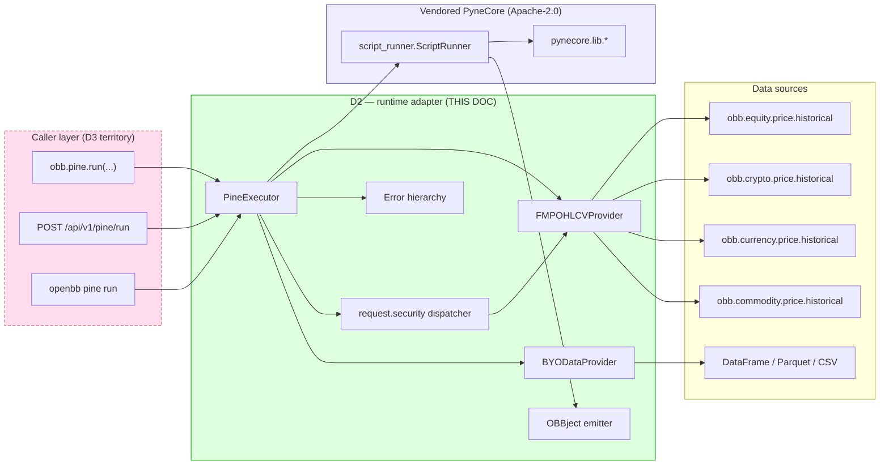
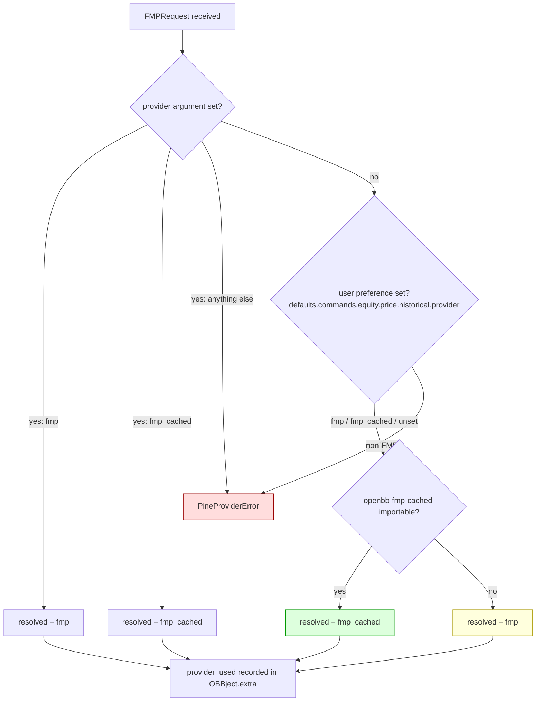

# D2 — Runtime + OHLCV Bridge Design

| Field | Value |
|---|---|
| **Document** | D2 of the `openbb-pine` design set |
| **Status** | Draft — implementation-ready |
| **Owner** | OpenBBTechnical fork maintainer |
| **Bead** | `OpenBBTechnical-0e9.2` (in_progress) |
| **GitHub issue** | [prajoria/OpenBB#104](https://github.com/prajoria/OpenBB/issues/104) — parent epic #102 |
| **Branch** | `openbb_tradingview` |
| **PRD** | `temp/openbb-pine-extension-prd.md` v1.0 — relevant sections §4.4, §4.6, §4.8, §4.8.2, §4.9, §4.10, §13.8 |
| **Companions** | D1 (compiler internals — separate), D3 (router/REST/widget/MCP — separate) |
| **Last updated** | 2026-06-28 |

> **Scope.** D2 locks the runtime adapter: how the compiled `@pyne` module reaches the
> vendored PyneCore executor; how OHLCV gets to that executor from FMP, fmp_cached, or a
> user's DataFrame; how `request.security` is routed; the exact `OBBject` shape on the way
> out; the error hierarchy; and the degraded mode for FMP-less installs.
>
> **Out of scope.** Compiler internals (D1); router shape / REST schema / widgets / MCP
> (D3). Where a decision spills into D1/D3 territory it is *named* here and *deferred* —
> see §10.

---

## 0. Executive summary

D2 fixes **eight runtime contracts** every downstream piece depends on:

1. **Vendoring.** `openbb_pine/__init__.py` prepends `third_party/pynecore/src` to `sys.path` lazily, guarded by `importlib.util.find_spec("pynecore")` so a PyPI `pynesys-pynecore` shadows the vendor copy (PRD §4.4).
2. **One provider class.** `FMPOHLCVProvider` is a *single concrete class* — no `Provider` protocol, no registry. v1.x supports `fmp` and `fmp_cached` only (PRD §4.6, §13.8).
3. **Asset-class dispatch.** Inside `FMPOHLCVProvider` per-asset routing decides between `obb.equity.price.historical`, `obb.crypto.price.historical`, `obb.currency.price.historical`, `obb.commodity.price.historical`.
4. **BYO primary series.** `BYODataProvider` wraps a caller `pandas.DataFrame` for the *primary* series only; secondary lookups stay FMP-backed unless a Python-API `data_resolver` callable is supplied (PRD §4.10).
5. **Fast-fail precedence.** Omitted `provider` → `fmp_cached` if installed else `fmp`; any other value in `obb.user.preferences.defaults.commands["equity.price.historical"]["provider"]` raises `PineProviderError` (PRD §4.9).
6. **OBBject shape.** `.results` is a `pandas.DataFrame` (one column per `plot()` + `bar_index`); `.extra` carries `alerts`, `orders`, `attribution`, `compile_cache_hit`, `exec_ms`, `provider_used`, `bars_consumed` (PRD §4.5, §4.8).
7. **Error hierarchy.** Four leaf errors under `PineRuntimeError`: `PineDataValidationError`, `PineProviderError`, `PineFMPRequiredError`, `PineFMPUnreachableError`.
8. **Degraded mode.** `pine.settings.allow_byo_only = true` permits installs without an FMP key; doctor downgrades FAIL → WARN; touching `syminfo.*` / `request.security` then raises `PineFMPRequiredError` rather than crashing at import.



---

## 1. PyneCore vendoring — sys.path bridge

**Decision.** Vendor as submodule (already present at `third_party/pynecore/`), with a **lazy, guarded** `sys.path` insert in the extension's `__init__.py`. Matches PRD §4.4 row A.

### 1.1 Import-time code (`openbb_pine/__init__.py`)

```python
"""openbb-pine — Pine Script compatibility extension for OpenBB Platform.

Runtime is vendored PyneCore (Apache-2.0) at ``third_party/pynecore/src``,
shadowed by a PyPI install of ``pynesys-pynecore`` if present. See PRD §4.4,
D2 §1."""

from __future__ import annotations

import importlib.util
import sys
from pathlib import Path

__all__ = ["__version__", "PINE_VERSION"]
__version__ = "0.1.0"           # PRD §11.2
PINE_VERSION = "6"              # PRD §13.1

_VENDOR_SRC = (
    Path(__file__).resolve().parents[4] / "third_party" / "pynecore" / "src"
)


def _install_pynecore_path() -> str | None:
    """Idempotent, guarded sys.path bridge. Returns inserted path or None
    if a PyPI ``pynesys-pynecore`` already wins."""
    if importlib.util.find_spec("pynecore") is not None:
        return None                                     # PyPI install wins
    if not _VENDOR_SRC.is_dir():
        raise ImportError(
            f"openbb-pine: PyneCore is neither installed (`pip install "
            f"pynesys-pynecore`) nor present at {_VENDOR_SRC!s}. See PRD §4.4."
        )
    src = str(_VENDOR_SRC)
    if src not in sys.path:
        sys.path.insert(0, src)
    return src


_VENDOR_INSERTED: str | None = _install_pynecore_path()
```

### 1.2 Why guarded, why lazy

| Concern | Behavior |
|---|---|
| **PyPI shadow** (user `pip install pynesys-pynecore`) | `find_spec` short-circuits before any `sys.path` mutation. The PyPI copy wins. |
| **Submodule absent** (sparse checkout) | `ImportError` at extension import — loud, actionable, references PRD §4.4. |
| **Re-import** (test isolation, plugin reload) | `if src not in sys.path` makes the insert idempotent. |
| **Cost** | No `import pynecore` here — that happens on the first `pine.run`. Keeps the PRD §16.5 < 200 ms import budget. |
| **Windows** | The insert uses a `str(Path)`. CI matrix (PRD §10 R12) covers Win/macOS/Linux. |

### 1.3 What this does NOT touch

- Does not register PyneCore's import hook explicitly — `pynecore/__init__.py` does that on first `import pynecore` (`from .core import import_hook`).
- Does not load `pynecore.providers.*` — the vendored `ccxt`/`capitalcom` providers are explicitly **not** used at runtime (PRD §4.6).

---

## 2. `FMPOHLCVProvider` — the single concrete class

### 2.1 Decision (binding for v1.x)

There is **no `Provider` protocol** in v1.x. One concrete class, instantiated per request. PRD §13.8 carries the full rationale. The vendored `pynecore.providers.Provider` ABC is **not** subclassed — PyneCore's executor (`pynecore.core.script_runner.ScriptRunner`) consumes an `Iterable[OHLCV]` directly (`script_runner.py:228, 292`); we feed that iterator ourselves.

### 2.2 Asset-class dispatch

| `asset_class` | OpenBB command | Standard model |
|---|---|---|
| `equity` (default for indices / ETFs too — FMP aliases `EtfHistorical → FMPEquityHistoricalFetcher`) | `obb.equity.price.historical` | `EquityHistoricalData` |
| `crypto` | `obb.crypto.price.historical` | `CryptoHistoricalData` |
| `currency` (forex) | `obb.currency.price.historical` | `CurrencyHistoricalData` |
| `commodity` | `obb.commodity.price.historical` | `CommodityHistoricalData` |
| anything else | — | `ValueError` at `__init__` |

Inference rules when `asset_class` is omitted (Python API only — REST callers must pass it):

1. Symbol matches `r"^[A-Z]{3}/[A-Z]{3}$"` (e.g. `"EUR/USD"`) → `currency`.
2. Matches `r"^[A-Z0-9]{2,10}-(USD|USDT|BTC|ETH)$"` (e.g. `"BTC-USD"`) → `crypto`.
3. Starts with `^` or is in `{"GC=F", "CL=F", "NG=F", ...}` → `commodity`.
4. Else `equity`.

### 2.3 Class skeleton (`openbb_pine/runtime/fmp_provider.py`)

```python
"""FMP-backed OHLCV provider for the Pine runtime.

Single concrete class — no abstraction, no protocol. See PRD §13.8, D2 §2."""

from __future__ import annotations

import importlib.util
import random
import time
from dataclasses import dataclass
from datetime import date, datetime, timezone
from typing import Iterator, Literal

from pynecore.core.syminfo import SymInfo
from pynecore.types.ohlcv import OHLCV

from openbb_pine.runtime.errors import (
    PineFMPUnreachableError, PineProviderError,
)

AssetClass = Literal["equity", "crypto", "currency", "commodity"]
ProviderName = Literal["fmp", "fmp_cached"]


@dataclass(frozen=True, slots=True)
class FMPRequest:
    symbol: str
    interval: str                       # OBB-shape: "1d", "1h", "5m", ...
    start: date | datetime | None
    end:   date | datetime | None
    asset_class: AssetClass
    provider: ProviderName | None       # None => §4 precedence engine resolves


class FMPOHLCVProvider:
    """v1.x single OHLCV provider. Wraps obb.<asset>.price.historical.

    Selection rule (full table in §4):
      - if caller passed ``provider`` it wins;
      - else fmp_cached if openbb-fmp-cached installed;
      - else fmp.

    No fallback to non-FMP providers (PRD §13.8). A non-FMP value in
    the user's preferences raises ``PineProviderError`` at construction."""

    MAX_RETRIES = 4               # § 9 retry budget
    BACKOFF_BASE = 0.4
    BACKOFF_CAP  = 6.0
    JITTER       = 0.25

    def __init__(self, req: FMPRequest, *, user_settings=None) -> None:
        self.req = req
        self._user_settings = user_settings
        self._resolved_provider: ProviderName = self._resolve_provider(req, user_settings)
        self._frame = None
        self._syminfo: SymInfo | None = None
        self._bars_consumed = 0

    # --- Public surface used by the executor ------------------------------

    @property
    def provider_used(self) -> ProviderName: return self._resolved_provider

    @property
    def bars_consumed(self) -> int: return self._bars_consumed

    def get_syminfo(self) -> SymInfo:
        if self._syminfo is None:
            self._syminfo = self._build_syminfo()
        return self._syminfo

    def iter_ohlcv(self) -> Iterator[OHLCV]:
        """Yield OHLCV records in chronological order. Single-pass."""
        if self._frame is None:
            self._frame = self._fetch_with_retry()
        for ts, o, h, lo, c, v in self._frame_rows():
            self._bars_consumed += 1
            yield OHLCV(timestamp=ts, open=o, high=h, low=lo, close=c, volume=v)

    # --- Private machinery -----------------------------------------------

    @classmethod
    def _resolve_provider(cls, req, user_settings) -> ProviderName:
        if req.provider is not None:
            if req.provider not in ("fmp", "fmp_cached"):
                raise PineProviderError(requested=req.provider)
            return req.provider
        pref = cls._read_user_preference(user_settings)
        if pref is not None and pref not in ("fmp", "fmp_cached"):
            raise PineProviderError(requested=pref)
        if importlib.util.find_spec("openbb_fmp_cached") is not None:
            return "fmp_cached"
        return "fmp"

    @staticmethod
    def _read_user_preference(user_settings) -> str | None:
        """Read defaults.commands["equity.price.historical"]["provider"].
        ``Defaults.validate_before`` (core/app/model/defaults.py:43-49)
        strips leading ``/`` and replaces ``/`` with ``.``, then wraps a
        string provider into a list — so canonical key is the dotted form."""
        if user_settings is None: return None
        try:
            commands = user_settings.defaults.commands
        except AttributeError:
            return None
        entry = commands.get("equity.price.historical") or {}
        prov = entry.get("provider")
        return prov[0] if isinstance(prov, list) and prov else prov

    def _fetch_with_retry(self):
        from openbb import obb                          # lazy
        endpoint = self._endpoint_for(self.req.asset_class, obb)
        last_exc: Exception | None = None
        for attempt in range(self.MAX_RETRIES + 1):
            try:
                obbj = endpoint(
                    symbol=self.req.symbol,
                    start_date=self.req.start, end_date=self.req.end,
                    interval=self.req.interval,
                    provider=self._resolved_provider,
                )
            except Exception as exc:                    # noqa: BLE001
                last_exc = exc
                if not self._is_retryable(exc) or attempt == self.MAX_RETRIES:
                    raise PineFMPUnreachableError(
                        provider=self._resolved_provider,
                        attempts=attempt + 1, last_error=exc,
                    ) from exc
                delay = min(self.BACKOFF_CAP, self.BACKOFF_BASE * (2 ** attempt))
                delay *= 1.0 + random.uniform(-self.JITTER, self.JITTER)
                time.sleep(delay)
                continue
            return obbj.to_dataframe()
        raise PineFMPUnreachableError(
            self._resolved_provider, self.MAX_RETRIES + 1, last_exc)

    @staticmethod
    def _endpoint_for(asset_class, obb):
        return {
            "equity":    obb.equity.price.historical,
            "crypto":    obb.crypto.price.historical,
            "currency":  obb.currency.price.historical,
            "commodity": obb.commodity.price.historical,
        }[asset_class]

    @staticmethod
    def _is_retryable(exc) -> bool:
        """HTTP 429 / 5xx / connection blips. Anything else is fatal."""
        msg = repr(exc).lower()
        return any(t in msg for t in
                   ("429", "rate", "timeout", "503", "502", "504", "connection"))

    def _frame_rows(self):
        """Translate the OBB DataFrame into the bar tuple PyneCore expects.

        Standard model EquityHistoricalData carries:
          date, open, high, low, close, volume, [vwap, ...]
        We coerce ``date`` to UNIX-seconds UTC (int)."""
        for ts, row in self._frame.iterrows():
            yield (_ts_seconds(ts),
                   float(row["open"]), float(row["high"]),
                   float(row["low"]), float(row["close"]),
                   float(row.get("volume") or 0.0))

    def _build_syminfo(self) -> SymInfo:
        opening, starts, ends = _sessions_for(self.req.asset_class)
        return SymInfo(
            prefix=_prefix_for(self.req.asset_class),
            description=self.req.symbol, ticker=self.req.symbol,
            currency=_currency_for(self.req.symbol, self.req.asset_class),
            basecurrency=None,
            period=_tv_period(self.req.interval),
            type=_pyne_type_for(self.req.asset_class),
            mintick=0.01, pricescale=100, minmove=1, pointvalue=1.0,
            mincontract=1e-4 if self.req.asset_class == "crypto" else 1.0,
            opening_hours=opening, session_starts=starts, session_ends=ends,
            timezone="UTC",
        )


def _ts_seconds(ts) -> int:
    """Coerce pandas Timestamp / date / datetime to UNIX seconds (UTC)."""
    import pandas as pd
    if isinstance(ts, pd.Timestamp):
        ts = ts.to_pydatetime()
    if isinstance(ts, date) and not isinstance(ts, datetime):
        ts = datetime(ts.year, ts.month, ts.day, tzinfo=timezone.utc)
    if ts.tzinfo is None:
        ts = ts.replace(tzinfo=timezone.utc)
    return int(ts.timestamp())
```

### 2.4 Bar-iterator translation contract

PyneCore's `ScriptRunner.run_iter` (vendored `core/script_runner.py:328`) consumes `Iterable[OHLCV]` where `OHLCV` is a NamedTuple of `(timestamp:int, open, high, low, close, volume, extra_fields=None)`.

| PyneCore field | Source (FMP `EquityHistoricalData`) | Notes |
|---|---|---|
| `timestamp` (UNIX seconds, **UTC**) | `date` | Coerce `date | datetime | pd.Timestamp` → UTC `datetime` → `int(ts.timestamp())`. Daily bars anchor at midnight UTC; matches PyneCore's `_set_lib_properties` which builds `_datetime` via `datetime.fromtimestamp(ts, tz)` (`script_runner.py:132`) |
| `open/high/low/close` | same names | `float()` coercion; sub-tick precision loss is normal — PyneCore's `_round_price` snaps to mintick |
| `volume` | `volume` (may be `None/int/float`) | `float(row.get("volume") or 0.0)` |
| `extra_fields` | unused in v1.x | `vwap`, `change`, `change_percent` dropped; surfaced when a Pine stdlib consumer exists (none in Phase 1) |

Ordering: DataFrame sorted ascending by `date` (`FMPEquityHistoricalFetcher.transform_data` already does this, `openbb_fmp/models/equity_historical.py:120`). Gaps are not back-filled — PyneCore handles missing bars as Pine does (`bar_index` increments per yielded bar; calendar holes are absent rows). Iterator is single-pass; the executor never rewinds.

### 2.5 `fmp` vs `fmp_cached` selection — see §4

---

## 3. `BYODataProvider` — primary-series-only DataFrame source

**Decision.** Separate concrete class (no shared base with `FMPOHLCVProvider`). Feeds the primary series only. Non-primary access (`syminfo.*` extended, `request.security`) still routes through `FMPOHLCVProvider` — see §5 dispatcher.

### 3.1 Required schema (binding)

| Column | Type | Required | Notes |
|---|---|---|---|
| `open`, `high`, `low`, `close` | float-coercible | ✅ | |
| `volume` | float-coercible | ✅ | Use `0.0` if not meaningful; do not omit |
| `vwap`, `wap`, `trades`, … | any | ❌ | Accepted, ignored in v1.x |

Index requirements:

- Must be `pd.DatetimeIndex`.
- **Strictly monotonically increasing**.
- **Tz-aware** for intervals finer than `"1d"`. Tz-naive permitted only for daily / weekly / monthly (PRD §4.10).
- **No duplicates**, **no NaN in required columns**.

### 3.2 Schema-validation code surface (`openbb_pine/runtime/byo_provider.py`)

```python
"""BYO-data primary-series provider. See PRD §4.10, D2 §3."""

from __future__ import annotations

from datetime import date, datetime, timezone
from typing import Iterator

import pandas as pd

from pynecore.core.syminfo import SymInfo
from pynecore.types.ohlcv import OHLCV

from openbb_pine.runtime.errors import PineDataValidationError
from openbb_pine.runtime.fmp_provider import _pyne_type_for, _sessions_for, _tv_period

REQUIRED_COLS = ("open", "high", "low", "close", "volume")
INTRADAY = {"1m", "2m", "3m", "5m", "15m", "30m", "1h", "2h", "4h"}


class BYODataProvider:
    """Wraps a caller DataFrame as the primary OHLCV stream.

    Schema, tz, and monotonicity violations are collected and raised as a
    single ``PineDataValidationError`` with one entry per defect — never
    "first error wins". This makes BYO mode usable from a CLI that hands
    the user a one-shot fix list (PRD §4.10)."""

    def __init__(self, df, *, symbol, interval, asset_class="equity") -> None:
        self._validate(df, interval=interval)           # raises on bad schema
        self._df = df
        self.symbol, self.interval, self.asset_class = symbol, interval, asset_class
        self._bars_consumed = 0

    # --- Validation ------------------------------------------------------

    @classmethod
    def _validate(cls, df, *, interval: str) -> None:
        if not isinstance(df, pd.DataFrame):
            raise PineDataValidationError(["data must be a pandas.DataFrame"])

        defects: list[str] = []

        if df.empty:
            defects.append("DataFrame is empty (zero rows)")

        missing = [c for c in REQUIRED_COLS if c not in df.columns]
        if missing:
            defects.append(f"missing required column(s): {missing}")

        if not isinstance(df.index, pd.DatetimeIndex):
            defects.append(
                f"index must be pandas.DatetimeIndex, got {type(df.index).__name__}")
        else:
            if not df.index.is_monotonic_increasing:
                defects.append("index must be strictly monotonically increasing")
            if df.index.has_duplicates:
                defects.append("index must not contain duplicates")
            if df.index.tz is None and interval in INTRADAY:
                defects.append(
                    f"index is timezone-naive but interval {interval!r} is "
                    "intraday — tz-aware DatetimeIndex required (PRD §4.10)")

        present = [c for c in REQUIRED_COLS if c in df.columns]
        if present:
            nan_cols = [c for c in present if df[c].isna().any()]
            if nan_cols:
                defects.append(f"NaN values in required column(s): {nan_cols}")

        if defects:
            raise PineDataValidationError(defects)

    # --- PyneCore-facing surface ----------------------------------------

    @property
    def provider_used(self) -> str: return "byo"

    @property
    def bars_consumed(self) -> int: return self._bars_consumed

    def get_syminfo(self) -> SymInfo:
        opening, starts, ends = _sessions_for(self.asset_class)
        return SymInfo(
            prefix="BYO", description=f"BYO:{self.symbol}",
            ticker=self.symbol, currency="USD", basecurrency=None,
            period=_tv_period(self.interval),
            type=_pyne_type_for(self.asset_class),
            mintick=0.01, pricescale=100, minmove=1, pointvalue=1.0,
            mincontract=1e-4 if self.asset_class == "crypto" else 1.0,
            opening_hours=opening, session_starts=starts, session_ends=ends,
            timezone=str(self._df.index.tz) if self._df.index.tz else "UTC",
        )

    def iter_ohlcv(self) -> Iterator[OHLCV]:
        for ts, row in self._df.iterrows():
            self._bars_consumed += 1
            yield OHLCV(
                timestamp=_to_utc_seconds(ts),
                open=float(row["open"]), high=float(row["high"]),
                low=float(row["low"]), close=float(row["close"]),
                volume=float(row["volume"] or 0.0),
            )


def _to_utc_seconds(ts) -> int:
    if ts.tzinfo is None:
        ts = ts.tz_localize(timezone.utc)               # daily+: midnight UTC
    return int(ts.timestamp())
```

### 3.3 BYO mode + `syminfo.*` / `request.security`

| Caller layer | Behavior |
|---|---|
| **Python API** (`obb.pine.run(data=df, ...)`) | Primary → `BYODataProvider`. Any `request.security("OTHER", tf, ...)` → dispatched to `FMPOHLCVProvider` *unless* caller passed `data_resolver: Callable[[str, str], pd.DataFrame]` (then preferred). `syminfo.*` for the primary comes from `BYODataProvider.get_syminfo()`; secondary syminfo from FMP. |
| **REST surface** (`POST /api/v1/pine/run` with `data: {...}`) | Same primary routing. **`data_resolver` is NOT exposed** — REST would need an HTTP-callable resolver endpoint with auth/timeout/recursion semantics, which D2 punts. Secondaries always go to FMP from REST. Documented in PRD §4.10 row "request.security in BYO mode". |
| **No FMP key + script touches secondary** | `PineFMPRequiredError` (§7), naming the offending builtin. See §8 for the degraded mode. |

---

## 4. Provider precedence (FMP-only)

Authoritative source is `FMPOHLCVProvider._resolve_provider` (§2.3). Decision tree:



**Why fail fast on a non-FMP preference.** The user's preference is *their* deliberate setting elsewhere in OpenBB. Silently overriding it would (a) make `pine.run` results inconsistent with their other OpenBB queries and (b) hide the FMP-only constraint until users wonder why nothing else they configure works. Both are worse than a structured error pointing at PRD §13.8. The error includes the requested provider name and a tracking URL (§7.2).

**`provider="fmp_cached"` when not installed.** That is a user error, not a silent downgrade. `obb.equity.price.historical(provider="fmp_cached", ...)` will fail inside OpenBB core with an unknown-provider error; `FMPOHLCVProvider` does not pre-flight that check, so the failure surfaces wrapped in `PineFMPUnreachableError` after the retry budget is exhausted.

The result is recorded on `OBBject.extra["provider_used"]` (PRD §4.8). No silent fallback exists.

---

## 5. `request.security` routing

### 5.1 In v1.x: always FMP

PRD §13.3 is unambiguous. Mechanics:

1. PyneCore's `ScriptRunner.__init__` accepts a `security_data: dict[str, str | Path]` mapping `"SYMBOL:TF"` or `"TF"` keys to OHLCV file paths (`script_runner.py:227-252`).
2. Pine's `request.security(symbol, tf, expr, ...)` is rewritten by the compiler (D1) into a call that registers `{symbol, timeframe}` in the module's `__security_contexts__` dict.
3. Before the executor starts, `ScriptRunner._resolve_security_data` (`script_runner.py:1104`) matches each context to the `security_data` we provided.
4. **D2's contribution:** populate that dict by issuing one `FMPOHLCVProvider` fetch per `(symbol, tf)` tuple, then writing each result to a per-tuple `.ohlcv` file via `OHLCVWriter` (vendored `pynecore.core.ohlcv_file.OHLCVWriter`). The dispatcher lives in `openbb_pine/runtime/security_dispatcher.py`.

### 5.2 Multi-symbol, multi-timeframe dispatch

For a script that registers `[("BTC-USD", "1D"), ("BTC-USD", "60"), ("ETH-USD", "1D")]`:

1. Deduplicate the tuples.
2. Spawn up to `pine.settings.security_concurrency` (default `4`) parallel fetches against `FMPOHLCVProvider` — bounded by FMP's rate limits (§9 retry envelope still applies per call).
3. Inherit `start`/`end` from the primary request — Pine's `request.security` reads the same calendar window the chart shows.
4. Write each stream to `~/.openbb/pine_cache/security/{hash}.ohlcv` where hash = `blake2b(symbol ‖ tf ‖ start ‖ end ‖ provider_used)`. Two concurrent runs with overlapping windows share artefacts (re-created per call, no shared-write).
5. Hand `security_data` to `ScriptRunner`.
6. Clean up via a request-scoped temp directory on success or error.

`ignore_invalid_symbol=true` (a Pine flag captured into `__security_contexts__[ctx_id]['ignore_invalid_symbol']`) tells `ScriptRunner._resolve_security_data` to return `None` instead of raising. The dispatcher honors that: if FMP raises `EmptyDataError`, the entry is `None` and no `.ohlcv` file is written.

### 5.3 The `data_resolver` escape hatch (Python API only)

```python
def my_resolver(symbol: str, tf: str) -> pd.DataFrame:
    return pd.read_parquet(f"/data/private/{symbol}_{tf}.parquet")

obb.pine.run(
    source=open("strat.pine").read(),
    data=primary_df,
    data_resolver=my_resolver,                          # D2's escape hatch
    symbol="PRIVATE",
)
```

Contract:

| Field | Required |
|---|---|
| Signature | `Callable[[str, str], pandas.DataFrame]` — `(symbol, tf)` → DataFrame with §3.1 schema |
| Validation | Dispatcher runs `BYODataProvider._validate(...)` on the returned DataFrame. Defects raise `PineDataValidationError` with a `context=` suffix indicating the secondary identity |
| Mixing | If `data_resolver` returns a DataFrame, FMP is not called for that `(symbol, tf)`. If it raises `KeyError`/`LookupError`, dispatcher falls back to FMP. Any other exception aborts the request |
| REST surface | **Not exposed.** REST callers always route secondaries through FMP. Tracked in `project:pine` for v2.0 |

### 5.4 What this design does NOT do

- Does not implement intraday→daily resampling for `request.security`. PyneCore already has `pynecore.core.resampler.Resampler` (referenced `script_runner.py:575`); dispatcher hands raw OHLCV file paths through and lets PyneCore resample.
- Does not implement bar magnifier (`use_bar_magnifier`). Phase 2 strategy feature; dispatcher's `magnifier_iter` parameter is reserved but unused in v1.x.
- Does not implement `request.financial`, `request.dividends`, `request.earnings`, `request.economic` — stdlib bridges (Phase 3 long tail).

---

## 6. Result emission shape

### 6.1 `OBBject` contract (binding for v1.x)

The executor wraps PyneCore's output. The shape below is what every D3 caller (Python API, REST, MCP, Workspace) consumes; D3 may add response envelopes around it but **must not rename or drop these keys**.

```python
OBBject(
    results=<pandas.DataFrame>,        # indexed by tz-aware DatetimeIndex
    extra={
        "alerts":            list[dict],
        "orders":            list[dict],          # strategies only; [] for indicators
        "attribution":       "Powered by PyneSys (https://pynesys.io)",
        "compile_cache_hit": bool,
        "exec_ms":           int,
        "provider_used":     str,                 # "fmp" | "fmp_cached" | "byo"
        "bars_consumed":     int,
    },
    warnings=list[OpenBBWarning] | None,
)
```

### 6.2 `.results` DataFrame columns

| Column | Type | Source |
|---|---|---|
| index (named `date`) | `pd.DatetimeIndex`, tz from `SymInfo.timezone` | The bar `timestamp` of each yielded OHLCV |
| `bar_index` | `int64` | PyneCore's `lib.bar_index` |
| `plot_0`, `plot_1`, … | `float64` | One column per `plot()` in source order. Named plots (`plot(x, title="basis")`) emit a column named `basis`. Name collisions de-duplicated with `_1`, `_2` suffix |
| `_signal_*` (optional) | `bool` | Only when the script calls `plotshape`/`plotchar`. Boolean columns named after the shape's `title` |
| Strategy-only: `equity`, `drawdown`, `position_size` | `float64` | From PyneCore's `position` (Phase 2 — reserved but unpopulated in M1) |

Construction in `openbb_pine/runtime/emitter.py`. The executor collects `(candle, plot_dict)` tuples from `ScriptRunner.run_iter()` (`script_runner.py:767`) and concatenates them at end-of-run (we do not stream a Pydantic list to keep the PRD §6 budget at ≤ 500 ms p50).

### 6.3 `.extra` keys — exact semantics

| Key | Type | Meaning |
|---|---|---|
| `alerts` | `list[{"bar_index": int, "ts": str (ISO-8601 UTC), "message": str}]` | Every `alert(message, ...)` in the script. Empty list, never `None` |
| `orders` | `list[{"bar_index": int, "ts": str, "action": "entry"|"exit"|"close", "id": str, "size": float, "price": float, "type": "market"|"limit"|"stop"|"stoplimit"}]` | Strategies only. **Always present**, `[]` for indicators (PRD §4.5 row 7) |
| `attribution` | literal string `"Powered by PyneSys (https://pynesys.io)"` | PRD §2.6 §4(d) compliance. **NEVER** computed dynamically — see §6.4 |
| `compile_cache_hit` | `bool` | D1 reports; D2 forwards |
| `exec_ms` | `int` | Wall-clock ms from start of `ScriptRunner.run_iter()` to end (compile time NOT included — D1 reports separately) |
| `provider_used` | `"fmp" \| "fmp_cached" \| "byo"` | From the active provider's `provider_used` |
| `bars_consumed` | `int` | From the active provider's `bars_consumed` |

### 6.4 Why `attribution` is a literal

It is the PyneCore `NOTICE` §4(d) compliance string and must appear in every user-visible surface (PRD §2.6). A literal constant means a typo or dynamic-format change cannot drop the URL, and CI can grep the exact string across surfaces (Workspace footer, `/pine/health`, doctor banner — PRD Appendix B checklist).

**Single source of truth (resolves the boundary leak flagged by the D1/D2/D3 reviewer).** The constant lives in `openbb_pine/attribution.py` (owned by D3 §8.1 — `POWERED_BY_FULL`). D2's runtime imports it rather than redefining its own `ATTRIBUTION`:

```python
# In openbb_pine/runtime/executor.py
from openbb_pine.attribution import POWERED_BY_FULL

# ...build extra dict...
extra["attribution"] = POWERED_BY_FULL
```

The `tests/unit/test_attribution_surfaces.py::test_all_four_pynecore_attribution_surfaces` test (D3 §8.3) asserts the same `POWERED_BY_FULL` literal appears in all 4 surfaces; D2's `extra["attribution"]` value is one of those 4 (the `/pine/run` REST response). Any future refactor that moves the constant must be a single-file change.

### 6.5 `OBBject.warnings`

Non-fatal surfaces only:

- `"primary series was supplied via 'data'; 'provider'/'symbol' arguments are ignored"` (when both BYO and FMP arguments are given — PRD §4.8.2)
- `"fmp_cached was requested but openbb-fmp-cached is not installed; falling back to live fmp"` (only when `provider="fmp_cached"` is explicit AND the import fails AND the live call succeeds; if live also fails the warning is replaced with `PineFMPUnreachableError`)
- `"v5 source detected; auto-migration shim applied (PRD §3.2)"`

Anything truly broken is an exception (§7), not a warning.

---

## 7. Error surfaces

### 7.1 Hierarchy (`openbb_pine/runtime/errors.py`)

```python
"""Runtime-side error hierarchy. See D2 §7. Compiler-side errors (D1) live
in openbb_pine.compiler.errors and do NOT inherit from PineRuntimeError.

**Cross-doc consolidation note (post-D1/D2/D3 review).** The PineError root and the
runtime-shaped subclass names below (`PineRuntimeError`, `PineDataValidationError`,
`PineProviderError`, `PineFMPRequiredError`, `PineFMPUnreachableError`) are defined in
the shared `openbb_pine/errors.py` module owned by D3 §4.7. D2 *imports* them and only
adds runtime-specific behavior (init-arg signatures, attached state). This avoids the
three-`PineError`-classes-with-different-bases bug the cross-doc reviewer flagged."""

from __future__ import annotations

from openbb_pine.errors import (
    PineError,              # OpenBBError-rooted (D3 §4.7)
    PineRuntimeError,
    PineDataValidationError as _PineDataValidationErrorBase,
    PineProviderError as _PineProviderErrorBase,
)


class PineDataValidationError(_PineDataValidationErrorBase):
    """BYO DataFrame violated the §3.1 schema. Lists *every* defect.

    Runtime-side init signature; class is rooted in OpenBBError via D3 §4.7."""
    def __init__(self, defects: list[str], *, context: str | None = None) -> None:
        self.defects = list(defects)
        self.context = context
        ctx = f" (context: {context})" if context else ""
        super().__init__(f"BYO data validation failed{ctx}: {'; '.join(self.defects)}")


class PineProviderError(_PineProviderErrorBase):
    """A non-FMP provider was requested (PRD §13.8).

    Runtime-side init signature; class is rooted in OpenBBError via D3 §4.7."""
    code = "PineProviderError"
    supported = ("fmp", "fmp_cached")
    tracking_url = ("https://github.com/prajoria/OpenBB/issues?"
                    "q=is%3Aissue+label%3Aproject%3Apine+multi-provider")
    def __init__(self, *, requested: str) -> None:
        self.requested = requested
        super().__init__(
            f"Only fmp and fmp_cached are supported in this version. "
            f"Requested: {requested!r}. See PRD §13.8 and {self.tracking_url}")


class PineFMPRequiredError(PineRuntimeError):
    """BYO mode without FMP key, and the script touched a builtin that
    needs FMP (e.g. ``syminfo.*`` extended, ``request.security``)."""
    docs_url = "https://docs.openbb.co/platform/getting_started/api_keys"
    def __init__(self, *, builtin: str) -> None:
        self.builtin = builtin
        super().__init__(
            f"Builtin {builtin!r} requires an FMP API key (BYO mode covers the "
            f"primary series only; see PRD §4.10). Set the key at "
            f"{self.docs_url} or remove the call from the script.")


class PineFMPUnreachableError(PineRuntimeError):
    """All retry attempts to FMP / fmp_cached failed (PRD §10 R13)."""
    def __init__(self, provider, attempts, last_error) -> None:
        self.provider, self.attempts, self.last_error = provider, attempts, last_error
        last = f"; last error: {last_error!r}" if last_error else ""
        super().__init__(
            f"Provider {provider!r} unreachable after {attempts} attempt(s)"
            f"{last}. Consider installing openbb-fmp-cached (PRD §4.6) or "
            "retrying later.")
```

### 7.2 Message templates and tracking URLs

| Class | Template (verbatim) | REST status | Tracking |
|---|---|---|---|
| `PineDataValidationError` | `BYO data validation failed[ (context: <ctx>)]: <defect>; <defect>; …` | 400 | — |
| `PineProviderError` | `Only fmp and fmp_cached are supported in this version. Requested: '<x>'. See PRD §13.8 and <tracking_url>` | 400 | label `project:pine` + `multi-provider` |
| `PineFMPRequiredError` | `Builtin '<name>' requires an FMP API key (BYO mode covers the primary series only; see PRD §4.10). Set the key at <docs_url> or remove the call from the script.` | 412 | docs link |
| `PineFMPUnreachableError` | `Provider '<x>' unreachable after <n> attempt(s); last error: <repr>. Consider installing openbb-fmp-cached (PRD §4.6) or retrying later.` | 503 | — |

REST mapping happens in D3 (router exception handler) — listed here only so D3's table matches.

### 7.3 What is deliberately *not* a runtime error class

- `PineUnsupportedBuiltinError` — raised by the compiler (D1), not runtime. Keeps the hierarchy clean.
- Compile/syntax errors — D1.
- Sandbox violations (PRD §5.1 T1/T3) — caught by D1 codegen's allowlist; if one slips through, `PineRuntimeError` is the right base, but the leaf class lives with the sandbox code, not here.

---

## 8. `allow_byo_only` degraded mode

### 8.1 Decision matrix

| Flag | FMP key present | Doctor verdict | `pine.run` behavior |
|---|---|---|---|
| `false` | yes | OK (green) | Normal |
| `false` | no | **FAIL** (exit 1) | Immediately raises `PineFMPRequiredError` even before script compilation |
| `true` | yes | OK (green) | Normal |
| `true` | no | **WARN** (exit 0, banner) | Accepts the call. Primary-only scripts run. Scripts touching `syminfo.*` extended (anything beyond the trivially-derived set served by `BYODataProvider.get_syminfo()` — see §8.2) or `request.security` raise `PineFMPRequiredError` at first touch, naming the builtin |

### 8.2 Pre-flight builtin scan (D1 collaboration)

D1's compiler emits a `builtins_used: set[str]` (per PRD §4.7 `/pine/compile` response). The runtime executor uses that set, before invoking PyneCore, to decide BYO-only compatibility:

```python
FMP_REQUIRING_BUILTINS = frozenset({
    "request.security", "request.security_lower_tf",
    "request.financial", "request.dividends", "request.earnings",
    "request.economic", "request.splits",
    # syminfo.* members NOT served by BYODataProvider.get_syminfo()
    "syminfo.country", "syminfo.sector", "syminfo.industry",
    "syminfo.shares_outstanding_total", "syminfo.shares_outstanding_float",
})

def assert_byo_compatible(builtins_used: set[str]) -> None:
    bad = builtins_used & FMP_REQUIRING_BUILTINS
    if bad:
        raise PineFMPRequiredError(builtin=sorted(bad)[0])
```

Safe `syminfo.*` subset (those `BYODataProvider` populates from index + metadata, from inspecting vendored `pynecore.core.syminfo.SymInfo.__slots__`): `{prefix, description, ticker, currency, period, type, timezone, mintick, pricescale, minmove, pointvalue, mincontract, opening_hours, session_starts, session_ends}`. Everything else needs FMP and must appear in `FMP_REQUIRING_BUILTINS`.

### 8.3 Doctor surface

`openbb pine doctor` (D3 territory) consumes a `pine.runtime.doctor.check_fmp_credential(allow_byo_only=...)` exposed by D2:

```python
# Returns ("ok", None) | ("warn", "<msg>") | ("fail", "<msg>")
def check_fmp_credential(*, allow_byo_only: bool, user_settings=None) -> tuple[str, str | None]: ...
```

With `allow_byo_only=true`, the function never returns `"fail"`. A missing/unreachable key downgrades to `"warn"` with a message naming the FMP setup-docs URL and listing builtin families that will now `PineFMPRequiredError`. PRD §16.4 doctor output already shows the FAIL version; the WARN variant:

```
$ openbb pine doctor
[OK]   Python 3.11.7
[OK]   openbb-core 1.6.12 installed
[OK]   openbb-fmp installed
[WARN] FMP API key NOT found, but allow_byo_only = true
        → BYO-data scripts WILL run (primary series only)
        → Scripts touching syminfo.* (extended) or request.security will raise PineFMPRequiredError
        → Set the key to remove this warning: https://docs.openbb.co/platform/getting_started/api_keys
[OK]   PyneCore 6.5.2 importable
All checks passed (1 warning).
exit code: 0
```

---

## 9. FMP rate-limit / outage handling

### 9.1 Retry budget

| Knob | Default | Where |
|---|---|---|
| `MAX_RETRIES` | `4` (up to 5 attempts total) | `FMPOHLCVProvider` class attr, override via `pine.settings.fmp_max_retries` |
| `BACKOFF_BASE` | `0.4` s | doubling per attempt |
| `BACKOFF_CAP` | `6.0` s | per-sleep ceiling |
| `JITTER` | `0.25` (±25 %) | uniform-jitter fraction |

Worst-case wait before `PineFMPUnreachableError`: `0.4 + 0.8 + 1.6 + 3.2 ≈ 6.0 s` (capped). Request wall-clock stays under PRD §6 budget when no retry is needed; in the retry path the request blows the budget and the operator is paged via the §9.5 metric — the right trade-off.

### 9.2 Retryable vs fatal classification

Implemented in `_is_retryable(exc)`:

- **Retryable.** HTTP 429, 502, 503, 504; `httpx.ConnectError`, `httpx.ReadTimeout`, any `Exception` whose `repr()` contains `rate`, `timeout`, or `connection`.
- **Fatal.** `EmptyDataError` (window empty — retry won't help), validation errors, auth failures (4xx other than 429), `KeyError`/`AttributeError` (programmer bug).

Tolerant rather than enumerative — OpenBB layers wrap `httpx` errors in `OpenBBError`, and the wrapped text typically preserves the status code or condition keyword.

### 9.3 Per-call vs per-request retries

Retries are **per call**. A request triggering (a) primary fetch + (b) three `request.security` fetches can retry up to 5× each, but the budget does not pool. The first call to exhaust the budget aborts the request.

### 9.4 Cache layer is strongly recommended

PRD §10 R13 lists this. D2 enforces operationally:

1. `pine doctor` reports `WARN` when `openbb-fmp-cached` is not installed but `openbb-fmp` is. Informational; not a failure.
2. Phase 4 Docker image (`openbb/openbb-platform-pine:<tag>`, PRD §16.2) ships with `openbb-fmp-cached` pre-installed.
3. Observability surfaces `pine_fmp_unreachable_total{provider=...}` (PRD §9.4) so operators see rate-limit pressure before user complaints land.

### 9.5 Observability of retries

Per-request structured log fields (extending PRD §9.4):

| Field | Value |
|---|---|
| `pine_fmp_attempts` | total attempts across primary + secondaries |
| `pine_fmp_retried` | count of attempts > 1 |
| `pine_fmp_provider_used` | `"fmp"` / `"fmp_cached"` |
| `pine_fmp_unreachable` | `bool` (true ⇒ `PineFMPUnreachableError` raised) |

Surfaced via the existing OpenBB structured logger, not a new sink. D3 wires log emission inside the router handler.

---

## 10. Out of scope for D2

Decisions named here so reviewers know what they're not finding, and deferred with a pointer:

| Topic | Owner doc | One-line reason |
|---|---|---|
| Compiler internals (lexer, parser, type checker, IR, codegen) | **D1** | Pure compile-side. D2 only sees the compiled `@pyne` module and its `builtins_used` set |
| `compile_cache` keying, location, eviction | **D1** | `compile_cache_hit` is forwarded by D2, not computed |
| REST request/response Pydantic schemas | **D3** | D2 ships the OBBject contract; D3 maps it to HTTP |
| Router definition (`/api/v1/pine/*`, FastAPI shape) | **D3** | Including the `PineProviderError → 400`, `PineFMPRequiredError → 412`, `PineFMPUnreachableError → 503` mapping (§7.2) |
| Workspace widget JSON schema | **D3** | Widget pack consumes `.results` columns; the contract is §6.2 |
| MCP tool registration | **D3** | Each compiled indicator becomes an MCP tool — registration is D3 |
| CLI (`openbb pine run`, `openbb pine doctor`) | **D3** | Doctor delegates the FMP-credential check to D2's `check_fmp_credential` (§8.3) |
| BYO `data.format = "parquet_url"` / `"csv_url"` / `"arrow_ipc_base64"` payloads | **D3** | D2's `BYODataProvider` only sees the materialized DataFrame; fetcher/decoder is D3 |
| Sandbox / RCE mitigations (PRD §5.2 T1) | **D1** | Codegen-side allowlist before file write — pre-import gate |
| Per-builtin Pine stdlib bridges (`ta.sma`, `ta.macd`, etc.) | separate `stdlib/*` doc | D2 only confirms `pynecore.lib.ta` is importable |
| Strategy engine (`strategy.entry`, fill models, equity curve) | **D2.5 (Phase 2)** | `OBBject.extra["orders"]` shape is reserved here; Phase 2 fills it |

### 10.1 PRD §5.2 T2 (resource exhaustion) and T3 (restricted exec namespace) — D2 ownership

**Resolves the security-ownership gap flagged by the D1/D2/D3 reviewer.** Both T2 and T3 are runtime-layer concerns (they protect the *running* compiled module from misbehaving), so they belong with D2, alongside §9's FMP retry budget (also a runtime resource concern). D1's T1 mitigates code that *should never be emitted*; D2's T2/T3 mitigate code that *might* execute despite the allowlist.

**T2 — per-script wall-clock + memory budget.** The runtime wraps `ScriptRunner.run_iter()` in:

```python
# openbb_pine/runtime/limits.py
import resource, signal
from contextlib import contextmanager

DEFAULT_TIMEOUT_S = 30          # PRD §5.2 T2; overridable via pine.settings.exec_timeout_s
DEFAULT_RLIMIT_AS = 2 * 1024**3 # 2 GiB virtual-mem cap on Linux
MAX_BARS_PER_REQUEST = 5_000_000  # soft cap; raise PineDataValidationError above

class PineExecTimeoutError(PineRuntimeError):
    code = "PineExecTimeoutError"

@contextmanager
def enforce_limits(timeout_s: int = DEFAULT_TIMEOUT_S):
    def _handler(signum, frame):
        raise PineExecTimeoutError(f"Pine script exceeded {timeout_s}s wall-clock budget")
    if hasattr(signal, "SIGALRM"):          # POSIX
        signal.signal(signal.SIGALRM, _handler)
        signal.alarm(timeout_s)
    try:
        if hasattr(resource, "RLIMIT_AS"):  # POSIX
            soft, hard = resource.getrlimit(resource.RLIMIT_AS)
            resource.setrlimit(resource.RLIMIT_AS, (min(soft, DEFAULT_RLIMIT_AS), hard))
        yield
    finally:
        if hasattr(signal, "SIGALRM"):
            signal.alarm(0)
```

Windows fallback: a `threading.Timer` raises `PineExecTimeoutError` after `timeout_s`; memory cap is best-effort via `psutil.Process().memory_info()` polled by the timer. The Windows path is documented as degraded — operator README recommends container deployment on POSIX (PRD §5.3).

**T3 — restricted exec namespace builder.** The compiled `@pyne` module is imported into a deliberately stripped namespace:

```python
# openbb_pine/runtime/restricted.py
_ALLOWED_BUILTINS = {
    # arithmetic / iter / type-introspection only — no I/O, no eval, no import
    "abs", "all", "any", "bool", "complex", "dict", "divmod", "enumerate",
    "filter", "float", "frozenset", "int", "isinstance", "issubclass", "len",
    "list", "map", "max", "min", "object", "pow", "range", "repr", "reversed",
    "round", "set", "slice", "sorted", "str", "sum", "tuple", "type", "zip",
    # explicitly absent: __import__, open, exec, eval, compile, input,
    # globals, locals, vars, setattr, delattr, dir, exit, quit, help
}

def build_restricted_namespace(compiled_module_path: str) -> dict:
    """Build the dict that exec(compiled, ns) uses. Returns a fresh ns each call."""
    ns = {"__name__": "pine_user_script", "__file__": compiled_module_path,
          "__builtins__": {k: __builtins__[k] for k in _ALLOWED_BUILTINS}}
    return ns
```

PyneCore's `import_hook` is allowed to register itself (it's the runtime substrate); user code cannot reach `os`, `sys`, `subprocess`, `socket`, `pathlib`, `open`, or `__import__` because none are in `_ALLOWED_BUILTINS` AND D1's allowlist forbids emitting `Import`/`ImportFrom` for any module outside `MODULE_ALLOWLIST`. **Defense in depth: T1 prevents emission, T3 prevents execution-time escape if T1 ever has a bug.**

**Operator deployment guidance (lifted from PRD §5.3).** Production deployments that expose `/api/v1/pine/run` to untrusted users should additionally run the worker under firejail / gVisor / a container with no network egress and a read-only filesystem except `/tmp`. T2 and T3 are language-level mitigations; they are necessary but not sufficient against a determined adversary.

### 10.2 Things D2 noticed but does not fix

Two PRD items that should be tightened in the next PRD revision (flagged for the maintainer):

1. **PRD §4.9 spelling of the preference key.** The PRD previously wrote `obb.user.preferences.defaults.commands["/equity/price/historical"]["provider"]`. But `openbb_core/app/model/defaults.py:43-49` normalizes the leading `/` away and replaces `/` with `.`, so the actual key is `commands["equity.price.historical"]`. D2 uses the normalized form. **Resolved** in the post-review consolidation commit — PRD §4.6/§4.9/§13.8 now use the normalized form throughout.
2. **PRD §4.8 example response previously included `chart: null` and a string `"..."` placeholder.** Harmless for human readers, but a future test fixture would trip on them. **Resolved** in the post-review consolidation commit — PRD §4.8 and §4.8.2 examples now elide cleanly (single row + parenthetical "results truncated for brevity").

Neither blocks D2 implementation.

---

## Appendix A — Cross-reference index

| PRD section | D2 section covering it |
|---|---|
| §4.4 PyneCore vendoring | §1 |
| §4.5 Data flow (one request) | §6 |
| §4.6 OHLCV bridge — FMP-only | §2 + §4 |
| §4.8 Worked API contract — FMP path | §6 (shape only; D3 owns HTTP framing) |
| §4.8.2 Worked API contract — BYO data | §3 + §6 |
| §4.9 Provider precedence | §4 |
| §4.10 BYO-data design notes | §3 + §5.3 + §8 |
| §10 R13 FMP outage handling | §9 |
| §10 R14 user without FMP key | §8 |
| §13.3 `request.security` data source | §5 |
| §13.8 FMP-only scope decision | §2.1 + §4.1 |
| §16.4 doctor CLI | §8.3 (credential check exported by D2) |

## Appendix B — Risk additions for PRD §10

Two D2-specific risks worth folding into PRD §10:

| # | Risk | Severity | Likelihood | Owner | Mitigation |
|---|---|---|---|---|---|
| R16 | `sys.path` insert in `openbb_pine/__init__.py` shadows a different `pynecore` installed for another tool in the same env | L | L | Build eng | `find_spec` guard (§1.1) defers to the existing install. CI matrix runs with and without a PyPI `pynesys-pynecore` installed |
| R17 | BYO `data_resolver` callable raises an exotic exception type the dispatcher doesn't classify, masking the real failure | L | M | Runtime eng | `data_resolver` exceptions wrap into `PineRuntimeError` with the original as `__cause__`; only `KeyError`/`LookupError` are interpreted as "fall back to FMP" (§5.3) |

## Appendix C — Module file map (D2 territory only)

```
openbb_platform/extensions/pine/openbb_pine/
├── __init__.py                       # §1 sys.path bridge
└── runtime/
    ├── __init__.py                   # exports version constants (POWERED_BY_FULL lives in openbb_pine/attribution.py per D3 §8.1)
    ├── errors.py                     # §7 error hierarchy
    ├── fmp_provider.py               # §2 FMPOHLCVProvider
    ├── byo_provider.py               # §3 BYODataProvider
    ├── security_dispatcher.py        # §5 request.security routing
    ├── emitter.py                    # §6 OBBject construction
    ├── doctor.py                     # §8.3 check_fmp_credential
    └── executor.py                   # ties it all together; wraps pynecore.core.script_runner.ScriptRunner
```

Nothing else in `openbb_pine/` is D2's. Compiler (`compiler/`), stdlib bridges (`stdlib/`), router (`pine_router.py`), widget pack (`widgets.json`), MCP tools (`mcp_tools.py`), and tests beyond this module's unit tests all belong to D1 / D3 / a later doc.

---

**End of D2.** Reviewers grade against PRD §4.4, §4.6, §4.9, §4.10, §13.8. The three most consequential decisions: §2.1 (no Provider protocol — one concrete `FMPOHLCVProvider`); §5.3 (`data_resolver` escape hatch in Python API only, not REST); §9.1 (5-attempt exponential-backoff envelope with explicit `fmp_cached` recommendation).
