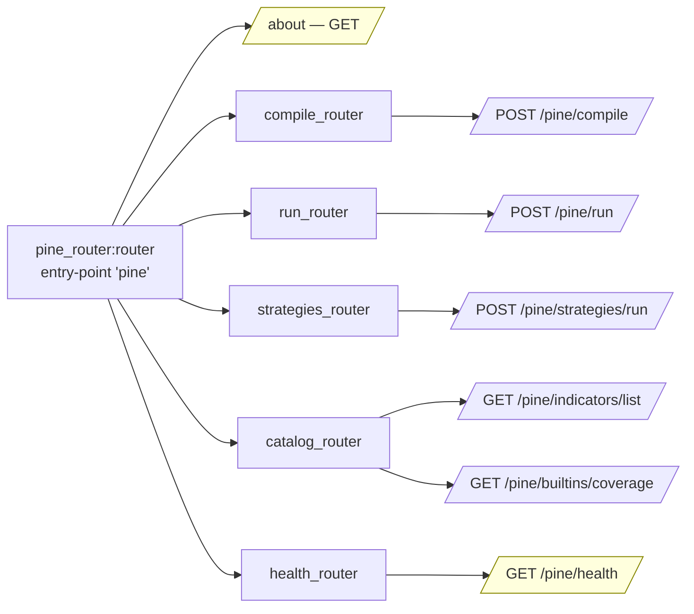

# D3 — OpenBB Platform Integration Design

| Field | Value |
|---|---|
| **Status** | v1.0 — Final, ready for review |
| **Bead** | `OpenBBTechnical-0e9.3` |
| **GitHub issue** | https://github.com/prajoria/OpenBB/issues/105 |
| **Branch** | `openbb_tradingview` |
| **PRD reference** | `temp/openbb-pine-extension-prd.md` (§§ 2.6, 4.2, 4.3, 4.5, 4.7, 4.8, 4.8.2, 16) |
| **Companion designs** | D1 (compiler) — GH #103; D2 (runtime + FMP bridge) — GH #104 |
| **Last updated** | 2026-06-28 |

> **Scope discipline.** This doc covers the *outer shell* — extension layout, router
> wiring, REST contracts, OBBject shapes, widgets, MCP tool registration, attribution
> surfaces, packaging, and the `openbb pine doctor` CLI. Compiler internals (D1) and the
> runtime / FMP bridge (D2) are black boxes here. See §13 for the explicit out-of-scope
> list.

---

## 0. Executive Summary

A Phase 1 implementer must be able to scaffold the entire `openbb-pine` extension shell
— router, sub-routers, one rendered widget, one MCP tool, all four §2.6 attribution
surfaces wired — in **one day** from this doc, with zero ambiguity about OpenBB
conventions.

Built by mirroring two in-repo precedents: **`openbb-techtrade`** (top-level router with
lazy `_include_subrouters()`, bare-`OBBject` for free-form returns, sibling pyproject
shape) and **`openbb-backtest`** (sub-router-per-file under `routers/`, `settings.py` +
`registry.py`, lazy heavy imports inside command bodies, error hierarchy on
`OpenBBError`).

Six REST endpoints (`/pine/run`, `/pine/compile`, `/pine/strategies/run`,
`/pine/indicators/list`, `/pine/builtins/coverage`, `/pine/health`) cover the M1 surface.
Four user-visible places (`/pine/health` JSON, every `pine.*` widget footer,
`obb.pine.about()`, the `openbb pine --version` CLI banner) carry the literal string
**"Powered by PyneSys (https://pynesys.io)"** — satisfying PyneCore `NOTICE` §4(d). The
`openbb pine doctor` CLI provides the L1 install-success check (PRD §16.4) with a strict
**exit 0 / exit 1** contract.

---

## 1. Extension scaffold (PRD §4.2)

### 1.1 Verbatim directory tree

Mirrored against `openbb_platform/extensions/techtrade/` and
`openbb_platform/extensions/backtest/`:

```
openbb_platform/extensions/pine/
├── README.md                              # Appendix A disclaimer + §2.6 attribution
├── conftest.py                            # ephemeral compile-cache fixture
├── pyproject.toml                         # entry-point registration (§2)
├── openbb_pine/
│   ├── __init__.py                        # only __version__ — no side effects
│   ├── pine_router.py                     # top-level router + about() (§3)
│   ├── settings.py                        # PineSettings (pydantic-settings)
│   ├── errors.py                          # PineError hierarchy (§4.6)
│   ├── about.py                           # PineAbout pydantic model (§11)
│   ├── attribution.py                     # single source for §2.6 strings (§8)
│   ├── py.typed                           # PEP 561 marker (mirrors siblings)
│   ├── assets/
│   │   └── widgets.json                   # Workspace widgets (§6)
│   ├── cli/
│   │   ├── __init__.py
│   │   ├── doctor.py                      # `openbb pine doctor` (§10)
│   │   └── main.py                        # Click entry point
│   ├── compiler/                          # D1 territory — D3 only imports its surface
│   │   └── __init__.py
│   ├── runtime/                           # D2 territory — same
│   │   └── __init__.py
│   ├── routers/
│   │   ├── __init__.py                    # docstring only, no eager imports
│   │   ├── _models.py                     # PineRunRequest, PineByoData, ...
│   │   ├── compile_router.py              # POST /pine/compile
│   │   ├── run_router.py                  # POST /pine/run
│   │   ├── strategies_router.py           # POST /pine/strategies/run
│   │   ├── catalog_router.py              # GET /pine/indicators/list + /builtins/coverage
│   │   └── health_router.py               # GET /pine/health
│   ├── mcp/
│   │   ├── __init__.py
│   │   ├── registration.py                # auto-register bundled indicators (§7)
│   │   └── tool_factory.py                # CompiledIndicator → MCP tool spec
│   └── catalog/
│       ├── __init__.py
│       ├── builtins_coverage.py           # truth for /pine/builtins/coverage
│       └── bundled_indicators.py          # top-30 templates (§6.3)
└── tests/
    ├── unit/
    │   ├── test_router_imports.py         # PRD §16.5: import time + no-OBBject[dict]
    │   ├── test_about.py
    │   ├── test_attribution_surfaces.py   # the 4-of-4 test (§8.3)
    │   ├── test_doctor.py
    │   └── test_widget_footer.py
    ├── integration/
    │   ├── test_run_endpoint.py           # provider mode (§4.8) fixture
    │   ├── test_run_endpoint_byo.py       # BYO mode (§4.8.2) fixture
    │   ├── test_compile_endpoint.py
    │   ├── test_strategies_endpoint.py
    │   ├── test_catalog_endpoints.py
    │   └── test_health_endpoint.py
    ├── compat/
    │   ├── test_pip_resolution.py         # PRD §16.5: transitive-dep conflict guard
    │   └── test_no_global_mutation.py     # settings snapshot before/after import
    └── mcp/
        └── test_indicator_tool_registration.py
```

**Layout choices.** Sub-routers live in `routers/` (not `engine/`) because they are pure
HTTP/Python-API thin layers — `techtrade` uses `engine/` because its sub-routers also
*are* the compute engine. Separate `compiler/` and `runtime/` packages are empty stubs;
D1/D2 fill them without renaming. `attribution.py` is the single source of truth for the
§2.6 strings — one change touches one file. `assets/widgets.json` matches the
`openbb-portfolio/assets/widgets.json` placement (the only sibling that ships widgets
today). The `py.typed` marker is universal across sibling extensions.

### 1.2 Sub-router → endpoint binding

| File | Endpoint(s) | M1 status |
|---|---|---|
| `routers/compile_router.py` | `POST /pine/compile` | required |
| `routers/run_router.py` | `POST /pine/run` | required |
| `routers/strategies_router.py` | `POST /pine/strategies/run` | scaffolded (501 at M1, live at M2 — PRD §3.2) |
| `routers/catalog_router.py` | `GET /pine/indicators/list`, `GET /pine/builtins/coverage` | required |
| `routers/health_router.py` | `GET /pine/health` | required (§2.6 surface #1) |

`strategies_router` ships at M1 returning a deterministic 501
`PineStrategyNotYetImplementedError` so callers get a structured error with a tracking
URL instead of a 404. The route is reserved early.

---

## 2. Entry-point registration (PRD §4.3)

```toml
# pyproject.toml — entry points only; full file in §9
[tool.poetry.plugins."openbb_core_extension"]
pine = "openbb_pine.pine_router:router"

[tool.poetry.plugins."openbb_mcp_server_hooks"]
pine_indicators = "openbb_pine.mcp.registration:register_pine_tools"

[tool.poetry.scripts]
"openbb-pine" = "openbb_pine.cli.main:cli"
```

Verified pattern across 18 of 23 sibling extensions for `openbb_core_extension`
(`techtrade`, `backtest`, `commodity`, `crypto`, `currency`, `derivatives`, …). The five
holdouts — `platform_api`, `mcp_server`, `devtools`, `agents`, `famafrench` — are
tooling packages that don't register a router.

**How discovery works.** `openbb-core` walks `openbb_core_extension` at import time and
binds each named module to a URL prefix derived from the entry-point **name** (not the
`Router(prefix=...)` argument). So commands appear at `/api/v1/pine/<command>` and
`obb.pine.<command>(...)`. `Router(prefix=...)` is used only by *sub-routers* nested
under the entry-point prefix.

**Why a console script too.** Sibling extensions expose their CLI as `obb.<name>.*` and
don't ship a console script. We need a real shell entry point for `openbb pine doctor`
and `openbb pine --version` (PRD §16.4, §2.6 surface #4). The script installs as
`openbb-pine`; the user-friendly `openbb pine doctor` form works because `openbb` (from
`openbb-core`) dispatches `pine` to our installed script when present.

---

## 3. Top-level router + sub-routers

### 3.1 `pine_router.py` skeleton

Mirrors `techtrade_router.py` line-by-line in spirit:

```python
"""Top-level pine router.

Assembles the public ``obb.pine.*`` surface. Sub-routers (compile, run, strategies,
catalog, health) are attached lazily inside :func:`_include_subrouters` so a missing
optional sub-router is skipped at import — the extension keeps importing cleanly during
incremental development.

The ``about`` command returns ``OBBject[PineAbout]`` (typed model) so the §2.6
attribution surface is part of the schema and the static package builder gets a concrete
return annotation. The bare-``OBBject`` convention (techtrade style) is used only for
free-form returns where the schema would otherwise have to be ``OBBject[dict]``.

See ``docs/designs/openbb-pine/D3-platform-integration.md``, PRD §4.2 and §4.3.
"""

from __future__ import annotations

from importlib import import_module
from importlib.metadata import PackageNotFoundError, version

from openbb_core.app.model.obbject import OBBject
from openbb_core.app.router import Router

from openbb_pine.about import PineAbout
from openbb_pine.attribution import POWERED_BY_FULL
from openbb_pine.catalog.builtins_coverage import implemented_count, total_count
from openbb_pine.settings import DEFAULT_SETTINGS

router = Router(
    prefix="",
    description="Pine Script™ compatibility — compile and run Pine v5/v6 indicators "
                "and strategies through the OpenBB Platform.",
)


def _include_subrouters() -> None:
    """Lazily attach sub-routers as their components are implemented."""
    for module_path, attr in (
        ("openbb_pine.routers.compile_router",    "router"),
        ("openbb_pine.routers.run_router",        "router"),
        ("openbb_pine.routers.strategies_router", "router"),
        ("openbb_pine.routers.catalog_router",    "router"),
        ("openbb_pine.routers.health_router",     "router"),
    ):
        try:
            module = import_module(module_path)
        except ImportError:
            continue
        router.include_router(getattr(module, attr))


_include_subrouters()


@router.command(methods=["GET"])
def about() -> OBBject[PineAbout]:
    """Return pine extension metadata (PRD §16.3)."""
    from openbb_pine.cli.doctor import run_checks    # lazy: pulls optional probes

    try:
        ext_version = version("openbb-extension-pine")
    except PackageNotFoundError:
        ext_version = "0.0.0"

    doctor = run_checks(quiet=True)
    return OBBject(
        results=PineAbout(
            extension_name="pine",
            extension_version=ext_version,
            pine_version_supported="6 (and v5 via auto-migration)",
            runtime="PyneCore 6.5.2 (Apache-2.0)",
            powered_by=POWERED_BY_FULL,
            compiler_status="healthy" if doctor.ok else "degraded",
            builtins_implemented=implemented_count(),
            builtins_total=total_count(),
            providers_supported=["fmp", "fmp_cached"],
            fmp_key_present=doctor.fmp_key_present,
            fmp_cached_installed=doctor.fmp_cached_installed,
            compile_cache_dir=str(DEFAULT_SETTINGS.compile_cache_dir),
            doctor_ok=doctor.ok,
            doctor_issues=None if doctor.ok else doctor.issues,
        )
    )
```

### 3.2 Endpoint → router map



### 3.3 Sub-router shape (`run_router.py` illustration)

Heavy imports (compiler, runtime, pandas/numpy) are deferred to command bodies, keeping
import time under the PRD §16.5 200 ms budget:

```python
from __future__ import annotations
from typing import Annotated, Any

from openbb_core.app.model.example import PythonEx
from openbb_core.app.model.obbject import OBBject
from openbb_core.app.router import Router
from pydantic import Field

from openbb_pine.attribution import POWERED_BY_FULL
from openbb_pine.routers._models import PineRunRequest

router = Router(prefix="", description="Execute a Pine script over OHLCV.")


@router.command(
    methods=["POST"],
    examples=[
        PythonEx(
            description="Run Bollinger Bands over FMP-supplied OHLCV.",
            code=[
                'src = open("bb.pine").read()',
                'obb.pine.run(source=src, provider="fmp", symbol="AAPL", '
                'interval="1d", start="2024-01-01", end="2024-12-31")',
            ],
        ),
        PythonEx(
            description="Run over bring-your-own OHLCV (no FMP call for primary series).",
            code=[
                'import pandas as pd',
                'df = pd.read_parquet("/data/my.parquet")',
                'obb.pine.run(source=open("rsi.pine").read(), data=df, symbol="PRIVATE_SYM")',
            ],
        ),
    ],
)
async def run(
    source: Annotated[str, Field(description="Pine v5 or v6 source.")],
    provider: Annotated[str | None, Field(description='"fmp" or "fmp_cached".')] = None,
    symbol: Annotated[str | None, Field(description="Ticker — required in provider mode.")] = None,
    interval: Annotated[str, Field(description='Bar interval, e.g. "1d", "1h".')] = "1d",
    start: Annotated[str | None, Field(description="ISO date.")] = None,
    end: Annotated[str | None, Field(description="ISO date.")] = None,
    params: Annotated[dict[str, Any] | None, Field(description="Pine input overrides.")] = None,
    data: Annotated[Any | None, Field(description="BYO OHLCV — DataFrame or fixture.")] = None,
) -> OBBject:                                          # bare OBBject — see §5
    """Compile and execute a Pine script over OHLCV (PRD §4.7, §4.8, §4.8.2)."""
    from openbb_pine.compiler import compile           # D1 territory
    from openbb_pine.runtime import execute            # D2 territory

    request = PineRunRequest(
        source=source, provider=provider, symbol=symbol, interval=interval,
        start=start, end=end, params=params or {}, data=data,
    )
    compiled = compile(request.source)
    rr = await execute(compiled, request)
    return OBBject(
        results=rr.results,                            # pd.DataFrame
        extra={
            "alerts":            rr.alerts,
            "orders":            rr.orders,
            "attribution":       POWERED_BY_FULL,      # §2.6 mirror
            "compile_cache_hit": rr.cache_hit,
            "exec_ms":           rr.exec_ms,
            "provider_used":     rr.provider_used,
            "bars_consumed":     rr.bars_consumed,
        },
    )
```

The other four sub-routers follow the same shape. `health_router` is the smallest — it
returns the literal §2.6 attribution string with no I/O.

---

## 4. REST endpoint contracts (PRD §4.7)

### 4.1 `POST /pine/run` — execute a Pine script

**Provider-mode request (PRD §4.8 verbatim):**

```http
POST /api/v1/pine/run
Content-Type: application/json

{
  "source": "//@version=6\nindicator(\"BB\")\nlength = input.int(20)\nmult = input.float(2.0)\nbasis = ta.sma(close, length)\ndev = mult * ta.stdev(close, length)\nplot(basis); plot(basis + dev); plot(basis - dev)",
  "provider": "fmp",
  "symbol": "AAPL",
  "interval": "1d",
  "start": "2024-01-01",
  "end":   "2024-12-31",
  "params": {"length": 20, "mult": 2.0}
}
```

**BYO-data request (PRD §4.8.2 verbatim):**

```http
POST /api/v1/pine/run
Content-Type: application/json

{
  "source": "//@version=5\nindicator(\"RSI\")\nplot(ta.rsi(close, 14))",
  "data": {
    "format": "records",
    "tz": "UTC",
    "records": [
      {"date": "2024-01-02T00:00:00Z", "open": 184.1, "high": 186.4, "low": 183.9, "close": 185.6, "volume": 52341900}
    ]
  },
  "symbol": "PRIVATE_SYM",
  "params": {}
}
```

**Request model (Pydantic skeleton):**

```python
class PineRunRequest(BaseModel):
    """Body for POST /pine/run.

    Provider mode: ``provider in {"fmp","fmp_cached"}`` + ``symbol`` required.
    BYO mode:      ``data`` populated; ``symbol`` recommended but not required.
    Both supplied: ``data`` wins for primary series, warning emitted (PRD §4.8.2).
    """
    source:   str = Field(min_length=1)
    provider: Literal["fmp", "fmp_cached"] | None = None
    symbol:   str | None = None
    interval: str = "1d"
    start:    str | None = None
    end:      str | None = None
    params:   dict[str, Any] = Field(default_factory=dict)
    data:     PineByoData | None = None

    @model_validator(mode="after")
    def _exactly_one_data_source(self) -> "PineRunRequest":
        if self.data is None and self.provider is None:
            raise ValueError("either `provider` or `data` must be set")
        return self


class PineByoData(BaseModel):
    format:  Literal["records", "parquet_url", "csv_url", "arrow_ipc_base64"]
    tz:      str | None = "UTC"
    records: list[dict[str, Any]] | None = None
    url:     str | None = None
    payload: str | None = None                 # base64 for arrow_ipc_base64
```

**Response (200) — provider mode (PRD §4.8 verbatim):**

```json
{
  "results": [
    {"date": "2024-01-02", "plot_0": 185.13, "plot_1": 194.22, "plot_2": 176.04}
  ],
  "warnings": [],
  "extra": {
    "alerts": [],
    "orders": [],
    "attribution": "Powered by PyneSys (https://pynesys.io)",
    "compile_cache_hit": true,
    "exec_ms": 41,
    "provider_used": "fmp_cached",
    "bars_consumed": 252
  }
}
```

(`results` is truncated for brevity; production responses carry one row per bar. `orders` is `[]` for indicators and populated for strategies per D2 §6.1.)

**Response (200) — BYO mode.** Shape is identical; `extra.provider_used = "byo"` and
`extra.bars_consumed` reflects the caller's row count. If `symbol` was omitted, a warning
lists `"symbol not supplied; syminfo.* will return na"` (PRD §4.10).

**Error envelope (uniform across endpoints, PRD §4.8 verbatim):**

```json
{
  "detail": {
    "code": "PineUnsupportedBuiltinError",
    "message": "Builtin `ta.foo` not yet implemented (Phase 3 backlog).",
    "tracking_url": "https://github.com/<repo>/issues/?label=pine-builtin",
    "fallback": null
  }
}
```

### 4.2 `POST /pine/compile` — Pine → Python, no execution

Per PRD §13.4 — explicit "view transpiled Python" affordance.

```python
class PineCompileRequest(BaseModel):
    source:         str = Field(min_length=1)
    target_version: Literal[5, 6] = 6        # input version; output is always v6 IR

class PineCompileResponse(BaseModel):
    python_source:  str  = Field(description="Emitted @pyne module text.")
    sha256:         str  = Field(description="Cache key; matches what /pine/run would use.")
    builtins_used:  list[str]                # sorted ta.*/math.*/etc. references
    warnings:       list[str]                # v5→v6 migration, deprecated builtins, ...
```

Return: `OBBject[PineCompileResponse]`. Small stable schema → typed model wins.

### 4.3 `POST /pine/strategies/run`

Identical to `/pine/run` plus a `strategy_params` field. Response carries extra
strategy artefacts:

```python
class PineStrategiesRunRequest(PineRunRequest):
    strategy_params: dict[str, Any] = Field(default_factory=dict)
```

**Response — bare `OBBject` with `extra` keys:**

```json
{
  "results": [{"date": "2024-01-02", "equity": 100000.0, "drawdown": 0.0}],
  "extra": {
    "trades": [{"entry_time": "2024-02-14", "exit_time": "2024-03-01",
                "side": "long", "qty": 100, "entry_price": 180.4, "exit_price": 188.2,
                "pnl": 780.0, "pnl_pct": 0.0432}],
    "kpis": {"total_return": 0.182, "cagr": 0.211, "sharpe": 1.47, "sortino": 2.10,
             "max_drawdown": -0.073, "win_rate": 0.58, "profit_factor": 1.94},
    "alerts":            [],
    "attribution":       "Powered by PyneSys (https://pynesys.io)",
    "compile_cache_hit": true,
    "exec_ms":           613,
    "provider_used":     "fmp_cached",
    "bars_consumed":     1259
  }
}
```

**M1 behavior:** route is registered, returns HTTP 501 with
`PineStrategyNotYetImplementedError` and a tracking URL. Live at M2 (PRD §3.2 / §8.1).

### 4.4 `GET /pine/indicators/list`

```http
GET /api/v1/pine/indicators/list?category=trend
```

`category` optional; values `trend|momentum|volatility|volume|oscillator|pattern|composite|all` (default `all`).

```python
class BundledIndicatorEntry(BaseModel):
    id:          str           # stable slug, e.g. "bollinger_bands"
    pine_name:   str           # display name, e.g. "Bollinger Bands"
    category:    str
    source_path: str           # repo-relative path to bundled .pine
    inputs:      list[dict]    # [{name, type, default, min, max}, ...]
    plots:       list[str]     # plot labels in emission order
    description: str
```

Return: `OBBject[list[BundledIndicatorEntry]]` — `list[Model]` is a valid annotation the
static package builder handles cleanly (verified against
`openbb_backtest.routers.bundle_router:list_bundles`).

### 4.5 `GET /pine/builtins/coverage`

```python
class BuiltinCoverageEntry(BaseModel):
    name:     str                                       # e.g. "ta.sma"
    state:    Literal["implemented", "stub", "unsupported"]
    phase:    Literal["P1", "P2", "P3"] | None
    docs_url: str | None

class BuiltinsCoverage(BaseModel):
    implemented_count: int
    total_count:       int
    coverage_pct:      float
    pine_version:      str = "6"
    entries:           list[BuiltinCoverageEntry]
```

Return: `OBBject[BuiltinsCoverage]`.

### 4.6 `GET /pine/health` — the §2.6 surface #1

```python
class PineHealth(BaseModel):
    compiler_version: str
    pine_version:     str            # "6"
    runtime:          str            # "PyneCore 6.5.2 (Apache-2.0)"
    powered_by:       str            # "PyneSys (https://pynesys.io)" — §2.6 #1
    cache_hit_rate:   float          # rolling, last 100 requests
    status:           Literal["ok", "degraded"]
```

**Response (literal contract):**

```json
{
  "results": {
    "compiler_version": "0.1.0",
    "pine_version":     "6",
    "runtime":          "PyneCore 6.5.2 (Apache-2.0)",
    "powered_by":       "PyneSys (https://pynesys.io)",
    "cache_hit_rate":   0.872,
    "status":           "ok"
  }
}
```

The string `"PyneSys (https://pynesys.io)"` in `powered_by` is the literal §2.6 surface
#1 contract. The longer `"Powered by PyneSys (https://pynesys.io)"` lives at the other
three surfaces — see §8.

### 4.7 Error hierarchy

All errors subclass `openbb_core.app.model.abstract.error.OpenBBError` (mirrors
`openbb_backtest.errors.BacktestError`):

```python
# openbb_pine/errors.py
class PineError(OpenBBError):
    code: str = "PineError"
    tracking_url: str | None = None
    fallback: str | None = None

class PineCompileError(PineError):                   code = "PineCompileError"
class PineSyntaxError(PineCompileError):             code = "PineSyntaxError"
class PineTypeError(PineCompileError):               code = "PineTypeError"
class PineUnsupportedBuiltinError(PineError):        code = "PineUnsupportedBuiltinError"
class PineProviderError(PineError):                  code = "PineProviderError"
class PineFMPRequiredError(PineProviderError):       code = "PineFMPRequiredError"
class PineDataValidationError(PineError):            code = "PineDataValidationError"
class PineCacheError(PineError):                     code = "PineCacheError"
class PineRuntimeError(PineError):                   code = "PineRuntimeError"
class PineStrategyNotYetImplementedError(PineError): code = "PineStrategyNotYetImplementedError"
class PineSecurityError(PineError):                  code = "PineSecurityError"   # § 5 T1/T3
```

`OpenBBError` is intercepted by the platform's standard error middleware; each subclass
serializes to the §4.1 error envelope.

### 4.8 Endpoint cross-reference

| PRD §4.7 row | This doc | M1 | OBBject |
|---|---|---|---|
| `POST /pine/run` | §4.1 | ✓ | bare |
| `POST /pine/compile` | §4.2 | ✓ | `OBBject[PineCompileResponse]` |
| `POST /pine/strategies/run` | §4.3 | scaffolded (501) | bare |
| `GET /pine/indicators/list` | §4.4 | ✓ | `OBBject[list[BundledIndicatorEntry]]` |
| `GET /pine/builtins/coverage` | §4.5 | ✓ | `OBBject[BuiltinsCoverage]` |
| `GET /pine/health` | §4.6 | ✓ | `OBBject[PineHealth]` |
| `GET /pine/about` (top router) | §3.1 | ✓ | `OBBject[PineAbout]` |

---

## 5. OBBject return shapes — typed vs bare (PRD §4.5)

Techtrade's rule: **bare `OBBject` for free-form returns** to keep the static package
builder happy (the alternative `OBBject[dict]` produces a static-build error). Backtest's
rule: **typed `OBBject[Model]` when the model is stable**. Reconciled per endpoint:

| Endpoint | Return | Why |
|---|---|---|
| `obb.pine.about()` | `OBBject[PineAbout]` | §2.6 attribution is in the schema — stability matters. |
| `POST /pine/run` | **bare `OBBject`** | `.results` is a DataFrame whose columns are user-script-defined (`plot_0`, `plot_1`, …). |
| `POST /pine/compile` | `OBBject[PineCompileResponse]` | Small stable schema; useful to MCP clients. |
| `POST /pine/strategies/run` | **bare `OBBject`** | Open-ended outputs (variable KPI set, variable trade fields). |
| `GET /pine/indicators/list` | `OBBject[list[BundledIndicatorEntry]]` | Stable per-entry model; `list[...]` annotates cleanly. |
| `GET /pine/builtins/coverage` | `OBBject[BuiltinsCoverage]` | Consumed by the coverage dashboard. |
| `GET /pine/health` | `OBBject[PineHealth]` | The §2.6 surface lives here — typed model locks it. |

**Rule of thumb** (codified in PR-review checklist): *"Typed model when the keys are
ours; bare `OBBject` when the keys are the user's."*

A unit test (`tests/unit/test_router_imports.py::test_no_obbject_dict_or_any_returns`)
asserts every command's return is `OBBject`, `OBBject[Model]`, or `OBBject[list[Model]]`
— never `OBBject[dict]` or `OBBject[Any]`. Catches the regression that broke an earlier
techtrade revision (`techtrade_router.py` docstring's "Critical Design Constraint").

---

## 6. Workspace widget definitions

### 6.1 `widgets.json` placement and schema

`openbb_pine/assets/widgets.json` — discovered by `openbb-api`. Per-widget schema:

```json
{
  "<widget_id>": {
    "name":         "<Display Name>",
    "description":  "<one-line>",
    "category":     "Pine",
    "subCategory":  "<Trend|Momentum|Volatility|Volume|Strategy|Pattern>",
    "type":         "chart",
    "widgetId":     "pine_<indicator_id>",
    "endpoint":     "/pine/run",
    "method":       "POST",
    "gridData":     {"w": 40, "h": 18},
    "params":       [ /* one per Pine input.* in the bundled .pine */ ],
    "data":         {"dataKey": "results"},
    "footer":       "Powered by PyneSys (https://pynesys.io)",
    "renderHints":  {"chartType": "line", "overlay": true}
  }
}
```

The **`footer`** key is the §2.6 surface #2 — on **every** `pine.*` widget. A unit test
(`tests/unit/test_widget_footer.py`) asserts `footer == POWERED_BY_FULL` for every entry
whose `widgetId` starts with `pine_`. This stops silent footer drift.

### 6.2 Top-30 bundled widgets (M1 deliverable)

Selection follows PRD §3.2 — the wild-corpus-ranked top-30 builtins, grouped:

| # | `widgetId` | Display name | Indicator type |
|---|---|---|---|
| 1 | `pine_sma` | Simple Moving Average | Trend |
| 2 | `pine_ema` | Exponential Moving Average | Trend |
| 3 | `pine_wma` | Weighted Moving Average | Trend |
| 4 | `pine_rma` | Running (Wilder) Moving Average | Trend |
| 5 | `pine_bollinger_bands` | Bollinger Bands | Volatility |
| 6 | `pine_keltner_channels` | Keltner Channels | Volatility |
| 7 | `pine_donchian_channels` | Donchian Channels | Volatility |
| 8 | `pine_atr` | Average True Range | Volatility |
| 9 | `pine_stdev` | Rolling Standard Deviation | Volatility |
| 10 | `pine_rsi` | Relative Strength Index | Momentum |
| 11 | `pine_stoch` | Stochastic Oscillator | Momentum |
| 12 | `pine_cci` | Commodity Channel Index | Momentum |
| 13 | `pine_macd` | MACD | Momentum |
| 14 | `pine_adx` | Average Directional Index | Momentum |
| 15 | `pine_mom` | Momentum | Momentum |
| 16 | `pine_roc` | Rate of Change | Momentum |
| 17 | `pine_obv` | On-Balance Volume | Volume |
| 18 | `pine_mfi` | Money Flow Index | Volume |
| 19 | `pine_vwap` | Volume-Weighted Average Price | Volume |
| 20 | `pine_cum_volume` | Cumulative Volume | Volume |
| 21 | `pine_sar` | Parabolic SAR | Trend |
| 22 | `pine_supertrend` | SuperTrend | Trend |
| 23 | `pine_ichimoku` | Ichimoku Cloud | Trend |
| 24 | `pine_pivot_points` | Pivot Points (classic) | Pattern |
| 25 | `pine_fib_retracement` | Fibonacci Retracement | Pattern |
| 26 | `pine_zigzag` | ZigZag | Pattern |
| 27 | `pine_crossover_signal` | Crossover signal (generic) | Oscillator |
| 28 | `pine_linreg` | Linear Regression | Oscillator |
| 29 | `pine_highest_lowest` | Highest / Lowest channel | Pattern |
| 30 | `pine_custom_runner` | Run arbitrary Pine source | Composite |

#30 is the "paste-your-own-script" widget — its `params` carry a `source` textarea. All
30 bind to `/pine/run`; the indicator-specific ones pre-fill the corresponding bundled
source. We are intentionally **not** authoring 30 endpoints.

### 6.3 Widget → OBBject flow

```mermaid
sequenceDiagram
    participant W as Workspace UI
    participant API as openbb-api
    participant R as run_router
    participant C as compiler (D1)
    participant E as runtime (D2)
    participant FMP as openbb-fmp
    W->>API: POST /pine/run {source, params, symbol, ...}
    API->>R: dispatch
    R->>C: compile(source) — cache lookup
    C-->>R: CompiledIndicator + python_source
    R->>E: execute(compiled, request)
    E->>FMP: obb.equity.price.historical(...)
    FMP-->>E: DataFrame
    E-->>R: RuntimeResult(results, alerts, exec_ms, ...)
    R-->>API: OBBject(results, extra={..., attribution: §2.6})
    API-->>W: JSON; widget renders results,<br/>footer string from widget def
```

The widget renders the *static* footer from the widget definition; `extra.attribution`
is the API-side mirror so a non-Workspace caller (e.g., REST direct) also sees the credit.

---

## 7. MCP tool registration

### 7.1 Naming convention

| Source | MCP tool name | Description seed |
|---|---|---|
| Bundled indicator `id="rsi"` | `pine_rsi` | indicator metadata.description |
| User-supplied custom script | `pine_run` (catch-all) | "Run an arbitrary Pine v5/v6 source." |
| Compile-only endpoint | `pine_compile` | "Translate Pine → Python without executing." |
| Catalog / coverage / health | `pine_indicators_list`, `pine_builtins_coverage`, `pine_health` | from docstring |

Tools beginning with `pine_` are auto-grouped in MCP category browsers (mirrors the
implicit convention already used for `equity_*`, `crypto_*`, …).

### 7.2 Auto-registration

`openbb-mcp-server` auto-generates one tool per `@router.command`. We add **one tool per
bundled indicator** on top, so the LLM can call `pine_rsi(symbol="AAPL", length=14)`
without first listing indicators and pasting source:

```python
# openbb_pine/mcp/registration.py
def register_pine_tools(mcp_app) -> None:
    from openbb_pine.catalog.bundled_indicators import iter_bundled
    for entry in iter_bundled():
        mcp_app.add_tool(build_tool_spec(entry))


def build_tool_spec(entry: BundledIndicatorEntry) -> dict:
    """Materialize an MCP tool spec from a bundled-indicator entry.

    Input schema is derived from ``entry.inputs`` (one property per Pine ``input.*``).
    Output schema matches ``/pine/run``'s response. The tool body posts to ``/pine/run``
    with the bundled source pre-filled.
    """
    return {
        "name":        f"pine_{entry.id}",
        "description": entry.description,
        "inputSchema": {
            "type": "object",
            "properties": {
                "symbol":   {"type": "string"},
                "interval": {"type": "string", "default": "1d"},
                "start":    {"type": "string", "format": "date"},
                "end":      {"type": "string", "format": "date"},
                "provider": {"type": "string", "enum": ["fmp", "fmp_cached"]},
                **{
                    inp["name"]: {"type": inp["type"], "default": inp["default"]}
                    for inp in entry.inputs
                },
            },
            "required": ["symbol"],
        },
        "outputSchema": {"$ref": "#/components/schemas/PineRunResult"},
        "metadata":     {"category": "pine", "powered_by": POWERED_BY_FULL},
    }
```

### 7.3 Discovery hook

D3 introduces the `openbb_mcp_server_hooks` entry-point group so mcp_server discovers our
per-indicator tools alongside the auto-generated ones:

```toml
[tool.poetry.plugins."openbb_mcp_server_hooks"]
pine_indicators = "openbb_pine.mcp.registration:register_pine_tools"
```

The one-line discovery patch lives in mcp_server and is in scope for the M1 PR that
lands D3. **Fallback if the hook isn't merged upstream:** `register_pine_tools()` is also
invoked idempotently on first `/pine/run` request.

### 7.4 Compile-cache synergy

Per-indicator tools post to `/pine/run` with the *same* bundled source every call. The
compile cache hits 100 % after first request — no extra plumbing.

---

## 8. Attribution surfaces — literal strings (PRD §2.6)

### 8.1 Single source of truth — `attribution.py`

```python
"""Single source of truth for PyneCore §4(d) attribution strings.

Importing from here is the *only* approved way to mention the string. The four §2.6
surfaces (health, widget footer, about, CLI banner) all import from this module. Tests
assert no other file contains a hard-coded variant.
"""

POWERED_BY_SHORT = "PyneSys (https://pynesys.io)"
"""For dict fields where the key already conveys 'powered_by'."""

POWERED_BY_FULL = "Powered by PyneSys (https://pynesys.io)"
"""For prose contexts: widget footer, OBBject extra, CLI banner."""
```

### 8.2 The four required surfaces

| # | Surface | Literal string | Test location |
|---|---|---|---|
| 1 | `GET /api/v1/pine/health` JSON `results.powered_by` | `"PyneSys (https://pynesys.io)"` | `tests/integration/test_health_endpoint.py` |
| 2 | Every `pine.*` Workspace widget `footer` field | `"Powered by PyneSys (https://pynesys.io)"` | `tests/unit/test_widget_footer.py` |
| 3 | `obb.pine.about()` `.results.powered_by` field | `"Powered by PyneSys (https://pynesys.io)"` | `tests/unit/test_about.py` |
| 4 | `openbb pine --version` CLI **first line** of stdout | `"Powered by PyneSys (https://pynesys.io)"` | `tests/unit/test_doctor.py` |

**Short vs full difference for surface #1:** `health.powered_by` is a dict field whose
key already says "powered_by", so the value omits the redundant `"Powered by "` prefix.
Surfaces #2-4 are prose contexts — they use the full form. Both come from
`attribution.py`.

### 8.3 The 4-of-4 promise

A single CI test (`tests/unit/test_attribution_surfaces.py`) runs all four checks
together. Failure of any one fails the build:

```python
def test_all_four_pynecore_attribution_surfaces():
    # Surface 1 — /pine/health
    r = client.get("/api/v1/pine/health").json()
    assert r["results"]["powered_by"] == POWERED_BY_SHORT

    # Surface 2 — widgets.json (every pine.* entry)
    widgets = json.loads((PKG_DIR / "assets/widgets.json").read_text())
    pine_widgets = {k: v for k, v in widgets.items() if v.get("widgetId", "").startswith("pine_")}
    assert pine_widgets, "no pine_* widgets registered"
    for wid, conf in pine_widgets.items():
        assert conf.get("footer") == POWERED_BY_FULL, f"{wid}: footer missing or wrong"

    # Surface 3 — obb.pine.about()
    about = run_command("pine", "about").results
    assert about.powered_by == POWERED_BY_FULL

    # Surface 4 — CLI banner first line
    out = subprocess.check_output(["openbb-pine", "--version"], text=True)
    assert out.splitlines()[0] == POWERED_BY_FULL
```

Required in CI (`required = true` in `.github/workflows/pine-ci.yml`) and on PR
checklist (PRD Appendix B item: "If touching `widgets.json`, `/pine/health`,
`obb.pine.about`, or the CLI banner: the §2.6 attribution line is preserved.").

---

## 9. `pyproject.toml` skeleton

### 9.1 Full file

```toml
[tool.poetry]
name = "openbb-extension-pine"
version = "0.1.0"
description = "Pine Script™ compatibility — compile and run Pine v5/v6 indicators and strategies through the OpenBB Platform."
authors = ["OpenBB Pine maintainers"]
license = "AGPL-3.0-only"
readme = "README.md"
packages = [{ include = "openbb_pine" }]

[tool.poetry.dependencies]
# PRD §16.1 — Python pin
python = ">=3.11,<3.13"

# PRD §16.1 — core platform
openbb-core = "^1.6.10"

# PRD §13.8, §16.1 — FMP is a HARD dependency, not an extra. The user persona
# in PRD §1.4 is an FMP subscriber; v1.x supports no other primary-series provider.
openbb-fmp = "^1.4"

# Runtime numerical stack — required.
pandas = ">=2.0,<3"
numpy  = ">=1.26,<3"

# Compiler parser — required, exact pin owned by D1 §1.5 (largest CVE surface per PRD §5.2 T5).
# D3 mirrors the pin verbatim; any version bump must be a D1 decision so the parser's
# grammar/error-recovery behavior stays under compiler-team review.
lark = "==1.2.2"

# Pydantic settings backs PineSettings; hard top-level import (matches backtest).
pydantic-settings = ">=2.0,<3"

# Click for the openbb-pine CLI (doctor, version).
click = ">=8.1,<9"

[tool.poetry.extras]
# fmp-cached — recommended for perf (PRD §13.8, §16.1). Optional because users
# without it can still hit provider="fmp".
fmp-cached = ["openbb-fmp-cached"]

# mcp — openbb-mcp-server bridge; optional so non-MCP installs don't pull the tree.
mcp = ["openbb-mcp-server"]

# dev — test+lint stack; mirrors sibling extensions.
dev = ["pytest", "pytest-asyncio", "pytest-benchmark", "pytest-snapshot",
       "hypothesis", "atheris", "httpx"]

[tool.poetry.plugins."openbb_core_extension"]
pine = "openbb_pine.pine_router:router"

[tool.poetry.plugins."openbb_mcp_server_hooks"]
pine_indicators = "openbb_pine.mcp.registration:register_pine_tools"

[tool.poetry.scripts]
"openbb-pine" = "openbb_pine.cli.main:cli"

[build-system]
requires = ["poetry-core"]
build-backend = "poetry.core.masonry.api"
```

### 9.2 Pin rationale (highlights)

| Pin | Why |
|---|---|
| `python = ">=3.11,<3.13"` | PRD §16.1 row 0.1.x; matches PyneCore and techtrade. 3.13 opens at M4. |
| `openbb-core = "^1.6.10"` | PRD §16.1; matches techtrade lower bound. `^` caps minor to guard against `Router` API changes. |
| `openbb-fmp = "^1.4"` | First release bundling the historical-price model D2 hits. **Hard dep** per PRD §13.8 — not optional. |
| `lark = 1.1.9` | Exact pin per PRD §5.2 T5 (parser is the largest CVE surface). |
| `pandas >=2.0,<3` / `numpy >=1.26,<3` | DataFrame contract; 1.26 is the floor that supports Py 3.12. |

**Deliberately not pinned:** PyneCore (vendored at `third_party/pynecore/`, not on PyPI;
bumps gated by `submodule-license-check` CI job per PRD §9.3), scipy (not needed at M1),
pyarrow (only needed if user picks `data.format="parquet_url"` — documented, not hard
dep).

---

## 10. `openbb pine doctor` CLI (PRD §16.4)

### 10.1 Exit-code contract

| Exit | Meaning |
|---|---|
| `0` | All checks passed. |
| `1` | At least one check failed (the normal failure code). |
| `2` | Pre-flight failure (Python not found, openbb-core not installed) — harness can't run. |

`1` is the issue-spec failure code ("0 = clean, 1 = any failure"). `2` is reserved so CI
can distinguish "the doctor said no" from "the doctor died".

### 10.2 Check list (each name appears literally in stdout)

| # | Check | Severity | What |
|---|---|---|---|
| 1 | `Python 3.11+` | hard | `sys.version_info >= (3, 11)` |
| 2 | `openbb-core installed` | hard | `importlib.util.find_spec("openbb_core")` |
| 3 | `openbb-fmp installed (required)` | hard | `importlib.util.find_spec("openbb_fmp")` |
| 4 | `openbb-fmp-cached installed (recommended)` | warn | `importlib.util.find_spec("openbb_fmp_cached")` — `[WARN]` not `[FAIL]` |
| 5 | `FMP API key present` | hard † | Reads `~/.openbb_platform/user_settings.json` `credentials.fmp_api_key` |
| 6 | `FMP /api/v3/profile/AAPL reachable` | hard † | HTTP GET, 5 s timeout, success = HTTP 200 + JSON parses |
| 7 | `PyneCore importable` | hard | `from pynecore import __version__` works |
| 8 | `Compile cache writable` | hard | `tempfile.mkstemp(dir=settings.compile_cache_dir)` |
| 9 | `PyneSys attribution surfaces present (4/4)` | hard | invokes the §8.3 4-of-4 logic |

† Degrades from hard to warn if `pine.settings.allow_byo_only = true` (PRD §16.4 BYO-only
clause).

### 10.3 Healthy CLI output (literal)

```
$ openbb pine doctor
[OK] Python 3.11.7
[OK] openbb-core 1.6.12 installed
[OK] openbb-fmp installed (required)
[OK] openbb-fmp-cached installed (recommended)
[OK] FMP API key present in ~/.openbb_platform/user_settings.json
[OK] FMP /api/v3/profile/AAPL reachable in 142 ms
[OK] PyneCore 6.5.2 importable
[OK] Compile cache writable: /home/user/.openbb/pine_cache
[OK] PyneSys attribution surfaces all present (4/4)
All checks passed.
```

Exit code: `0`.

### 10.4 Failing FMP key CLI output (literal)

```
$ openbb pine doctor
[OK] Python 3.11.7
[OK] openbb-core 1.6.12 installed
[OK] openbb-fmp installed
[FAIL] FMP API key NOT found in ~/.openbb_platform/user_settings.json
        → Set it: see https://docs.openbb.co/platform/getting_started/api_keys
        → Or run in BYO-only mode by setting pine.settings.allow_byo_only = true
        (scripts using syminfo.* or request.security will then raise PineFMPRequiredError)
1 check failed.
```

Exit code: `1`.

### 10.5 `openbb pine --version` banner

The first line MUST be `Powered by PyneSys (https://pynesys.io)` (§2.6 surface #4):

```
$ openbb pine --version
Powered by PyneSys (https://pynesys.io)
openbb-extension-pine 0.1.0
  pine: 6 (v5 via auto-migration)
  runtime: PyneCore 6.5.2 (Apache-2.0)
  openbb-core: 1.6.12
  python: 3.11.7
```

### 10.6 Implementation skeleton

```python
# openbb_pine/cli/main.py
import click
from openbb_pine.attribution import POWERED_BY_FULL
from openbb_pine.cli.doctor import run_checks, render_human


@click.group()
@click.version_option(message=f"{POWERED_BY_FULL}\n%(prog)s %(version)s")
def cli():
    """openbb-pine — Pine Script™ compatibility for OpenBB."""


@cli.command()
def doctor():
    """Run install / runtime diagnostics for the pine extension."""
    report = run_checks(quiet=False)
    print(render_human(report))
    raise SystemExit(0 if report.ok else 1)
```

```python
# openbb_pine/cli/doctor.py
from dataclasses import dataclass, field
from typing import Literal

CheckStatus = Literal["OK", "WARN", "FAIL"]

@dataclass(frozen=True)
class Check:
    name: str; status: CheckStatus
    detail: str | None = None
    fix: list[str] = field(default_factory=list)

@dataclass(frozen=True)
class DoctorReport:
    checks: list[Check]
    fmp_key_present: bool
    fmp_cached_installed: bool
    issues: list[Check]
    @property
    def ok(self) -> bool:
        return not any(c.status == "FAIL" for c in self.checks)

def run_checks(*, quiet: bool = False) -> DoctorReport:
    """Run every numbered check from §10.2 and return a structured report."""
    ...
```

The `DoctorReport` is the same object `obb.pine.about()` consults (§3.1) — one
implementation, two surfaces.

---

## 11. `obb.pine.about()` command (PRD §16.3)

Field-for-field map of the PRD §16.3 example payload:

```python
# openbb_pine/about.py
from typing import Literal
from pydantic import BaseModel, Field


class PineAbout(BaseModel):
    """Extension metadata returned by `obb.pine.about()` — PRD §16.3 contract."""

    extension_name:         Literal["pine"] = "pine"
    extension_version:      str = Field(description="Installed package version.")
    pine_version_supported: str = Field(description='e.g. "6 (and v5 via auto-migration)".')
    runtime:                str = Field(description='e.g. "PyneCore 6.5.2 (Apache-2.0)".')
    powered_by:             str = Field(description="§2.6 surface #3 — PyneSys §4(d) attribution.")
    compiler_status:        Literal["healthy", "degraded"]
    builtins_implemented:   int = Field(ge=0)
    builtins_total:         int = Field(ge=0)
    providers_supported:    list[Literal["fmp", "fmp_cached"]] = Field(
        default_factory=lambda: ["fmp", "fmp_cached"],
        description="Locked to FMP / fmp_cached in v1.x (PRD §13.8).",
    )
    fmp_key_present:        bool
    fmp_cached_installed:   bool
    compile_cache_dir:      str
    doctor_ok:              bool
    doctor_issues:          list[dict] | None = Field(
        default=None,
        description="Populated only when doctor_ok=False; structured list of failing checks.",
    )
```

---

## 12. No-side-effect promises + CI tests (PRD §16.5)

### 12.1 No transitive-dep conflict (`tests/compat/test_pip_resolution.py`)

```python
def test_pip_resolves_with_every_sibling_extension():
    siblings = list_repo_extensions()                       # walks openbb_platform/extensions/
    req = "\n".join([
        "-e ./openbb_platform/extensions/pine",
        *[f"-e ./openbb_platform/extensions/{name}" for name in siblings],
    ])
    rc = subprocess.run(
        ["uv", "pip", "compile", "--resolver=backtracking", "-"],
        input=req, text=True, capture_output=True,
    )
    assert rc.returncode == 0, rc.stderr
```

Runs as a separate CI job that gates merge.

### 12.2 No global setting mutation on import (`tests/compat/test_no_global_mutation.py`)

```python
def test_import_does_not_mutate_global_settings():
    import importlib
    from openbb_core.app.service.user_service   import UserService
    from openbb_core.app.service.system_service import SystemService

    before_u = UserService().read_default_user_settings().model_dump_json(sort_keys=True)
    before_s = SystemService().read_default_system_settings().model_dump_json(sort_keys=True)

    importlib.import_module("openbb_pine")

    after_u  = UserService().read_default_user_settings().model_dump_json(sort_keys=True)
    after_s  = SystemService().read_default_system_settings().model_dump_json(sort_keys=True)

    assert before_u == after_u, "user_settings mutated on import"
    assert before_s == after_s, "system_settings mutated on import"
```

### 12.3 Import time ≤ 200 ms (`tests/unit/test_router_imports.py`)

```python
def test_import_time_under_200_ms():
    import subprocess
    rc = subprocess.run(
        ["python", "-X", "importtime", "-c", "import openbb_pine"],
        text=True, capture_output=True,
    )
    total_us = parse_total_import_us(rc.stderr)         # parses -X importtime output
    assert total_us < 200_000, f"import took {total_us/1000:.1f} ms (budget 200 ms)"
```

Heavy compiler/runtime imports are gated behind command bodies and must not fire on
`import openbb_pine`.

### 12.4 Companion D3-locked promises

| Promise | Test |
|---|---|
| Every command's return annotation is `OBBject`, `OBBject[Model]`, or `OBBject[list[Model]]` — never `OBBject[dict]` or `OBBject[Any]`. | `tests/unit/test_router_imports.py::test_no_obbject_dict_or_any_returns` (§5) |
| The literal `POWERED_BY_*` strings appear in exactly 4 surfaces. | `tests/unit/test_attribution_surfaces.py::test_all_four_pynecore_attribution_surfaces` (§8.3) |

---

## 13. Deliberately out of scope for D3

| Concern | Owner |
|---|---|
| Pine lexer/parser; AST node shape; PEG grammar | **D1** (`0e9.1` / #103) — `openbb_pine/compiler/` |
| Type checker rules; Pine IR; codegen passes | **D1** |
| Compile-cache key format beyond the §5.2 T4 BLAKE2b sketch | **D1** |
| Security mitigations T1/T3 emission allowlist (AST-walk filter) | **D1** |
| PyneCore submodule wiring (sys.path munging, version detection) | **D2** (`0e9.2` / #104) — `openbb_pine/runtime/` |
| `FMPOHLCVProvider` implementation details (PRD §4.6) | **D2** |
| `request.security` resolver in BYO mode | **D2** |
| Per-script wall-clock / memory limits | **D2** |
| Provider precedence beyond §4.9 / §13.8 fast-fail | **D2** |
| Pine v5→v6 migration shim semantics | **D1** |
| Bundled-indicator `.pine` source files (the 30 widgets reference them) | **D1** — `openbb_pine/catalog/bundled/*.pine` |
| Strategy fill model & order engine | M2 (Phase 2; doc D4 later) |
| `library()` / `import` / drawings | M3 (Phase 3; doc D5 later) |

D3 deliberately **closes**: the shape of every M1 endpoint (incl. M1-only 501 for
strategies); the 4 attribution surfaces' literal strings; the typed-vs-bare `OBBject`
decision per endpoint (§5 rule of thumb); the widget JSON schema and the 30-entry list;
the MCP tool naming convention and `openbb_mcp_server_hooks` discovery hook; doctor CLI
exit codes, check names, and literal stdout for both scenarios; the pyproject dependency
wall (incl. `openbb-fmp` as hard dep); the three §16.5 side-effect tests + the two
D3-specific extras.

---

## 14. Risk register (D3-scoped)

| # | Risk | Sev | Lik | Owner | Mitigation |
|---|---|---|---|---|---|
| D3-R1 | Sub-router import-time creep pushes past 200 ms | M | M | router author | Lazy imports inside command bodies; `test_import_time_under_200_ms` every PR (§12.3). |
| D3-R2 | `OBBject[dict]` slips into a new endpoint, breaks static package builder | H | M | router author | `test_no_obbject_dict_or_any_returns` (§5); PR checklist row. |
| D3-R3 | §2.6 attribution string drifts (wrong URL pasted) | H (Apache breach) | M | maintainer | `attribution.py` single source + 4-of-4 test (§8.3) + PR checklist. |
| D3-R4 | `widgets.json` footer field renamed by Workspace and silently dropped | M | L | platform team | 4-of-4 test asserts `footer == POWERED_BY_FULL` per widget — rename = CI failure. |
| D3-R5 | MCP tool name collision with another extension's `pine_*` | L | L | mcp_server team | Naming convention §7.1 reserves `pine_` prefix; mcp_server validates uniqueness. |
| D3-R6 | `openbb-fmp` upgrade breaks call signature D2 depends on | M | L | maintainer | `^` minor pin; CI matrix runs lower bound + latest. |
| D3-R7 | User without FMP key hits cryptic error before doctor surfaces cause | M | M | router author | `run_router` re-raises credential `KeyError` as `PineFMPRequiredError` with doc URL. |
| D3-R8 | `openbb_mcp_server_hooks` entry-point group doesn't exist upstream | L | L | maintainer | `register_pine_tools()` also invoked idempotently on first `/pine/run`. |
| D3-R9 | Static package builder annotates `OBBject` from a bare alias, breaks build | L | L | router author | `test_router_imports.py` runs actual `openbb-build`; same technique that caught the techtrade regression. |
| D3-R10 | Widget `params` schema changes upstream and 30 widget configs break | L | L | platform team | 30-widget JSON auto-generated from `BundledIndicatorEntry` — one schema change = one fix. |

---

## 15. PRD cross-reference

| PRD § | D3 § | Notes |
|---|---|---|
| §2.6 — Attribution surfaces | §1.1, §3.1, §8, §10.5 | Literal strings + 4-of-4 CI test. |
| §3.2 — Phased scope | §4.3, §6.2 | Strategies scaffolded at M1, live at M2. |
| §4.2 — Module layout | §1.1 | Verbatim tree. |
| §4.3 — Entry-point | §2 | One-line snippet. |
| §4.5 — OBBject shapes | §5 | Per-endpoint rule. |
| §4.7 — Endpoint surface | §4 | All 6 endpoints + top-level `about`. |
| §4.8 — Worked example, provider | §4.1 | Fixture verbatim. |
| §4.8.2 — Worked example, BYO | §4.1 | Fixture verbatim. |
| §4.9 — Provider precedence | §4.6, §4.7 (`PineProviderError`) | Fail-fast wiring. |
| §4.10 — BYO data | §4.1 (`PineByoData` model), §4.7 | Schema + error. |
| §13.4 — Compiled-Python visibility | §4.2 | `/pine/compile` endpoint. |
| §13.5 — Distribution | §9 | One pyproject = monorepo + PyPI. |
| §13.6 — Name | §9 | `openbb-extension-pine` (PyPI) / `openbb_pine` (import). |
| §13.8 — FMP-only scope | §4.6 (`Literal["fmp","fmp_cached"]`), §9 (hard dep), §10.2 (checks #3, #5, #6) | Locked in three places. |
| §16.1 — Compatibility matrix | §9 | Pins match. |
| §16.3 — `obb.pine.about()` payload | §11 | Pydantic model = field-for-field. |
| §16.4 — `openbb pine doctor` | §10 | Exit codes + verbatim stdout. |
| §16.5 — No-side-effect promises | §12 | Three CI tests + two D3 extras. |

---

## 16. Acceptance — what 1 day of M1 work looks like from this doc

A reviewer should be able to check off the following without further design questions:

- [ ] `openbb_platform/extensions/pine/` exists with the §1.1 tree (file paths, not
      bodies — stub each new module with a docstring).
- [ ] `pyproject.toml` matches §9.1 line-for-line for entry points, scripts, and the
      `dependencies` block.
- [ ] `pine_router.py` is the §3.1 skeleton; `obb.pine.about()` returns the §11 model
      populated from `run_checks(quiet=True)` (doctor logic may be a stub returning
      `ok=True`).
- [ ] All six sub-routers in `openbb_pine/routers/` exist and `_include_subrouters()`
      loads each without ImportError.
- [ ] `assets/widgets.json` has one widget (`pine_bollinger_bands` per PRD §8.1 row
      M1.c); its `footer` matches `POWERED_BY_FULL`.
- [ ] `cli/main.py` exposes `openbb-pine --version` printing `POWERED_BY_FULL` as the
      first line.
- [ ] `attribution.py` exports `POWERED_BY_SHORT` and `POWERED_BY_FULL` as the literal
      §8 strings.
- [ ] The 4-of-4 attribution test (§8.3) passes against the scaffold.
- [ ] `pytest tests/unit/test_router_imports.py` passes (import time + no-`OBBject[dict]`).
- [ ] `pytest tests/compat/test_no_global_mutation.py` passes.
- [ ] `openbb pine doctor` prints the §10.3 / §10.4 outputs for the two scenarios.

M1 is unblocked when these are green.

---

## 17. Glossary

| Term | Meaning |
|---|---|
| **Bare `OBBject`** | `OBBject` with no generic — `.results` typed as `Any`. Used when the schema is user-defined (script-emitted columns). |
| **Typed `OBBject[Model]`** | `OBBject` parameterized with a concrete Pydantic model. Static package builder uses the annotation for signatures. |
| **§2.6 surface** | One of the four user-visible PyneCore `NOTICE` §4(d) placements. |
| **`POWERED_BY_SHORT`** | `"PyneSys (https://pynesys.io)"` — value half of a `{powered_by: ...}` field. |
| **`POWERED_BY_FULL`** | `"Powered by PyneSys (https://pynesys.io)"` — prose contexts. |
| **D1** | Compiler internals design — bead `0e9.1`, GH #103. |
| **D2** | Runtime + FMP bridge design — bead `0e9.2`, GH #104. |
| **D3** | This document — platform integration. |
| **M1 … M4** | Milestones from PRD §8 (MVP … Polish & Launch). |
| **L1 … L4** | The four "legs" of the primary user intent from PRD §1.4. |
| **`openbb_core_extension`** | Poetry entry-point group `openbb-core` walks to discover routers. |
| **`openbb_mcp_server_hooks`** | Poetry entry-point group D3 adds (§7.3) for per-bundled-indicator MCP tool registration. |
