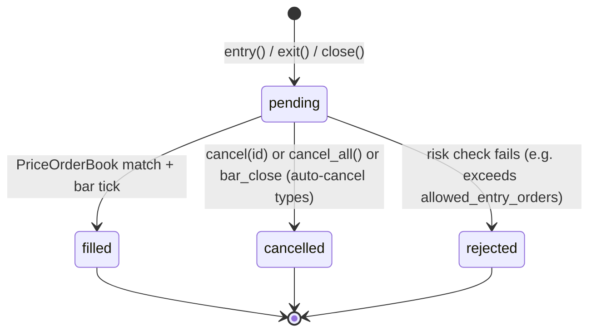

# D5 — Strategy Engine + `request.security` Runtime Design

> **Phase 2 foundational design.** Locks the architectural choices for
> M2 (strategies + cross-timeframe/symbol data) before any Phase 2
> implementation begins. Mirrors the D1/D2/D3 → Phase 1 pattern.
>
> **Parent bead:** `OpenBBTechnical-0e9.6` (Phase 2 rollup, GH #108)
> **This bead:** `OpenBBTechnical-0e9.6.1`
> **Blocks:** every subsequent Phase 2 implementation bead

## 0. Executive summary

**The single biggest finding**: PyneCore already ships a full strategy engine. `third_party/pynecore/src/pynecore/lib/strategy/` defines `Order`, `Trade`, `SimPosition`, `PriceOrderBook`, and the full `cancel/close/entry/exit/close_all/cancel_all` builtin surface. `third_party/pynecore/src/pynecore/core/strategy_stats.py` ships `StrategyStatistics` — a `@dataclass` with **50+ KPI fields matching TradingView's Strategy Tester output verbatim** — plus a `calculate_strategy_statistics()` function that computes them from a trade list. `ScriptRunner` already knows about `is_strat = self.script.script_type == script_type.strategy` (line 342) and installs a `SimPosition` for `@script.strategy(...)`-decorated modules (line 378-379).

**Same shape as the R7 (Wave 2B) discovery** that PyneCore had `_plot_data.clear()` semantics we had to snapshot around: we build atop what PyneCore already ships, we don't reinvent. The Phase-2 work is **integration + surface exposure**, not compiler-engine-from-scratch.

**Design pivot from what the D5 bead originally spec'd**: this doc treats PyneCore's strategy engine as **existing infrastructure** (like `ScriptRunner` was for Phase 1), and describes how our compiler + runtime layers plumb Pine `strategy(...)` decls through to it and how our executor surfaces the KPI table + trade list + equity curve on the `OBBject` return. Estimated Phase 2 scope: **~15-20 sub-beads** (down from initial ~30 estimate), because PyneCore ate the hard part.

**M2 acceptance gates locked** (PRD §8.1):
- (M2a) Naïve "RSI<30 buy / >70 sell" Pine strategy matches TV equity curve at ≤ 0.1 %
- (M2b) Trade-list exact-match parity vs TV "List of Trades" CSV export
- (M2c) Backtest results consumable by existing `openbb-backtest` analytics
- (M2d) `request.security` works via FMP; `data_resolver` escape hatch in Python API
- (M2e) Wild-corpus coverage ≥ 70 % on curated corpus

---

## 1. Order engine architecture

### 1.1 PyneCore's existing surface (what we consume)

At `pynecore/lib/strategy/__init__.py`:

| PyneCore symbol | Type | Pine equivalent |
|---|---|---|
| `class Order` | dataclass | Internal order object |
| `class Trade` | dataclass | A closed trade (round-trip) |
| `class SimPosition(PositionBase)` | class | The running position + equity accountant |
| `class PriceOrderBook` | class | Order queue between bars |
| `def entry(id, direction, qty, limit=…, stop=…, comment=…)` | function | `strategy.entry` |
| `def exit(id, from_entry, qty=…, limit=…, stop=…, …)` | function | `strategy.exit` |
| `def close(id, comment=…, qty=…, immediately=…)` | function | `strategy.close` |
| `def close_all(comment=…, alert_message=…, immediately=…)` | function | `strategy.close_all` |
| `def cancel(id)` / `def cancel_all()` | function | `strategy.cancel` / `strategy.cancel_all` |
| `long` / `short` (from `direction.long`/`direction.short`) | constants | `strategy.long` / `strategy.short` |
| `fixed` / `cash` / `percent_of_equity` (from `QtyType`) | constants | Pine `strategy.qty_type` values |
| `_order_type_normal` / `_order_type_entry` / `_order_type_close` (private) | IntEnum | Internal order kind |

### 1.2 Order lifecycle (FSM — PyneCore's model, documented for our reference)



Pine's convention (PyneCore honors): an order submitted **this bar** normally fills at **next bar's open**. Opt-in `strategy(process_orders_on_close=true)` fills at current-bar close instead. Opt-in `strategy(calc_on_order_fills=true)` re-runs the script body after each intra-bar fill.

### 1.3 What OUR layer adds

**Nothing at the FSM level.** We do not wrap `Order`, `Trade`, `SimPosition` — the compiler emits Pine code that PyneCore's `@script.strategy` decorator + `SimPosition` handle. What we DO add:

1. **Compiler side**: `strategy(...)` decl → `@script.strategy(...)` decorator emission (C5 codegen)
2. **Type-checker side**: allow `strategy.entry/exit/close/close_all/cancel/cancel_all/long/short` as builtin identifiers (C3 signatures)
3. **Runtime side**: post-run collection of `SimPosition.closed_trades` list → serialize to our `.extra["orders"]` list, feed to `calculate_strategy_statistics()` → serialize to `.extra["stats"]`
4. **Grammar side**: no changes needed — `strategy(...)` is a top-level function call, parses like `indicator(...)` today

### 1.4 Our order/trade/position data shapes (thin wrappers for JSON)

These are the **serialized-for-`.extra`** shapes, not runtime data structures. PyneCore owns runtime; we own the wire format the OBBject exposes.

```python
# openbb_pine/runtime/strategy_types.py — Phase 2 new module

from __future__ import annotations
from dataclasses import dataclass
from datetime import datetime
from typing import Literal


@dataclass(frozen=True, slots=True)
class TradeSummary:
    """One closed round-trip trade. Serialized into `.extra["orders"]`."""
    trade_num: int                    # 1-indexed
    side: Literal["long", "short"]
    entry_id: str                     # Pine's entry_id string
    entry_time: datetime              # bar timestamp of entry fill
    entry_price: float
    entry_signal: str                 # comment= from strategy.entry()
    exit_time: datetime
    exit_price: float
    exit_signal: str                  # comment= from strategy.exit() or close()
    qty: float                        # shares/contracts (Pine's "qty")
    pnl: float                        # gross P&L in currency
    pnl_percent: float
    commission: float                 # paid on entry + exit
    slippage: float                   # sum of entry + exit slippage
    bars_in_trade: int
    runup: float                      # max favorable excursion
    drawdown: float                   # max adverse excursion
```

```python
@dataclass(frozen=True, slots=True)
class OpenPositionSummary:
    """The one running position (long / short / flat) at end-of-run."""
    side: Literal["long", "short", "flat"]
    qty: float
    avg_entry_price: float
    unrealized_pnl: float
    unrealized_pnl_percent: float
    bars_open: int
    entry_time: datetime | None       # None when side="flat"
```

### 1.5 Design decision: pluggable fill / slippage / commission — deferred

PyneCore ships one default fill model (next-bar-open) and one commission model (percentage-of-value or fixed-per-trade based on `strategy(commission_type=…)`). **We do NOT introduce a pluggable `FillModel` protocol** in M2 — YAGNI. If a user needs different fill semantics, they set them via the `strategy()` directive (Pine's canonical mechanism); PyneCore honors those and we surface them. If someday demand for a truly custom fill model surfaces, refactoring one concrete class into a protocol is a 1-day job (same pattern as the FMP-only decision per PRD §13.8).

**Locked defaults** (matching Pine/TV out-of-box):
- Fill: next-bar-open
- Slippage: 0 unless script sets `strategy(slippage=N)`
- Commission: 0 unless script sets `strategy(commission_value=…, commission_type=…)`
- Initial capital: `strategy(initial_capital=N)` — default 100000
- Currency: `strategy(currency=…)` — default `currency.NONE`

---

## 2. Position tracking & equity curve

### 2.1 PyneCore already tracks

`SimPosition` (subclass of `PositionBase`) maintains:
- Running qty, avg_entry_price, side
- Realized P&L (sum of closed trades' pnl)
- Unrealized P&L (from current close vs avg entry)
- Equity = initial_capital + realized + unrealized
- `equity_curve` list emitted per bar
- `closed_trades: list[Trade]`

### 2.2 What we surface on the OBBject

For a strategy run, `run_compiled()` returns:

| OBBject field | Content |
|---|---|
| `.results` | `pd.DataFrame` indexed by timestamp, columns = `equity`, `unrealized_pnl`, `realized_pnl`, `drawdown_pct`, `cash`, `position_qty`, plus any `plot()` outputs from the script |
| `.extra["orders"]` | `list[TradeSummary.asdict()]` — one per closed trade |
| `.extra["open_position"]` | `OpenPositionSummary.asdict()` — the running position at end-of-run |
| `.extra["stats"]` | `dict` — full `StrategyStatistics.asdict()` from PyneCore (50+ KPIs) |
| `.extra["alerts"]` | same as indicator mode (per D2 §6.1) |
| `.extra["attribution"]` | `POWERED_BY_FULL` literal — unchanged |
| `.extra["compile_cache_hit"]`, `.extra["exec_ms"]`, `.extra["provider_used"]`, `.extra["bars_consumed"]` | same as indicator mode |
| `.extra["script_type"]` | `"strategy"` — lets client distinguish |

`.extra["orders"]` staying `[]` for indicator scripts and populated for strategies matches D2 §6.1's reserved-slot design; no shape change on the indicator path.

### 2.3 Bar-by-bar collection

Same pattern as R7's `_plot_data.clear()` handling: PyneCore mutates `SimPosition` in place during `ScriptRunner.run_iter()` iteration. Our executor:

1. Sets up the strategy hook on `SimPosition`: subscribe to per-bar equity snapshot (`SimPosition.equity_at_bar_end`)
2. Snapshots `dict(equity_data)` after each yield (never a reference — same defense as _plot_data)
3. Post-run: reads `SimPosition.closed_trades` (list of `Trade` objects) once
4. Passes to `calculate_strategy_statistics(trades, initial_capital)` → `StrategyStatistics`

**No hot-path work** — the equity curve is a snapshot per bar (O(1) per bar), trades read once at end.

---

## 3. Strategy KPIs — the `.extra["stats"]` shape

### 3.1 PyneCore's `StrategyStatistics` fields (used verbatim)

From `pynecore/core/strategy_stats.py` — matches TradingView Strategy Tester output exactly. Fields grouped:

**Overview** (5): `net_profit`, `net_profit_percent`, `gross_profit`, `gross_profit_percent`, `gross_loss`, `gross_loss_percent`

**Equity extremes** (4): `max_equity_runup`, `max_equity_runup_percent`, `max_equity_drawdown`, `max_equity_drawdown_percent`

**Benchmarks** (4): `buy_and_hold_return`, `buy_and_hold_return_percent`, `sharpe_ratio`, `sortino_ratio`, `profit_factor`

**Trade counts** (5): `total_trades`, `winning_trades`, `losing_trades`, `percent_profitable`, `avg_trade`, `avg_trade_percent`

**Trade averages** (6): `avg_winning_trade`, `avg_winning_trade_percent`, `avg_losing_trade`, `avg_losing_trade_percent`, `largest_winning_trade`, `largest_losing_trade`

**Bars-in-trade** (3): `avg_bars_in_trades`, `avg_bars_in_winning_trades`, `avg_bars_in_losing_trades`

**Consecutive streaks** (2): `max_cons_winning_trades`, `max_cons_losing_trades`

**Long/short split** (~15): `long_trades`, `long_winning_trades`, `long_net_profit`, ... (mirrors overview but partitioned)

**Total: 50+ fields.** All serializable via `dataclasses.asdict()`.

### 3.2 M2 acceptance gate (M2b — trade-list parity)

TV's Strategy Tester CSV export uses the exact same field names as PyneCore's `write_strategy_statistics_csv()` — we can compare row-by-row. Conformance harness:

```
tests/conformance_strategy/rsi_reversal.pine        # Pine v6 source
tests/conformance_strategy/rsi_reversal.equity.csv  # per-bar equity from TV export
tests/conformance_strategy/rsi_reversal.trades.csv  # per-trade from TV export
tests/conformance_strategy/rsi_reversal.stats.csv   # KPI table from TV export
```

Test asserts:
1. equity curve values match at ≤ 0.1 % relative (numerical noise budget for floating point)
2. trade list is byte-identical after normalizing column order + timestamp format
3. `stats.csv` values match — the KPIs where TV and PyneCore both compute floats agree at ≤ 0.1 %

**Locked**: minimum 5 conformance strategy fixtures at M2 gate (M2b). Names + rough scripts:
- `rsi_reversal.pine` — RSI 30/70 mean reversion (M2a gate reference)
- `sma_crossover.pine` — fast/slow SMA cross
- `breakout_atr_trail.pine` — Donchian breakout + ATR trailing stop
- `bb_squeeze.pine` — Bollinger Band squeeze breakout
- `macd_histogram_signal.pine` — MACD histogram zero-cross

---

## 4. `request.security` dispatcher

### 4.1 Compiler-side (D1 §3.1 amendment)

Codegen already tags `CompiledModule.security_contexts: dict | None` per D1 §3.1 — stub-populated by C3. **D5 locks the full shape**:

```python
# openbb_pine/compiler/types.py — extend

@dataclass(frozen=True, slots=True)
class SecurityContext:
    """One `request.security(symbol, tf, expr)` call in the compiled script.

    Runtime uses this to prefetch the secondary series before the main
    script iterates (rather than fetching lazily on every bar — which
    would blow the FMP retry budget).
    """
    context_id: str                       # unique per call site: "ctx_0", "ctx_1", …
    symbol: str                           # "SPY", "AAPL", "syminfo.ticker" (dynamic)
    timeframe: str                        # "1D", "60", "5", "" (chart TF), "syminfo.timeframe"
    lookahead: Literal["off", "on"] = "off"     # Pine's request.security lookahead=
    gaps: Literal["off", "on"] = "off"          # Pine's request.security gaps=
    fill_method: Literal["ffill", "none"] = "ffill"
    dynamic_symbol: bool = False          # True if symbol resolved from a series expr at runtime
    dynamic_timeframe: bool = False       # True if timeframe is a series expr
```

C3 populates one `SecurityContext` per `request.security(...)` call site during type-check. Codegen (C5) emits a module-level `__security_contexts__: dict[str, SecurityContext]` constant that the runtime reads pre-iteration.

### 4.2 Runtime dispatcher

```python
# openbb_pine/runtime/security_dispatcher.py — new

def prefetch_security_contexts(
    contexts: dict[str, SecurityContext],
    primary: FMPRequest | pd.DataFrame,
    *,
    fmp_provider: FMPOHLCVProvider | None,
    data_resolver: Callable[[str, str], pd.DataFrame] | None = None,
    cache: SecondarySeriesCache | None = None,
) -> dict[str, pd.DataFrame]:
    """Fetch every secondary series before ScriptRunner.run_iter() starts.

    Returns: {context_id: DataFrame} — the executor threads this into
    PyneCore's `request.security` runtime via a module-level global that
    the emitted @pyne module reads.

    Priority:
        1. If data_resolver supplied (Python API only), call it.
        2. Else if the context is dynamic-symbol/dynamic-timeframe, defer
           to lazy per-bar fetch (rare; documented perf caveat).
        3. Else fetch via fmp_provider with shared retry budget.
        4. Alignment: forward-fill to primary series' timestamps.
    """
```

Cache aggressively:
- Key: `(symbol, timeframe, start_bar, end_bar)`
- TTL: 1 day for daily/higher timeframes, 1 hour for intraday
- Storage: `~/.openbb/pine_cache/secondary/` — separate dir from primary compile cache
- Hit rate expected: high — real strategies request the same 2-3 secondaries repeatedly across backtests

### 4.3 BYO-mode + `request.security`

BYO users passing `records=` for the primary series get their secondaries via FMP by default (documented in D2 §5.3). Python API escape hatch:

```python
obb.pine.run_byo(
    source=strategy_src,
    records=my_ohlcv,
    symbol="MYPRIVATE",
    # Python-only extension: user-supplied resolver for secondaries
    data_resolver=lambda sym, tf: fetch_my_private(sym, tf),
)
```

REST facade **does NOT** expose `data_resolver` — no way to pass a callable across HTTP. REST BYO users whose scripts hit `request.security("OTHER", ...)` get FMP-routed secondaries or a `PineFMPRequiredError` if no FMP key. Documented limitation; PRD §4.10 already flags.

### 4.4 Fully-dynamic symbol/timeframe

Pine supports `request.security(syminfo.ticker, tf, expr)` where `tf` is a series expression. In that case C3 can't statically resolve — `SecurityContext.dynamic_timeframe=True`. Runtime handles per-bar lazy fetch (with the same cache), documented perf caveat: **dynamic-symbol scripts run 5-10× slower than static-symbol** because they can't prefetch.

---

## 5. Executor extensions for strategy mode

### 5.1 Script-type detection

```python
# openbb_pine/compiler/types.py — extend CompiledModule

@dataclass(frozen=True, slots=True)
class CompiledModule:
    # ... existing fields ...
    script_type: Literal["indicator", "strategy", "library"] = "indicator"
```

C5 codegen sets `script_type` based on which top-level decl fires:
- `indicator(...)` → `script_type="indicator"`
- `strategy(...)` → `script_type="strategy"`
- `library(...)` → `script_type="library"` (still M3-deferred; carries the marker for future)

### 5.2 Executor branching

```python
# openbb_pine/runtime/executor.py — extend run_compiled()

def run_compiled(compiled, *, provider_or_data, symbol, ...) -> OBBject:
    if compiled.script_type == "library":
        raise PineUnsupportedFeatureError("PF011 library() — M3 deferral")

    # 1) Prefetch secondaries if any request.security contexts
    if compiled.security_contexts:
        secondaries = prefetch_security_contexts(
            compiled.security_contexts,
            primary=provider_or_data,
            fmp_provider=_resolve_fmp(...),
            data_resolver=kwargs.get("data_resolver"),
        )
        # Inject into PyneCore's request.security substrate before import
        _install_secondaries_hook(secondaries)

    # 2) Import + iterate — same as indicator mode
    module = _import_compiled(compiled)
    runner = ScriptRunner(module_path)
    bars = _bar_iter(provider_or_data)

    # 3) Snapshot equity + plot data per bar (strategy adds equity snap)
    plot_snapshots = []
    equity_snapshots = []  # NEW for strategy mode
    for i, (candle, plot_data) in enumerate(runner.run_iter(bars, ...)):
        plot_snapshots.append(dict(plot_data))  # per _plot_data.clear() fix
        if compiled.script_type == "strategy":
            equity_snapshots.append(_snapshot_equity(runner.script.position, candle))

    # 4) Build OBBject
    results = _plot_snapshots_to_df(plot_snapshots)
    extra = _base_extra(...)  # attribution, cache, exec_ms, provider_used, bars_consumed, alerts

    if compiled.script_type == "strategy":
        position = runner.script.position  # SimPosition instance
        trades = position.closed_trades
        stats = calculate_strategy_statistics(trades, position.initial_capital, ...)

        # Merge equity into results DataFrame
        equity_df = _equity_snapshots_to_df(equity_snapshots)
        results = results.join(equity_df, how="outer")  # equity columns alongside plots

        extra["orders"] = [asdict(TradeSummary.from_pynecore(t)) for t in trades]
        extra["open_position"] = asdict(OpenPositionSummary.from_pynecore(position))
        extra["stats"] = asdict(stats)
        extra["script_type"] = "strategy"
    else:
        extra["orders"] = []                       # per D2 §6.1 reserved slot
        extra["script_type"] = "indicator"

    return OBBject(results=results, extra=extra)
```

### 5.3 `_install_secondaries_hook`

PyneCore's `request.security` builtin lives in `pynecore.lib.request`. We monkey-patch (per R7's precedent with `capture_alerts`) to feed our prefetched DataFrames instead of PyneCore's default resolution (which requires TV-style data source). The monkey-patch is scoped to one `run_compiled()` call via context manager — same pattern as `enforce_limits`.

---

## 6. openbb-backtest integration

### 6.1 Soft dependency

Consume: `openbb-backtest` is not a hard dep — it's an optional consumer of our strategy `.extra["stats"]` output.

```python
# openbb_pine/runtime/backtest_bridge.py — new

def maybe_export_to_backtest(strategy_result: OBBject) -> None:
    """If openbb-backtest is installed, register the run for its analytics
    layer. No-op otherwise (documented in .extra["warnings"] once)."""
    try:
        from openbb_backtest.analytics import ingest_pine_strategy
    except ImportError:
        strategy_result.extra.setdefault("warnings", []).append(
            "openbb-backtest not installed — install it to enable KPI analytics "
            "cross-referencing. See README §Analytics integration."
        )
        return
    ingest_pine_strategy(strategy_result)
```

Called optionally by `run_compiled()` when `script_type == "strategy"`. Users can opt out via `strategy(...)` context.

### 6.2 Shape adapter

`openbb-backtest.analytics.ingest_pine_strategy` (function we PR into openbb-backtest, or wrap ourselves if that PR takes time) accepts our `strategy_result.extra["stats"]` + `.extra["orders"]` and produces backtest.analytics's native shapes. See `openbb_platform/extensions/backtest/openbb_backtest/models.py` for exact schemas. Fields expected:

- `openbb_backtest.models.BacktestResult` — top-level container
- `openbb_backtest.models.TradeList` — the trade series
- `openbb_backtest.models.EquityCurve` — bar-by-bar

Our `TradeSummary` maps 1:1 to `TradeList` entries; `equity_df` maps to `EquityCurve`; `stats` dict flattens into `BacktestResult.summary`. Documented in Phase 2 implementation-bead spec.

### 6.3 Bidirectional: strategies-in-from-pine

techtrade's `[tool.poetry.plugins."openbb_backtest_strategies"]` entry point (see `openbb_platform/extensions/techtrade/pyproject.toml`) registers a strategy class for `openbb-backtest` discovery. **We adopt the same pattern**:

```toml
[tool.poetry.plugins."openbb_backtest_strategies"]
pine_bundled = "openbb_pine.backtest_strategies:PineBundledStrategy"
```

`PineBundledStrategy` exposes each `openbb_pine/assets/widgets.json` bundled strategy as a `openbb-backtest`-discoverable class. Zero user setup — install both extensions, both discover each other via entry points.

---

## 7. Compiler extensions (D1 amendment surface)

Flagged for Phase-2 implementation beads; **not owned by D5**.

### 7.1 Grammar (C2)

- `strategy(...)` decl parsing — currently `strategy` is treated as a generic identifier; needs to be a first-class top-level statement like `indicator(...)`
- `request.security(...)` — already parses as a generic call. No grammar change; C3 tags it.
- `strategy.entry / strategy.exit / strategy.close / strategy.close_all / strategy.cancel / strategy.cancel_all / strategy.long / strategy.short` — already parse as `.` attribute access; C3 adds to signatures.

### 7.2 Signatures (C3)

Add to `openbb_pine/compiler/builtin_signatures.py`:

```python
"strategy.entry": Signature(
    args=(
        ("id", _CONST_STRING),
        ("direction", _CONST_STRING),          # "long" | "short"
    ),
    kwargs={
        "qty": _SIMPLE_FLOAT,
        "limit": _SERIES_FLOAT,
        "stop": _SERIES_FLOAT,
        "comment": _CONST_STRING,
        "alert_message": _CONST_STRING,
        # …
    },
    returns=_VOID,
    notes="IMPLEMENTED",
),
# ... similar for strategy.exit / close / close_all / cancel / cancel_all

"request.security": Signature(
    args=(
        ("symbol",    _SIMPLE_STRING),  # or series if dynamic — C3 flags
        ("timeframe", _SIMPLE_STRING),
        ("expression", _SERIES_ANY),
    ),
    kwargs={
        "gaps":      _CONST_BOOL,
        "lookahead": _CONST_BOOL,
    },
    returns=_SERIES_ANY,               # matches `expression` return type
    notes="IMPLEMENTED",
),
```

C3 side-effect: when it sees `request.security(...)`, populate `CompiledModule.security_contexts` with the new `SecurityContext` (see §4.1). When it sees `strategy(...)` directive, set `CompiledModule.script_type = "strategy"`.

### 7.3 Codegen (C5)

- `strategy(title=..., ...)` → `@script.strategy(title=..., ...)` decorator (same shape as `@script.indicator`)
- `strategy.entry(...)` → `strategy.entry(...)` in emitted Python (bridge already exists at `openbb_pine/stdlib/strategy.py` — new file)
- `request.security(sym, tf, expr)` → generated call that reads from the prefetched-secondaries dict via a runtime helper

### 7.4 v5 migration shim extension (C7)

C7 currently rewrites `study(...)` → `indicator(...)`. Phase 2 adds:
- Detection of `strategy()` in v5 — no syntactic rewrite needed (same call surface in v5 and v6), but v5's `strategy.exit(from_entry=...)` positional-vs-keyword differences may need a shim; investigate as Phase-2 sub-bead.
- v5 `security(sym, tf, expr)` → `request.security(sym, tf, expr)` — already in C7's V5_REWRITES catalog (added Wave 3B, commit `0d2765ad4`).

---

## 8. Platform extensions (D3 amendment surface)

Flagged for Phase-2 implementation beads; **not owned by D5**.

### 8.1 `/pine/strategies/run` flip

Currently returns HTTP 501 with `PineStrategyNotYetImplementedError`. Phase-2 bead flips this to real via the shared `_compile_and_run()` internal helper (bead `0e9.11` pattern):

```python
# openbb_pine/routers/strategies_router.py — M2 refactor

async def run(source, provider="fmp_cached", symbol="AAPL", interval="1d",
              start=None, end=None, params=None, strategy_params=None,
              timeout_s=30) -> OBBject:
    resolve_provider(provider)
    result = _compile_and_run(
        source=source,
        provider_or_data=provider,
        symbol=symbol, interval=interval, start=start, end=end,
        params=params, timeout_s=timeout_s,
    )
    if result.extra.get("script_type") != "strategy":
        raise PineTypeError(rule="PT099", message=(
            "Source does not use `strategy(...)`; use /pine/run for indicators."
        ))
    # strategy_params override — post-compile setting adjustments if needed
    _apply_strategy_params(result, strategy_params or {})
    return result
```

### 8.2 `/pine/strategies/run_byo` mirror

Same split-facade pattern from bead `0e9.11`. Signature: `source, records, symbol, tz, params, strategy_params, timeout_s`.

### 8.3 `/pine/strategies/list` new endpoint

Mirror of `/pine/indicators/list` but for bundled strategies (from widgets.json's `bundled_strategies` section — new key). Returns `list[BundledStrategyEntry]`.

### 8.4 Bundled strategy widgets

Extend `openbb_pine/assets/widgets.json` with 3-5 bundled strategies for M2:
- RSI Reversal (M2a acceptance-gate script)
- SMA Crossover
- Breakout + ATR Trailing Stop

Each shipped with the widget footer attribution literal (surface #2 test continues to enforce).

---

## 9. Testing strategy

### 9.1 Strategy conformance harness

New directory `tests/conformance_strategy/`. Fixture triples:

```
tests/conformance_strategy/
  rsi_reversal.pine
  rsi_reversal.equity.csv      # per-bar: timestamp, equity
  rsi_reversal.trades.csv      # per-trade: entry_time, exit_time, side, pnl, ...
  rsi_reversal.stats.csv       # KPI table
  ... (sma_crossover, breakout_atr, bb_squeeze, macd_histogram)
```

Harness (parallels existing `tests/conformance/conftest.py`):

```python
# tests/conformance_strategy/conftest.py

@pytest.fixture(params=_discover_strategy_triples())
def strategy_conformance_triple(request):
    """Each param is (Path('foo.pine'), Path('foo.equity.csv'),
                       Path('foo.trades.csv'), Path('foo.stats.csv'))."""
    return request.param
```

Test:

```python
def test_strategy_equity_parity(strategy_conformance_triple):
    pine, equity_csv, trades_csv, stats_csv = strategy_conformance_triple
    result = obb.pine.strategies.run_byo(
        source=pine.read_text(),
        records=_load_test_ohlcv_for(pine),  # deterministic 500-bar fixture
        symbol="TEST",
    )
    expected_equity = pd.read_csv(equity_csv).set_index("timestamp")["equity"]
    actual_equity = result.results["equity"]
    np.testing.assert_allclose(
        actual_equity.values, expected_equity.values,
        rtol=1e-3,  # 0.1% relative tolerance per M2a gate
    )

def test_strategy_trade_list_exact_match(strategy_conformance_triple):
    ...
    expected_trades = pd.read_csv(trades_csv)
    actual_trades = pd.DataFrame(result.extra["orders"])
    # Normalize column order + timestamp tz, then byte-compare
    _assert_trade_frames_equal(actual_trades, expected_trades)
```

### 9.2 v5 strategy roundtrip

3 v5 strategy fixtures in `tests/integration/v5_fixtures/`:
- `v5_strategy_simple.v5.pine` + `.v6.pine` — trivial strategy
- `v5_strategy_security.v5.pine` + `.v6.pine` — uses v5 `security()` (C7 already rewrites)
- `v5_strategy_iff_exit.v5.pine` + `.v6.pine` — v5 `iff()` in exit condition (C7 rewrites)

Assert: v5 script and hand-migrated v6 counterpart produce identical trade lists at exact-match.

### 9.3 openbb-backtest integration test

`tests/integration/test_backtest_integration.py`:

```python
@pytest.mark.skipif(not _openbb_backtest_installed(), reason="openbb-backtest not installed")
def test_pine_strategy_result_consumable_by_backtest_analytics():
    result = obb.pine.strategies.run_byo(source=RSI_REVERSAL_SRC, records=OHLCV, symbol="X")
    from openbb_backtest.analytics import summarize
    summary = summarize(result)   # or whatever the actual entry point is
    assert summary.total_return is not None
    assert summary.sharpe_ratio is not None
```

### 9.4 request.security fixtures

Extend curated corpus:

```
tests/wild_corpus/curated_scripts/request_security_multi_symbol.pine
tests/wild_corpus/curated_scripts/request_security_multi_tf.pine
tests/wild_corpus/curated_scripts/request_security_pair_trade.pine
```

Each is real Pine using `request.security` in the shape wild-corpus scripts do (equity vs SPY, chart TF vs daily TF, etc.). Fingerprinter picks up `request.security` in `features_used` — after M2 lands the runtime dispatcher, these move from "blocker" to "runnable" in coverage.

---

## 10. Wild-corpus coverage — M2 gate (≥70 %)

Post-M1 baseline: **95.9% on curated corpus** (bead `0e9.13`), but M1's curated corpus has only 49 entries and 0 with real `request.security`. Adding Phase-2 fixtures grows the corpus AND raises the bar.

M2 expansion plan:
- Add 5 strategy fixtures (conformance harness above)
- Add 3 `request.security` fixtures (curated corpus)
- Add 10-15 real-world-shaped Pine v6 scripts covering common patterns not yet in the corpus (multi-indicator strategies, breakout + oscillator confluence, etc.)

Target M2 corpus size: 70-75 entries. Coverage target: ≥ 70 % (M2 gate M2e). Given Phase 2 also implements strategy + request.security, actual coverage post-M2 should land at 85-90 % on the expanded corpus.

Telemetry additions (extend `openbb_pine/telemetry.py`):

```python
pine_strategy_orders_total{state="filled|cancelled|rejected"}   # per-order state counter
pine_strategy_runs_total{result="success|error"}                # run-outcome counter
pine_security_context_fetches_total{provider,cache_hit=t|f}     # cross-symbol traffic
```

---

## 11. Non-goals — explicit rejections

Documented so scope creep during Phase 2 gets caught early:

- ❌ **Pine v4 strategy syntax** — v5→v6 only; v1-v4 out of scope per PRD §3.3
- ❌ **Real-broker order routing** — Phase 2 is backtest engine only; live trading is a future dedicated phase (probably v3.0)
- ❌ **Multi-asset portfolio backtests** — single-symbol strategies only in M2. Multi-symbol via `request.security` is a *data* concern, not a portfolio-management concern
- ❌ **Options / futures with margin, greeks** — cash equity only in M2
- ❌ **Custom `FillModel` protocol** — PyneCore's built-in fill model + Pine's `strategy(slippage=…, commission_value=…)` cover 95 % of use cases. Refactor to protocol only if 3+ users request non-standard fill semantics
- ❌ **Live streaming / WebSocket Pine** — bar-by-bar batch only in v1.x per PRD §3.3
- ❌ **Custom order types beyond market/limit/stop/stop_limit** — Pine's canonical set; brackets emitted via multi-order composition, not new types

---

## 12. Estimated Phase 2 sub-bead breakdown

Based on this design, the follow-on implementation decomposition (to be filed as `0e9.6.2 ... 0e9.6.N` after D5 review):

| Layer | Sub-beads | Effort |
|---|---|---|
| Compiler grammar + signatures (C2/C3 extensions) | 3 | 1 week |
| Codegen extensions (`@script.strategy` decorator, security_contexts population) | 2 | 3 days |
| C7 v5 strategy migration shim extensions | 1 | 2 days |
| Runtime: script_type field on CompiledModule | 1 | 1 day |
| Runtime: SimPosition → OBBject bridge (strategy_types + serializer) | 2 | 3 days |
| Runtime: prefetch_security_contexts + secondaries cache | 3 | 1 week |
| Runtime: _install_secondaries_hook monkey-patch | 1 | 2 days |
| Executor: strategy branch in run_compiled() | 1 | 3 days |
| openbb-backtest bridge (soft-dep import + shape adapter) | 2 | 3 days |
| Platform: strategies_router.run flip from 501 to real | 1 | 2 days |
| Platform: strategies_router.run_byo new endpoint | 1 | 1 day |
| Platform: /pine/strategies/list endpoint | 1 | 1 day |
| Widgets: 3-5 bundled strategy widgets | 1 | 2 days |
| Tests: conformance_strategy harness + 5 fixtures | 2 | 1 week |
| Tests: 3 v5 strategy roundtrip fixtures | 1 | 2 days |
| Tests: openbb-backtest integration test | 1 | 1 day |
| Corpus: 3 request.security curated fixtures + 10 misc | 1 | 2 days |
| **Total** | **25 sub-beads** | **~5 weeks** |

Well under the 6-week PRD §6 Phase-2 estimate — that budget was based on the assumption that the strategy engine had to be built from scratch. PyneCore's ready-made engine buys back ~2 weeks.

---

## Cross-refs

- PRD `temp/openbb-pine-extension-prd.md`: §3.2 (Phase 2 scope), §8.1 (M2 gates), §4.6 (FMP bridge), §13.8 (FMP-only), §16.6 (M1 shipping findings — facade split precedent)
- D1 `docs/designs/openbb-pine/D1-compiler-architecture.md`: §3.1 (CompiledModule contract), §5.1 (error model), §2.6 (typed-IR invariants)
- D2 `docs/designs/openbb-pine/D2-runtime-bridge.md`: §2.3 (FMPOHLCVProvider), §5.3 (data_resolver escape hatch), §6.1 (OBBject shape), §9 (retry budget)
- D3 `docs/designs/openbb-pine/D3-platform-integration.md`: §4 (endpoint contracts), §5 (typed-vs-bare OBBject), §7 (MCP registration)
- D4 `docs/designs/openbb-pine/D4-wild-corpus-strategy.md`: §Option C (curated corpus methodology)
- PyneCore `third_party/pynecore/src/pynecore/lib/strategy/__init__.py`: entry/exit/close/cancel + Order/Trade/SimPosition definitions
- PyneCore `third_party/pynecore/src/pynecore/core/strategy_stats.py`: `StrategyStatistics` dataclass + `calculate_strategy_statistics()`
- PyneCore `third_party/pynecore/src/pynecore/core/script_runner.py:342,378`: existing `is_strat` branch + `SimPosition` install
- openbb-backtest `openbb_platform/extensions/backtest/openbb_backtest/models.py`: `BacktestResult`, `TradeList`, `EquityCurve` shapes we adapt to

---

Clean-room: I have not viewed TradingView or PyneComp source code.
