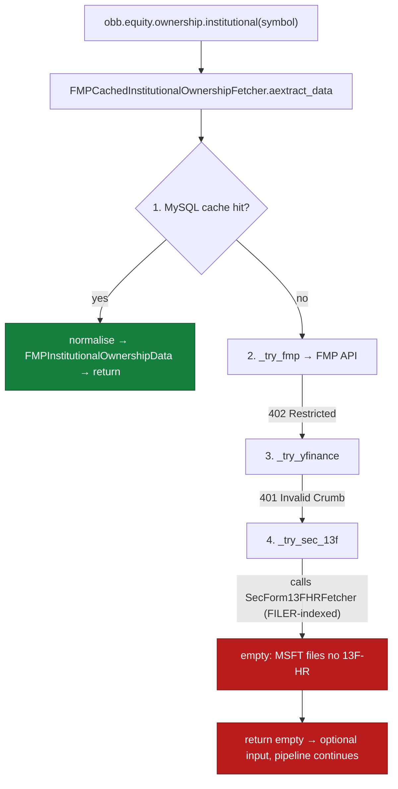
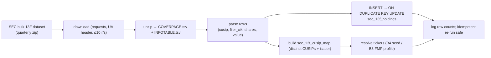

# 89 — SEC bulk 13F + CUSIP index (reverse institutional ownership)

**GitHub:** [#89](https://github.com/prajoria/OpenBB/issues/89) *(proposed — not yet filed)* · **Phase:** Provider infra · **Sprint:** TBD · **Size:** L
**Depends on:** none (self-contained provider work) · **Related:** the `fmp_cached`
institutional-ownership fallback chain surfaced by the §3 Analysis pipeline and
[`notebooks/01-foundations-techtrade-and-analysis.ipynb`](../../../notebooks/01-foundations-techtrade-and-analysis.ipynb)
**Source:** no PRD — this design doc is the primary artifact. Problem statement
captured in §"What this is" below.
**Scope:** Add a MySQL-backed **CUSIP→holders index** built from SEC's quarterly
**Form 13F bulk datasets**, expose a `resolve_cusip(symbol)` + `holders_for_cusip(cusip)`
read path, and rewire the `fmp_cached` institutional-ownership SEC tier to use it —
replacing the current always-empty filer-indexed lookup with a real
"who holds `<symbol>`" answer.

> **Repo note:** provider code lives in this `OpenBBTechnical` checkout.
> Affected providers:
> [`providers/fmp_cached/`](../../../openbb_platform/providers/fmp_cached/) (the consuming
> fallback chain) and [`providers/sec/`](../../../openbb_platform/providers/sec/) (the
> existing — partly stubbed — reverse-13F fetcher). This design doc lives under
> `docs/designs/ownership_13f/` (one doc per issue, issue-number prefix per the
> `quant_trading/` precedent).

---

## What this is

The `fmp_cached` provider answers `obb.equity.ownership.institutional(symbol=…)` through a
four-tier fallback chain (cache → FMP API → yfinance → SEC EDGAR 13F). In the current
environment **all three live tiers fail**, each for an independent reason:

1. **FMP** → `402 Restricted Endpoint` — the `institutional-ownership/symbol-positions-summary`
   endpoint is not in the active FMP plan.
2. **yfinance** → `401 Invalid Crumb` / `"User is unable to access this feature"` — Yahoo blocks
   the `quoteSummary` endpoint family (which serves `major_holders` / `institutional_holders`)
   for this IP/region. Confirmed unfixable client-side: latest `yfinance 1.4.1` + `curl_cffi`
   Chrome impersonation + cache clear all still 401; only the separate chart/history endpoint
   works.
3. **SEC 13F** → empty, **by design**. This is the structural problem this issue fixes.

**The structural problem.** Form 13F-HR is filed *by* institutional managers to report the
securities they hold. It is indexed by the **filer** (manager CIK), not by the **held**
company's ticker. An operating company like MSFT never files a 13F-HR, so the current SEC tier
— which calls the *filer-indexed* `SecForm13FHRFetcher` with `symbol="MSFT"` — legitimately
finds zero filings. To answer **"who holds MSFT"** you must invert the index: resolve MSFT →
its **CUSIP**, then scan *every* manager's 13F holdings and filter rows whose CUSIP matches.
That is a fundamentally different (and much heavier) query than the per-filer fetch the chain
performs today.

**Why "bulk + index" rather than live full-text search.** A reverse fetcher already exists
in-tree — [`SecForm13FHoldingsFetcher`](../../../openbb_platform/providers/sec/openbb_sec/models/form_13f_holdings.py)
with [`search_13f_holders(cusip, …)`](../../../openbb_platform/providers/sec/openbb_sec/utils/helpers.py) —
but it drives SEC's **EFTS full-text search** API live, per request: slow, rate-limited,
paginated, and (critically) its **CUSIP resolution is stubbed to `None`**
(`search_edgar_for_cusip` returns nothing), so it cannot even start from a ticker. Doing this
correctly and fast means **ingesting SEC's official quarterly 13F *bulk* datasets once** into a
local MySQL index keyed by CUSIP, then serving reads from that index in milliseconds — the same
read-through-cache philosophy `fmp_cached` already applies to every other model.

**The principle:** *SEC is authoritative and free; the cost is volume, not access.* We pay the
volume cost **once per quarter** at ingest time and amortize it across every lookup. The
`fmp_cached` chain stays the single consumer; only its SEC tier changes — from "ask EFTS live and
get nothing" to "read the local CUSIP index."

---

## 0. Key decisions (locked) + Open questions

### Locked (do not re-open)

| # | Decision | Choice | Consequence |
|---|---|---|---|
| L1 | Authoritative source | SEC **Form 13F bulk data sets** (quarterly structured `.tsv`/zip dumps from `https://www.sec.gov/dera/data/form-13f`), **not** live EFTS full-text per request | Volume cost paid once/quarter at ingest; reads are local |
| L2 | Index key | **CUSIP** (9-char), the only join key present in 13F `INFOTABLE` rows | Ticker→CUSIP resolution is a required, separate step (Q-B) |
| L3 | Storage | MySQL via existing `openbb_fmp_cached.utils.database` (`DatabaseConfig` / `get_connection` / `execute_many`) in the **`openbb_fmp_cache_test`** DB (the resolved `DatabaseConfig` default per `user_settings`) | No new DB; reuse the existing cache DB + its DDL idempotency pattern |
| L4 | Single consumer | Only the `fmp_cached` institutional-ownership SEC tier reads the index; output is normalized to `FMPInstitutionalOwnershipData` exactly as today | No new public router; the existing `obb.equity.ownership.institutional` surface is unchanged |
| L5 | Network rules | SEC HTTP via `requests` with a descriptive `User-Agent` (SEC requires it), ≤10 req/s, retries with backoff; **no `aiohttp`** (broken on Win/Py3.12 per repo rules) | Ingest is a synchronous, resumable batch script under `Tools/` |
| L6 | Ingest cadence | Manual / scheduled CLI script — **not** auto-triggered inside the read path | A cold read never blocks on a multi-hundred-MB download; missing-quarter → graceful empty |
| L7 | Idempotency | All DDL `CREATE TABLE IF NOT EXISTS`; ingest uses `INSERT … ON DUPLICATE KEY UPDATE` keyed on `(cusip, filer_cik, period)` | Re-running a quarter yields the same row count (repo idempotency rule) |

### Open questions (for review / brainstorm)

**Q-A — Ingest tool home & shape: `Tools/` script vs. provider-internal module.**
The bulk download + parse + load is operationally a batch job (hundreds of MB/quarter, resumable,
logged), which matches the existing `Tools/` script skeleton (sys.path bootstrap, idempotent,
DESIGN.md changelog). But the *read* path is provider code in `providers/sec/` + `providers/fmp_cached/`.
- **Recommendation:** ingest lives in **`Tools/ingest_sec_13f.py`** (operational batch, follows the
  `Tools/` skeleton in §4 of `DEVELOPMENT_RULES.md`); the **read/query** helpers live in
  `providers/sec/openbb_sec/utils/` so both the reverse fetcher and the `fmp_cached` tier can import
  them. The two halves share only the table schema (documented here + in `Tools/docs/DESIGN.md`).
> - **Answer (Review):** ✅ **Agree** — `Tools/` ingest + `providers/sec/.../utils/` read helpers is the
>   right split (operational batch vs. hot read path). Two refinements so the two halves don't drift:
>   1. **Single source of truth for the DDL.** Don't let `Tools/ingest_sec_13f.py` carry its own
>      `CREATE TABLE` strings. Put the DDL + an `init_thirteen_f_index()` in the *read-side* module
>      (`thirteen_f_index.py`) and have the ingest script import and call it. That keeps schema and
>      reader in lockstep and avoids a second copy in `Tools/`.
>   2. **Dependency direction is one-way:** provider code must **not** import from `Tools/`
>      (`Tools/` is not on the installed package path and won't be importable from the `obb` runtime).
>      Ingest imports the provider helper, never the reverse — your layout already implies this; make
>      it an explicit rule in §2.
>   Net: ingest = thin orchestration; schema + all SQL live with the reader.

**Q-B — Ticker→CUSIP resolution (the hard prerequisite; currently stubbed `None`).**
13F rows carry CUSIP, not ticker. `search_edgar_for_cusip` returns `None` today, so the whole reverse
path is dead on arrival without a resolver. Options:

| Option | Source of ticker↔CUSIP map | Tradeoff |
|---|---|---|
| **B1 — SEC `company_tickers.json` + 13F `INFOTABLE` issuer names** | Free, SEC-hosted; but `company_tickers.json` maps ticker↔CIK↔name, **not** CUSIP | Needs a fuzzy name/CIK→CUSIP bridge; imperfect |
| **B2 — Build CUSIP↔issuer map from the 13F bulk data itself** | The bulk `INFOTABLE` has CUSIP + issuer name + class; aggregate distinct CUSIPs and reconcile to tickers via name match | Self-contained (no extra source); name matching is the risk |
| **B3 — FMP `cusip`/`profile` field** | `fmp_cached` already caches company profiles; many include a CUSIP | Reuses warm cache; but coverage/accuracy of FMP CUSIP varies, and it reintroduces an FMP dependency we're trying to route around |
| **B4 — Bundled static seed map for the common universe (e.g. S&P 500)** | Ship a small curated `symbol,cusip` seed for the tickers the notebook/Analysis actually use | Pragmatic MVP; bounded coverage, manual upkeep |

- **Recommendation:** **B2 as the durable index** (CUSIP is the native 13F key — build the authoritative
  CUSIP↔issuer table straight from the bulk data), **seeded/bootstrapped by B4** for the immediate
  notebook universe so the feature is demonstrably working on day one, with **B3 as an opportunistic
  enrichment** when a warm FMP profile already carries the CUSIP. Avoid B1's fuzzy bridge as the primary
  path.
> - **Answer (Review):** ✅ **Agree on B2+B4, but add a deterministic FIGI bridge and drop fuzzy name
>   matching from the critical path.** The recommendation is sound, with three corrections:
>   1. **Use FIGI, not issuer-name fuzzing, as the durable ticker resolver.** Modern 13F `INFOTABLE`
>      rows carry a **FIGI** column (SEC added it; present in recent quarters). FIGI → ticker is a
>      *deterministic* lookup via Bloomberg's free **OpenFIGI API** (batch, ~25 req/min unauthenticated,
>      higher with a free key). This is far more reliable than reconciling `issuer_name` strings and
>      removes B2's stated "name matching is the risk." Recommend: **B2 builds the CUSIP↔issuer table
>      from bulk data (native, free), FIGI-mapping fills `ticker` deterministically where the column
>      exists**, B4 seed guarantees the notebook universe day one, B3 stays opportunistic. Verify FIGI
>      coverage in the actual target quarter before committing (see Q-E pre-task).
>   2. **Mind CUSIP↔ticker cardinality.** A CUSIP encodes issuer **+ issue (share class)**, so one
>      ticker can map to multiple CUSIPs (multiple classes) and the index must tolerate that. Keep
>      `idx_ticker` non-unique (it already is) and have `resolve_cusip(symbol)` return the **set** of
>      CUSIPs for a ticker, not a single value — `holders_for_cusip` should then accept a CUSIP list.
>      This also matters because the *entry point the chain needs is ticker→CUSIP*, the harder
>      direction; the seed covers it for the MVP universe, FIGI covers it generally.
>   3. **B1 rejection is correct** — `company_tickers.json` has no CUSIP and the CIK→CUSIP bridge is
>      exactly the fuzzy step we're avoiding. Keep it out.

**Q-C — Coverage depth: how many quarters / which managers to ingest.**
A full historical 13F corpus is large. The notebook only needs the **latest** quarter's holders for a
held ticker.
- **Recommendation:** MVP ingests the **most recent completed quarter only** (single dataset), schema
  designed so additional quarters append without migration (the `period` column is part of the PK).
  Document the "add a quarter" runbook; don't backfill years in the MVP.
> - **Answer (Review):** ✅ **Agree — latest quarter only for MVP.** Two clarifications to make
>   "latest" unambiguous and observable:
>   1. **"Latest" = latest *published* bulk dataset, not the latest calendar quarter.** 13F-HR is due
>      **45 days after quarter end** and managers dribble in over weeks, so the bulk dataset for Qn
>      isn't complete/published until well into Qn+1. Default `--period` to the most recent dataset
>      SEC actually has up, and log the resolved period explicitly so a cold notebook run can't
>      silently read a half-empty quarter.
>   2. **Add an ingest-manifest row for observability.** A tiny `sec_13f_ingest_runs` table
>      (`period`, `ingested_at`, `row_count`, `source_zip_sha256`, `value_unit`) answers "which quarter
>      is live, how fresh, and in what units" without scanning the holdings table — and gives the
>      idempotency check something to assert against on re-run. Cheap, pays for itself the first time
>      coverage is questioned. Schema-appends-without-migration via `period` in the PK is the right
>      call; keep it.

**Q-D — Output fidelity: what fields the SEC tier returns vs. the FMP schema expects.**
`FMPInstitutionalOwnershipData` has fields (e.g. `investors_holding`, `ownership_percent`,
`total_invested`) that 13F does not directly provide (13F gives per-manager share counts + market
value, not float-relative percentages). Some FMP fields will be `None`/derived.
- **Recommendation:** populate the **directly available** 13F fields (holder name, shares, value,
  period, count of distinct filers) and leave float-relative metrics `None`, with `data_source =
  "sec_13f_bulk"` recorded for provenance. Document the field-by-field mapping in §3.
> - **Answer (Review):** ✅ **Agree on populate-what-13F-gives / `None` the rest**, but the §3 mapping
>   has a **correctness bug to fix** and one shape question to settle:
>   1. **The `value_usd` ×1000 note is wrong for recent data — do NOT blanket-multiply.** SEC amended
>      Form 13F so that, **from 2023-Q2 onward, VALUE is reported in whole dollars**; pre-2023-Q2 it
>      was in **thousands**. A flat ×1000 will inflate every recent holding by 1000×. Normalize
>      **per-period based on the filing format**, not a constant — store the chosen `value_unit` on the
>      ingest-manifest row (Q-C) and assert it in a unit test for both a pre- and post-2023-Q2 fixture.
>      Update the §3 "mind the historical ×1000" cell to "unit varies by period; normalize at parse."
>   2. **Settle the return shape: per-holder rows vs. one aggregate summary.**
>      `FMPInstitutionalOwnershipData` is modeled as a per-symbol/per-period **summary**, whereas the
>      index naturally yields **per-manager** rows. Recommend the SEC tier emit **per-holder rows
>      ranked by `value_usd`** (most useful answer to "who holds X") and compute
>      `investors_holding = COUNT(DISTINCT filer_cik)` as a derived field on each row — but explicitly
>      confirm the downstream Analysis/notebook consumer accepts a list rather than a single summary,
>      since that's a behavioral change from the FMP path's shape.
>   3. **Exclude/segregate option rows from share sums.** `INFOTABLE` rows with `put_call` set are
>      derivative positions; don't fold their `shares` into a long-share aggregate. Filter or flag
>      them — your schema already keeps `put_call`, so just document the rule in the mapping.

**Q-E — Effort & sequencing.** Rough estimate **3–4 days**: ~1d ingest script + schema, ~1d CUSIP
resolver (B2+B4), ~0.5d read helpers + fmp_cached tier rewire, ~1d tests + a notebook verification cell.
Decompose into a bd task chain (see §"Tracking").
> - **Answer (Review):** ✅ **3–4 days is reasonable *if* the resolver is timeboxed to seed+FIGI.** The
>   single risk that can blow the estimate is Q-B: if anyone reaches for issuer-name fuzzy matching the
>   1-day resolver becomes open-ended. Lock the MVP resolver to **B4 seed + deterministic FIGI lookup**
>   and defer broad coverage to a follow-up bd task. Two additions to sequencing:
>   1. **Add a cheap T0 spike before T1/T2:** download **one real quarter's `INFOTABLE.tsv`** and
>      inspect actual columns — confirm (a) FIGI column is present, (b) the VALUE unit for that period
>      (pre/post 2023-Q2), (c) delimiter/encoding quirks. ~1–2h that de-risks the parser, the unit bug
>      (Q-D), and the FIGI bridge (Q-B) before locking schema. Do this first.
>   2. **Resequence tests left, not last (T5).** Write the parser fixture test alongside T2 and the
>      resolver test alongside the resolver (TDD per repo skill) rather than batching all tests at the
>      end — the parser/unit normalization is exactly where the ×1000 bug hides. End-to-end + notebook
>      cell can stay last. Otherwise the T1→T2/T3→T4→tests→notebook ordering is correct, and the bd
>      dep-schema limitation is noted/acceptable.

---

## 1. Current state (grounded in code)



**Key files & facts:**

| File | Current behavior | Change in #89 |
|---|---|---|
| [`providers/fmp_cached/openbb_fmp_cached/models/institutional_ownership.py`](../../../openbb_platform/providers/fmp_cached/openbb_fmp_cached/models/institutional_ownership.py) | `_try_sec_13f` calls the **filer-indexed** `SecForm13FHRFetcher` with the held symbol → always empty | Rewire to call the new **CUSIP-index** read path (`resolve_cusip` → `holders_for_cusip`) |
| [`providers/sec/openbb_sec/models/form_13f_holdings.py`](../../../openbb_platform/providers/sec/openbb_sec/models/form_13f_holdings.py) | `SecForm13FHoldingsFetcher` exists (reverse) but drives **live EFTS** full-text search; slow, rate-limited | Optionally back this fetcher with the local index too (shared read helper) |
| [`providers/sec/openbb_sec/utils/helpers.py`](../../../openbb_platform/providers/sec/openbb_sec/utils/helpers.py) | `search_13f_holders(cusip, …)` live; `search_edgar_for_cusip` **stubbed → `None`** | Add `resolve_cusip(symbol)` + `holders_for_cusip(cusip)` reading the MySQL index |
| `Tools/ingest_sec_13f.py` | does not exist | **New** batch ingest script (bulk download → parse → load) |

---

## 2. Module layout (new + changed)

```
Tools/
  ingest_sec_13f.py                 # NEW — batch: download bulk 13F → parse INFOTABLE/COVERPAGE → load MySQL
openbb_platform/providers/sec/openbb_sec/utils/
  thirteen_f_index.py               # NEW — read helpers: resolve_cusip(symbol), holders_for_cusip(cusip)
openbb_platform/providers/fmp_cached/openbb_fmp_cached/models/
  institutional_ownership.py        # CHANGED — _try_sec_13f uses thirteen_f_index instead of SecForm13FHRFetcher
Tools/docs/DESIGN.md                # CHANGED — add schema + ingest runbook + changelog entry
docs/designs/ownership_13f/
  89-sec-bulk-13f-cusip-index.md    # THIS doc
```

---

## 3. Data model (MySQL, in `openbb_fmp_cache_test`)

Two tables. All DDL `CREATE TABLE IF NOT EXISTS`; load via `INSERT … ON DUPLICATE KEY UPDATE`.

```sql
-- CUSIP ↔ issuer/ticker resolution (built from 13F INFOTABLE + seed map; Q-B)
CREATE TABLE IF NOT EXISTS sec_13f_cusip_map (
    cusip        CHAR(9)      NOT NULL,
    issuer_name  VARCHAR(255) NOT NULL,
    ticker       VARCHAR(16)  NULL,          -- resolved opportunistically (B2/B3/B4)
    title_class  VARCHAR(64)  NULL,
    source       VARCHAR(32)  NOT NULL,      -- 'bulk_infotable' | 'fmp_profile' | 'seed'
    updated_at   DATETIME     NOT NULL,
    PRIMARY KEY (cusip),
    KEY idx_ticker (ticker)
);

-- Reverse holdings index: one row per (held security, manager, quarter)
CREATE TABLE IF NOT EXISTS sec_13f_holdings (
    cusip        CHAR(9)      NOT NULL,       -- HELD security
    filer_cik    VARCHAR(16)  NOT NULL,       -- the institutional manager
    filer_name   VARCHAR(255) NOT NULL,
    period       CHAR(7)      NOT NULL,       -- report period, e.g. '2026-Q1'
    shares       BIGINT       NULL,
    value_usd    BIGINT       NULL,           -- 13F value (note: historically x1000)
    put_call     VARCHAR(8)   NULL,
    source       VARCHAR(32)  NOT NULL,       -- 'sec_13f_bulk'
    updated_at   DATETIME     NOT NULL,
    PRIMARY KEY (cusip, filer_cik, period),
    KEY idx_cusip_period (cusip, period)
);
```

**Read path (serving `who holds <symbol>`):**

```python
# thirteen_f_index.py  (illustrative)
def resolve_cusip(symbol: str) -> str | None:
    """ticker → CUSIP via sec_13f_cusip_map (idx_ticker)."""

def holders_for_cusip(cusip: str, period: str | None = None) -> list[dict]:
    """All managers holding `cusip` in the latest (or given) period, ranked by value_usd."""
```

**Field mapping → `FMPInstitutionalOwnershipData` (Q-D):**

| FMP field | Source from 13F index | Notes |
|---|---|---|
| `symbol` | passed-in held symbol | echoed |
| `cik` / `investor_name` | `filer_cik` / `filer_name` | per-holder row |
| `shares` | `shares` | direct |
| `market_value` | `value_usd` | mind the historical ×1000 unit |
| `date` / `period` | `period` | quarter end |
| `investors_holding` | `COUNT(DISTINCT filer_cik)` | derived |
| `ownership_percent`, float-relative metrics | `None` | 13F gives no float denominator |
| `data_source` | `"sec_13f_bulk"` | provenance column |

---

## 4. Ingest flow (`Tools/ingest_sec_13f.py`)



- Follows the `Tools/` skeleton: sys.path bootstrap to `PROJECT_ROOT`, `logging` (not `print`),
  `sys.stdout.reconfigure(encoding="utf-8", …)`, idempotent, `--period` arg, resumable.
- `FMP_CACHE_AUTO_CREATE_DB=false` in the hot load loop (skip the 67-table existence check).
- Adds a `Tools/docs/DESIGN.md` changelog entry (per repo rule).

---

## 5. Determinism & testing

| Layer | Test | Marker |
|---|---|---|
| Parser | fixture `INFOTABLE.tsv` (3–4 rows) → expected normalized dicts | unit |
| CUSIP map | seed + bulk merge → `resolve_cusip("MSFT")` returns expected CUSIP | unit |
| Read helper | seeded MySQL rows → `holders_for_cusip` ranks by value, filters period | integration (needs DB) |
| fmp_cached tier | monkeypatch index helpers → `_try_sec_13f` returns normalized FMP rows | unit |
| End-to-end | ingest one small fixture quarter → `obb.equity.ownership.institutional("MSFT")` non-empty via SEC tier | integration |
| Notebook | optional §3 verification cell: show top-5 holders for the deep-dive ticker | manual |

- No live SEC calls in unit tests — fixtures only. Integration tests gated behind a marker and a
  seeded local MySQL, consistent with existing `fmp_cached` test patterns.

---

## 6. Risks & mitigations

| Risk | Mitigation |
|---|---|
| Ticker→CUSIP coverage gaps (Q-B) | B2 builds the durable map from bulk data; B4 seed guarantees the notebook universe works; missing → graceful empty (same as today) |
| Bulk dataset size / download time | One-time per quarter, resumable, off the read path (L6); MVP = latest quarter only (Q-C) |
| 13F value unit ambiguity (×1000 historically) | Normalize explicitly at parse; assert in unit test |
| SEC rate limits / UA requirement | `requests` + descriptive UA, ≤10 r/s, backoff (L5) |
| Schema churn as quarters append | `period` in PK; DDL `IF NOT EXISTS`; no migration to add a quarter (L7) |
| Re-introducing FMP coupling via B3 | B3 is opportunistic enrichment only; B2 is the source of truth |

---

## Acceptance mapping (#89)

| Acceptance criterion | Where satisfied |
|---|---|
| SEC tier returns real holders for a held ticker (no longer always empty) | §1 rewire + §3 read path |
| Ticker→CUSIP resolution works for the notebook universe | §0 Q-B (B2+B4) + §3 `sec_13f_cusip_map` |
| Ingest is idempotent, resumable, off the read path | §0 L6/L7 + §4 |
| Output normalized to `FMPInstitutionalOwnershipData` with provenance | §0 L4 + §3 field mapping (Q-D) |
| No `aiohttp`; SEC via `requests` + UA; ≤10 r/s | §0 L5 |
| Reuses existing `openbb_fmp_cache_test` DB + `database` helpers | §0 L3 |
| Tests: parser/resolver/read-helper/tier + e2e | §5 |
| Graceful degradation when index absent (empty, pipeline continues) | §1 + §6 |

---

## Tracking

Per repo convention — **GitHub issue for the heavy lift, bd chain for the sub-tasks:**

- **GitHub [#89](https://github.com/prajoria/OpenBB/issues/89) — FILED:** "SEC bulk 13F + CUSIP
  index (reverse institutional ownership)" (this design doc is its spec).
- **bd sub-tasks (created, linked via `external_ref gh-89`)** — scope reflects the answered
  Q-A…Q-E above:

  | T | bd ID | Task | Order (logical dep) |
  |---|---|---|---|
  | T0 | `OpenBBTechnical-vny` | **Data spike** — inspect one real quarter's `INFOTABLE.tsv` (FIGI? value unit? delimiter) before locking schema | **first** (Q-E) |
  | T1 | `OpenBBTechnical-awy` | Schema DDL + `database` wiring — **3 tables** incl. `sec_13f_ingest_runs` manifest; DDL single-sourced in `thirteen_f_index.py` (Q-A/Q-C) | after T0 |
  | T2 | `OpenBBTechnical-7t8` | `Tools/ingest_sec_13f.py` download+parse+load — per-period value-unit normalize, option-row segregation, manifest row, parser test alongside | after T0,T1 |
  | T3 | `OpenBBTechnical-53y` | `resolve_cusip` (CUSIP **set**) + `holders_for_cusip` — seed + **deterministic FIGI** bridge, no name-fuzzing (Q-B) | after T0,T1 |
  | T4 | `OpenBBTechnical-sfq` | Rewire `_try_sec_13f` in `fmp_cached` — **per-holder ranked rows**, confirm list-shape consumer (Q-D) | after T3 |
  | T5 | `OpenBBTechnical-7qp` | Tests — **e2e + value-unit guard** (unit tests shifted left into T2/T3) | after T2,T3,T4 |
  | T6 | `OpenBBTechnical-sfg` | Notebook §3 verification cell + `Tools/docs/DESIGN.md` changelog | last |
  | T7 | `OpenBBTechnical-cse` | **Deferred follow-up** — broad ticker→CUSIP coverage beyond seed+FIGI (no fuzzy matching in MVP) | deferred |

> **Known bd limitation (this checkout):** the dependency-graph feature errors with
> `Error 1105: column "depends_on_id" could not be found` on both `bd create --deps` and
> `bd dep add` (Dolt schema issue). Edges could not be persisted, so the **logical ordering above
> is the authority** until the bd dep schema is repaired.
