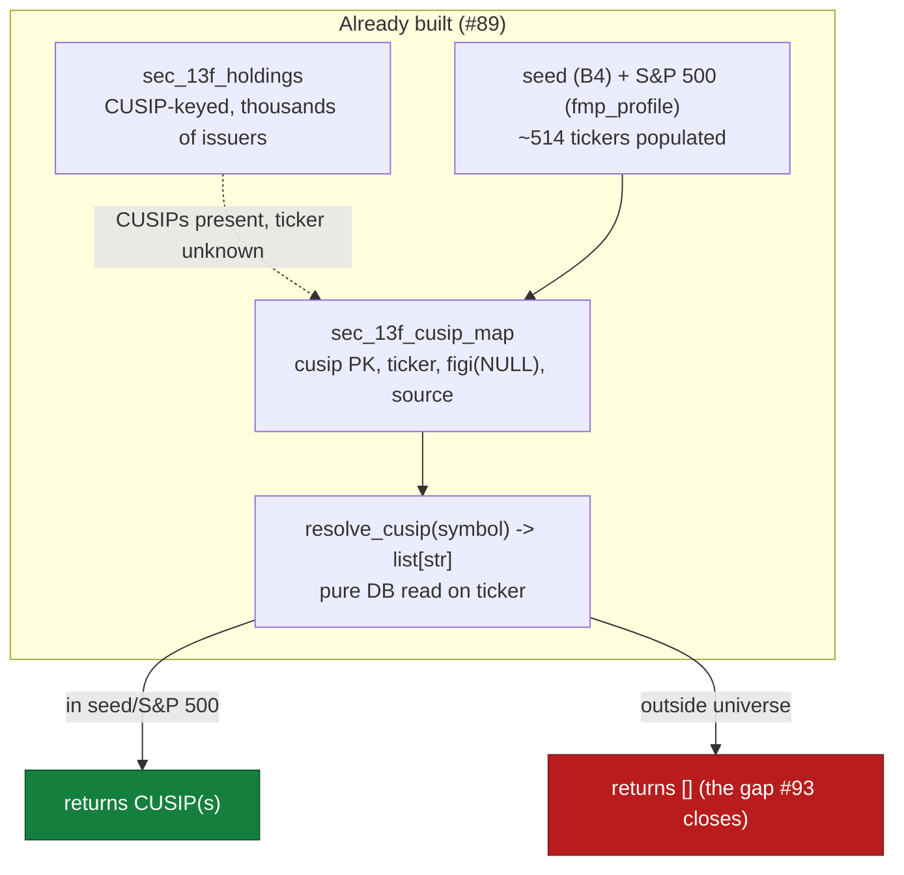
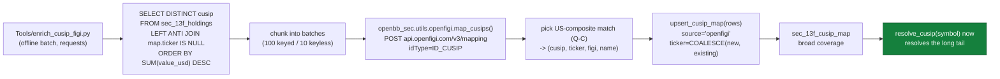
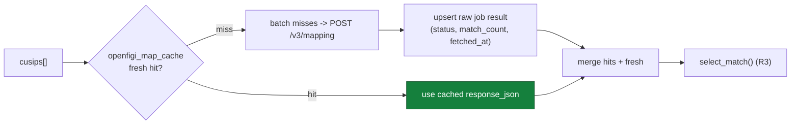

# 93 — Broad ticker→CUSIP resolver via OpenFIGI (deterministic FIGI bridge)

**GitHub:** [#93](https://github.com/prajoria/OpenBB/issues/93) · **Phase:** Provider infra (13F follow-up) · **Sprint:** TBD · **Size:** M
**Depends on:** [#89](https://github.com/prajoria/OpenBB/issues/89) (SEC bulk 13F + CUSIP index — schema, `resolve_cusip`, `sec_13f_cusip_map`, `sec_13f_holdings`) · **Local bead:** `OpenBBTechnical-cse`
**Source:** no PRD — this design doc is the primary artifact. It implements the
**deterministic FIGI bridge** that #89's Q-B / Q-E reviews locked as the follow-up
([89 design](../ownership_13f/89-sec-bulk-13f-cusip-index.md), §0 Q-B/Q-E).
**Scope:** Extend `resolve_cusip(symbol)` coverage from the #89 MVP (B4 seed + S&P 500
FMP-profile rows) to the **broad 13F universe** by mapping the CUSIPs already present
in `sec_13f_holdings` to `(ticker, figi)` via Bloomberg's free **OpenFIGI `/v3/mapping`**
API, then upserting them into the existing `sec_13f_cusip_map` table.

> **Repo note:** code lives in this `OpenBBTechnical` checkout. Read/query +
> schema half: [`providers/sec/openbb_sec/utils/thirteen_f_index.py`](../../../openbb_platform/providers/sec/openbb_sec/utils/thirteen_f_index.py).
> New enrichment batch job: [`Tools/enrich_cusip_figi.py`](../../../Tools/) (sibling to
> the existing [`Tools/populate_cusip_map.py`](../../../Tools/populate_cusip_map.py) and
> [`Tools/ingest_sec_13f.py`](../../../Tools/)). Vendored client:
> [`third_party/openfigi-api`](../../../third_party/openfigi-api/) (submodule, fork of
> `OpenFIGI/api-examples`, Apache-2.0). This doc lives under `docs/designs/quant_trading/`
> (one doc per issue, issue-number prefix per precedent).

> **⚠ This is a PLANNING / brainstorming doc.** The OpenFIGI direction, the
> `sec_13f_cusip_map` schema, and the "no fuzzy issuer-name matching in the critical
> path" rule are **locked** (carried over from #89). The batch tactics (key vs.
> keyless rate limits, share-class disambiguation, enrichment scope/ordering) are
> **open** — surfaced for review before any code.

---

## What this is

#89 built a CUSIP-keyed reverse 13F index and a `resolve_cusip(symbol) -> list[str]`
read path, but timeboxed the **ticker→CUSIP** direction (the hard one) to a bounded
universe: a small built-in **B4 seed** plus the full **S&P 500** (514 rows, sourced
from FMP company profiles by [`Tools/populate_cusip_map.py`](../../../Tools/populate_cusip_map.py)).
Everything outside that universe resolves to `[]`.

The 13F holdings table, however, already contains **every CUSIP institutions report
holding** — thousands of issuers, public SEC data, far beyond the S&P 500. What is
missing is the **ticker** for those CUSIPs. This issue fills it the license-clean,
deterministic way #89 locked in:

> **CUSIP (we have it, public/local) → OpenFIGI `/v3/mapping` → FIGI + ticker (open) → upsert.**

The defining constraint is **legal, not technical**: a ticker↔CUSIP master is a
**licensed** product (CUSIP Global Services / S&P) and may not be redistributed. We
never copy such a list. Instead we (a) derive CUSIPs from public SEC 13F bulk data
(already done by #89) and (b) use **FIGI** — an open identifier — as the cross-reference
to recover tickers. The `sec_13f_cusip_map.figi` column was scaffolded by #89 for
exactly this.

The other locked constraint, restated: **no issuer-name fuzzy matching.** #89's Q-B
review rejected name reconciliation as the resolver risk and parked it here. This
issue must **not** reintroduce it — the OpenFIGI mapping is a deterministic key→key
lookup, which is the whole point.

---

## 0. Key decisions — locked vs. open

### 0.1 Locked (inherited from #89 — do not re-open)

| # | Decision | Choice | Consequence |
|---|---|---|---|
| L1 | Resolver mechanism | **OpenFIGI `/v3/mapping`** (`idType=ID_CUSIP`) — deterministic CUSIP→FIGI+ticker | No licensed CUSIP master copied; FIGI is the open bridge |
| L2 | Source of CUSIPs to enrich | **`sec_13f_holdings`** (public SEC 13F bulk, already ingested by #89) | Coverage = the institutional universe; grows as more quarters ingest |
| L3 | Target table | Existing **`sec_13f_cusip_map`** (cols `cusip, issuer_name, ticker, title_class, figi, source, updated_at`) — **no schema change** | `figi` column already present; upsert via existing `upsert_cusip_map` |
| L4 | Read contract unchanged | `resolve_cusip(symbol) -> list[str]` stays a pure DB read returning the **set** of CUSIPs for a ticker (share-class cardinality, #89 Q-B) | The hot path never calls OpenFIGI; enrichment is offline batch |
| L5 | No fuzzy matching | Issuer-name reconciliation stays **out** of the critical path (the deferred risk) | Mapping is key→key only; ambiguous results are skipped/flagged, not guessed |
| L6 | Network rules | `requests` only (no `aiohttp`); respect OpenFIGI rate limits; resumable; per-CUSIP try/except; `sys.stdout.reconfigure(utf-8)` | Matches repo HTTP + `Tools/` skeleton rules |
| L7 | Idempotency | `INSERT ... ON DUPLICATE KEY UPDATE` (existing `upsert_cusip_map`, `ticker = COALESCE(VALUES(ticker), ticker)`) | Re-running enrichment yields the same row count; never nulls a richer ticker |
| L8 | Vendored client | OpenFIGI client vendored as submodule **`third_party/openfigi-api`** (fork, Apache-2.0) so we may modify it freely | Reference contract for `/v3/mapping`; our helper wraps it with `requests` |

### 0.2 Open questions (please review / brainstorm)

> **Reviewer summary (Copilot, 2026-06-25).** All five Qs are pointed in the
> right direction; my edits below are tightening, not redirection. Three
> cross-cutting themes show up in multiple Qs and deserve a single answer
> before implementation starts:
> - **Provenance precedence is not actually enforced by `COALESCE`** (Q-E.1).
>   Pick one of the two enforcement shapes there and propagate it to L7.
> - **"Ambiguous" needs a persistent state**, not just a log line (Q-C.3 →
>   distinct `source='openfigi_ambiguous'`); otherwise every backfill re-maps
>   the same noisy CUSIPs and Q-D's left-anti-join silently does the wrong
>   thing.
> - **Rate-limiter shape** should be a `RateLimitPolicy` honoring `Retry-After`
>   (Q-B.1/2), not blanket `time.sleep`. Easier to test, easier to update
>   when OpenFIGI publishes new caps.
>
> Lower-impact suggestions are inline below.

> **Q-A — Where does the OpenFIGI helper live, and how thin?**
> The fork's `python/example.py` is a single stdlib-`urllib` script (search + mapping
> demo), not a pip package. Options:
> - **A1 — Wrap in a provider util** `providers/sec/openbb_sec/utils/openfigi.py`: a
>   small `requests`-based `map_cusips(cusips, api_key) -> dict[cusip, list[match]]`
>   that batches (≤100 jobs/request), handles 429 backoff, and normalizes the v3
>   response. The submodule stays a **reference**, not an import (it is not on the
>   installed package path, same one-way rule as `Tools/` in #89 Q-A).
> - **A2 — Import the submodule directly.** Rejected: `third_party/openfigi-api/python`
>   is example code, not an installable module, and provider runtime must not depend
>   on a path outside the package surface.
> - **Recommendation:** **A1.** Vendor stays a documented reference + a place to land
>   upstreamable fixes; the runtime helper is our own thin `requests` wrapper that
>   matches the fork's `/v3/mapping` request/response shape exactly. ⟶ *needs sign-off.*
>
> **Reviewer (Copilot) — endorse A1 with 3 refinements:**
> 1. **Naming/location is right but justify it.** Putting the helper under
>    `providers/sec/openbb_sec/utils/` is consistent with `thirteen_f_index.py` from
>    #89, *even though* the only runtime caller is `Tools/enrich_cusip_figi.py`. Add
>    one sentence in §2.1 stating: "helper lives under `openbb_sec.utils` so any
>    future SEC-provider command can call it without a circular `Tools/` import."
>    Otherwise a reader will reasonably ask why it isn't a `Tools/`-local module.
> 2. **Type the response, don't return `dict[str, list[dict]]`.** Define a
>    `TypedDict` (or `pydantic` model) `OpenFIGIMatch{figi, ticker, name, exchCode,
>    securityType, securityType2, compositeFIGI, marketSector}` and return
>    `dict[str, list[OpenFIGIMatch] | OpenFIGIError]`. This makes the Q-C selection
>    logic statically checkable and turns the test fixtures into real specs.
> 3. **Pin two HTTP defaults** in the wrapper that the fork's `urllib` script gets
>    for free but `requests` does not: set `Content-Type: application/json` and a
>    descriptive `User-Agent` (e.g. `OpenBBTechnical/openfigi-enrich/0.1`). OpenFIGI
>    silently throttles default Python User-Agents harder than identified clients.
> 4. **CI safety:** confirm `pyproject.toml` does not try to install
>    `third_party/openfigi-api` (it's not a package). If poetry picks it up via a
>    `packages = [...]` glob, exclude it explicitly.

> **Q-B — API key vs. keyless, and batch/rate strategy.**
> OpenFIGI `/v3/mapping` allows **keyless** use at a low rate and a higher rate with a
> free **`X-OPENFIGI-APIKEY`** (resolved from `user_settings.json` /`.env` like other
> creds, env `OPEN_FIGI_API_KEY`). Mapping accepts a **batch** of jobs per POST
> (the public limit is ~100 jobs/request with a key, fewer keyless).
> - **Recommendation:** key-aware: read `openfigi_api_key` via `UserService` /`.env`;
>   chunk CUSIPs into batches of **100 (keyed) / 10 (keyless)**; sleep to stay under
>   the published per-minute cap; exponential backoff on 429. Log the resolved mode
>   (keyed/keyless) so a slow run is explainable. *Verify current published limits
>   against openfigi.com/api at implementation time — do not hardcode a guess.* ⟶ *needs sign-off.*
>
> **Reviewer (Copilot) — endorse, with a stronger rate-limit shape:**
> 1. **Don't use blanket `time.sleep` between batches.** OpenFIGI publishes *two*
>    keyless caps (per-minute AND per-6-hour) and one keyed cap; a fixed sleep
>    overshoots one and busts the other. Wrap the rate policy in a small
>    `RateLimitPolicy` dataclass driven by the resolved mode
>    (`keyed`/`keyless`) and use a **token-bucket** (or sliding window) instead
>    of a sleep table. One place to update when limits change.
> 2. **Honor `Retry-After` on 429** instead of guessing an exponential interval —
>    OpenFIGI actually sets it. Fall back to exponential only if the header is
>    absent. The current "exponential backoff on 429" line should be amended.
> 3. **Credential resolution order should be explicit and logged.** Recommend:
>    `--api-key` flag → `OPEN_FIGI_API_KEY` env → `user_settings.json`
>    `credentials.openfigi_api_key` → keyless. At startup, log which source was
>    used (never the value): `INFO: openfigi mode=keyed source=user_settings.json`.
> 4. **Add `--max-runtime` and `--max-batches`** (in addition to `--limit`) so a
>    backfill can't silently run for hours in CI/cron. Exit clean with a summary
>    of remaining un-mapped CUSIPs.
> 5. **Concurrency:** stay single-threaded. The batch endpoint already amortizes
>    network cost (100 jobs/request); adding threads only makes the rate-limiter
>    harder. Document this so a well-meaning reviewer doesn't try to add async.

> **Q-C — Share-class cardinality & which match to keep.**
> A single CUSIP encodes issuer **+ issue (share class)**, and OpenFIGI may return
> **multiple** matches per CUSIP (different exchanges / composite vs. local). We need
> exactly one `(ticker, figi)` to store per CUSIP, but a ticker may legitimately map
> to several CUSIPs (multiple classes) — `idx_ticker` is non-unique by design (#89 Q-B).
> - **Recommendation:** prefer the **US composite** match (`exchCode` in the US
>   composite set / `securityType2 == "Common Stock"` where present); when multiple
>   remain, keep the one whose `figi` is the **composite** FIGI and record its
>   `ticker`. If still ambiguous → **skip and flag** (do not guess, L5). Document the
>   selection rule and unit-test it against a fixed multi-match fixture. ⟶ *needs sign-off.*
>
> **Reviewer (Copilot) — endorse, but the rule needs to be deterministic and
> wider than "Common Stock":**
> 1. **Make the selection rule a documented total order**, not a heuristic.
>    Proposed deterministic ladder (apply in order, stop at first single match):
>    a. Filter to `marketSector == "Equity"` AND
>       `securityType2 IN {"Common Stock", "Preferred Stock"}` AND
>       `exchCode IN US_COMPOSITE_SET` (e.g. `{"US"}`).
>    b. Of survivors, prefer rows where `figi == compositeFIGI`.
>    c. If still >1, prefer `securityType2 == "Common Stock"` over Preferred.
>    d. If still ambiguous → **skip + flag** (L5).
>    Code this as a single function; unit-test each rung.
> 2. **Don't exclude Preferred Stock by default.** 13F holdings include preferred
>    shares with their own CUSIPs and they're legitimately resolvable. Persist
>    the chosen `security_type` (Common vs Preferred) so downstream consumers
>    can filter. The current doc text "Common Stock where present" is too narrow.
> 3. **Persist the "skipped/ambiguous" decision.** Don't just log it — write a
>    row with `ticker=NULL, source='openfigi_ambiguous'` so the next run's
>    left-anti-join filter skips it. Otherwise every backfill re-maps the same
>    noisy CUSIPs forever. Pair this with a `--reresolve-flagged` flag for the
>    rare case where OpenFIGI later corrects data.
> 4. **Test fixtures must cover:** (a) single match (happy path), (b) multi-match
>    US composite + foreign listings, (c) ADR (CUSIP → US ADR ticker via
>    composite FIGI), (d) Preferred-only CUSIP, (e) `error` payload, (f) truly
>    ambiguous (>1 US composite Commons — rare but exists for old splits).
> 5. **Define `US_COMPOSITE_SET` once** as a module-level constant; expect it to
>    be `{"US"}` per OpenFIGI's composite convention but make it overridable in
>    case future OpenFIGI semantics shift.

> **Q-D — Enrichment scope & ordering (what to map, in what order).**
> The holdings table can hold tens of thousands of distinct CUSIPs.
> - **Recommendation:** MVP enriches **distinct CUSIPs in `sec_13f_holdings` that have
>   no `ticker` yet in `sec_13f_cusip_map`** (left-anti-join), ordered by **descending
>   aggregate `value_usd`** so the most-held names resolve first and a partial run is
>   still maximally useful. CLI flags `--limit`, `--sleep`, `--dry-run`, `--api-key`,
>   `--database` mirror `populate_cusip_map.py`. Provenance `source = "openfigi"`.
>   Option rows (`put_call` set) are **excluded** from the value ranking (consistent
>   with #89 Q-D). ⟶ *needs sign-off.*
>
> **Reviewer (Copilot) — endorse the shape, tighten 5 details:**
> 1. **"Value DESC" needs a period qualifier.** Ranking on `SUM(value_usd)`
>    across *all history* lets stale Berkshire-style positions dominate ahead
>    of currently-held names. Recommend: rank by `SUM(value_usd)` from the
>    **latest filing per filer** (CTE: `MAX(period_end) per cik`, then sum).
>    Otherwise the "partial run is still maximally useful" claim is weakened.
> 2. **`--limit` semantics must be on distinct CUSIPs, not jobs/rows.** A batch
>    of 100 hits 100 distinct CUSIPs; if the script counts jobs, `--limit 50`
>    quietly maps 5,000 CUSIPs in one batch. Add a one-line clarification.
> 3. **Add `--since YYYY-MM-DD`** so an operator can enrich just the CUSIPs
>    that newly appeared since the last enrichment, instead of always
>    rewalking the whole un-mapped universe.
> 4. **Specify resumability concretely.** "Resumable" in L6 today only means
>    "the script can rerun and skip done rows." Define: on SIGINT after a
>    successful batch, exit 0 cleanly; on uncaught exception, the in-flight
>    batch is dropped (not partially upserted) — upserts must be transactional
>    per batch, not per row.
> 5. **Log the starting scope.** Before the first request: log `distinct CUSIPs
>    un-mapped: N`, `to enrich this run: min(N, limit)`, `estimated batches:
>    ceil(.../100)`, `mode: keyed|keyless`. Operators currently have no
>    visibility into ETA.
> 6. **Option exclusion is right** — keep the `put_call IS NULL` filter; also
>    exclude rows where `cusip` is non-9-char (defensive against malformed
>    legacy data #89's loader may have let through).

> **Q-E — Provenance precedence vs. existing seed / FMP rows.**
> `sec_13f_cusip_map` rows may already have a `ticker` from `seed` or `fmp_profile`.
> - **Recommendation:** OpenFIGI **never overwrites** an existing non-null `ticker`
>   (the `COALESCE(VALUES(ticker), ticker)` upsert already guarantees this for the
>   ticker column); it **does** fill `figi` where missing (open identifier, safe to
>   add). So seed/S&P 500 tickers win; OpenFIGI fills the long tail + backfills FIGI.
>   Record `source = "openfigi"` only on rows it newly creates. ⟶ *needs sign-off.*
>
> **Reviewer (Copilot) — partially endorse; the `COALESCE` claim is too weak:**
> 1. **`COALESCE(VALUES(ticker), ticker)` does NOT enforce provenance precedence.**
>    It only prevents nullifying an existing ticker. If OpenFIGI returns a
>    *different non-null* ticker than the seed/FMP row, COALESCE silently
>    overwrites the seed value. The precedence claim ("seed/S&P 500 tickers
>    win") is not actually enforced by L7. Two correct shapes:
>    - **DB-side guard:** `ticker = CASE WHEN source IN ('seed','fmp_profile')
>      THEN ticker ELSE COALESCE(VALUES(ticker), ticker) END`, OR
>    - **App-side guard:** the enricher's left-anti-join filters out CUSIPs
>      whose existing `source IN ('seed','fmp_profile')` from the start, so
>      OpenFIGI never even attempts them.
>    Pick one and write it into L7 / Q-E. The app-side filter is simpler and
>    keeps the upsert helper unchanged.
> 2. **Disagreement is a signal, not noise.** When OpenFIGI returns a ticker
>    that differs from the existing seed/FMP ticker, **log it at WARN**
>    (don't overwrite, don't suppress). It's a corporate-action / seed-error
>    signal worth surfacing. Consider a `--audit-disagreements` mode that
>    only reports diffs without writing.
> 3. **Source on backfilled `figi`.** If a row is `(ticker=seed, figi=NULL,
>    source='seed')` and OpenFIGI fills `figi` only, the row's `source` will
>    still read `seed` — which understates provenance. Three options:
>    a. Accept the ambiguity (cheapest; document it).
>    b. Add a `figi_source` column (schema change → out of scope, L3 forbids).
>    c. Append to a `notes` column / JSON if one exists.
>    Recommend (a) + a comment in the upsert helper. Don't break L3 for this.
> 4. **FIGI mutability.** FIGIs *can* change after certain corporate actions
>    (rare but real). Add a follow-up bd to refresh `figi` for rows older
>    than e.g. 18 months — not in MVP scope, but call it out so it isn't
>    forgotten.
> 5. **`source` value for ambiguous skips:** use a distinct value like
>    `openfigi_ambiguous` (per Q-C reviewer note) — don't reuse `openfigi`
>    for them or the left-anti-join in Q-D won't be able to tell "still
>    un-mapped" from "tried and gave up."

### 0.3 Resolved decisions (locked for implementation — Phase-1 gate closed 2026-06-25)

The reviewer notes above are accepted. Implementation follows these resolutions;
the open questions are now closed (no TBDs remain).

| # | From | Resolution |
|---|---|---|
| R1 | Q-A | Helper `providers/sec/openbb_sec/utils/openfigi.py` — thin `requests` wrapper. Typed `OpenFIGIMatch` `TypedDict` (`figi, ticker, name, exchCode, securityType, securityType2, compositeFIGI, marketSector`). Always send `Content-Type: application/json` + `User-Agent: OpenBBTechnical/openfigi-enrich/0.1`. Submodule is a **reference only** — not imported at runtime, excluded from packaging. |
| R2 | Q-B | Credential order: `--api-key` → `OPEN_FIGI_API_KEY` env (present in repo `.env`) → `user_settings.credentials.openfigi_api_key` → keyless. `RateLimitPolicy` dataclass per resolved mode; **honor `Retry-After` on 429**, exponential fallback only if absent. Batch **100 keyed / 10 keyless**. Single-threaded. Log resolved `mode` + `source` (never the key value). CLI `--max-batches` safety cap. |
| R3 | Q-C | `select_match()` = deterministic ladder: (a) keep `marketSector == "Equity"` ∧ `securityType2 ∈ {"Common Stock","Preferred Stock"}` ∧ `exchCode ∈ US_COMPOSITE_SET` (`{"US"}`, module constant); (b) prefer `figi == compositeFIGI`; (c) prefer Common over Preferred; (d) else **skip + flag**. Persist the security type in the existing `title_class` column (no schema change). |
| R4 | Q-C/Q-E | Ambiguous / no-match CUSIPs get a persisted row `(ticker=NULL, source='openfigi_ambiguous')` so re-runs skip them; `--reresolve-flagged` re-attempts them on demand. |
| R5 | Q-D | Source query: distinct CUSIPs from `sec_13f_holdings` where `put_call IS NULL` ∧ `CHAR_LENGTH(cusip)=9`, ranked by `SUM(value_usd)` over the **latest period per filer**; left-anti-join excludes any CUSIP already mapped (`ticker IS NOT NULL`) **or** flagged (`source IN ('seed','fmp_profile','openfigi','openfigi_ambiguous')`). `--limit` counts **distinct CUSIPs**. Per-batch transactional upsert (drop in-flight batch on uncaught error, never partial). |
| R6 | Q-E | **Provenance precedence is enforced app-side** by R5's anti-join (OpenFIGI never even attempts `seed`/`fmp_profile` CUSIPs) — *not* by `COALESCE`. `--audit-disagreements` mode maps without writing and WARN-logs any OpenFIGI ticker that differs from an existing seed/FMP ticker. FIGI-backfill `source` ambiguity is accepted + documented (L3 forbids a `figi_source` column). |
| R7 | Q-E | Filed a follow-up bd (not MVP) to refresh `figi` for rows older than ~18 months (FIGIs can change on corporate actions). |
| R8 | Q-D | CLI mirrors `populate_cusip_map.py`: `--database --symbols(N/A) --limit --sleep --dry-run --api-key` plus `--max-batches --since --reresolve-flagged --audit-disagreements`. Startup logs scope: `distinct un-mapped: N`, `to enrich: min(N,limit)`, `batches: ceil(...)`, `mode`. |
| R9 | new | **Read-through OpenFIGI response cache** (`openfigi_map_cache`, §2.3) mirroring `fmp_cached`: cache the **raw** `/v3/mapping` job result keyed `(id_type, id_value, exch_code)`, `OPENFIGI_CACHE_TTL_DAYS = 180`, hit/miss/store stats, `--refresh` bypass. Decouples raw responses from the selected match so an R3 ladder change re-selects from cache without new API calls; the TTL window is the lever R7 will tune. |

**L7 (amended):** idempotent `INSERT ... ON DUPLICATE KEY UPDATE` stays as-is, but
provenance precedence is enforced by the R5 **app-side anti-join**, not by
`COALESCE(VALUES(ticker), ticker)` (which only prevents nulling, not overwrite).

---

## 1. Current state (grounded in code)



- `resolve_cusip` / `upsert_cusip_map` / schema: [`thirteen_f_index.py`](../../../openbb_platform/providers/sec/openbb_sec/utils/thirteen_f_index.py)
  (read/write helpers + DDL, single source of truth from #89 Q-A).
- Seed + S&P 500 loader: [`Tools/populate_cusip_map.py`](../../../Tools/populate_cusip_map.py)
  (FMP-profile path, `source = "fmp_profile"`).
- Bulk ingest that fills `sec_13f_holdings`: `Tools/ingest_sec_13f.py` (#89).

---

## 2. Target design



### 2.1 New / changed files

| File | Kind | Responsibility |
|---|---|---|
| `providers/sec/openbb_sec/utils/openfigi.py` | **new** | Thin `requests` client: `map_cusips(cusips, api_key=None, batch=...) -> dict[str, list[dict]]`; batching, 429 backoff, v3 response normalization, `select_match()` (R3). **Owns the `openfigi_map_cache` read-through cache** (DDL + `cache_get`/`cache_put`/stats, §2.3). Mirrors the fork's `/v3/mapping` contract (Q-A/A1). |
| `Tools/enrich_cusip_figi.py` | **new** | Offline batch: select un-tickered CUSIPs from `sec_13f_holdings`, map via OpenFIGI, pick match (Q-C), upsert into `sec_13f_cusip_map`. Follows the `Tools/` skeleton + CLI flags of `populate_cusip_map.py`. |
| `third_party/openfigi-api` | **submodule** | Vendored fork (reference + landing spot for upstreamable fixes). Not imported at runtime. |
| `providers/sec/.../tests/test_openfigi.py` | **new** | Unit: batch chunking, match selection (Q-C), 429 retry, response normalization — all against fixtures (no live network). |
| `Tools/docs/specs/enrich_cusip_figi.md` | **new** | Per-tool spec (matches existing `Tools/docs/specs/` precedent). |
| `Tools/docs/DESIGN.md` | edit | Add `enrich_cusip_figi.py` to the DB-loaders inventory + changelog entry. |

No change to `resolve_cusip`, `sec_13f_cusip_map` DDL, or the `fmp_cached` tier.
The new `openfigi_map_cache` table (§2.3) is owned by `openfigi.py` and created on
demand (`init_openfigi_cache()`), leaving the #89 13F schema untouched (L3).

### 2.2 OpenFIGI `/v3/mapping` contract (from the vendored fork)

Request (batch of jobs, `POST https://api.openfigi.com/v3/mapping`, optional header
`X-OPENFIGI-APIKEY`):

```json
[{ "idType": "ID_CUSIP", "idValue": "037833100", "exchCode": "US" }]
```

Response (one entry per job, in order):

```json
[{ "data": [{ "figi": "BBG000B9XRY4", "ticker": "AAPL", "name": "APPLE INC",
              "exchCode": "US", "securityType": "Common Stock",
              "compositeFIGI": "BBG000B9XRY4" }] }]
```

`error` may replace `data` per job (e.g. "No identifier found") → skip + flag (L5).

### 2.3 OpenFIGI response cache (read-through, mirroring `fmp_cached`)

Every OpenFIGI `/v3/mapping` job is cached in MySQL exactly like `fmp_cached`
caches FMP responses — a read-through cache so repeated enrichment runs (or a
later re-selection after the R3 ladder changes) never re-hit the API for a CUSIP
already mapped. This is the same philosophy #89 applied to the 13F index itself:
*pay the network cost once, amortize across every lookup.*

> **Why a raw-response cache when `sec_13f_cusip_map` already stores the result?**
> `sec_13f_cusip_map` stores the **selected** `(ticker, figi)` for a CUSIP. The
> cache stores the **full raw `/v3/mapping` job result** (all matches, all fields).
> That decoupling means if the R3 selection ladder is later refined, we can
> **re-run `select_match()` against cached responses** without spending a single
> OpenFIGI call — and it lets ambiguous/no-match jobs be reconsidered cheaply.

**New table — `openfigi_map_cache`** (DDL + helpers live in `openfigi.py`, which
owns the OpenFIGI concern; the 13F index schema in `thirteen_f_index.py` is
unchanged, honoring L3):

```sql
CREATE TABLE IF NOT EXISTS openfigi_map_cache (
    id_type       VARCHAR(16)  NOT NULL,            -- 'ID_CUSIP' (ISIN/ticker later)
    id_value      VARCHAR(32)  NOT NULL,            -- the CUSIP
    exch_code     VARCHAR(8)   NOT NULL DEFAULT '', -- '' when unconstrained
    response_json LONGTEXT     NOT NULL,            -- raw job result: data[] or error
    status        VARCHAR(16)  NOT NULL,            -- 'ok' | 'no_match' | 'error'
    match_count   INT          NOT NULL DEFAULT 0,
    fetched_at    DATETIME     NOT NULL,
    is_valid      TINYINT(1)   NOT NULL DEFAULT 1,
    PRIMARY KEY (id_type, id_value, exch_code),
    KEY idx_fetched_at (fetched_at)
) ENGINE=InnoDB DEFAULT CHARSET=utf8mb4
```

**TTL / staleness.** FIGI mappings are highly stable, so the cache TTL is long:
`OPENFIGI_CACHE_TTL_DAYS = 180` (module constant, like `INSTITUTIONAL_OWNERSHIP_TTL_DAYS`
in `fmp_cached`). A row is a **hit** when `is_valid = 1` AND
`fetched_at >= now - TTL`. This staleness window is exactly the mechanism R7's
"refresh FIGIs older than ~18 months" follow-up will tune — no extra plumbing.

**Read-through flow** inside `map_cusips(cusips, …)`:



1. For each requested CUSIP, look up a **fresh, valid** cache row → collect hits.
2. Send only the **misses** to OpenFIGI (batched per R2 limits).
3. Upsert each job's **raw** result with `status`/`match_count`/`fetched_at`
   (`INSERT ... ON DUPLICATE KEY UPDATE`, idempotent like L7).
4. Return the merged set (cache + fresh) to `select_match()`.

**Cache helpers** (in `openfigi.py`, mirroring `fmp_cached.cache_manager`):
`init_openfigi_cache()` (DDL), `cache_get(id_value, …)`, `cache_put(job_result, …)`,
and a small hit/miss/store **stats** counter logged at run end
(`cache hits=… misses=… stores=…`), matching `DatabaseManager.get_stats()`.

**CLI bypass.** `--refresh` forces a re-fetch (ignore cache reads, overwrite rows)
for the targeted CUSIPs; default behavior is read-through. This is the OpenFIGI
analogue of invalidating a stale `fmp_cached` entry.

---

## 3. Acceptance criteria

- [ ] `Tools/enrich_cusip_figi.py --dry-run` lists N un-tickered CUSIPs ranked by held value, maps nothing.
- [ ] A live run maps a bounded `--limit` set, upserts `(ticker, figi, source='openfigi')`, and is **idempotent** (second run → 0 net new rows).
- [ ] `resolve_cusip(<a non-S&P-500 ticker present in 13F>)` returns its CUSIP(s) after enrichment (was `[]` before).
- [ ] Existing seed / S&P 500 tickers are **never overwritten** (provenance precedence, Q-E).
- [ ] Multi-match CUSIPs resolve to the US-composite ticker; truly ambiguous ones are skipped + logged, **never guessed** (L5, Q-C).
- [ ] **OpenFIGI responses are cached** (`openfigi_map_cache`): a second enrichment run for the same CUSIPs hits the cache (0 OpenFIGI calls within TTL), and `--refresh` forces a re-fetch (§2.3, R9).
- [ ] Unit tests pass offline (fixtures); no `aiohttp`; respects rate limits with backoff.
- [ ] `Tools/docs/DESIGN.md` + a per-tool spec document the new script.

---

## 4. Tracking (bd chain — to be filed in openbb-dev-cycle Phase 2)

Parent bead: `OpenBBTechnical-cse` (already DEFERRED; un-defer + claim when work starts).
Proposed children (one per deliverable, wired with `bd dep add`):

1. `openfigi.py` client util + tests (Q-A/Q-B/Q-C selection logic) **+ `openfigi_map_cache` read-through cache (R9, §2.3)**.
2. `Tools/enrich_cusip_figi.py` batch job + CLI + idempotent upsert (Q-D/Q-E).
3. Docs: `Tools/docs/specs/enrich_cusip_figi.md` + DESIGN.md inventory/changelog.
4. End-to-end verification: bounded live run + `resolve_cusip` long-tail check.

Implementation proceeds under the gated **openbb-dev-cycle** (design → plan → TDD →
quality → review → integrate). This document is the Phase 1 artifact.
