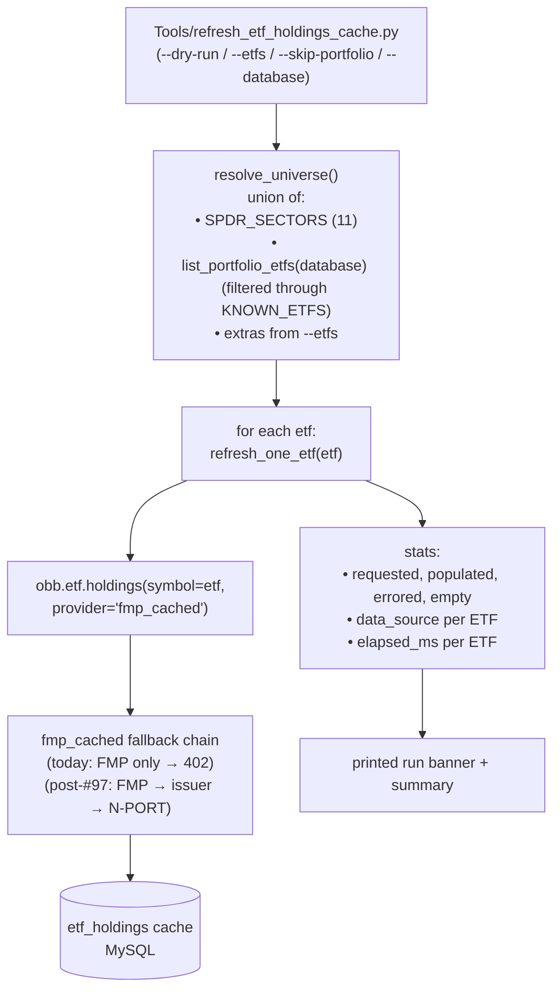

# Refresh ETF Holdings Cache — Design

**GitHub:** _(none yet — sibling work to #97 but separately scopeable)_ · **Beads:** `OpenBBTechnical-cgz` · **Phase:** Tools / scheduled-loader · **Size:** S
**Depends on:** none for shape (works against today's FMP-only provider chain and returns errors); **delivers value** once #97 (ETF holdings free fallback tier) ships and the issuer-file / N-PORT tiers populate.
**Related:** [#97](https://github.com/prajoria/OpenBB/issues/97) (ETF holdings multi-tier fallback), `Tools/fetch_position_history.py` (the reference template for scheduled-loader shape), `openbb_techtrade.engine.screener.GICS_SECTOR_ETFS` (source of truth for the SPDR sector tuple).
**Scope:** A new sibling tool `Tools/refresh_etf_holdings_cache.py` that enumerates a small ETF universe (11 GICS sector SPDRs ∪ portfolio-held ETFs ∪ `--etfs` extras), calls `obb.etf.holdings(symbol=…, provider="fmp_cached")` per ETF, and lets the provider's multi-tier fallback chain populate / refresh the `etf_holdings` MySQL cache table. The tool is a thin orchestrator — it knows nothing about which tier (FMP / issuer-file / N-PORT) feeds each ETF.

> **Repo note:** the existing `Tools/fetch_position_history.py` is left untouched (it stays focused on the equity-history cache). This new sibling shares the same skeleton (sys.path bootstrap, Windows-encoding fix, lazy `openbb` import, per-symbol try/except) and is scheduled separately. Design doc lives under `docs/superpowers/specs/` per the brainstorming-skill convention; the per-tool spec lives under `Tools/docs/specs/` per the existing tool-spec convention.

---

## What this is

Today, `Tools/fetch_position_history.py` pre-warms the **equity-price-history** cache (`equity_historical`) for symbols held in `Portfolio_Positions`. There is no analogous warm-loader for the **ETF holdings** cache (`etf_holdings`). When `obb.techtrade.scan` resolves each of the 11 GICS sectors to its symbol universe, it calls `obb.etf.holdings(symbol="XLK", provider="fmp_cached")` for each sector ETF; today FMP returns `402 Restricted Endpoint` on all 11, the `etf_holdings` cache stays empty, and the scan silently degenerates to a market-wide feed (the "repeated `EURKR` symptom" — see #97).

#97 will fix the fallback tier behind the provider. **This tool fixes the cadence:** even when the fallback works, somebody has to call it on a schedule to keep the cache fresh. Without that, the first scan after stale data pays a multi-tier-fallback round-trip; with it, the scan reads cache hits in microseconds.

The two responsibilities — **fixing the source chain (#97)** and **scheduling the warm-up calls (this design)** — are independent:
- Build this tool today → it logs `402` errors per ETF and populates nothing, but the plumbing is in place
- The moment #97 lands → the same tool, the same `.ps1`, starts producing cached rows with zero code change

---

## Locked decisions

| # | Decision | Choice | Consequence |
|---|---|---|---|
| L1 | File location | NEW `Tools/refresh_etf_holdings_cache.py`; existing `fetch_position_history.py` untouched | Cleaner single-responsibility per tool; both scheduled independently |
| L2 | Source tier | Call `obb.etf.holdings(symbol=X, provider="fmp_cached")` and let the provider pick the tier | Tool is a thin scheduler; provider chain is the SSOT for "how to fetch ETF holdings" |
| L3 | ETF universe | Union of (a) the 11 GICS sector SPDRs, (b) Portfolio_Positions symbols filtered through `KNOWN_ETFS`, (c) `--etfs` CLI extras | Covers techtrade.scan (a) + the user's own holdings (b) + ad-hoc one-offs (c) |
| L4 | ETF detection in Portfolio_Positions | Built-in `KNOWN_ETFS` frozenset (~20 tickers: SPDRs + S&P trackers + bonds + bond + commodity + thematic) | Zero API calls, no schema change; staleness as new ETFs launch is acceptable (CLI `--etfs` covers the gap) |
| L5 | Dependency on #97 | Build now, ship empty until #97 lands | Lowest sequencing risk; tool works against today's provider and is logged-error-tolerant |
| L6 | Cache TTL | Provider owns it (L8 of #97: issuer 1d, N-PORT 30d). This tool just *causes* the chain to walk; no `--no-cache` flag | Daily scheduled runs stay cache-friendly; the provider decides what is stale |
| L7 | Error handling | Per-ETF try/except; 402 / network / parse / any exception → log first line at WARNING, count as `errored`, continue | Today's 402 storm doesn't crash the run; partial wins are still wins |
| L8 | Scheduler | New sibling `Tools/scheduler/run_refresh_etf_holdings_cache.ps1`, **not chained** to `run_fetch_position_history.ps1` | Different failure modes, different re-run cadences; two scheduled tasks, two logs |
| L9 | SPDR tuple SSOT | `SPDR_SECTORS = tuple(GICS_SECTOR_ETFS.values())` — derived at module load from techtrade's dict | Impossible to drift; the regression test (Section 6) is a defense-in-depth assertion, not a primary correctness guarantee |
| L10 | House style | Mirror `Tools/fetch_position_history.py` exactly: sys.path bootstrap to `openbb_platform/providers/{fmp_cached,fmp}/core/platform/extensions/*`; `sys.platform == "win32"` guard with `errors="replace"` on both std{out,err}; lazy `openbb` import inside functions; `logging` not `print` (script may use `print` for the human-facing run banner per existing tool precedent); `Decimal` N/A (no money here) | New contributors recognize the shape instantly; reuses the proven encoding fix |

---

## Architecture



**Why this shape:**
1. **Mirrors `fetch_position_history.py` exactly.** A new contributor reading the two side by side recognizes the same skeleton, learns the pattern once.
2. **Provider chain is the SSOT.** This tool never knows there are multiple tiers — it only knows it asked the provider for holdings and got rows back (or didn't). When #97 changes the chain, this tool needs zero edits.
3. **`SPDR_SECTORS` derived from `GICS_SECTOR_ETFS.values()`.** Two declarations can't drift. The Section 6 regression test is a safety net, not the primary correctness mechanism.

---

## File structure

**Create**
- `Tools/refresh_etf_holdings_cache.py` (~260 LoC) — the tool
- `Tools/tests/test_refresh_etf_holdings_cache.py` (~280 LoC, ~11 tests, all offline)
- `Tools/docs/specs/refresh_etf_holdings_cache.md` (~80 LoC) — per-tool spec
- `Tools/scheduler/run_refresh_etf_holdings_cache.ps1` (~20 LoC) — Windows scheduled-task wrapper

**Modify**
- `Tools/docs/DESIGN.md` (+~5 LoC) — DB-loaders inventory entry + changelog line

**Unchanged**
- `Tools/fetch_position_history.py` (left as-is — different responsibility)
- `openbb_platform/providers/fmp_cached/openbb_fmp_cached/models/etf_holdings.py` (this tool is a *consumer* of that provider; if anything changes there it's via #97, not this design)
- `Portfolio_Positions` schema (we use the existing `symbol` column; no `is_etf` column added per L4)

---

## API surface (Python)

```python
# Public constants
SPDR_SECTORS: tuple[str, ...]   # derived from GICS_SECTOR_ETFS.values() at import
KNOWN_ETFS: frozenset[str]       # built-in seed set, includes SPDR_SECTORS + ~10 others

# Public functions (importable + unit-tested)
def list_portfolio_etfs(database: str | None = None) -> list[str]:
    """Distinct Portfolio_Positions.symbol values that ∈ KNOWN_ETFS. [] if table absent."""

def resolve_universe(
    *, database: str | None, skip_portfolio: bool, extra_etfs: list[str] | None,
) -> list[str]:
    """Union of SPDR_SECTORS + (portfolio ETFs unless --skip-portfolio) + extras."""

def refresh_one_etf(
    etf: str, *, dry_run: bool, api_key: str | None,
) -> tuple[str, int, str | None, float, str | None]:
    """Returns (etf, row_count, data_source, elapsed_ms, error_or_None).
    dry_run: returns (etf, 0, None, 0.0, None) without calling obb."""

def refresh_universe(
    etfs: list[str], *, dry_run: bool, api_key: str | None,
) -> dict[str, int]:
    """Refresh each ETF, return stats {requested, populated, errored, empty}."""

def main() -> int:
    """CLI entry point; returns process exit code."""
```

---

## CLI surface

```
python Tools/refresh_etf_holdings_cache.py --dry-run             # plan only, no API
python Tools/refresh_etf_holdings_cache.py                       # SPDRs + portfolio ETFs
python Tools/refresh_etf_holdings_cache.py --etfs IVV,VOO,QQQ    # add extras
python Tools/refresh_etf_holdings_cache.py --skip-portfolio      # SPDRs + --etfs only
python Tools/refresh_etf_holdings_cache.py --database openbb_fmp_cache_test
python Tools/refresh_etf_holdings_cache.py -v                    # DEBUG-level logging
```

| Flag | Default | Meaning |
|---|---|---|
| `--database` | from `DatabaseConfig` | source for Portfolio_Positions lookup |
| `--etfs` | none | extra comma-separated ETFs to refresh atop the defaults |
| `--skip-portfolio` | off | skip the Portfolio_Positions read; SPDRs + `--etfs` only |
| `--dry-run` | off | print plan + universe; no API calls, no DB writes |
| `--api-key` | none | override FMP_API_KEY (mirrors `populate_cusip_map.py`) |
| `-v / --verbose` | off | DEBUG-level logging |

---

## Run-time output format

```
======================================================================
  REFRESH etf_holdings CACHE
======================================================================
  SPDR sectors  : 11 (XLB, XLC, XLE, XLF, XLI, XLK, XLP, XLRE, XLU, XLV, XLY)
  Portfolio ETFs: 3 (IVV, QQQ, VTI)
  Extra (--etfs): 0
  Total universe: 14

  Refreshing ...
    XLK    [issuer_ssga]    rows=75      elapsed=120ms
    XLF    [issuer_ssga]    rows=72      elapsed=110ms
    ...
    IVV    [-]              rows=0       elapsed=15ms   ERROR: 402 Restricted Endpoint
    ...

======================================================================
  RESULTS
======================================================================
  Requested : 14
  Populated : 12
  Errored   :  2  (IVV: 402; QQQ: 402)    ← will resolve once #97 ships
  Empty     :  0
  Elapsed   : 4.1s
======================================================================
```

The banner is `print()`-based (matches `populate_cusip_map.py` / `enrich_cusip_figi.py` precedent for the human-facing summary). All structured information also goes through `logger.info` so the scheduler's log file is grep-able.

---

## Testing strategy

All tests **offline**, all under `Tools/tests/test_refresh_etf_holdings_cache.py`:

| # | Test | What it locks |
|---|---|---|
| 1 | `test_spdr_sectors_matches_techtrade_gics_sector_etfs` | Regression: SPDR_SECTORS == set(GICS_SECTOR_ETFS.values()) (defense-in-depth — L9 makes drift structurally impossible, but the test catches if either constant moves) |
| 2 | `test_known_etfs_is_superset_of_spdr_sectors` | Internal consistency |
| 3 | `test_known_etfs_excludes_common_non_etfs` | AAPL/MSFT/etc not in KNOWN_ETFS (heuristic sanity) |
| 4 | `test_list_portfolio_etfs_filters_by_known_set` | Mocked DB returns mixed symbols; only KNOWN_ETFS pass through |
| 5 | `test_list_portfolio_etfs_returns_empty_on_db_error` | Graceful degradation if Portfolio_Positions absent |
| 6 | `test_resolve_universe_unions_spdr_portfolio_extras` | Happy path with all three sources |
| 7 | `test_resolve_universe_dedupes` | Same ETF in multiple sources → one entry |
| 8 | `test_resolve_universe_uppercases_and_strips_extras` | `--etfs " ivv ,voo,"` → ["IVV", "VOO"] |
| 9 | `test_resolve_universe_skip_portfolio_drops_portfolio_etfs` | `--skip-portfolio` honored |
| 10 | `test_refresh_one_etf_dry_run_makes_no_obb_call` | Dry-run zero side effects |
| 11 | `test_refresh_one_etf_catches_402_returns_error_tuple` | Loop survives 402 storm |
| 12 | `test_refresh_one_etf_extracts_data_source_from_first_row` | Tier-attribution logging works (post-#97 readiness) |
| 13 | `test_refresh_universe_aggregates_stats_correctly` | End-to-end with mocked `refresh_one_etf` |

Fakes use the same `MagicMock`/`patch` patterns as `Tools/tests/test_enrich_cusip_figi.py`.

---

## Scheduler integration

New file `Tools/scheduler/run_refresh_etf_holdings_cache.ps1` modeled on `run_fetch_position_history.ps1`:

```powershell
# Daily refresh of ETF holdings cache (#97 / techtrade scan)
$ErrorActionPreference = "Stop"
$root = "H:\masterswork\git\OpenBBTechnical"
& "$root\.venv_win\Scripts\python.exe" `
    "$root\Tools\refresh_etf_holdings_cache.py" `
    --database openbb_fmp_cache_test `
    *>&1 | Out-File -Append -Encoding utf8 "$root\Tools\scheduler\logs\refresh_etf_holdings_cache.log"
```

Registered as a separate Windows scheduled task. Cadence: daily, ~02:00 local (an hour after `fetch_position_history`).

---

## Risks & mitigations

| Risk | Mitigation |
|---|---|
| FMP 402 storms log noise on every run until #97 ships | Per-ETF errors are WARNING (not ERROR); the run-banner footer counts errors but doesn't fail the process |
| `KNOWN_ETFS` goes stale as new ETFs launch | `--etfs` CLI flag covers the gap explicitly; the set is small + easy to extend |
| Provider changes its return type | `refresh_one_etf` defensively does `list(result.results or [])` and falls back to `data_source = None` |
| Scheduler chain corruption (this tool fails → fetch_position_history fails) | Separate scheduled tasks (L8) — no chaining |
| New contributor edits SPDR_SECTORS forgetting it's derived | L9: `SPDR_SECTORS = tuple(GICS_SECTOR_ETFS.values())` makes editing impossible; the regression test (Section 6 #1) catches drift |

---

## Acceptance criteria

- [ ] `python Tools/refresh_etf_holdings_cache.py --dry-run` lists the resolved universe (SPDRs + portfolio ETFs + extras) and exits 0 with no API calls.
- [ ] A live run against today's provider (FMP-only) executes per-ETF with all 11 SPDRs logging `402 Restricted Endpoint` as `errored`; the process exits 0 with a summary banner.
- [ ] After #97 ships, the same `--dry-run` lists the same universe and a live run populates `etf_holdings` rows with `data_source ∈ {"fmp","issuer_ssga","sec_nport"}`.
- [ ] `Tools/tests/test_refresh_etf_holdings_cache.py` — all 13 unit tests passing offline.
- [ ] `Tools/scheduler/run_refresh_etf_holdings_cache.ps1` exists and is a working sibling of `run_fetch_position_history.ps1`.
- [ ] `Tools/docs/specs/refresh_etf_holdings_cache.md` + a `Tools/docs/DESIGN.md` inventory row + changelog entry exist.
- [ ] Ruff clean.
