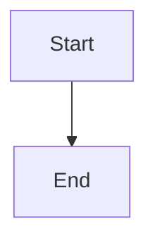

# Development Rules

> **Purpose:** Technical coding standards, patterns, and gotchas specific
> to this project.  Follow these when writing or modifying code.

---

## 1. Python Environment

- **Venv:** `.venv_win` — Windows-specific, project-local.
- **Activation:** `& ".venv_win\Scripts\Activate.ps1"` in PowerShell.
- **Python version:** 3.12.
- **Never use** `python -m venv` or `pip install` without activating first.
- **Never create** a sub-shell (`powershell -c "..."`) — use the persistent
  terminal session.

---

## 2. Windows-Specific Rules

### Encoding
Always add this near the top of any script that prints to stdout:
```python
import sys
sys.stdout.reconfigure(encoding="utf-8", errors="replace")
```
Without this, non-ASCII characters crash with `UnicodeEncodeError` on
Windows (cp1252 default encoding).

### Async / aiohttp
**Do NOT use aiohttp** for HTTP requests.  It throws
`asyncio.CancelledError` in `protocol.read()` on Windows Python 3.12.
Use the `requests` library for synchronous HTTP instead.

### PowerShell
- Use `;` to chain commands (NEVER `&&`).
- Use backtick `` ` `` for line continuation (not `\`).
- Prefer PowerShell cmdlets (`Get-ChildItem`, `Test-Path`) over Unix aliases.
- Use `$PWD` or `Get-Location` for current directory.

---

## 3. Database Patterns

### Connection
Always use the shared infrastructure:
```python
from openbb_fmp_cached.utils.database import DatabaseConfig
# ... then get_connection(database="openbb_fmp_cache_test")
```
Never hard-code credentials.  Credentials come from
`~/.openbb_platform/user_settings.json`.

### Persistence Strategies
Choose the right strategy based on data characteristics:

| Strategy | When to Use | Example |
|----------|-------------|---------|
| DELETE + INSERT | Full-snapshot data with no natural unique key | `Portfolio_Positions` |
| INSERT ... ON DUPLICATE KEY UPDATE | Data with a clear natural key | `ESPP_Plan`, `market_holidays` |
| INSERT IGNORE | Metadata/lookup tables | `Account_Owner` |

### Table Creation
Always use `CREATE TABLE IF NOT EXISTS`.  Scripts must be runnable
against both fresh and existing databases.

### Auto-Create Overhead
Set `FMP_CACHE_AUTO_CREATE_DB=false` in environment to skip the 67-table
creation check that runs on every `init_database()` call.  This is
critical for scripts that run many iterations.

### Target Database
Portfolio data lives in `openbb_fmp_cache_test`.  The default
`openbb_fmp_cache` is for general provider caching.  Always verify
which database you're connecting to.

### Backups
Database backups live **outside the repository** so large `.sql` dumps
never get committed.  On this machine the backup folder is `H:\DBBackup`.
Do **not** write dumps into the repo tree (no `backups/` folder under the
repo root).

- Use `mysqldump --single-transaction --routines --triggers --databases <db>`
  for a consistent snapshot.
- Pass the password via the `MYSQL_PWD` environment variable, never on the
  command line; read credentials from `DatabaseConfig`.
- Name dumps `<database>_<YYYYMMDD_HHMMSS>.sql`.
- Restore with `mysql --user=<user> -p < H:\DBBackup\<file>.sql`.

---

## 4. Script Structure Pattern

All Tools/ scripts follow this structure:

```python
#!/usr/bin/env python3
"""Docstring with purpose and usage."""

import sys
sys.stdout.reconfigure(encoding="utf-8", errors="replace")

import argparse
import logging
from pathlib import Path

# --- sys.path bootstrap ---
PROJECT_ROOT = Path(__file__).resolve().parents[1]
for sub in [
    "openbb_platform/providers/fmp_cached",
    "openbb_platform/providers/fmp",
    "openbb_platform/core",
    "openbb_platform/platform",
]:
    p = str(PROJECT_ROOT / sub)
    if p not in sys.path:
        sys.path.insert(0, p)
# Add all extensions
for ext_dir in (PROJECT_ROOT / "openbb_platform" / "extensions").iterdir():
    if ext_dir.is_dir():
        p = str(ext_dir)
        if p not in sys.path:
            sys.path.insert(0, p)

# --- imports from project ---
from openbb_fmp_cached.utils.database import DatabaseConfig

# --- constants ---
LOG = logging.getLogger(__name__)

# --- functions ---
def main():
    parser = argparse.ArgumentParser(description="...")
    parser.add_argument("--database", default=None)
    parser.add_argument("--dry-run", action="store_true")
    args = parser.parse_args()
    # ...

if __name__ == "__main__":
    main()
```

---

## 5. FMP API Rules

### Endpoint
Use the stable endpoint: `https://financialmodelingprep.com/stable/historical-price-eod/full`

### Date Parameters
- Use `from` and `to` (NOT `start_date` / `end_date`).
- FMP's `/full` endpoint **ignores** `start_date`/`end_date` params.
- Always add client-side date filtering as a safety net.

### API Key Resolution
```python
from openbb_core.app.service.user_service import UserService
creds = UserService.read_default_user_settings().credentials
api_key = getattr(creds, "fmp_api_key", None)
```

### Rate Limiting
Add a 0.3–0.5 second delay between consecutive API calls to avoid
hitting FMP rate limits.

### Error Handling
- Catch `requests.exceptions.RequestException` for network errors.
- Handle empty JSON responses (holidays, delisted symbols) gracefully.
- Never let a single symbol failure kill the entire batch.

---

## 6. Parsing Rules

### Currency Values
Handle all Fidelity formats: `$10,423.20`, `+$5,104.47`, `-$183.70`,
`($605.38)`, `--`.  Parentheses mean negative.

### Safe Defaults
Parse functions should return safe defaults (`0.0`, `None`) for
unparseable values rather than raising exceptions.

### HTML Parsing
- Fidelity uses ag-grid with **pinned-left** and **center** containers.
- Pinned-left is the authority for tickers and detail drawers.
- Center container does NOT contain drawer tables.
- Col-id attributes (`curVal`, `qty`, `cstBasShr`, etc.) may change
  across Fidelity DOM updates — treat as brittle.

---

## 7. Testing

### Dry-Run First
Always run `--dry-run` before database writes when testing changes.

### Verify After Write
Run a COUNT/SELECT query after DB writes to confirm expected row counts.

### Idempotency Check
After any persistence logic change, verify that running the import twice
produces the same final row count.

### Skip Symbols
Certain symbols are skipped in `fetch_position_history.py`:
`Cash`, `NSAV`, `MVVYF`, `EADSF`, `NXDR`, `NHX202764`, `NHX203309`
(cash positions, OTC/delisted stocks, CUSIDs without FMP data).

### Seams, Mocks, and Silent-Zero Failures

**Case study:** bd `OpenBBTechnical-z7f` — `obb.techtrade.movers` returned
0 movers for every sector segment for months while 363 unit tests
stayed green. The bug was in the *contract between two mocked
subsystems*, not in either subsystem alone. See the bead for the full
postmortem; the rules below prevent the same class of mistake.

#### R7.1 — Never let two mocks agree with themselves
If a public function `f(a, b)` internally combines results from two
injected seams `fetch_a()` and `fetch_b()`, at least ONE test must
exercise `f` with **realistic-shape** fixtures for **both** seams —
i.e. fixtures captured from a real production response, not
hand-crafted dicts.

Hand-crafted mocks describe the developer's *mental model* of the data,
not the data itself. When both mocks come from the same head, the test
is a closed loop that cannot disagree with the assumption being tested.

**Do:** record one live JSON response per seam under
`tests/fixtures/<module>/` and load it with `json.load()` in the test.
**Don't:** write `[{"symbol": "AAPL", "pct_change": 0.05}]` and pretend
that's what the API returns.

#### R7.2 — Every public entry point needs a "not empty" smoke test
For every command exposed on the `obb.*` surface or in a public engine
API, write one test named `test_<entry>_returns_non_empty_for_<realistic_input>`.

The test may be marked `@pytest.mark.integration` and skipped in fast
CI, but it MUST exist and run in the integration suite. `len(result) > 0`
is a lower bar than any semantic assertion, and catches the entire
"silent zero" failure class.

#### R7.3 — Empty results must be loud, not silent
Wherever code returns an empty list / zero count that a caller could
reasonably expect to be non-empty, log a `WARNING` explaining WHY it
was empty (upstream returned 0, filter removed everything, cache miss,
etc.). Prefer a warning with concrete numbers over a bare empty return.

```python
# Bad — silent zero
return [c for c in candidates if c.symbol in allowed]

# Good — loud zero
filtered = [c for c in candidates if c.symbol in allowed]
if candidates and not filtered:
    LOG.warning(
        "filter removed all candidates: %d candidates, %d in allowed set, 0 intersection",
        len(candidates), len(allowed),
    )
return filtered
```

If a user reports "returns nothing", grep for the warning in logs
should immediately localize the culprit.

#### R7.4 — Prefer narrow-then-fan-out over fan-out-then-filter
When you need "top N from set S", fetch S directly and rank — do NOT
fetch a market-wide firehose F and then filter `F ∩ S`. The firehose
approach is mathematically brittle: any time `F` and `S` are drawn
from different populations (small caps vs. mega caps, US vs. global,
delayed vs. real-time), the intersection is silently empty.

If you must use a firehose, assert `len(F ∩ S) > 0` in the code path
and warn if not.

#### R7.5 — Test the assumption, not just the behavior
For every injected seam, add one test that asserts the seam's *shape
contract* against a recorded live response. This is separate from
behavior tests. Named `test_<seam>_response_shape_matches_expected`.

Example: `test_fmp_discovery_gainers_returns_symbols_matching_universe_grain`
would have failed on day 1 because FMP `gainers` returns penny-stock
symbols while sector-ETF universes return mega-caps.

#### R7.6 — One real end-to-end call before shipping any injectable seam
When designing a new `callable=None` seam parameter, make ONE real call
to the live implementation *before* writing the mocked tests. Save the
response as a fixture (R7.1). If you can't call the real thing during
design, you don't yet know what shape it returns — and your tests will
encode your guess, not the reality.

#### R7.7 — Fixtures MUST produce different outputs under buggy vs. fixed code

The strongest test of a regression test is: temporarily revert the
production fix, run the test, and verify it FAILS. If the test still
passes with the fix reverted, the fixture doesn't discriminate — the
test is *ceremonial* even if the assertion is precise.

Discovered the hard way across multiple review iterations of PR #331
(bd-0h2.9): 3 of the first-draft regression tests passed under BOTH
pre-fix and post-fix code because the fixtures had TARGET returns
that dominated the perturbation the fix was meant to catch.

**Discipline:** every load-bearing test gets a reverse-verification
run at author-time. Mutate the production code the test claims to
guard, observe the test fail, restore. If mutation doesn't fail the
test, the fixture is wrong — reshape it (or convert to AST /
`caplog` assertion, see R7.8 / R7.9).

#### R7.8 — AST inspection beats `inspect.getsource` for wiring guards

For "test that a specific kwarg is threaded through a constructor"
or "test that this function is called with this argument," textual
assertions on `inspect.getsource(fn)` are **defeatable by
comment-poisoning**. Concrete failure caught in PR #331 iter-3:
mutating `foo=foo,` → `foo=0.0,  # BUG: foo=foo disabled` passed a
textual `"foo=foo" in src` check because the string still appeared
inside the comment.

```python
# WRONG — defeatable by comments
assert "momentum_accel_63d=momentum_accel_63d" in inspect.getsource(fn)

# RIGHT — walks the parsed AST, comments are stripped by the parser
tree = ast.parse(inspect.getsource(fn))
for node in ast.walk(tree):
    if isinstance(node, ast.Call) and isinstance(node.func, ast.Name):
        if node.func.id == "Phase6Result":
            for kw in node.keywords:
                if kw.arg == "momentum_accel_63d":
                    assert isinstance(kw.value, ast.Name), "hardcoded literal!"
                    assert kw.value.id == "momentum_accel_63d"
```

The AST is the code; the source text is the presentation. Any
assertion at the presentation layer can be defeated by
presentation-layer changes (comments, whitespace, formatting) that
don't affect behavior.

#### R7.9 — `caplog` assertions beat value assertions for R7.3 loud-empty branches

When the load-bearing behavior is "the code emits a WARNING and
returns 0.0," asserting on the value alone is **defeatable by
coincidence** — the mutation may happen to produce 0.0 through a
different code path. Assert on the WARNING substring instead: the
warning fires only from the specific branch the mutation removes.

```python
# WRONG — coincidence-defeatable
assert accel == 0.0

# RIGHT — the warning is the load-bearing signal
with caplog.at_level(logging.WARNING, logger="my_module"):
    accel = my_function(degenerate_input)
assert accel == 0.0
warnings = [r for r in caplog.records if "peer set too thin" in r.getMessage()]
assert len(warnings) == 1
```

Verified via mutation testing in PR #331 iter-3: mutating
`if len(x) < 3:` → `< 2:` correctly caused the caplog test to fail
(0 warnings) while a naive `assert accel == 0.0` still passed.

#### R7.10 — Test file module identity MUST match production module identity

`caplog.at_level(logger="my_module")` targets a specific logger by
name. If the test file imports the production module by one path and
other code imports it by another, they resolve to DIFFERENT logger
objects — and `caplog` captures nothing. Silent test skip.

**Windows sys.path.insert gotcha (PR #331 iter-4):** the same file
can be simultaneously importable as `stock_analysis` (via
`sys.path.insert(0, ".../Analysis")`) AND `Analysis.stock_analysis`
(via repo root). Both create distinct module identities with
distinct loggers. Rule: within a test file, always import the
production module by exactly one path, and use that same path in
every `caplog.at_level(logger=...)` call. The same rule applies to
`monkeypatch.setattr(module_x, ...)` when production reads the
attribute via a lazily-imported `from module_x import y` — a
different path resolves to a different module object; the patch
silently targets an orphan copy and the test passes for the wrong
reason.

#### R7.11 — Ceremonial tests ship in EVERY iteration's first draft

Empirically observed across 4 review iterations of PR #331: the
first-draft regression tests were ceremonial in iter-1 (fixture
dominance), iter-2 (fixture dominance), iter-3 (test duplicated the
fixed arithmetic in the test body), and iter-4 (test used imported
constant + wrong code path). The pattern is universal: if you don't
reverse-verify, you ship ceremony.

**Discipline:** the exit criterion for shipping a regression test is
not "the test passes on the fix" — it's "the test *fails* on the
reverted-fix and *passes* on the fix." Every load-bearing test
needs both assertions, empirically observed.

---

## 8. Logging

Use Python's `logging` module, not `print()`, for operational output:
```python
import logging
logging.basicConfig(
    level=logging.INFO,
    format="%(asctime)s  %(levelname)-8s  %(message)s",
    datefmt="%H:%M:%S",
)
LOG = logging.getLogger(__name__)
```

Log progress at INFO level for batch operations (per-symbol, row counts).
Log detailed diagnostics at DEBUG level.

---

## 9. Git Issues vs Beads Tasks

**GitHub issues are for explicit user requests only.** Do not automatically create GitHub issues during development.

| Use GitHub Issues (`gh issue create`) | Use Beads Tasks (`bd create`) |
|---|---|
| User explicitly asks to create a GitHub issue | Implementation sub-tasks during development |
| Tracking work that needs external visibility | Test failures discovered during a session |
| Feature specs, design docs, phase deliverables | Bugs found mid-implementation |
| Work items discussed and approved with the user | Local investigation / debugging tasks |

**Rules:**
1. **Never auto-create GitHub issues** while implementing features — use `bd create` instead
2. **Never start working on the next task** after completing one until beads tasks have been created for the local development work and shown to the user
3. **Test failures → beads bugs only** — `bd create --type=bug --title="..."`, not GitHub issues
4. **One beads issue per logical unit of work** — claim it before starting, close it when done
5. **At session end:** report open beads, git status, and proposed next steps — do not auto-commit or auto-push

---

## 11. Git Practices

- **Branch:** `openbb_learning` (never commit to `main`).
- **Commit messages:** Imperative mood, brief subject.
- **Review diffs** for PII before committing (see COLLABORATION_RULES.md).
- **Never force-push** without explicit user confirmation.
- `.gitignore` must include: `*.sql`, `.venv_win/`,
  `Tools/docs/CONTEXT_LOCAL.md`, `*.env`.

---

## 12. Diagrams

**Always use Mermaid for diagrams in documentation.** Do not use ASCII art diagrams.

- Use `flowchart TD` or `flowchart LR` for architecture and flow diagrams
- Use `sequenceDiagram` for request/response and interaction flows
- Use `graph TD` for dependency graphs
- Wrap in fenced code blocks with the `mermaid` language tag:

````markdown

````

Mermaid renders natively in GitHub, VS Code (with the Mermaid extension), and most modern documentation tools. ASCII diagrams do not.

---

## 13. Paths in Documentation

**Always use repo-relative paths in documentation and design docs.** Never use absolute paths.

| ❌ Wrong (absolute) | ✅ Correct (relative) |
|---|---|
| `I:\masterswork\git\OpenBB\Analysis\stock_analysis.py` | `Analysis/stock_analysis.py` |
| `I:\masterswork\git\OpenBB\.venv_win\Scripts\python.exe` | `.venv_win\Scripts\python.exe` |
| `C:\Users\daaji\.openbb_platform\user_settings.json` | `~/.openbb_platform/user_settings.json` |

**Exception:** Shell setup snippets (e.g., `.claude/settings.json` MCP config, `.vscode/mcp.json`) that require absolute paths for the OS to resolve the executable — document these with a note that the path must be updated per machine:

```json
{
  "command": "ABSOLUTE_PATH_TO_REPO\\.venv_win\\Scripts\\python.exe"
}
```

This keeps docs portable and avoids leaking local machine paths into committed files.

---

## 14. Code Style

- Follow existing code patterns in the file you're modifying.
- Use type hints for function signatures.
- Use dataclasses for structured data (see `ESPPPurchase`, `ShareLot`).
- Prefer f-strings over `.format()` or `%`.
- Keep functions focused — extract helpers for readability.
- Document non-obvious decisions with inline comments.

---

## 15. Quick Safety Checklist

Before committing any code changes, verify:

### **🔐 Privacy & Security**
- [ ] No PII in logs or API responses
- [ ] Raw portfolio data stays in local MySQL only
- [ ] Input sanitization on all user inputs
- [ ] API responses use synthetic data only

### **💰 Financial Accuracy**
- [ ] Tax calculations match IRS formulas (ESPP, cost basis)
- [ ] Currency parsing handles all formats (`$123.45`, `($67.89)`, `--`)
- [ ] Decimal precision used for financial calculations
- [ ] Portfolio weights sum to 100% ± 0.01%

### **🛠️ Technical Quality**
- [ ] Type hints and Pydantic models used
- [ ] Database operations are idempotent
- [ ] Error handling includes retry logic
- [ ] Windows encoding fix: `sys.stdout.reconfigure(encoding="utf-8")`

### **🧪 Testing**
- [ ] Dry-run tested before database writes
- [ ] Idempotency verified (script runnable twice)
- [ ] Performance targets met (response times)
- [ ] Privacy transformation tested
- [ ] Public entry points have a `not-empty` smoke test (R7.2)
- [ ] Injected seams tested against realistic-shape fixtures, not hand-crafted mocks (R7.1)
- [ ] Empty-result paths emit a `WARNING` explaining the cause (R7.3)
- [ ] "Filter over firehose" architectures either avoided or assert non-empty intersection (R7.4)

### **📋 Documentation**
- [ ] Context files updated if architecture changed
- [ ] Sensitive data sanitized from examples
- [ ] Commit message follows imperative format
- [ ] Changelog entry added if significant change

**🛡️ For comprehensive safety rules, see:**
- `context/CLAUDE_CODE_RULES.md` - Complete development safety framework
- `context/SAFETY_STANDARDS.md` - Pre-deployment validation checklist

---

*Last updated: 2026-07-03*
