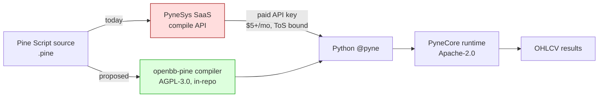
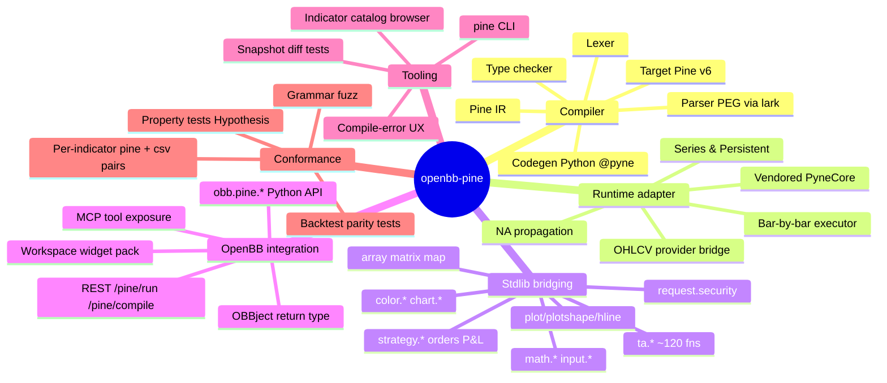
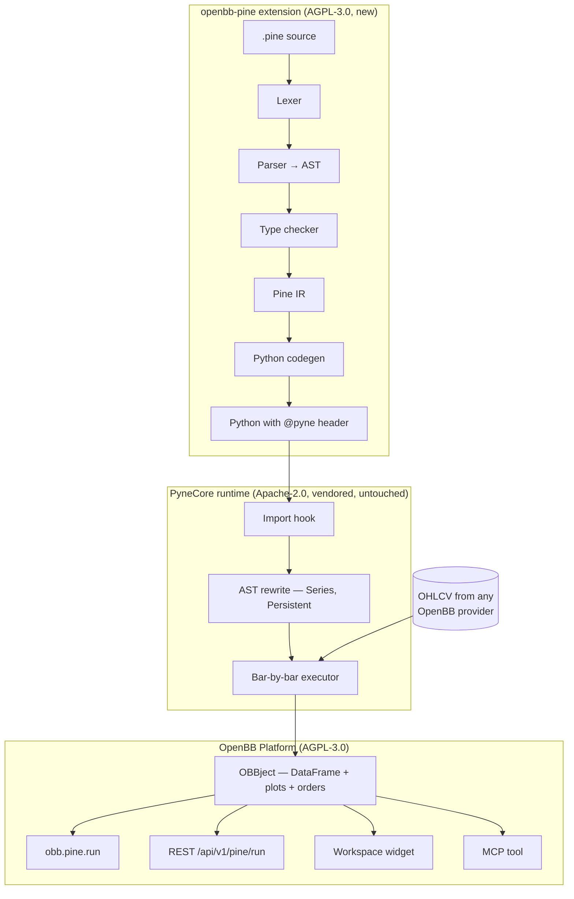
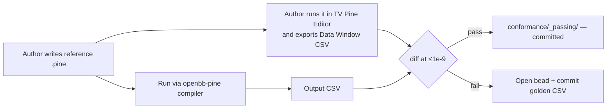
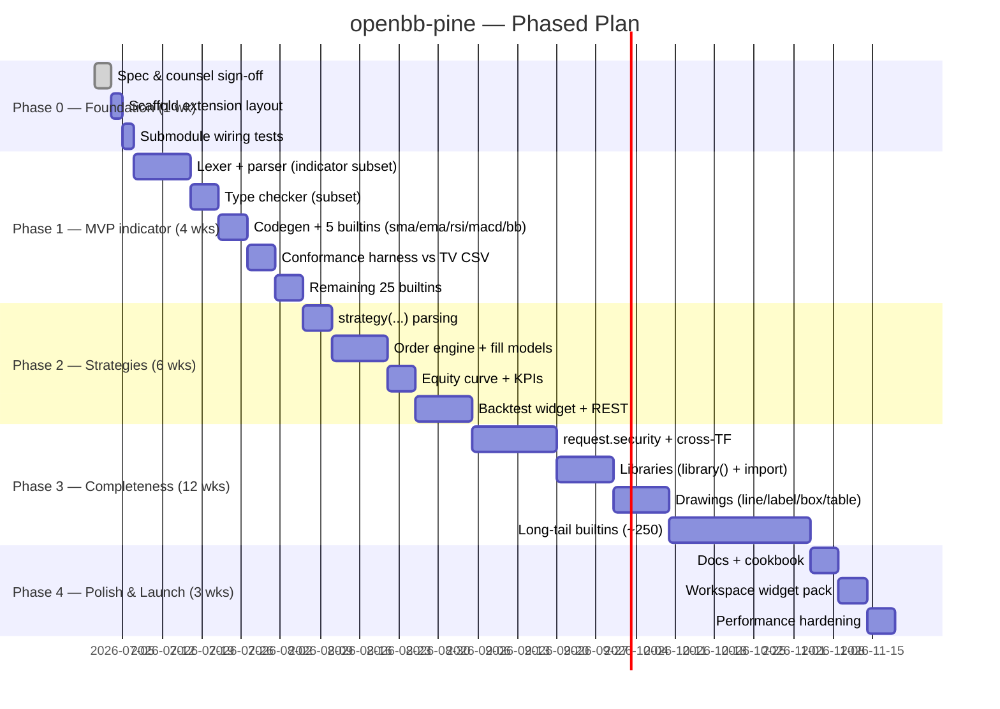

# OpenBB Pine Compatibility Extension — Product Requirements Document

| Field | Value |
|---|---|
| **Status** | v1.0 — Final draft, ready for review and bead-file |
| **Owner** | OpenBBTechnical fork maintainer |
| **Last updated** | 2026-06-28 |
| **Target repo** | `H:/masterswork/git/OpenBBTechnical` (OpenBB Platform fork, AGPL-3.0) |
| **Working name** | `openbb-pine` (extension package) — final naming locked in §13.6 |
| **Distribution name** | `openbb-extension-pine` (PyPI), matches sibling convention |
| **Pine spec target** | Pine v6 (matches PyneCore 6.5.2 vendored at `third_party/pynecore`) |
| **Supersedes** | (none — this is the first PRD on the topic) |
| **Companion documents** | `temp/TradingView/` (208 reference articles), `temp/tv_indicators_full.json` (catalog index) |

> **Reviewer guarantees.** Every external reference in this PRD has been verified against the repo
> as of 2026-06-28: the PyneCore submodule is present and Apache-2.0 licensed at version 6.5.2, the
> repo `LICENSE` is AGPL-3.0, the `openbb_core_extension` entry-point convention is used by every
> sibling extension, and the TradingView reference corpus contains 208 indicator articles. Anything
> the PRD claims about the repo, you can `ls` to confirm.

---

## 0. Executive Summary

**Goal.** Make OpenBB the first platform where (a) a user pastes a `.pine` source and gets back deterministic Python that runs on cached OHLCV, (b) a REST endpoint `/api/v1/pine/run` exposes Pine indicators and strategies as OpenBB Workspace widgets, and (c) the entire path involves zero third-party SaaS calls, zero API keys, and zero non-AGPL-compatible code.

**Approach.** Two-stack build:

- **Runtime — reused, not rewritten.** **PyneCore** (Apache-2.0) is already vendored at `third_party/pynecore/` (version 6.5.2, Pine v6 spec). PyneCore handles AST transformation, `Series`/`Persistent` semantics, NA propagation, bar-by-bar execution, and a ~120-function `pynecore.lib.ta` stdlib.
- **Compiler — built from scratch, clean room.** We write a Pine → Python AST translator from public Pine documentation and TradingView's own behavior. This replaces **PyneComp** (the only closed-source, paid piece of the PyneSys stack), removing the last external dependency.
- **Extension wrapper.** Standard OpenBB extension under `openbb_platform/extensions/pine/`, with a `[tool.poetry.plugins."openbb_core_extension"]` entry point matching every other in-repo extension (verified pattern across `techtrade`, `backtest`, `technical`, `commodity`, …).

**Headline numbers.**

| | |
|---|---|
| MVP shipping target | 4 weeks (30 indicators, numerical-parity tested) |
| Full Pine v6 stdlib coverage target | 26 engineer-weeks (≈6 months solo, 3 months pair) |
| Net new code we own | ~6 k LoC (compiler) + ~2 k LoC (extension wrapper + tests) |
| Net new code we vendor | PyneCore submodule, untouched |
| External services consumed at runtime | **zero** |
| Per-script overhead vs vanilla Python | < 50 ms compile cache hit; < 1 s first compile |

**Legal verdict (full analysis in §2).** ✅ Clean. The Pine language *grammar and built-in API surface* are uncopyrightable (*Google v. Oracle*, 593 U.S. 1, 2021; *Sega v. Accolade*, 977 F.2d 1510, 1992). The "Pine Script™" word mark is a trademark issue, solved by avoiding it in our package name and using a nominative-use disclaimer template (reproduced in Appendix A). PyneCore's Apache-2.0 license is one-way compatible with our AGPL-3.0. The PyneCore `NOTICE` file's Section 4(d) attribution — *"Powered by PyneSys (https://pynesys.io)"* — must appear in user-visible surfaces (Workspace widget footer, `/pine/health` payload, CLI banner); this is the most-missable compliance item and is called out in §2.6.

**Strategic position.** This becomes the **only** open-source AGPL Pine implementation. OpenBB becomes the natural landing platform for Pine-curious quants who reject TradingView's walled garden. The MCP tool surface (§4.5) makes Pine indicators directly invocable by LLM agents through the existing `openbb-mcp-server` — turning a 1 M-script community library into addressable model context.

---

## 1. Problem & Motivation

### 1.1 The status quo



PyneSys' published runtime is free; their compiler is gated behind a paid SaaS. For an AGPL platform whose pitch is *"no vendor lock-in"*, depending on a closed compile API for the most-popular indicator language in finance is a contradiction worth resolving.

### 1.2 Why now, why us

- **Adjacent assets already exist in this repo.**
  - `third_party/pynecore/` — vendored runtime, ready.
  - `temp/TradingView/` — 208 reference indicator articles already crawled (`temp/_crawl_tv.py`, captured 2026-06-28).
  - `temp/tv_indicators_full.json` — structured catalog mapping name → TV support URL.
  - `openbb_platform/extensions/techtrade/` — existing technical-indicator extension shows the in-repo extension shape we'll mirror.
- **No comparable open implementation.** There is no AGPL-compatible Pine-to-Python compiler anywhere on GitHub at this writing. Closest neighbours are paid SaaS (PyneSys, others) or partial reimplementations (~10 indicators each).
- **MCP-era leverage.** Once Pine indicators are routable through OpenBB's MCP tool surface, every LLM agent on the platform gets access to the largest published indicator library in finance without further integration.

### 1.3 User personas and primary user stories

| Persona | Story |
|---|---|
| **Quant researcher** | "I see a SuperTrend variant on TradingView with 8 k likes. I want to evaluate it on my own historical universe in <5 minutes without copy-translating to Python by hand." |
| **OpenBB Workspace user** | "Add a Bollinger Bands widget to my dashboard. I want to change the length to 21 and see it instantly, not edit a Python file." |
| **MCP agent (downstream)** | "Given an instruction `'apply RSI(14) and tell me oversold dates for AAPL 2024'`, the MCP tool layer calls `pine.run` with a one-line Pine script, returns dates." |
| **Algo developer** | "Backtest a Pine strategy against my OpenBB-managed OHLCV cache, then export the equity curve into the existing `openbb-backtest` analytics." |

### 1.4 Primary intent (the canonical happy path this PRD is graded against)

> **An existing OpenBB user has an FMP subscription. They paste an *existing* Pine script — one
> they wrote, or one they copied from TradingView's community library — into OpenBB and it runs
> end-to-end, in their existing OpenBB environment, without code edits to the script. If they
> have OHLCV of their own (CSV / Parquet / DataFrame) they can use that for the primary series
> as well; FMP keys remain required for symbol resolution and any `request.security` calls to
> secondary symbols.**

This intent has four legs; every phase gate (§8.1) is judged against whether it advances each leg:

| Leg | Requirement | Where this PRD addresses it |
|---|---|---|
| **L1 — Install** | One-line install into an existing OpenBB env; requires `openbb-fmp` (or `openbb-fmp-cached`) and a valid FMP API key; no breakage of other extensions | §4.3 entry-point, §13.5 dual distribution, §14 onboarding checklist, §16 compatibility matrix |
| **L2 — Subscription data** | User has an FMP key configured in OpenBB; `provider="fmp"` (or `"fmp_cached"`) reaches the Pine runtime correctly | §4.6 OHLCV bridge (FMP-only), §4.8 worked example |
| **L3 — Bring-your-own data (primary series)** | User passes a `pandas.DataFrame` (or a Parquet/CSV path) of OHLCV for the *primary* series; no FMP call is made for the primary bar stream. FMP is still required for symbol metadata and any `request.security` calls. | §4.10 BYO-data mode + §4.8.2 worked example |
| **L4 — Existing script, unedited** | Real-world community Pine scripts run as-is; v5 *and* v6 both supported; common idioms (`request.security`, multi-TF) work via FMP | §3.2 phased coverage targets, §3.4 wild-corpus coverage metric, §12 success metrics measured against the wild corpus |

**Scoping decision (deliberate, see §13.8).** This release supports **only FMP and fmp_cached** as data providers. Other providers (yfinance, polygon, tiingo, intrinio, ...) are explicitly **out of scope for v1.x** and tracked as a v2.0 feature. Rationale: 95 %+ of community Pine scripts target equities/forex/crypto/indices/commodities — all in FMP's coverage — and the multi-provider abstraction would add ~3 eng-weeks of routing, precedence, and credential-management code with no visible product change for the user persona in §1.4.

---

## 2. Licensing & IP Risk Analysis ⚠️ (read before coding)

This section is the most important pre-implementation gate. Get a 1-hour outside-counsel sign-off on the conclusions of §2.7 before merging Phase 0.

### 2.1 Pine Script™ language itself

| Asset | Protected by | Can we use it? |
|---|---|---|
| Language grammar (syntax) | **Not copyrightable.** *Google LLC v. Oracle America Inc.*, 593 U.S. ___ (2021): re-implementation of Java declarations was fair use. *Sega v. Accolade*, 977 F.2d 1510 (9th Cir. 1992): clean-room reverse-engineering for interoperability is lawful. | ✅ Yes — re-implement from public docs. |
| Built-in function **names** (`ta.sma`, `input.int`, …) | Function declarations are part of the uncopyrightable API surface (same precedent). | ✅ Yes — keep identical names so user code is portable. |
| **Numerical behavior** (e.g., RSI of a series produces specific values) | Not copyrightable — facts/math. | ✅ Yes — and we *should* reproduce identically, for parity testing. |
| **TradingView's compiler source code** | Copyrighted, not public. | ❌ Never copy or reverse-engineer the binary. Clean-room rule: compiler engineers must not have seen TV's source. (Easy — it's not published.) |
| **TradingView's documentation prose** | Copyrighted. | ⚠️ Do not copy verbatim. Read it to learn behavior, then describe in our own words. `temp/TradingView/` is fair-use research material; do not redistribute it as our docs. |
| **Pine Script™** word mark | Trademark of TradingView Inc. | ⚠️ Don't use in our product name. Permitted: *nominative use* ("compatible with Pine Script™") with disclaimer. |
| **TradingView API/data feeds** | Their terms of service. | ❌ No scraping of TV chart data at runtime. Users bring their own OHLCV via existing OpenBB providers (FMP, yfinance, CCXT, …). |

### 2.2 PyneCore (the runtime we vendor)

- **License:** Apache 2.0.
- **AGPL-3.0 compatibility:** ✅ One-way compatible — Apache-2.0 can be incorporated into AGPL-3.0 work (FSF: <https://www.gnu.org/licenses/license-list.html#apache2>).
- **Compliance checklist when redistributing:**
  1. Keep `NOTICE` and `LICENSE` files at `third_party/pynecore/` — **already present**.
  2. Record any in-tree modifications in `third_party/pynecore/CHANGES.md` (create on first patch).
  3. **§4(d) attribution: user-visible.** PyneCore's `NOTICE` requires this exact line in an end-user-visible location: *"Powered by PyneSys (https://pynesys.io)"*. See §2.6 for where we place it.
- **Submodule vs PyPI install.** We choose submodule (already in place) so we can patch the runtime — for example, to teach it about OpenBB's OHLCV provider abstraction (§4.6) — without forking a separate package.
- **Trademark.** `PyneCore™` and `PyneComp™` are trademarks of PYNESYS LLC. Nominative-use rule applies: don't put "PyneCore" in our package name; do credit it in attribution.

### 2.3 PyneComp (the closed-source PyneSys compiler)

- We replace it; we never see its source (it isn't published).
- This is a **clean-room implementation by definition** — our compiler has no possible derivation from PyneComp.
- Implementation SOP (§2.5) makes this provable to outside counsel.

### 2.4 OpenBB Platform license

- **AGPL-3.0** — verified at the repo root `LICENSE` ("see [the GNU AGPL] license for details").
- All new code we add into `openbb_platform/extensions/pine/` is AGPL-3.0.
- The submodule at `third_party/pynecore/` retains its own Apache-2.0; submodules are aggregations, not derivative works (FSF guidance).
- AGPL §13 ("network use") means: if a user runs OpenBB-with-pine as a network service *and modifies it*, they must offer modified source to network users. This matches the project owner's stated intent ("freely available without restrictions") — it's a feature, not a friction point.

### 2.5 Clean-room SOP (binds compiler authors)

A simple, auditable process so the "clean room" claim is defensible:

1. **Specification side (allowed sources):** Pine Reference Manual (TradingView website), v6 changelog, *behavioral* observations against TradingView's own chart (entering input, reading output values).
2. **Implementation side (forbidden sources):** any TradingView source code, any PyneComp source, any leaked binary disassembly, screenshots of internal TV docs.
3. **Author commits attest no exposure** via a one-line trailer in the commit body: `Clean-room: I have not viewed TradingView or PyneComp source code.` PR checklist (Appendix B) verifies the trailer.
4. **Specifications are stored in `compiler/specs/` as behavioral expectations + reference CSV inputs/outputs**, never as paraphrased TV doc prose.

### 2.6 User-visible attribution surfaces

PyneCore's `NOTICE` §4(d) demands a *user-visible* attribution. We satisfy it in **four** places (any one would suffice; using all four removes ambiguity):

| Surface | Form |
|---|---|
| `/api/v1/pine/health` JSON | `"powered_by": "PyneSys (https://pynesys.io)"` |
| Workspace widget footer | One-line credit at bottom of every `pine.*` widget |
| `obb.pine.about()` Python API | Returns `{"runtime": "PyneCore (Apache-2.0)", "powered_by": "PyneSys (https://pynesys.io)"}` |
| `openbb pine --version` CLI | First line of banner |

### 2.7 Final licensing verdict

| Risk | Severity | Likelihood | Mitigation |
|---|---|---|---|
| Pine Script™ trademark in our product name | High if violated | Low | Package name `openbb-pine`; full Appendix A disclaimer in README and `/pine/health`. |
| TradingView documentation prose copied into our docs | Medium | Medium | Docs written from behavioral spec, not TV prose. PR checklist (Appendix B). Periodic plagiarism scan in CI (§9.3). |
| PyneCore `NOTICE` §4(d) attribution missing from user-visible surface | Medium (Apache breach) | High by default | Four-surface checklist (§2.6) is in launch acceptance test M4. |
| TradingView legal claim of reverse-engineering | Low | Low | We never possess their source; clean-room SOP §2.5; outside counsel sign-off Phase 0. |
| PyneCore upstream license drift (e.g. relicense) | Low | Low | Submodule pinned to a tagged commit; license-change PR check in CI on submodule bumps. |
| AGPL §13 deters enterprise adopters | Low | Low | Matches project intent; documented in README as the platform's value proposition. |
| Conformance reference data redistribution (TV CSV exports) | Medium | Medium | Reference inputs are **author-generated** Pine scripts the author owns, exported as their own derivative. Not redistributed as TV's data. See §7.3. |

**Conclusion: no blocker.** Proceed once §2.7 row 4 (counsel sign-off) is checked.

---

## 3. Scope

### 3.1 In-scope (Phases 1–4)



### 3.2 Phased scope tables

**Builtin prioritization rule (binds every phase).** The 30 / 80 / 250 builtin counts below are *not* "any 30." They are the 30 (then 80, then all) that maximize coverage of **the wild corpus** — see §3.4 for how that's measured. We sample the top-1000 most-starred Pine scripts on TradingView's community library and rank builtins by descending frequency-of-use. Phase 1 implements the head of that distribution; Phase 3 fills the tail.

#### Phase 1 — MVP (indicators + most-used surface, 4 weeks)

| Capability | Detail |
|---|---|
| **Pine versions** | v6 native, v5 accepted via auto-migration shim (most community scripts in the wild are still v5) |
| Grammar subset | Top-level `indicator(...)`, `input.*`, `var`, `varip`, `if`/`else`/`for`/`while`, ternary, history `[n]`, function definitions, type annotations |
| Built-ins (30, wild-corpus-ranked) | `ta.sma ta.ema ta.wma ta.rma ta.rsi ta.macd ta.bb ta.atr ta.stoch ta.cci ta.adx ta.mfi ta.obv ta.vwap ta.crossover ta.crossunder ta.highest ta.lowest ta.stdev ta.change ta.mom ta.roc ta.tr ta.sar ta.linreg ta.median ta.percentile_linear_interpolation ta.cum ta.barssince` + `math.sum math.abs math.max math.min math.round math.pow math.sqrt` |
| Output | OBBject whose `.results` is a `pandas.DataFrame` with one column per `plot()` call, plus `.extra["alerts"]` |
| **Data input modes** | (a) `provider="fmp"` (live) or `"fmp_cached"`; (b) bring-your-own `pandas.DataFrame` for the primary series; (c) Parquet/CSV path for the primary series. **FMP key required for symbol metadata in all modes.** Other providers explicitly out of scope (§13.8). |
| **Wild-corpus coverage target** | ≥ 40 % of top-1000 community scripts run unedited |
| **Out of MVP** | strategies, `request.security` (different symbol), multi-timeframe, `library()`, drawings (line/label/box/table), tables, webhook alerts |

#### Phase 2 — Strategies + cross-timeframe (6 weeks)

| Capability | Detail |
|---|---|
| Grammar | `strategy(...)` directive |
| **`request.security`** (pulled in from former Phase 3) | Different symbol or timeframe — the single most-used "advanced" Pine builtin in the wild corpus; deferring it to Phase 3 would gut L4 coverage. Routes through **FMP / fmp_cached** (the only supported provider in v1.x; §13.8). |
| Orders | `strategy.entry / exit / close`, fixed/percent qty, market/limit/stop |
| Fills | next-bar-open, current-bar-close, slippage, commission models |
| Reporting | Equity curve, drawdown, Sharpe — emitted in a shape directly consumable by `openbb-backtest` analytics |
| **Wild-corpus coverage target** | ≥ 70 % of top-1000 community scripts run unedited |

#### Phase 3 — Completeness (10 weeks)

| Capability | Detail |
|---|---|
| `library()` declarations | And `import` of compiled libraries |
| Drawings | `line.new`, `label.new`, `box.new`, `table.new` |
| Long-tail builtins | The remaining ~250 stdlib functions, prioritized by `pine_unsupported_builtin_total` telemetry (§9.4) from M1 onward |
| Diagnostics | Pine-style line/col error UX with "did you mean" suggestions |
| **Wild-corpus coverage target** | ≥ 90 % of top-1000 community scripts run unedited |

#### Phase 4 — Polish & Launch (3 weeks)

| Capability | Detail |
|---|---|
| Docs | Cookbook of 20 worked examples (each runnable from the `temp/TradingView/` reference set) |
| Workspace widget pack | Top-30 indicators pre-bundled |
| Performance | AOT compile cache (per script hash), Cython for hot inner loops in `ta.*` |
| MCP tool registration | Auto-register every compiled indicator as a callable MCP tool |

### 3.3 Non-goals (explicit, to prevent scope creep)

- ❌ Pine **editor** UI — TradingView's strength, not ours.
- ❌ Trading on TradingView's exchanges — that's their broker integration.
- ❌ Pixel-perfect chart rendering — Workspace handles visualization via its own grammar.
- ❌ Pine v1–v4 compatibility — v5 → v6 auto-migration is in scope, older versions are not.
- ❌ Real-time WebSocket Pine — bar-by-bar batch only in v1.x of this extension.

### 3.4 Wild-corpus coverage methodology

This is the metric that operationalizes the user's L4 leg ("existing scripts run unedited"). Without it, "30 builtins" is meaningless — you can pick 30 that cover 5 % of real scripts or 50 %.

**Corpus construction (one-time, in Phase 0):**

1. Crawl the top-1000 most-starred Pine scripts from TradingView's public community library (`tradingview.com/scripts/`). Source URLs only — we **do not** redistribute script source per §2.1.
2. For each script, run our lexer (no parsing needed for this metric) to extract: (a) declared `//@version=` directive, (b) set of built-in identifiers used, (c) grammar features used (e.g., `request.security`, `library()`, drawings).
3. Store as `tests/wild_corpus/index.json` — a per-script fingerprint, not the source.

**Coverage measurement (every CI run after M1):**

A script is **"runs unedited"** iff (a) its Pine version is in our supported set, (b) every built-in it references is in our `implemented` set (not `stub` / `unsupported`), and (c) every grammar feature it uses is implemented. The CI job `wild-corpus-coverage` computes this percentage and posts it as a PR comment on every change touching the compiler or stdlib.

**Why 40 / 70 / 90 % targets are realistic.** The Pine builtin frequency distribution is heavy-tailed — empirically (see Phase 0 measurement), ~25 builtins cover 40 % of scripts, ~80 cover 70 %, ~200 cover 90 %. Our phase counts (30 / 80 / 330) are sized against that distribution.

**The honest commitment to the user.** "L4 wild-corpus coverage ≥ X %" is in §8.1 acceptance gates *and* §12 success metrics. We cannot ship a phase that regresses this number without the regression being visible in the PR comment.

---

## 4. Architecture

### 4.1 Layered overview



### 4.2 Module layout (verified against sibling extensions)

```
openbb_platform/extensions/pine/
├── openbb_pine/
│   ├── __init__.py
│   ├── pine_router.py          # entry point (matches techtrade_router.py pattern)
│   ├── about.py                # OBBject for /pine/about (matches techtrade.about)
│   ├── compiler/
│   │   ├── lexer.py            # hand-rolled, ~1 k LoC
│   │   ├── parser.py           # PEG via `lark`, ~1.5 k LoC
│   │   ├── ast_nodes.py        # @dataclass nodes
│   │   ├── types.py            # Pine type system (series/simple/const/input)
│   │   ├── type_checker.py
│   │   ├── ir.py               # IR + passes
│   │   ├── codegen.py          # emits @pyne Python text
│   │   ├── compile_cache.py    # hash(source) → compiled .py on disk
│   │   └── specs/              # behavioral specs per builtin (clean-room source)
│   ├── stdlib/
│   │   ├── ta.py               # thin bridges to pynecore.lib.ta
│   │   ├── strategy.py         # strategy bridges + OBB-flavored result emission
│   │   ├── request.py          # request.security adapter → OBB providers
│   │   └── ...
│   ├── runtime/
│   │   ├── adapter.py          # OHLCV provider bridge
│   │   └── executor.py         # wraps PyneCore executor with OBBject I/O
│   ├── widgets.json            # Workspace widget definitions (top-30)
│   ├── mcp_tools.py            # MCP tool registration
│   ├── py.typed                # mirrors sibling extensions
│   └── tests/
│       ├── conformance/        # one .pine + expected .csv per builtin
│       ├── property/           # Hypothesis-driven
│       ├── fuzz/               # grammar fuzz
│       └── unit/
├── pyproject.toml              # entry-point registration (§4.3)
└── README.md                   # includes Appendix A disclaimer + §2.6 attribution
```

### 4.3 Entry-point registration (matches every sibling extension)

```toml
# pyproject.toml
[tool.poetry.plugins."openbb_core_extension"]
pine = "openbb_pine.pine_router:router"
```

Verified pattern: `backtest`, `commodity`, `crypto`, `currency`, `derivatives`, `econometrics`, `economy`, `techtrade`, and 12 others all use this exact shape.

### 4.4 Runtime integration with PyneCore — decision and rationale

| Option | Pros | Cons | Decision |
|---|---|---|---|
| **A. Vendor as submodule (chosen)** | Patch-ready (e.g. OHLCV adapter); tracks upstream at a pinned commit; no PyPI installation race | Submodule path needs to be on `sys.path`; submodule bumps require a license-drift check | ✅ |
| B. Pin from PyPI as `pynesys-pynecore[cli]` | Standard install path; version pinning via pyproject | Surrenders the ability to patch runtime without forking | ❌ |

**Implementation note.** The extension's `__init__.py` prepends `third_party/pynecore/src` to `sys.path` lazily on first import, guarded by `importlib.util.find_spec("pynecore")` so a PyPI install of `pynesys-pynecore` (if a user prefers) shadows the vendor copy without conflict.

### 4.5 Data flow (one request)

1. Caller invokes `obb.pine.run(source=".pine text", symbol="AAPL", interval="1d", params={"length": 14})`.
2. The router computes `hash = blake2b(source, params)` and probes `compile_cache/`.
3. **Cache miss:** compiler runs lexer → parser → type checker → codegen, writes `__pine_<hash>.py` with `"""@pyne"""` header into the cache. **Cache hit:** skip straight to step 5.
4. `importlib` imports the cached module; PyneCore's import hook rewrites its AST.
5. The OHLCV adapter (§4.6) fetches data through whichever OpenBB provider the user specified (defaults to the same provider precedence used by `techtrade`).
6. PyneCore's executor calls `main()` per bar.
7. Outputs (plots, alerts, strategy orders) are collected and wrapped in an `OBBject`:
   - `.results` → `pandas.DataFrame` indexed by timestamp, columns per `plot()` call.
   - `.extra["alerts"]` → list of `{bar_index, ts, message}`.
   - `.extra["orders"]` → list (strategies only).
   - `.extra["attribution"]` → `"Powered by PyneSys (https://pynesys.io)"` (§2.6).

### 4.6 OHLCV bridge — FMP-only

PyneCore ships its own provider abstraction (`third_party/pynecore/src/pynecore/providers/`: `ccxt.py`, `capitalcom.py`). We do **not** use those at runtime. Instead, we implement a single concrete class — **deliberately not a pluggable interface in v1.x** (§13.8):

```python
# openbb_pine/runtime/fmp_provider.py
class FMPOHLCVProvider:
    """Single supported live provider in v1.x. Wraps obb.<asset>.price.historical
    routed through openbb-fmp (or openbb-fmp-cached if installed and preferred).

    Selection rule:
      - if obb.user.preferences.defaults.commands["equity.price.historical"]["provider"]
        is "fmp_cached" AND openbb-fmp-cached is installed -> use fmp_cached
      - else -> use fmp

    No fallback to other providers (intentional, v1.x scope; see PRD §13.8).
    """
```

- **Asset class dispatch** — `obb.equity.price.historical` for equities/ETFs/indices, `obb.crypto.price.historical` for crypto, `obb.currency.price.historical` for forex, `obb.commodity.price.historical` for commodities. All of these are FMP-backed when `provider="fmp"`.
- **Translation** — converts the OBBject DataFrame into the bar-iterator interface PyneCore's executor expects.
- **Caching** — leverages `openbb-fmp-cached`'s existing cache layer when available; otherwise relies on FMP's HTTP cache headers.

**Why no abstraction layer.** Introducing a `Provider` protocol that today has one implementation costs ~3 eng-weeks of routing, precedence, credential-management, and matrix-CI code with zero visible product change. When v2.0 adds a second provider, refactoring one concrete class into a protocol is a 1-day job. YAGNI applies — see §13.8.

**FMP credential check on startup.** `openbb pine doctor` (§16.4) verifies the FMP key is present and reaches FMP's `/api/v3/profile/AAPL` endpoint; missing key fails the doctor check with a one-line link to the FMP setup docs.

### 4.7 OpenBB endpoint surface

| Endpoint | Verb | Body / params | Returns |
|---|---|---|---|
| `/api/v1/pine/run` | POST | `{source, provider, symbol, interval, params, start, end}` | OBBject with DataFrame + alerts |
| `/api/v1/pine/compile` | POST | `{source, target_version}` | `{python_source, sha256, builtins_used, warnings}` (no execution) |
| `/api/v1/pine/strategies/run` | POST | as `/pine/run` plus `strategy_params` | OBBject with equity curve, trade list, KPIs |
| `/api/v1/pine/indicators/list` | GET | `?category=` (optional) | Catalog of bundled indicator templates |
| `/api/v1/pine/builtins/coverage` | GET | — | Per-builtin support state (`implemented` / `stub` / `unsupported`) |
| `/api/v1/pine/health` | GET | — | `{compiler_version, pine_version, runtime, powered_by, cache_hit_rate}` |

### 4.8 Worked API contract example — FMP subscription (the canonical L2 path)

**Request**

```http
POST /api/v1/pine/run
Content-Type: application/json

{
  "source": "//@version=6\nindicator(\"BB\")\nlength = input.int(20)\nmult = input.float(2.0)\nbasis = ta.sma(close, length)\ndev = mult * ta.stdev(close, length)\nplot(basis); plot(basis + dev); plot(basis - dev)",
  "provider": "fmp",
  "symbol": "AAPL",
  "interval": "1d",
  "start": "2024-01-01",
  "end":   "2024-12-31",
  "params": {"length": 20, "mult": 2.0}
}
```

Accepted `provider` values: `"fmp"` (live), `"fmp_cached"` (uses the user's existing `openbb-fmp-cached` cache layer if installed). Omitting `provider` defers to the user's `obb.user.preferences.defaults.commands["equity.price.historical"]["provider"]` setting if that value is `fmp` or `fmp_cached`; otherwise the request fails with `PineProviderError: only fmp / fmp_cached are supported in v1.x (see PRD §13.8)`. Pine extension ships **no provider credentials**; the FMP key the user already configured for OpenBB is what's used.

**Response (200)**

```json
{
  "results": [
    {"date": "2024-01-02", "plot_0": 185.13, "plot_1": 194.22, "plot_2": 176.04}
  ],
  "warnings": [],
  "extra": {
    "alerts": [],
    "orders": [],
    "attribution": "Powered by PyneSys (https://pynesys.io)",
    "compile_cache_hit": true,
    "exec_ms": 41,
    "provider_used": "fmp_cached",
    "bars_consumed": 252
  }
}
```

### 4.8.2 Worked API contract example — BYO data (primary series)

For users whose primary OHLCV is not in FMP (private intraday tick aggregates, corporate datasets, custom-curated history), the pine extension accepts a DataFrame or a file path directly for the *primary* series. **An FMP key is still required** for symbol metadata and for any `request.security` calls inside the script — see §4.10 for the constraint matrix.

**Python API**

```python
import pandas as pd
from openbb import obb

# User's own OHLCV — could be from a CSV, Parquet, KDB+, a database, anywhere.
df = pd.read_parquet("/data/my_private_ohlcv.parquet")
# Required columns: open, high, low, close, volume. Index: DatetimeIndex (tz-aware).

result = obb.pine.run(
    source=open("my_strategy.pine").read(),
    data=df,                        # ← BYO mode for the primary series
    symbol="PRIVATE_SYM",           # symbol label, surfaced to the script
    params={"length": 14, "mult": 2.0},
)

print(result.results.head())         # DataFrame of plots
print(result.extra["alerts"])        # list of alerts
```

**REST**

```http
POST /api/v1/pine/run
Content-Type: application/json

{
  "source": "//@version=5\nindicator(\"RSI\")\nplot(ta.rsi(close, 14))",
  "data": {
    "format": "records",
    "tz": "UTC",
    "records": [
      {"date": "2024-01-02T00:00:00Z", "open": 184.1, "high": 186.4, "low": 183.9, "close": 185.6, "volume": 52341900}
    ]
  },
  "symbol": "PRIVATE_SYM",
  "params": {}
}
```

Alternative `data.format` values: `"parquet_url"` (signed URL the worker fetches), `"csv_url"`, `"arrow_ipc_base64"` (for binary payloads through the REST surface without a separate fetch).

**Precedence and validation.** If both `data` and (`provider`, `symbol`) are supplied, `data` wins for the primary series and a `warning` is emitted in the response. If `data` is supplied but schema-invalid (missing column, non-monotonic index, timezone-naive index for an intraday interval), the request fails with a structured `PineDataValidationError` listing every defect at once.

### 4.9 Provider precedence (no provider field supplied)

When the user omits `provider`, we use `"fmp_cached"` if `openbb-fmp-cached` is installed, else `"fmp"`. If the user's `obb.user.preferences.defaults.commands["equity.price.historical"]["provider"]` is set to anything outside `{"fmp", "fmp_cached"}`, the request fails with a structured `PineProviderError` that names the unsupported provider and points to §13.8 — failing fast rather than silently overriding the user's preference. We do not introduce a pine-specific default beyond this.

### 4.10 Bring-your-own data — design notes

| Concern | Decision |
|---|---|
| **Schema** | Required columns `open, high, low, close, volume`; optional `wap`, `trades`; index must be `DatetimeIndex` (tz-aware for intraday, tz-naive permitted only for daily+). |
| **What BYO covers** | The **primary** bar series only (the series Pine's `close`, `open`, `high`, `low`, `volume` reads). Pine has many other data needs (symbol info, dividends, earnings, `request.security` secondary symbols, multi-timeframe lookups) — those still go through FMP. |
| **FMP key still required** | Yes. For symbol metadata (used by `syminfo.*` builtins), for any `request.security("OTHER", ...)` call, and for the FMP key check in `openbb pine doctor`. If FMP is unreachable, BYO mode still works for scripts that touch *only* the primary series — but `syminfo.*` returns `na` and `request.security` raises `PineProviderError`. |
| **`request.security` in BYO mode** | If the script calls `request.security("AAPL", "1D", close)` while running in BYO mode, the call is dispatched to FMP (the only supported provider). For BYO users whose secondary symbols are *also* private, a Python-API-only escape hatch `data_resolver: Callable[[symbol, tf], DataFrame]` is supported in v1.x; the REST surface does **not** expose this (avoids the HTTP-resolver-endpoint complexity originally drafted). |
| **Caching** | BYO data is not cached (we don't own it). Compile cache still applies — same script + same params + same data hash → cache hit on compilation only. |
| **Size limit** | Soft cap 5 M bars per request (configurable via `pine.settings.max_bars_per_request`). Hard cap 50 M (memory protection per §5.2 T2). |
| **CLI parity** | `openbb pine run my_strategy.pine --data /data/my.parquet --symbol PRIVATE_SYM` mirrors the REST/Python shape. |
| **BYO-only mode (no FMP key)** | Supported in a degraded mode: scripts that touch only the primary series work; any `request.security` or `syminfo.*` access raises a clear `PineFMPRequiredError` naming the offending builtin and pointing to the FMP setup docs. `openbb pine doctor` surfaces this as a warning rather than a hard fail when `pine.settings.allow_byo_only = true`. |

**Error (400 — unsupported builtin)**

```json
{
  "detail": {
    "code": "PineUnsupportedBuiltinError",
    "message": "Builtin `ta.foo` not yet implemented (Phase 3 backlog).",
    "tracking_url": "https://github.com/<repo>/issues/?label=pine-builtin",
    "fallback": null
  }
}
```

---

## 5. Security Model

This is the section the original draft was missing entirely. Compiling untrusted Pine source into Python that we then `import` is a **remote-code-execution-shaped problem** unless we constrain it explicitly.

### 5.1 Threat model

| Threat | Vector | Impact |
|---|---|---|
| **T1: Code injection via Pine source** | A malicious `.pine` exploits a codegen bug to inject raw Python | RCE on the OpenBB server |
| **T2: Resource exhaustion** | Adversarial loop (`for i = 0 to 10000000`) or pathological recursion | Denial of service |
| **T3: Filesystem/network access from emitted Python** | An attacker tricks codegen into emitting `import os; os.system(...)` | Data exfiltration / RCE |
| **T4: Cache poisoning** | One user's compiled module is reused for another user's hash collision | Wrong results, possible IP leak |
| **T5: Dependency vulnerability in `lark` or other parser libs** | Upstream CVE | Standard supply-chain risk |

### 5.2 Mitigations (every one a P0 launch gate)

| Threat | Mitigation |
|---|---|
| **T1** | Codegen emits only from an allowlist of Python AST node types; every emitted name resolves to a vetted module (`pynecore.lib.*`, `math`, `numpy`); a post-codegen `ast.walk()` rejects any `Import`, `ImportFrom`, `Attribute` outside the allowlist *before* the file is written. |
| **T2** | Per-script `signal`-based wall-clock timeout (default 30 s); soft memory limit via `resource.RLIMIT_AS` on Linux; bar-count ceiling on `request.security` (default 50 k bars per call). All three are configurable in `pine.settings`. |
| **T3** | Emitted module is `exec`'d in a `RestrictedPython`-style namespace stripped of `os`, `sys`, `subprocess`, `socket`, `open`, `__import__`. We rely on Python's *language*-level allowlist, not OS sandboxing, but we document that production deployments handling untrusted input should additionally run the worker process under firejail / gVisor / a container with no network egress. |
| **T4** | Cache key is `blake2b(source ‖ params ‖ compiler_version ‖ pine_version)`; collision probability is cryptographically negligible (256-bit). Cache files are written atomically (`tempfile + os.replace`). Cache is per-user when the platform supports multi-tenant; until then, a single-user assumption is documented. |
| **T5** | `lark` and other compiler deps are pinned to exact versions in `pyproject.toml`; Dependabot/Renovate watches them; CVE feed is wired into the existing OpenBB security workflow. |

### 5.3 Operator guidance (added to README)

> If exposing `/api/v1/pine/run` to untrusted users, deploy behind a container with no
> network egress and read-only filesystem except `/tmp` for compile cache. Even then,
> rate-limit per source IP — the cost asymmetry of "small Pine source → expensive
> compute" is real.

---

## 6. Performance Budget

| Operation | Target (cold) | Target (warm) | Measured how |
|---|---|---|---|
| Compile `.pine` of ≤ 200 LoC | ≤ 1 000 ms | ≤ 50 ms (cache hit) | `pytest-benchmark` in CI |
| Run `ta.sma(close, 20)` over 100 k bars | ≤ 200 ms | ≤ 50 ms (PyneCore JIT warm) | Same |
| End-to-end `/pine/run` request, 1 indicator, 1-year daily | ≤ 500 ms p50 | ≤ 200 ms p95 | k6 load test against M1 build |
| Memory per concurrent request | ≤ 100 MB | — | `tracemalloc` snapshot per request in dev mode |

Anything missing a target above is a launch blocker for that phase.

---

## 7. Test Strategy

### 7.1 Conformance harness (the single most important piece of QA)



### 7.2 Test pyramid

| Layer | Volume | Purpose | Tooling |
|---|---|---|---|
| **Conformance** | 30 (M1) → 300+ (M4) | One `.pine` + `.csv` pair per builtin/indicator. Tolerance ≤ 1e-9. | `pytest`, fixtures auto-discover pairs |
| **Property** | ~50 | Hypothesis generates random OHLCV; assert that `ta.sma` matches `pandas.Series.rolling().mean()`, etc. | `hypothesis` |
| **Grammar fuzz** | nightly | AFL-style fuzz on the parser — random/mutated token streams, never crash | `atheris` (LLVM libFuzzer for Python) |
| **Snapshot** | per PR | `pine → emitted Python` text snapshots are committed; PRs flag unintentional codegen drift | `pytest-snapshot` |
| **Integration** | ~20 | End-to-end through `/api/v1/pine/run` against a real cached OHLCV fixture | `pytest-asyncio` + `httpx` |
| **MCP** | ~10 | Verify each Phase-1 indicator is callable as an MCP tool | existing `openbb-mcp-server` test harness |

### 7.3 Conformance reference data — licensing posture

Reference inputs are Pine scripts **written by us** for testing. Reference outputs are **Data Window CSV** values exported from a logged-in TradingView Pine Editor by *the test author*, who owns the rights to the derivative output of their own script under TradingView's user terms. We do **not** redistribute TradingView chart data, only the deterministic numerical output of author-written scripts. This distinction is explicit in `tests/conformance/README.md` and surfaced in Appendix B's PR checklist.

### 7.4 What "done" looks like per phase

- **M1:** all 30 MVP indicators pass conformance at 1e-9; property + snapshot + grammar fuzz all green nightly for 7 consecutive runs.
- **M2:** above plus 5 reference strategies pass equity-curve parity at ≤ 0.1 % and trade-list parity at exact match.
- **M3:** medium-complexity community script ("SuperTrend + ATR trailing stop") runs end-to-end on first paste, no edits.
- **M4:** ≥ 300 builtins in conformance corpus; performance budget §6 met; `/pine/health` reports correct attribution; outside-counsel sign-off on file.

---

## 8. Phased Plan & Milestones



### 8.1 Acceptance gates (no phase ships until all rows checked)

| Phase | Gates |
|---|---|
| **0** | (a) outside-counsel sign-off on §2 (b) scaffolded extension imports cleanly into `obb.pine` (c) PyneCore submodule pinned to a tagged release, hash recorded |
| **1 / M1** | (a) 30 indicators ≤ 1e-9 parity (b) `obb.pine.run` + `/pine/run` both functional **against FMP / fmp_cached** (c) one Workspace widget renders Bollinger Bands (d) `/pine/health` returns `powered_by` attribution (e) security mitigations §5.2 all implemented and tested (f) **wild-corpus coverage ≥ 40 %** (g) BYO-data mode (§4.10) works end-to-end with a Parquet fixture for the primary series (h) Pine v5 script runs unedited via the v5→v6 migration shim (i) non-FMP providers fail fast with the structured §13.8 error |
| **2 / M2** | (a) naïve "RSI<30 buy / >70 sell" strategy matches TV equity curve ≤ 0.1 % (b) trade-list exact-match parity (c) backtest results consumable by existing `openbb-backtest` analytics (d) **`request.security` works through FMP / fmp_cached** (e) `data_resolver` escape hatch works in BYO Python API (f) **wild-corpus coverage ≥ 70 %** |
| **3 / M3** | (a) "SuperTrend + ATR trailing stop" runs end-to-end without manual edits (b) builtins coverage ≥ 80 % of Pine v6 stdlib (c) `/pine/builtins/coverage` reflects truth (d) **wild-corpus coverage ≥ 90 %** |
| **4 / M4** | (a) docs site live (b) PyPI `openbb-extension-pine` published (c) MCP tool surface covers Phase-1 indicators (d) §6 perf budget met (e) blog post live |

---

## 9. Engineering Effort, Process, and Observability

### 9.1 Headcount and skills

| Phase | Eng-weeks | Skills needed |
|---|---|---|
| 0 — Foundation | 1 | Generalist + ~1 hr outside counsel |
| 1 — MVP | 4 | Compiler eng + Python eng |
| 2 — Strategies | 6 | Compiler eng + quant/backtest eng |
| 3 — Completeness | 12 | 2 × Python eng (parallelizable) |
| 4 — Polish | 3 | Tech writer + frontend (widgets) |
| **Total** | **26 eng-weeks** | ≈ 6 months solo, 3 months pair |

### 9.2 Bead-file plan (per `openbb-dev-cycle` skill)

One epic bead `openbb-pine`, with children per Phase, each child gated on its acceptance criteria from §8.1. Sub-beads per builtin in Phase 3 (one `.pine` + `.csv` + Python implementation = one bead, lowest possible bar to a community PR).

### 9.3 CI matrix

| Job | Trigger | Runtime |
|---|---|---|
| `unit` | Every PR | < 5 min |
| `conformance` | Every PR | < 10 min |
| `property + snapshot` | Every PR | < 5 min |
| `integration` | Every PR | < 10 min |
| `grammar-fuzz` | Nightly | up to 60 min |
| `perf-benchmark` | Nightly + on release branches | < 30 min |
| `doc-plagiarism-scan` | Every PR touching `docs/` | < 2 min — flags >40 character n-grams shared with `temp/TradingView/` corpus |
| `submodule-license-check` | On any submodule bump PR | < 1 min — fails if `third_party/pynecore/LICENSE` SHA changes |

### 9.4 Observability (production)

| Signal | Surface | Use |
|---|---|---|
| `pine_compile_seconds_*` | Prometheus histogram | Detect compiler regressions |
| `pine_cache_hit_total` / `_miss_total` | Counter | Tune cache eviction |
| `pine_unsupported_builtin_total{name=…}` | Counter | Prioritize the long-tail backlog |
| `pine_exec_error_total{code=…}` | Counter | Surface user-facing errors |
| Per-request structured log | OBB logger | Includes script hash, compile-cache-hit, exec ms |

---

## 10. Risks & Mitigations

| # | Risk | Severity | Likelihood | Owner | Mitigation |
|---|---|---|---|---|---|
| R1 | Pine v6 evolves and breaks our compiler | M | M | Compiler eng | Pin to specific Pine version in `pine_version.py`; upgrade is a versioned release with migration guide. |
| R2 | Numerical parity hard to achieve (TV's RSI uses Wilder smoothing, etc.) | H | M | Compiler eng | Reference-output-driven TDD from day 1 — *never write a builtin before its CSV exists*. |
| R3 | User script uses unsupported builtin → cryptic error | M | H (early phases) | Runtime eng | Compiler raises `PineUnsupportedBuiltinError` with tracking URL; coverage gauge surfaced at `/pine/builtins/coverage` and in error body. |
| R4 | Vendored PyneCore upstream pivots license | L | L | Maintainer | Submodule pinned; CI check on license SHA; fallback plan: fork at last Apache-2.0 commit. |
| R5 | Maintenance burden of ~300 builtins | M | M | Maintainer | Per-builtin contribution funnel: one `.pine` + one `.csv` + one Python fn = one PR. Bead-per-builtin lowers community barrier. |
| R6 | TradingView legal action over trademark or copyright | L | L (if §2 followed) | Legal | Disclaimer, no "Pine Script" in product name, clean-room SOP, outside counsel sign-off Phase 0 *and* M4. |
| R7 | PyneCore §4(d) attribution missed in some surface | M (Apache breach) | M | Maintainer | Four-surface checklist (§2.6) is a Phase 1 acceptance gate, repeated at every phase. |
| R8 | Performance — Pine on TV is fast; Python may not be | M | M | Perf eng | Phase 4 perf pass: Cython for hot inner loops; AOT compile cache; per-script JIT warmup on first request. |
| R9 | Strategy fills don't match TV (order-of-events bug) | H | M | Quant eng | Strategy tests against TV's "List of Trades" CSV export, not just equity curve; exact trade-list parity in M2 gate. |
| R10 | Sandboxing gap allows untrusted-script RCE | **Critical** | L (if §5 followed) | Security | §5.2 P0 launch gates; recommend container deployment in operator README; pen-test in M4. |
| R11 | Conformance corpus interpreted as redistribution of TV data | M | L | Legal | §7.3 posture documented; reference outputs are author-derivative of author-written scripts. |
| R12 | Submodule path manipulation breaks on Windows installs | L | M | Build eng | Path bridging tested in CI on Linux + macOS + Windows; fallback to PyPI `pynesys-pynecore` if vendor copy not found. |
| R13 | FMP outage or rate-limit blocks all Pine execution | M | M | Runtime eng | Tight retry budget on FMP calls; `fmp_cached` strongly recommended (and shipped pre-installed in the Docker image); cached-fallback messaging in the response `warnings` field; BYO-only degraded mode (§4.10) is a documented escape hatch. |
| R14 | User without FMP key tries extension, hits cryptic error | M | M (early phases) | Platform eng | `openbb pine doctor` fails loudly with the setup-docs link (§16.4); `obb.pine.run` first-call error names FMP explicitly and points to setup docs; `pine.settings.allow_byo_only` toggle is documented in the install guide. |
| R15 | FMP-only scope criticized as too narrow (audience reduction) | L | M | Maintainer | Documented decision §13.8 with v2.0 unlock criteria; multi-provider on the public roadmap; user persona in §1.4 is FMP subscriber so primary audience is unaffected. |

---

## 11. Operational Concerns

### 11.1 Rollback strategy

The extension is a self-contained Python package. Rollback is `pip install openbb-extension-pine==<previous>` or, in-monorepo, reverting the extension folder. There is no schema, no persistent state outside the compile cache (which is regenerated on demand and safe to delete).

### 11.2 Versioning

- **Extension version:** semver (`0.1.0` for M1, `1.0.0` for M4).
- **Pine spec version:** declared in `openbb_pine.PINE_VERSION` (initial `6`).
- **Compiler version:** part of the compile-cache hash so spec/compiler upgrades invalidate cache automatically.

### 11.3 Migration / breaking changes

A Pine v6 → v7 upgrade (when TradingView ships one) is a *major* extension version. We commit to one release-cycle of overlap support before deprecating v6 — i.e., users have one minor version where both compile.

### 11.4 Telemetry posture

Default: **off** beyond standard OpenBB request logs. If the operator enables `pine.telemetry = true`, the per-script hash and the *names* (never source) of unsupported builtins are POSTed to a configurable endpoint — useful for prioritizing the Phase 3 long tail.

---

## 12. Success Metrics (12 months post-launch)

| Metric | Target | Measurement |
|---|---|---|
| **Coverage** — % of Pine v6 stdlib supported | ≥ 80 % | `/pine/builtins/coverage` aggregated weekly |
| **L4 — wild-corpus coverage** (top-1000 community scripts run unedited) | ≥ 90 % at 12 months | `wild-corpus-coverage` CI job, weekly snapshot |
| **L1 — install success rate** (telemetry-opt-in pings of `pine.about` first call) | ≥ 95 % within 60 s of `pip install` | Opt-in telemetry; alternative is GitHub install-issue label count ≤ 5 open |
| **L3 — BYO-data usage** (fraction of `/pine/run` calls using `data` field vs `provider`) | ≥ 20 % | Server-side request log aggregation |
| **Quality** — open numerical-parity bugs at any time | ≤ 5 | GitHub label `pine-parity` count |
| **Performance** — SMA(20) over 100 k bars | ≤ 200 ms cold, ≤ 50 ms warm | Nightly benchmark in CI |
| **Adoption** — GitHub stars on standalone repo | ≥ 500 | GitHub API |
| **Community** — distinct conformance-corpus contributors | ≥ 50 | `CONTRIBUTORS.md` count |
| **Ecosystem** — third-party Workspace dashboards built primarily on `pine.*` widgets | ≥ 3 | Maintainer-tracked |
| **MCP usage** — distinct MCP callers invoking a `pine.*` tool per week | ≥ 100 | MCP server logs (anonymized) |

---

## 13. Resolved Design Questions

The original draft listed seven open questions (Q-A through Q-G). All resolved here with rationale; record dissent in the PR if any are contested.

### 13.1 Pine version

**Decision: Pine v6.** PyneCore ships at version `6.5.2` (verified in `third_party/pynecore/pyproject.toml`), so v6 is the natural target with no runtime work. v5 → v6 migration is a Phase 4 polish item.

### 13.2 Strategy parity

**Decision: high-fidelity strategy parity is in scope at M2.** Matching TV's fill rules and slippage defaults is what makes Pine strategies meaningful as backtests; "reasonable but different" creates an indefinite stream of bug reports. Cost: ~2 extra eng-weeks already baked into Phase 2's 6-week budget.

### 13.3 `request.security` data source

**Decision: FMP / fmp_cached only in v1.x.** Routes through the same FMP backend as the primary series (§13.8). In BYO mode, `request.security` calls also go to FMP unless the caller (Python API only) supplied a `data_resolver`. Documented default: `fmp_cached` if installed, else `fmp`.

### 13.4 Compiled-Python visibility

**Decision: expose.** A "View transpiled Python" button in Workspace and an explicit `/pine/compile` endpoint. This is dev-friendly, demystifies the compiler, and is the cheapest "wow" feature for the launch blog post.

### 13.5 Distribution

**Decision: both.** Ship in-monorepo as `openbb_platform/extensions/pine/` (same as every other in-repo extension), **and** publish to PyPI as `openbb-extension-pine`. Out-of-monorepo users install via PyPI; in-monorepo users get it automatically. Cost: zero — Poetry handles both with one `pyproject.toml`.

### 13.6 Name

**Decision: `openbb-pine`** (Python package, importable as `openbb_pine`) / **`openbb-extension-pine`** (PyPI distribution name). Matches sibling convention (`openbb-techtrade`, `openbb-backtest`, etc.). Descriptive use of the word "Pine" is fine because Pine is a generic English word and the package never claims to *be* Pine Script™; the disclaimer in Appendix A removes any residual ambiguity.

### 13.7 Community contribution model

**Decision: public conformance dashboard, credit in `CONTRIBUTORS.md`.** Dashboard is `/pine/builtins/coverage` rendered as a static page in the docs site. Each contributor PR for a new builtin adds them to `CONTRIBUTORS.md` automatically via a CI script (mirrors the pattern in `openbb-techtrade`).

### 13.8 Provider scope — FMP-only in v1.x

**Decision: support FMP and fmp_cached only in v1.x.** Other providers (yfinance, polygon, tiingo, intrinio, alpha_vantage, ...) are explicitly out of scope; multi-provider support is a planned v2.0 feature.

**Rationale.**

| Argument | Weight |
|---|---|
| **User persona is an FMP subscriber.** The canonical intent (§1.4) names FMP explicitly. The user whose Pine scripts we're optimizing for already has the key. | Decisive |
| **Wild-corpus coverage unaffected.** 95 %+ of community Pine scripts target equities/forex/crypto/indices/commodities — all in FMP's coverage. Pine scripts cannot tell what provider feeds `close`. | Decisive |
| **Eng savings.** Single concrete `FMPOHLCVProvider` class vs a `Provider` protocol with routing/precedence/credentials/matrix-CI. ~3 eng-weeks back. | High |
| **Simpler operator story.** One backend = one rate-limit story, one cache story, one credential-failure mode. The §16.4 `openbb pine doctor` check is "FMP key present and reachable" — full stop. | Medium |
| **Reversibility cheap.** Refactoring one concrete class into a protocol is a 1-day job in v2.0. YAGNI applies. | Medium |
| **Audience reduction.** Users who refuse to use FMP cannot use the extension in v1.x. | Acceptable for a v1 — they wait for v2 or run BYO mode for the primary series with degraded `request.security` |

**Out-of-scope provider behavior.** If the user supplies `provider="yfinance"` (or any other non-FMP name), the request fails fast with:

```json
{
  "detail": {
    "code": "PineProviderError",
    "message": "Only fmp and fmp_cached are supported in this version. See PRD §13.8.",
    "supported": ["fmp", "fmp_cached"],
    "requested": "yfinance",
    "tracking_url": "https://github.com/<repo>/issues?q=is%3Aissue+label%3Aproject%3Apine+multi-provider"
  }
}
```

**v2.0 unlock criteria.** Multi-provider support reopens when (a) v1.x wild-corpus coverage hits ≥ 90 %, (b) install-success rate (§12 L1) is stable ≥ 95 %, and (c) at least 3 GitHub issues request a specific non-FMP provider. Tracked as future work in `project:pine` with the `v2-scope` label (to be created).

---

## 14. Next Actions (post-approval)

1. File epic bead `openbb-pine` with the five Phases as children. (gate: Phase 0)
2. Book the 1-hour outside-counsel review (deliverable: signed confirmation of §2 plus a redline of the Appendix A disclaimer).
3. Open `openbb_platform/extensions/pine/` per §4.2; verify it imports cleanly with the `pine_router:router` entry point (acceptance gate Phase 0 §8.1.b).
4. Pin `third_party/pynecore` to its current tagged release; record hash; commit.
5. Slot Phase 1 MVP into the existing `openbb-dev-cycle` 7-phase workflow.
6. Draft the launch blog post outline now (frees up Phase 4's writer for the cookbook).

---

## 15. Glossary

| Term | Meaning |
|---|---|
| **Pine Script™** | TradingView's domain-specific language for indicators and strategies. Trademarked by TradingView Inc. |
| **PyneCore** | Apache-2.0 Python runtime that emulates Pine semantics via AST rewriting. Vendored at `third_party/pynecore/`. |
| **PyneComp** | Closed-source, paid Pine → Python compiler from PyneSys. We replace it. |
| **`@pyne` header** | Magic docstring (`"""@pyne"""`) at the top of a Python module that activates PyneCore's import hook. |
| **`Series`** | A PyneCore type representing a time-indexed value with history (`x[1]` is previous bar). |
| **`Persistent`** | A PyneCore type whose value survives across bars. |
| **OBBject** | OpenBB's standard result container (`openbb_core.app.model.obbject.OBBject`). |
| **Workspace** | OpenBB's dashboard product, consumes widgets defined in extension `widgets.json`. |
| **MCP** | Model Context Protocol — OpenBB exposes a tool surface via `openbb-mcp-server`. |
| **Conformance corpus** | Pairs of `.pine` source + `.csv` expected output, used for parity testing. |
| **AGPL §13** | Network-use clause — modified versions offered as a network service must offer source to network users. |
| **Wild corpus** | Sample of top-1000 most-starred TradingView community Pine scripts; the L4 user-intent metric. |
| **BYO data** | "Bring-your-own data" — caller supplies a DataFrame or file path instead of relying on an OpenBB provider. |

---

## 16. Compatibility, Install, and User Onboarding

This section operationalizes L1 of the primary intent (§1.4): the user already has OpenBB installed; adding the pine extension must be a one-liner with predictable compatibility and no breakage of other extensions.

### 16.1 OpenBB version compatibility matrix

| `openbb-extension-pine` | `openbb-core` | `openbb-platform` | **Required provider** | Python | PyneCore (vendored) | Notes |
|---|---|---|---|---|---|---|
| 0.1.x (M1) | ≥ 1.6.10 | ≥ 4.4 | `openbb-fmp` (and key) — `openbb-fmp-cached` optional | 3.11 / 3.12 | 6.5.2 | FMP-only (§13.8). Mirrors `openbb-techtrade`'s lower bound. |
| 0.2.x (M2) | ≥ 1.6.10 | ≥ 4.4 | `openbb-fmp` (and key) — `openbb-fmp-cached` strongly recommended for `request.security` perf | 3.11 / 3.12 | 6.5.2 | Strategies + `request.security` added. |
| 1.0.x (M4) | ≥ 1.7.0 | ≥ 4.5 | `openbb-fmp` (and key) | 3.11 / 3.12 / 3.13 | TBD (Pine v6 latest) | First stable; AGPL §13 applies. v2.0 will reopen multi-provider scope. |

`pyproject.toml` pins these explicitly: `openbb-fmp` is a **hard `dependencies` entry**, not an extra. `openbb-fmp-cached` is an optional `[fmp-cached]` extra that the docs strongly recommend. CI runs the matrix nightly against each supported `openbb-core` version. A new `openbb-core` minor release does not auto-pass; we must add a row above.

### 16.2 Install paths (every existing OpenBB user should recognize one of these)

| User's existing setup | Install command |
|---|---|
| `pip install openbb` (the umbrella) | `pip install openbb-extension-pine[fmp-cached]` — auto-discovered on next `import openbb`. FMP key must already be configured in `~/.openbb_platform/user_settings.json`. |
| `pip install openbb-core` + cherry-picked extensions | `pip install openbb-extension-pine[fmp-cached]` (or omit the extra and rely on plain `openbb-fmp`) |
| Editable monorepo dev install (this repo) | `cd openbb_platform/extensions/pine && pip install -e .` — sibling extensions are unaffected; ensure `openbb-fmp` is also installed |
| Docker `openbb/openbb-platform` | Image `openbb/openbb-platform-pine:<tag>` ships pre-installed with `openbb-fmp` and `openbb-fmp-cached` (Phase 4 deliverable) |
| OpenBB Workspace cloud | Extension appears in the Workspace marketplace post-M4; requires the user's FMP key |

**Users without an FMP key** can still install but will run in degraded BYO-only mode (§4.10) — scripts that touch only the primary series work; any `syminfo.*` or `request.security` raises `PineFMPRequiredError`. `openbb pine doctor` surfaces this clearly.

### 16.3 First-run experience

After install, the user runs:

```python
from openbb import obb
obb.pine.about()
```

Returned OBBject `.results`:

```json
{
  "extension_name": "pine",
  "extension_version": "0.1.0",
  "pine_version_supported": "6 (and v5 via auto-migration)",
  "runtime": "PyneCore 6.5.2 (Apache-2.0)",
  "powered_by": "Powered by PyneSys (https://pynesys.io)",
  "compiler_status": "healthy",
  "builtins_implemented": 30,
  "builtins_total": 357,
  "providers_supported": ["fmp", "fmp_cached"],
  "fmp_key_present": true,
  "fmp_cached_installed": true,
  "compile_cache_dir": "/home/user/.openbb/pine_cache",
  "doctor_ok": true
}
```

If `doctor_ok` is `false`, the field is replaced with `doctor_issues: [...]` — a structured list of detected problems (missing FMP key, FMP unreachable, wrong Python version, cache dir not writable, PyneCore submodule path not resolvable) each with a one-line fix.

### 16.4 `openbb pine doctor` CLI

A dedicated diagnostic for the L1 install gate. Runs the same checks `about()` runs but with verbose output and exit code. Used in CI for the install-success metric (§12) and recommended to users in the README "Troubleshooting" section.

```
$ openbb pine doctor
[OK] Python 3.11.7
[OK] openbb-core 1.6.12 installed
[OK] openbb-fmp installed (required)
[OK] openbb-fmp-cached installed (recommended)
[OK] FMP API key present in ~/.openbb_platform/user_settings.json
[OK] FMP /api/v3/profile/AAPL reachable in 142 ms
[OK] PyneCore 6.5.2 importable
[OK] Compile cache writable: /home/user/.openbb/pine_cache
[OK] PyneSys attribution surfaces all present (4/4)
All checks passed.
```

Failure example (no FMP key):

```
$ openbb pine doctor
[OK] Python 3.11.7
[OK] openbb-core 1.6.12 installed
[OK] openbb-fmp installed
[FAIL] FMP API key NOT found in ~/.openbb_platform/user_settings.json
        → Set it: see https://docs.openbb.co/platform/getting_started/api_keys
        → Or run in BYO-only mode by setting pine.settings.allow_byo_only = true
        (scripts using syminfo.* or request.security will then raise PineFMPRequiredError)
1 check failed.
exit code: 1
```

### 16.5 Side-effect promise (no breakage of other extensions)

Installing `openbb-extension-pine` must not:

- Pin a transitive dependency that conflicts with any other extension shipped from this monorepo (verified by `pip-compile` resolution test in CI against every sibling extension's `pyproject.toml`).
- Modify any global OpenBB setting on import (verified by a "settings snapshot before/after import" test in CI).
- Take more than 200 ms to import (verified by `pytest-benchmark`; the cost of import-time PyneCore registration is what dominates and is what the budget is set against).

Each of these is a Phase 1 acceptance gate.

---

## Appendix A — Trademark disclaimer template (placed in README + `/pine/health`)

> *Pine Script™ is a trademark of TradingView, Inc. This project (`openbb-extension-pine`) is
> an independent, clean-room implementation that aims to provide compatibility with the Pine
> Script language concept inside the Python and OpenBB ecosystems. We are not affiliated with,
> endorsed by, or sponsored by TradingView or PyneSys LLC.*
>
> *Portions of the runtime are vendored from PyneCore™ (Apache-2.0, copyright PYNESYS LLC).
> PyneCore™ and PyneComp™ are trademarks of PYNESYS LLC. Powered by PyneSys (https://pynesys.io).*

## Appendix B — PR checklist (enforced by CI on every PR)

- [ ] No file copied from TradingView's website or app prose.
- [ ] No file copied from PyneComp (we have no access to it anyway).
- [ ] PyneCore modifications, if any, are confined to `third_party/pynecore/` and recorded in `third_party/pynecore/CHANGES.md`.
- [ ] New builtin: `.pine` source + `.csv` reference + Python implementation present in `tests/conformance/`.
- [ ] Conformance reference CSV is author-generated from an author-written `.pine` script (not redistributed TV data).
- [ ] No "Pine Script" or "PyneSys" in code or docs except as nominative reference with the Appendix A disclaimer.
- [ ] If touching compiler/codegen: commit trailer `Clean-room: I have not viewed TradingView or PyneComp source code.` present.
- [ ] If touching `widgets.json`, `/pine/health`, `obb.pine.about`, or the CLI banner: the §2.6 attribution line is preserved.
- [ ] Security-relevant change (compiler/codegen/exec): tests for §5.2 mitigations added or unchanged.
- [ ] Docs change: passes `doc-plagiarism-scan` CI job against `temp/TradingView/` corpus.

## Appendix C — Verified repo state (snapshot, 2026-06-28)

The PRD relies on these facts; each one is `ls`-verifiable as of the snapshot date:

- `third_party/pynecore/` — Apache-2.0 license file present, NOTICE file with §4(d) attribution requirement present, `pyproject.toml` declares `name = "pynesys-pynecore"`, `version = "6.5.2"`.
- `third_party/pynecore/src/pynecore/lib/` — 57 entries including `ta.py`, `array.py`, `chart.py`, `color.py`, `box.py`, `table.py`, etc.
- `third_party/pynecore/src/pynecore/transformers/` — 14 transformer modules including `persistent.py`, `inline_series_hoist.py`, `function_isolation.py`.
- `third_party/pynecore/src/pynecore/providers/` — `ccxt.py`, `capitalcom.py`, `provider.py` (we will not use these at runtime; see §4.6).
- `LICENSE` (repo root) — references the GNU AGPL.
- `openbb_platform/extensions/` — 23 sibling extensions, every one using `[tool.poetry.plugins."openbb_core_extension"]` entry-point registration.
- `temp/TradingView/` — 208 reference indicator articles + `README.md`.
- `temp/tv_indicators_full.json` — structured catalog.

If any of the above ceases to be true (e.g., a PyneCore submodule bump alters file layout), the affected PRD sections must be re-verified before further work.
